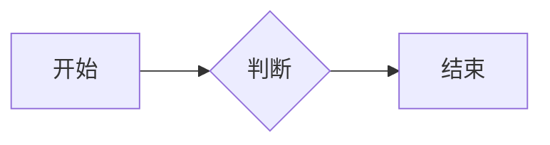

# Chirpy 文章写作语法参考

本仓库基于 jekyll-theme-chirpy 主题。写/改 `_posts/` 下文章时，用本文查语法与 front matter 特性。

> **强制约定不在这里**：文件名 `YYYY-MM-DD-` 前缀、tags 必须小写、`date` 用真实时间且不能是未来、不手写 `last_modified_at`、frontmatter 基本形状——这些以仓库根目录 `CLAUDE.md` 为准，动笔前先遵守它。本文只补充 **Chirpy 特有的写作语法与可选特性**。

## Front Matter 可选特性开关

在已有 `categories/title/date/tags/keywords/image` 之外，按需添加：

| 字段 | 作用 | 示例 |
|---|---|---|
| `description` | 自定义摘要（首页列表、RSS、标题下方展示），不写则自动取正文开头 | `description: 一句话摘要` |
| `pin` | 置顶到首页 | `pin: true` |
| `toc` | 关闭本文右侧目录（全局默认开） | `toc: false` |
| `comments` | 关闭本文评论 | `comments: false` |
| `math` | 启用 MathJax（**默认不加载，用到公式才开**） | `math: true` |
| `mermaid` | 启用 Mermaid 图表 | `mermaid: true` |
| `media_subpath` | 本文媒体资源统一路径前缀 | `media_subpath: /assets/img/2026/` |
| `render_with_liquid` | 关闭 Liquid 渲染（正文含 `` 字面量时用，需 Jekyll ≥4） | `render_with_liquid: false` |

题图（preview image）规格：分辨率 `1200 x 630`（比例 `1.91:1`，否则会被裁剪）：

```yaml
image:
  path: <图片 URL 或文件名>   # 设了 media_subpath 时只需文件名
  lqip: /assets/img/placeholder.webp   # 低质量占位图，可为 base64 URI
  alt: 图片描述
```

## 提示框 Prompts

在引用块下一行加 `{: .prompt-类型 }`，类型有 `tip` / `info` / `warning` / `danger`：

````md
> 这是一条提示。
{: .prompt-tip }
````

## 图片

**基础 + 图注**（图片下一行写斜体即成为居中图注）：

````md

_图注文字_
````

**尺寸**（务必设宽高，防止加载时布局抖动；SVG 至少设 `w`）。`width/height` 可缩写为 `w/h`：

````md
{: w="700" h="400" }
````

**位置**：`.normal`(左对齐) / `.left`(左浮动) / `.right`(右浮动)。⚠️ 设了位置就不要再加图注：

````md
{: .left }
````

**暗/亮模式**（需准备两张图，分别加 `.light` / `.dark`，跟随主题切换显示）：

````md
{: .light }
{: .dark }
````

**阴影 / 圆角**：`.shadow`（程序窗口截图常用）、`.rounded-10`。可组合：`{: .w-75 .shadow .rounded-10 }`。

**普通图片的 LQIP**：`{: lqip="/path/to/lqip-file" }`。

> 本仓库图片多为外链 CDN（jsDelivr/GitHub），`image.path` 直接填完整 URL 即可；无需本地 `/posts/...` 路径。

## 代码块

指定语言可高亮；附加属性写在代码块下一行的 `{: ... }`：

- **指定文件名**（替换掉左上角的语言标签）：`{: file="path/to/file" }`
- **隐藏行号**：`{: .nolineno }`（`plaintext`/`console`/`terminal` 默认就无行号）
- **展示 Liquid 字面量**：用 `…` 包裹，或给 front matter 加 `render_with_liquid: false`

示例（外层四反引号仅为在本文中演示，实际写三反引号）：

`````md
````shell
echo 'hello'
````
{: file="run.sh" .nolineno }
`````

**行内代码**：`` `inline code` ``。
**文件路径高亮**：`` `/path/to/file.ext`{: .filepath} ``。

## 数学公式（需 `math: true`）

- **块级公式**：`$$ … $$`，**前后必须各留一个空行**。
- **公式编号**：块内用 `\begin{equation} … \label{eq:名字} \end{equation}`，正文用 `\eqref{eq:名字}` 引用。
- **行内公式（正文行中）**：`$$ … $$`，前后**不留空行**。
- **行内公式（列表中）**：首个 `$` 需转义，写 `\$$ … $$`。

```markdown
$$
\sum_{n=1}^\infty 1/n^2 = \frac{\pi^2}{6}
$$

当 $$a \ne 0$$ 时，方程 $$ax^2+bx+c=0$$ 有两个解。
```

## Mermaid 图（需 `mermaid: true`）

用 ```` ```mermaid ```` 围起图代码：

````md

````

## 文本排版

- **标题**：`#`~`######`（H1–H6）。
- **列表**：有序 `1. 2. 3.`；无序 `-`（可嵌套）；**待办** `- [ ]` / `- [x]`。
- **描述列表**：术语单独一行，下一行以 `: ` 开头写释义：

  ````md
  术语
  : 释义
  ````
- **引用**：`> 引用内容`。
- **表格**：用 `:---`(左) / `:---:`(中) / `---:`(右) 控制对齐。
- **脚注**：正文 `文字[^id]`，文末 `[^id]: 脚注内容`。
- **裸链接**：`<https://example.com>` 自动成链。

## 媒体嵌入

**社交平台视频/音频**（`Platform` 用小写平台名，`ID` 见下表）：

````liquid

````

| 视频/音频 URL 样例 | Platform | ID |
|---|---|---|
| youtube.com/watch?v=**H-B46URT4mg** | `youtube` | `H-B46URT4mg` |
| twitch.tv/videos/**1634779211** | `twitch` | `1634779211` |
| bilibili.com/video/**BV1Q44y1B7Wf** | `bilibili` | `BV1Q44y1B7Wf` |
| open.spotify.com/track/**3OuMIIFP5TxM8tLXMWYPGV** | `spotify` | `3OuMIIFP5TxM8tLXMWYPGV` |

Spotify 额外参数：`compact=1`（紧凑播放器）、`dark=1`（强制暗色）。

**本地视频文件**：

````liquid

````

**本地音频文件**：

````liquid

````

## 媒体 URL 前缀（可选）

`site.cdn`（`_config.yml`）与 `page.media_subpath`（front matter）可单独或组合使用，最终 URL 拼为：`[site.cdn/][media_subpath/]file.ext`。用于避免在多处重复写相同前缀。

---

> 来源：整理自 Chirpy 官方示例文《Writing a New Post》与《Text and Typography》，并结合本仓库约定裁剪。
