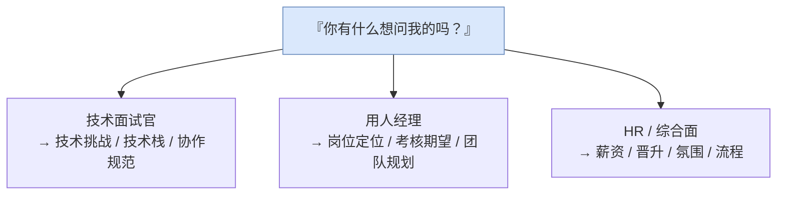

面试快结束时那句"你有什么想问我的吗"，看起来是客套，实际上**评估还没结束**。答"没有了"几乎是减分项——它传递的信号是你对这份工作没那么上心，或者没认真思考过。

反问环节真正的关键只有一条：**问对人**。不同轮次的面试官能回答的东西完全不同，问技术面试官薪资、问 HR 架构细节，都是错配。下面按面试官角色拆开，每类挑 2~3 个问就够，别连珠炮式发问。

> **面试系列**：本文是面试准备系列的一篇，可搭配阅读 [《面试如何回答"遇到的最大难题"》](/posts/面试如何回答遇到的最大难题-三个真实案例口述稿/) 和一份完整的 [《模拟面试》](/posts/模拟面试/) 自问自答稿。
{: .prompt-info }

## 一、对技术面试官（同级或稍高的工程师）

这类人最能聊真实的技术和团队状态，是最该深挖的一轮。

- **"这个岗位近期最主要的技术挑战是什么？是偏业务迭代速度，还是有架构 / 性能上的硬骨头？"**
  摸清工作重心，也让对方觉得你想解决真问题。
- **"团队目前 Android 的技术栈和工程化程度大概是什么样？比如 Compose 的比例、模块化 / 组件化、CI 和自动化测试的覆盖情况。"**
  判断团队工程成熟度，也顺带展示你关心这些。
- **"代码评审（Code Review）和技术方案是怎么落地的？是有设计文档评审，还是主要靠 CR？"**
  看协作规范是否健全。
- **（如果前面面试聊到某个具体问题）"刚才那道题我挺感兴趣，想问下你们线上实际是怎么处理 XX 的？"**
  **最高级的反问是接住前面的话题**，显得你真在思考，而不是背了几个问题来问。

## 二、对团队负责人 / 用人经理（Hiring Manager）

- **"团队现在的人员构成和这个岗位的定位是怎样的？是补一个明确的坑，还是团队扩张？"**
  判断你进去要干嘛、有没有成长空间。
- **"您对这个岗位半年到一年的期望是什么？什么样算做得好？"**
  直接问清考核标准，入职后不踩坑。
- **"团队接下来一年的规划或方向大概是什么？"**
  看业务前景和稳定性。

## 三、对 HR / 综合面

薪资、调薪机制、晋升通道、加班强度、团队氛围这类问题，放到 HR 环节问，技术面别碰。

- 薪资结构、调薪 / 晋升机制、加班与调休情况、团队氛围。
- **"这个岗位的招聘进度大概到哪一步了？后续还有几轮、节奏是怎样的？"**
  得体地了解流程，也方便你安排其它 offer 的节奏。

## 四、加分的通用问题

这几个问题在任何轮次问都不违和，还能自然地展现你的态度：

- **"如果我入职，前一两个月大概会接触什么项目、怎么上手？"**
  展现你已经在设想如何融入团队。
- **"您觉得在这个团队做得好的人，通常有哪些共同特质？"**
  侧面问清团队真实的价值观与用人标准。
- **"以您的角度，这个团队最吸引您留下来的一点是什么？"**
  让面试官从自己视角讲团队优点，信息很真实，也能缓和气氛、拉近距离。

## 五、尽量避免的问法

> 下面几种问法很容易在最后一刻拉低印象分，务必避开。
{: .prompt-warning }

- **"我表现怎么样／能过吗？"**——把面试官当场架住，很尴尬，而且答案也不由他一人定。
- **官网、JD 上明摆着能查到的信息**——显得你连基本功课都没做。
- **技术面一上来就问薪资、假期、能不能远程**——不是不能问，而是时机和对象不对。
- **"你们公司主要是做什么的？"**——基本会被直接判定为毫无准备。

## 六、一个小心机：准备 4~5 个，现场借题发挥

多准备几个问题，因为其中一两个很可能在面试过程中已经被聊到了。这时你可以顺势说：

> "我本来想问 A，不过刚才您已经讲得挺清楚了；那我想再问一下 B……"

这句话本身就证明你**全程在认真听、在思考**，是非常自然的加分点，比生硬地抛出一个问题效果好得多。

## 小结

反问环节的本质，是你从"被考察者"短暂切换成"共同评估这份工作是否合适"的一方。问题问得好，既能拿到你真正关心的信息（团队、成长、稳定性），又能反向证明你的思考深度和诚意。

- **问对人**：技术问技术、管理问定位、薪酬问 HR。
- **接住上文**：能顺着面试中的话题追问，永远比背题库高级。
- **有备而来**：准备 4~5 个，允许现场借题发挥。

> 一句话：别把它当客套的收尾，把它当成你这场面试**最后一次主动出牌**的机会。
{: .prompt-tip }
