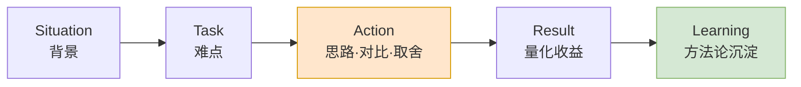

"讲一个你在项目中遇到的最大的难题，以及你是怎么解决的"——这几乎是每场 Android 面试的必考题。它最能拉开候选人之间的差距，因为面试官考察的**从来不是"难题有多难"，而是你面对复杂问题的思维方式、技术深度、以及推动解决的主动性**。

这篇文章分两部分：先给一套可直接套用的回答框架，再用本站三篇真实技术文章拆成**可以直接背诵的口述稿**，每个都配上高频追问和参考答案——因为真正决定成败的往往不是你讲的那两分钟，而是被追问时能不能顶得住。

> **面试系列**：本文是面试准备系列的一篇，可搭配阅读 [《面试反问环节——"你有什么想问我的吗"该怎么答》](/posts/面试反问环节-该问面试官哪些问题/) 和一份完整的 [《模拟面试》](/posts/模拟面试/) 自问自答稿。
{: .prompt-info }

## 一、回答框架：STAR-L

经典的 STAR 之外，我更推荐加一个 **L（Learning）**——把一次具体的解决过程升华成可复用的方法论，这是从"解决了一个问题"跃迁到"具备解决这类问题能力"的关键信号。

| 环节 | 内容 | 时长占比 |
| --- | --- | --- |
| **S**ituation 背景 | 一句话交代业务场景和为什么这事重要 | 10% |
| **T**ask 难点 | 明确"难在哪"——技术约束、矛盾点 | 15% |
| **A**ction 行动 | **重点**：排查思路 → 方案对比 → 为什么选它 | 50% |
| **R**esult 结果 | 量化收益（性能 / 崩溃率 / 包体积 / 安全） | 15% |
| **L**earning 沉淀 | 复盘，抽象成通用能力 | 10% |

核心原则：**Action 部分要体现"排除法"和"权衡"**。不要只说"我最后用了 X 方案"，而要说"我先试了 A 发现 B 问题，又对比了 C 和 D，基于某个约束选了 D"。这才是资深的信号。

### 怎么选题材

好题材的共性是有清晰的"**坑 → 分析 → 权衡**"链条。几个避坑提醒：

- **别选"配环境 / 踩了个 bug 查了三天"**——难题层次太低。
- **别把功劳全归自己**——涉及协作时说"我主导了……"，既真实又体现推动力。
- **一定要有量化或定性的结果**——没有数据至少要有明确收益。
- **一定要准备被追问**——你选的题材必须是自己真吃透的，面试官必然会挖"为什么不用另一个方案""如果量级再大十倍怎么办"。

下面三个案例分别对应三种不同的能力信号，可以根据面试官的侧重挑着讲。

## 二、案例一：ActionBar 键盘 / 面板切换零抖动

> 展示能力：**第一性原理的问题分析能力、对系统机制的理解**。完整技术推导见 [《Compose 键盘与面板切换时，ActionBar 如何做到零抖动》](/posts/Compose键盘与面板切换ActionBar零抖动原理/)。
{: .prompt-info }

这是最能体现"思维方式"的一个，推荐作为首选。它的亮点不是用了什么高级 API，而是**把一个看似要靠"调动画、加延时"硬凑的问题，转化成一个数学恒等式**——这正是面试官想看到的资深信号。

### 2 分钟口述稿

> "我在做富文本编辑页工具栏时遇到过一个交互难题。页面底部有一条固定的操作栏，点『字体』按钮要在软键盘和字体面板之间切换。最初的实现是先收键盘、收完再展开面板，结果操作栏会先跟着键盘掉到屏幕底部、再被面板顶回来，上下抖动很明显。产品要求做到 iOS 邮件那种『工具栏纹丝不动、下方无缝替换』的效果。
>
> 我没有一上来就调动画，而是先把问题写成算式：**操作栏距屏幕底部的距离 = 当前键盘高度 + 面板高度**。抖动的根源就清楚了——这两个量在时间上是**串行变化**的，键盘先减到 0、面板再从 0 增长，所以先掉下去再弹回来。
>
> 那解法方向就明确了：让这两个量**同帧互补**，键盘每收 1 像素、面板同帧长 1 像素，两者之和恒定，操作栏自然就不动了。具体做法是让操作栏自己用 `padding(bottom = 当前 IME 高度)` 逐帧消费键盘 inset，面板高度算成『键盘最大高度 − 当前键盘高度』。因为 Compose 的 `WindowInsets.ime` 在键盘动画期间是**逐帧更新**的，面板高度就天然被系统的键盘动画曲线驱动了，**完全不需要我自己写动画**。
>
> 恒等式里那个『键盘最大高度』的常数，我用 `snapshotFlow + debounce(150ms)` 拿到：键盘弹出过程中高度不断变，只有停止变化 150ms 后才记录，天然过滤掉中间值，也能适配用户换输入法、手动调键盘高度。最后还补了两个收尾：一个是状态机——面板切回键盘时，监听『当前键盘高度 ≥ 记录的最大高度』作为关闭面板的时机；另一个是焦点迁移时 inset 有单帧抖动会导致工具栏闪一下，我把可见性判断经 `snapshotFlow` 中转成稳定状态，相当于对毛刺做了采样平滑。
>
> 最终切换全程操作栏零位移、面板和键盘像素级对齐，没有任何手写动画和硬编码高度，代码量还很小。这件事让我养成一个习惯：**遇到 UI 联动抖动，先把位置写成显式算式、找出哪些变量在异步变化，再让它们同帧互补，比对时序、加延时可靠得多。**"

### 高频追问

**Q：为什么用 `padding(bottom=ime)` 而不是直接给整个布局加 inset？**

因为我要把操作栏的位置变成一个**我可控的算式**——底栏自己消费 inset、面板挂它下面，这样两项之和才能凑成恒等式。交给系统统一处理就没法拆出面板这一项来补偿。

**Q：`debounce(150)` 的 150ms 怎么定的？会不会不稳？**

它只需要"大于键盘动画的单次跳变间隔"即可。系统键盘动画一般 200~300ms 内多次跳变，但每次间隔远小于 150ms，所以停止 150ms 基本等价于"动画结束"。取值不敏感，100~200 都行，本质是等高度稳定。

**Q：键盘从没弹出过、拿不到最大高度怎么办？**

给一个默认高度（如 200dp）兜底，并且 `coerceAtLeast(0)` 防止真实键盘更高时算出负数。

**Q：为什么必须 `adjustResize` + `setDecorFitsSystemWindows(false)`？**

这是拿到**逐帧** IME inset 的前提。不关 `decorFitsSystemWindows`，系统会自己吃掉 inset，Compose 就只能拿到最终值、拿不到动画中间帧，恒等式就驱动不起来了。

**Q：低于 API 30 没有 `WindowInsetsAnimation` 怎么办？**

低版本 inset 不逐帧、只有始末两态，会退化成"跳变"而非平滑。可接受降级（直接切换），或对低版本单独补一段插值动画兜底。

## 三、案例二：可持久化倒计时（App 杀死 / 设备重启续算）

> 展示能力：**系统机制理解深度、状态建模能力、安全 / 防作弊意识**。完整源码分析见 [《可持久化倒计时的设计：App 杀死、设备重启后如何续算与失效》](/posts/可持久化倒计时机制设计-CountDownUtil源码分析/)。
{: .prompt-info }

这个的杀手锏是 `elapsedRealtime` 与 `currentTimeMillis` 的选型，以及**把"设备重启会归零"这个缺点变成重启检测手段**。

### 2 分钟口述稿

> "我做过登录模块里一个可持久化的验证码倒计时组件。需求是验证码发出去后有 60~180 秒的重发冷却，而这个冷却状态在 **App 被杀重启、甚至设备重启后都不能丢**，否则用户杀个进程重进就能无限刷验证码，既是安全问题也费短信钱。
>
> 关键的设计转变是：**我不存『还剩几秒』，而是存一个不可篡改的时间基准点加总时长，每次进来用当前时间反推剩余**。因为『剩几秒』这个值从存下那一刻就过时了——你不知道进程被杀了多久；而『基准点 + 总时长』是不变的原始事实，任何时刻都能算出准确剩余：剩余 = 总时长 −（现在 − 基准点）。
>
> 第二个关键是**时间源选型**。我用的是 `SystemClock.elapsedRealtime()` 而不是 `System.currentTimeMillis()`。`currentTimeMillis` 是墙上时钟，用户去设置里改系统时间就能跳过倒计时；`elapsedRealtime` 是自开机的单调时钟，用户改不了，能**防作弊**。它唯一的『缺点』是设备重启会归零——但我反过来利用了这一点：如果发现当前的 `elapsedRealtime` 比记录的基准还小，那**只可能是重启过**，直接判倒计时失效。这在业务上也合理，验证码服务端本来就 180 秒过期，重启这段时间早过期了。
>
> 落盘我用的是 Room 而不是 SharedPreferences，因为数据是结构化的多字段多记录，而且这张表放在『登出也保留』的库里，语义清晰。读取做两级缓存：先查内存 HashMap，miss 再回退查数据库。基准点这个字段是后加的，我通过 Room 迁移加列、对旧数据默认 0 做优雅降级——读到 0 就当失效清掉，不误判也不崩。
>
> 最终效果是：杀进程重启无缝续算、设备重启自动失效、改系统时间也绕不过去。组件做成单例 + `StateFlow` 对外，手机号 / 邮箱 / Passkey 三种场景一套逻辑靠 tag 区分。这件事的沉淀是：**持久化一个随时间变化的状态时，别存易变的派生值，存不变的原始事实，用的时候再算。**"

### 高频追问

**Q：为什么不直接存剩余秒数，重启读出来接着倒？**

存下的那一刻它就过时了，你不知道进程被杀了多久。存"基准点 + 总时长"任何时刻都能算出真实剩余——本质是**把易变的派生值换成不变的原始事实**。

**Q：`elapsedRealtime` 重启归零不就乱了吗？**

正好用它检测重启：`now < baseTimestamp` 只可能是重启导致，此时判失效。而且验证码服务端 180 秒就过期，重启后判失效业务上完全合理。

**Q：如果业务要求重启后继续倒计时（不失效）呢？**

那就得换思路：存服务端下发的**绝对过期时间戳**（`currentTimeMillis` 体系），配合一次服务端时间校准来抵消本地时钟被篡改的风险。选 `elapsedRealtime` 还是绝对时间，取决于业务要"防作弊 + 可失效"还是"跨重启续算"。

**Q：并发 / 线程安全怎么做？**

单例用 `@Volatile + synchronized` 双检锁；DB 操作全走 `Dispatchers.IO`；计时器回调在主线程更新 `StateFlow`。

**Q：已知的坑或可改进点？**

主动暴露：部分错误码的 `onError` 其实也消耗了验证码，但没全覆盖清理逻辑，会导致个别情况只能等倒计时结束；相同 tag 也可能误判。改进方向是和后端对齐错误码语义、给 tag 加业务前缀做命名空间。

> 主动说局限，往往比只讲优点更能体现工程判断——面试官问"还有什么可以优化"时，你有备而来。
{: .prompt-tip }

## 四、案例三：播放器缓存方案改造（安全驱动的架构切换）

> 展示能力：**架构决策能力、安全意识、"官方没有的能力自己补"的工程落地**。完整分析见 [《播放器缓存方案改造：从 HTTP 本地代理迁移到 Media3 缓存导出》](/posts/播放器缓存方案改造-从HTTP本地代理迁移到Media3/)。
{: .prompt-info }

这个的价值在于**不是自嗨式优化，而是安全审计倒逼的架构决策**，还额外体现了"读懂官方库内部结构、补齐它不提供的能力"。

### 2 分钟口述稿

> "我做过一次播放器视频缓存的安全改造。原方案是 ExoPlayer 加一个**本地 HTTP 代理**——App 内部起一个监听 `127.0.0.1` 某端口的小服务器，播放器请求这个本地端口，由它去拉远程数据、边下边缓存。功能没问题，但应用市场的安全扫描直接把它标记成漏洞。
>
> 根因在于『**为了缓存，开了一个谁都能连的本地监听端口**』。很多人以为 loopback 只有本机能访问就安全，但关键是：本机能访问 = **同一台设备上任意一个 App 都能连**，Android 没有进程级的 loopback 隔离。这就带来几个问题：端口是暴露的攻击面、可能被恶意 App 当跳板发起类 SSRF 请求、播放器到代理这一跳还是明文 HTTP，而且为了让明文 loopback 生效还得放宽整个 App 的明文流量策略。
>
> 我把它换成了 **Media3 的进程内缓存**：用 `SimpleCache` + `CacheDataSource` 在进程内直接读写，缓存文件落在 App 私有目录，`DownloadManager` 做预加载，播放和下载共用同一个 cache。这样**端口直接没了、数据不出沙箱、请求端到端 HTTPS**，而且是 Google 官方库，好维护。
>
> 但有个现实问题：**Media3 只提供缓存、不提供把缓存导出成一个完整文件**，而我们业务需要导出。我先搞清楚它的底层——`SimpleCache` 不是存成一个大文件，而是拆成很多分片，每个分片带一个 `position`（在原文件里的偏移），文件名是它内部编码的、乱序的。所以导出这块是我自己实现的：调 `getCachedSpans` 拿到所有分片，**按 `position` 排序**再顺序拼接，每个分片**只读它有效的 `length`**（末尾可能有 padding），全程先写 `.temp`、拼完再 `rename`，保证**要么完整要么不存在**，不会留下看着正常其实残缺的坏文件，而且全程可取消。
>
> 并发上分了三层：下载层 `DownloadManager` 按 cacheKey 天然去重；导出层给每个 cacheKey 一把 `Mutex`，做到不同视频并行、同一视频串行；缓存读写层单例 `SimpleCache` 兜底。还有个细节是 CacheKey 用 `clearQuery()` 去掉 URL 的 token、时间戳参数，保证同一资源命中同一份缓存。
>
> 结果是既消除了端口的安全风险、保住了 HTTPS 全程加密，又把缓存、预加载、导出统一到一套官方能力上。"

### 高频追问

**Q：loopback 端口不是只有本机能访问吗，为什么算漏洞？**

本机能访问 = 同设备任意 App 都能访问，Android 没做进程级 loopback 隔离；端口可枚举、代理通常无鉴权，还可能被当跳板，所以安全审计直接判漏洞。

**Q：缓存分片是乱序的，怎么保证拼对？**

每个 `CacheSpan` 带 `position`（原文件偏移），按它排序后顺序写；**绝不能用文件名或写入时间排**，那样拼出来是错乱的。

**Q：导出到一半失败 / 取消怎么办？**

全程写 `.temp`，成功才 `renameTo`；失败或取消就删临时文件，保证结果要么完整要么不存在。

**Q：怎么判断缓存完整、可以导出了？**

用 `ContentMetadata` 里的真实总长 `KEY_CONTENT_LENGTH`，和已缓存范围 `[0, 总长]` 对比；导出后再用总长和文件实际大小二次校验。先下全再导出。

**Q：同一个视频被并发导出会不会写坏？**

按 cacheKey 加 `Mutex`（用 `ConcurrentHashMap` + `putIfAbsent` 保证同一 key 拿到同一把锁），不同 URL 并行、同一 URL 串行。

**Q：URL 每次带的 token 都变，缓存会失效吗？**

自定义 `CacheKeyFactory` 里 `clearQuery()` 去掉 `?` 后参数，保证 key 稳定命中同一份；还兼容了新旧两种命名（去参前后 URL 的 MD5），避免历史缓存一刀切失效。

## 五、怎么选、怎么用

三个案例分别对应不同的能力信号，按面试官的提问侧重挑：

| 面试官侧重 | 建议主打 |
| --- | --- |
| **思维深度、问题分析**（常见于资深 / 架构岗） | 案例一 ActionBar 零抖动——把问题化成恒等式，最出彩 |
| **系统底层、安全意识** | 案例二 倒计时 或 案例三 播放器缓存 |
| **混合开发 / 跨端** | 追加 [JsBridge 定制开发](/posts/Android-与-Web-的-JS-交互原理与-JsBridge-定制开发/)（那篇的 Q1~Q11 已经是现成弹药） |

几个通用提醒：

1. **三个故事各准备一个，别都背**——面试官追问方向不同，你要能顺着任意一个往深挖。
2. **一定要说出"沉淀"那句收尾**（"把位置写成算式""把易变派生值换成不变原始事实"）——这是从"解决了一个问题"上升到"形成方法论"的关键。
3. **每个故事都主动准备一个局限 / 改进点**——面试官问"还能怎么优化"时不至于卡壳，反而显得你对方案有清醒认知。
4. **Action 占一半时长，重点讲取舍**——讲清"为什么不选另一个方案"，比讲"我选了什么"更有说服力。

> 一句话总结：这道题答的不是"难题"，而是"你这个人遇到难题时是怎么想、怎么做、怎么复盘的"。把过程讲透，比把结果讲大更重要。
{: .prompt-tip }
