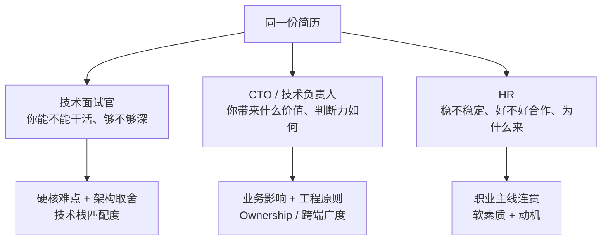

面试自我介绍最常见的错误,是**三类面试官都背同一段**。技术面试官想听你解决过什么硬问题、架构怎么取舍;CTO 想听你带来什么业务价值、有没有工程判断力;HR 想听你的职业稳定性、协作风格和求职动机。用错对象,再漂亮的稿子也是浪费。

自我介绍不是简历朗读,而是**给对方铺"想继续问下去"的钩子**。同一段经历,对三类人要抽取不同的侧面。

> **面试系列**:本文可搭配阅读一份完整的 [《模拟面试》](/interview/模拟面试/) 自问自答稿、[《面试如何回答"遇到的最大难题"》](/interview/面试如何回答遇到的最大难题-三个真实案例口述稿/) 和 [《面试反问环节——"你有什么想问我的吗"该怎么答》](/interview/面试反问环节-该问面试官哪些问题/)。
{: .prompt-info }

## 三类面试官到底在听什么

| 维度 | 技术面试官 | CTO / 技术负责人 | HR |
|---|---|---|---|
| 核心关注 | 技术深度、能不能落地 | 价值产出、工程判断、可复用性 | 稳定性、协作、动机、性价比 |
| 讲经历的角度 | "怎么做的、为什么这么选" | "解决了什么问题、沉淀了什么" | "一条连贯成长线" |
| 数字要不要 | 要(技术指标:耗时、Bug 率) | 要(结果指标 + 复用价值) | 少量点缀即可 |
| 时长 | 60~90 秒 | 60 秒 | 45~60 秒 |
| 别踩的坑 | 堆缩写、讲得浅 | 陷进技术细节出不来 | 满嘴术语、讲离职负面 |

> 三版都控制在 **90 秒以内**。信息不是越多越好——把展开的空间留给对方提问,才是加分项。
{: .prompt-tip }

## 版本一:面向技术面试官

**目标**:证明你有真东西,并主动埋 2~3 个你准备充分、希望被深挖的技术钩子。

> 面试官您好,我叫何晓猛,近 10 年 Android 开发经验。这些年做过出行、教育、AI 互动和海外企业协同办公几个方向,技术栈从 Java 一路到 Kotlin、Compose,也能用 Flutter 独立开发完整 App。
>
> 我重点讲最近这段。在北京百邻,我负责一款面向中东市场的企业级 IM + 协同办公客户端 Beem,技术栈是 Kotlin + Jetpack Compose + MVI,多仓库 submodule、多 flavor 多环境构建。这一年做了几件事:一是**音视频播放缓存重构**,老方案用本地代理做播放缓存有安全隐患,我改成了读写分离设计——播放侧只读缓存、写入职责全部收敛到下载引擎,从架构上根除了多任务并发写缓存的冲突;二是**从 0 到 1 搭邮箱产品**,基于 WebView + JsBridge 设计了原生与前端的双向通信协议做富文本编辑器,把收件人管理、附件绑定、草稿同步这些复杂交互按职责拆成多个独立协调层,控制主状态机复杂度;三是**登录账号体系重构**,还做了海外推送按厂商拆分构建变体的合规适配。这几块的架构取舍我都可以展开聊。
>
> 再往前,在考虫直播 App 我治理过大量历史遗留的内存泄漏和 OOM,把网络层整体改造成了协程;在 VIPKID 主导过组件化,启动耗时降低约 50%。性能和稳定性方向、还有 Handler 原理、View 事件分发、Media3、JsBridge 这些我都比较熟。以上是我的基本情况,谢谢面试官。

**要点**

- **每个亮点都点到"为什么这么选",而不是只报结论**——"有安全隐患→改成读写分离"比"根除了冲突"更能引出追问。
- 结尾主动说一句"**这几块可以展开聊**",把主动权递给面试官,引导他往你准备好的深挖版走。
- 提前备好这几个深挖点:读写分离的具体设计与取舍、JsBridge 双向通信协议怎么定、内存泄漏/OOM 的排查手段与典型案例、组件化拆分粒度与启动优化 50% 的具体动作。
- 别一口气抛太多缩写。保留最想被问的 2~3 个,其余等对方追。

## 版本二:面向 CTO / 技术负责人

**目标**:CTO 时间宝贵,想在几分钟内判断"这人能不能扛事、判断力怎么样"。少讲实现细节,多讲**价值、判断力、可复用的工程沉淀**。

> 您好,我是何晓猛,近 10 年 Android 经验。我的定位是能独立扛下一条产品线、也能主导架构改造和性能稳定性治理的高级工程师。
>
> 最近一年在百邻做面向中东市场的企业级协同办公客户端 Beem。我做的几件事都不只是功能交付:比如播放缓存,我发现老的本地代理方案有安全隐患,就把它重构成读写分离架构,从根上消除了并发写缓存的冲突;邮箱产品是我从 0 到 1 搭起来的,收发、草稿、附件、富文本一整套;推送这块,针对中东大量国产设备 GMS 覆盖不足导致 FCM 不可达,我推动了按厂商拆分构建变体、并把原来混乱的配置收敛统一。
>
> 更重要的是,这一年我沉淀了几条可复用的工程原则,比如"**收敛优于推翻**"——大改造尽量在调用层逐点迁移,而不是推翻内核重写,把回归风险压到最小;还有"能力下沉、规则集中""把依赖网络和不依赖网络的能力解耦"。这些让我做架构决策时更有章法。
>
> 我也有跨端和独立交付的经验:在众艺汇智独立做过 AI 跳舞的学生端和教师端,学生端做人体姿态识别打分,线上 Bug 率控制在万分之五以内,教师端是我从零学 Flutter 独立交付的。团队协作上我和产品、管理这些角色配合都比较主动。以上是我的基本情况。

**要点**

- **把技术动作翻译成价值和判断**:CTO 关心的不是"读写分离怎么实现",而是"你能识别隐患、能做出低风险的改造决策"。
- "**收敛优于推翻**"这类工程原则是区分资深与普通开发的信号,CTO 大概率会顺着追问——这正是你想聊的。
- 突出 **Ownership**:0→1 搭产品、独立交付双端、推动跨团队合规适配,都在说明"你能扛事"。
- 别陷进实现细节。CTO 想深挖时会自己往下问,你只要留好入口。

## 版本三:面向 HR

**目标**:HR 不评估技术深浅,评估的是**职业稳定性、协作风格、求职动机和岗位匹配度**。去术语化,讲一条连贯、上进的成长线。

> 您好,我叫何晓猛,天津商业大学计算机科学与技术本科,近 10 年一直在做 Android 开发,目前是高级开发工程师。
>
> 我的职业路径比较连贯:从威马汽车做出行 App 起步,后来在 VIPKID 做启蒙教育、在考虫做在线直播、在众艺汇智做 AI 互动教育,最近一年在百邻做面向海外中东市场的企业级协同办公产品。行业换过几个,但方向一直聚焦在 Android 客户端,专业上是持续深耕、逐步做到能独立负责产品线和主导架构改造。
>
> 我平时有写技术博客、持续跟进新技术的习惯,做的是海外产品,英文技术文档也能流畅阅读。工作里我和产品、测试、管理这些团队配合比较主动,遇到跨团队依赖会提前沟通、推动并行开发,尽量不因为等待卡住进度。
>
> 我关注咱们这个岗位,一方面是它和我做过的方向很契合,能马上上手贡献;另一方面也希望在这里继续做有挑战、能长期投入的事。以上是我的基本情况,谢谢。

**要点**

- **主动交代"行业换过、方向没换"**,把跳槽解释成"聚焦深耕",消除 HR 对稳定性的顾虑。
- 软素质要具体:"提前沟通、推动并行开发"比空泛的"沟通能力强"更可信。
- 术语几乎清零。HR 听不懂"读写分离""JsBridge",讲了反而拉远距离。
- 结尾落到**求职动机 + 岗位匹配**,这是 HR 最想确认的两点。
- **离职原因别在自我介绍里主动提**,等被问到再从容回答(参考下面的提醒)。

## 通用交付技巧

- **工龄口径统一**:简历写"近 10 年",开口就别改成"十年整"或"9 年",被追问会露怯。
- **早期经历一笔带过**:考虫、VIPKID、威马各一句点成果即可,别平均用力,否则整段超时。除非目标岗位正好对口某段(如直播、出行、组件化),再把那段拎出来重点讲。
- **按 JD 动态换重点**:投音视频/IM→重点讲 Beem 播放架构与推送;投架构/基建→讲组件化、多仓库 submodule、多 flavor;投跨端→讲 Flutter 独立交付与 AI 跳舞双端;投性能→讲 OOM 治理、启动优化 50%、播放缓存。
- **准备离职原因的得体说法**:当前这段合同到 2026 年 7 月,正处于求职窗口,提前想好一句中性表达(如项目阶段结束/寻求更大挑战),不主动提,被问到不慌。

> **数字是钩子,不是句号。** "线上 Bug 率万分之五""启动降 50%"这类数字要留一手——报出来之后,准备好被追问"怎么做到的",这才是真正的加分环节。
{: .prompt-warning }

## 对照速查

| | 技术面试官 | CTO | HR |
|---|---|---|---|
| 开场定位 | 工龄 + 岗位 + 技术栈广度 | "能扛产品线 + 主导架构"的定位 | 学历 + 连贯的职业主线 |
| 主讲内容 | 播放读写分离 / JsBridge / OOM 治理 | 价值 + "收敛优于推翻"等工程原则 | 成长线 + 协作 + 动机 |
| 数字用法 | 技术指标,且埋深挖钩子 | 结果指标 + 可复用价值 | 少量点缀 |
| 结尾落点 | "这几块可以展开聊" | Ownership + 跨端广度 | 求职动机 + 岗位匹配 |
| 严禁 | 堆缩写、讲得浅 | 陷进实现细节 | 满嘴术语、主动讲负面 |

把这三版按目标岗位提前练熟,进场前确认这一轮面的是谁,直接切对应版本——这是自我介绍环节最省力也最有效的准备。
