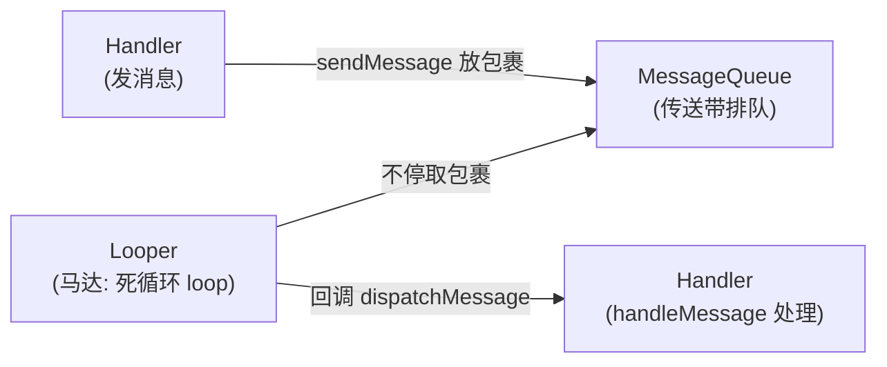
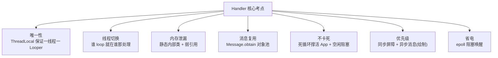

Handler 是 Android 面试的"钉子户"，几乎每一轮都会被问到。但很多人背了一堆源码，真到面试却讲得又生涩又零散。这篇文章先用一个**生活化的比喻**把整套机制串起来，再逐个击破高频问题，**每道题后面都附一段可以直接背的口语化面试话术**，帮你既懂原理、又答得漂亮。

## 先用一个比喻搞懂四者关系

Handler 机制其实就四个角色，把它想象成一条**快递分拣传送带**就全懂了：

| 角色 | 类 | 打个比方 |
|---|---|---|
| **消息** | `Message` | 一个个**快递包裹**，里面装着要做的事 |
| **消息队列** | `MessageQueue` | 一条**传送带**，包裹按"该处理的时间"排队排在上面 |
| **循环器** | `Looper` | 传送带的**马达**，不停地转，把包裹一个个送到分拣员面前 |
| **处理器** | `Handler` | **快递员**，一头负责往传送带上放包裹（`sendMessage`），另一头负责处理送到面前的包裹（`handleMessage`） |

整个流程一句话：**Handler 把 Message 放进 MessageQueue，Looper 不停地从 MessageQueue 取出 Message，再回调给 Handler 处理。**



> 记住这条主线，后面所有问题都是在问这条链路的某个细节。带着"传送带"的画面去理解，比死记源码轻松得多。
{: .prompt-tip }

## 一个线程有几个 Handler？几个 Looper？如何保证？

**结论**：Handler 可以有任意多个（想 new 几个都行），但一个线程**只有一个** Looper。

怎么保证唯一？关键在 `Looper.prepare()`：

```java
public static void prepare() {
  prepare(true);
}

private static void prepare(boolean quitAllowed) {
  if (sThreadLocal.get() != null) {
    // 这个线程已经有 Looper 了，再调一次就抛异常
    throw new RuntimeException("Only one Looper may be created per thread");
  }
  sThreadLocal.set(new Looper(quitAllowed));
}
```

`Looper` 的构造方法是 `private` 的，外部不能直接 `new`，唯一入口就是 `prepare()`。而 `prepare()` 借助 **`ThreadLocal`**（一个"每个线程各存一份、互不干扰"的存储盒子）先检查：这个线程有没有存过 Looper？有就抛异常，没有才创建并存进去。所以**一个线程最多只能 prepare 一次**，Looper 的唯一性就这么保证了。

> 💡 **面试这样答**：一个线程可以有多个 Handler，但只有一个 Looper。因为 Looper 构造方法是私有的，只能通过 `prepare()` 创建，而 `prepare()` 内部用 `ThreadLocal` 判断：当前线程已经有 Looper 就直接抛异常。ThreadLocal 保证了"一个线程一份 Looper"，所以整个线程内 Looper 全局唯一。
{: .prompt-info }

## Handler 是如何切换线程的？

这是 Handler 最核心的用途——**在子线程干活、回主线程更新 UI**。它凭什么能"跨线程"？其实一点都不玄乎：

1. 在 **A 线程**（比如主线程）调用 `Looper.prepare()` 和 `Looper.loop()`，Looper 和它的 MessageQueue 就都"归属"于 A 线程了，`loop()` 是个死循环，在 A 线程里一直转着等消息。
2. 在 **B 线程**里通过 Handler 调用 `sendMessage`，消息最终被 `enqueueMessage` 插进了**A 线程那条传送带**（MessageQueue）。
3. A 线程的 `loop()` 循环取出这条消息，回调 `handleMessage`——**注意，这段回调代码是运行在 A 线程的**。

**关键点就一句话**：消息虽然是 B 线程放进去的，但**取出和处理它的 `loop()` 跑在 A 线程**，所以 `handleMessage` 自然就执行在 A 线程了。线程切换的本质，是"**换了个线程来消费同一条队列**"。

> 💡 **面试这样答**：线程切换靠的是"消息队列被哪个线程消费"。Looper 在哪个线程 `loop`，`handleMessage` 就在哪个线程执行。子线程通过 Handler 发消息，只是把 Message 插进了主线程的 MessageQueue；真正取出并处理它的是主线程的 loop 循环，所以回调就切回主线程了。它本质不是"把代码搬到另一个线程"，而是"让另一个线程来处理这条消息"。
{: .prompt-info }

## Handler 内存泄漏的原因是什么？如何解决？

**原因一句话**：非静态内部类（或匿名内部类）会**默认持有外部类的引用**，导致 Handler 攥着 Activity 不放。

具体场景：在 Activity 里用匿名内部类写了个 Handler，发了一条**延迟消息**（比如延迟 10 分钟）。结果用户提前退出了 Activity，但这条消息还躺在 MessageQueue 里没执行。而消息 → 引用 Handler → Handler 引用 Activity，这条引用链导致 **Activity 无法被 GC 回收**，就泄漏了。

**解决方案：静态内部类 + 弱引用**。静态内部类不持有外部类引用，切断了那条链；弱引用则保证即使还引用着 Activity，GC 也能正常回收它：

```java
public class MainActivity extends AppCompatActivity {

  private MyHandler mMyHandler = new MyHandler(this);

  @Override
  protected void onCreate(Bundle savedInstanceState) {
    super.onCreate(savedInstanceState);
    setContentView(R.layout.activity_main);
  }

  private void handleMessage(Message msg) {
  }

  // 静态内部类不持有外部 Activity 引用，用弱引用间接访问
  static class MyHandler extends Handler {
    private WeakReference<Activity> mReference;

    MyHandler(Activity reference) {
      mReference = new WeakReference<>(reference);
    }

    @Override
    public void handleMessage(Message msg) {
      MainActivity activity = (MainActivity) mReference.get();
      if (activity != null) { // 可能已经被回收，用前判空
        activity.handleMessage(msg);
      }
    }
  }

  @Override
  protected void onDestroy() {
    // 兜底：页面销毁时清空所有未处理的消息
    mMyHandler.removeCallbacksAndMessages(null);
    super.onDestroy();
  }
}
```

> 💡 **面试这样答**：内存泄漏的根因是 Handler 生命周期比 Activity 长。匿名内部类 Handler 默认持有 Activity，如果发了延迟消息，Activity 提前销毁时消息还在队列里，引用链让 Activity 回收不掉。解决办法有两个、通常一起用：一是把 Handler 写成**静态内部类 + 弱引用** Activity，切断强引用；二是在 `onDestroy` 里调 `removeCallbacksAndMessages(null)` 清空未处理的消息。第二个其实是更直接的兜底手段。
{: .prompt-info }

## 子线程中使用 Looper 要注意什么？有什么用？

**用处**：让子线程也拥有自己的消息循环，可以像主线程一样"排队处理任务"，典型如 `HandlerThread`（IntentService 内部就用它）。

**注意点**：子线程的 Looper 用完后，一定要调 `quit()` 或 `quitSafely()` 退出。因为 `loop()` 是死循环，不主动退出的话，子线程会**一直卡在循环里出不来**，既没法结束、也没法被回收，进而导致内存泄漏。

- `quit()`：直接退出，队列里没执行的消息全部丢弃。
- `quitSafely()`：把当前**已到时间**的消息处理完再退出，更安全。

> 💡 **面试这样答**：子线程用 Looper 是为了给子线程也建一个消息循环，`HandlerThread` 就是这么干的。最大的坑是用完必须调 `quit` 或 `quitSafely`，否则 `loop` 的死循环会让子线程一直阻塞、无法回收造成泄漏。`quitSafely` 会先处理完到期消息再退，比 `quit` 更温和。
{: .prompt-info }

## MessageQueue 是如何保证线程安全的？

因为**发消息的线程**和**取消息的 loop 线程**往往不是同一个（正是靠这点做线程切换），所以队列的入队 `enqueueMessage` 和出队 `next` 必然存在多线程并发。

保证线程安全的方式很朴素：这两个方法内部对操作队列的关键代码都加了 **`synchronized`** 同步锁，保证同一时刻只有一个线程能改动这条链表。

> 💡 **面试这样答**：MessageQueue 本质是条单链表，入队 `enqueueMessage` 和出队 `next` 会被不同线程并发访问。它用 `synchronized` 锁住对链表的操作，保证入队和出队不会同时改动链表，从而线程安全。
{: .prompt-info }

## 使用 Message 时应该如何创建？

**推荐用 `Message.obtain()`，而不是 `new Message()`。**

原因：Message 里维护了一个**消息池**（用链表实现），`obtain()` 会优先从池子里**捞一个用过的空 Message 回收利用**，而不是每次都新建。虽然单个 Message 创建开销不大，但 Android 是"消息驱动"的系统，Message 的用量极大，用池子复用就能显著减少频繁创建/销毁带来的内存抖动。

```java
public final class Message implements Parcelable {

  public int what;   // 消息标识
  public int arg1;
  public int arg2;
  long when;         // 该处理的时间

  Message next;              // 用链表把回收的消息串起来
  private static Message sPool;   // 消息池的头节点

  // 从消息池取一个复用，池子空了才 new
  public static Message obtain() {
    synchronized (sPoolSync) {
      if (sPool != null) {
        Message m = sPool;       // 取出头节点
        sPool = m.next;
        m.next = null;
        m.flags = 0;
        sPoolSize--;
        return m;
      }
    }
    return new Message();
  }

  // 消息用完后回收进池子（头插法）
  void recycleUnchecked() {
    flags = FLAG_IN_USE;
    what = 0; arg1 = 0; arg2 = 0;
    obj = null; when = 0;
    target = null; callback = null; data = null;

    synchronized (sPoolSync) {
      if (sPoolSize < MAX_POOL_SIZE) {
        next = sPool;   // 头插回池子
        sPool = this;
        sPoolSize++;
      }
    }
  }
}
```

一个 Message 处理完后，系统会调 `recycle`/`recycleUnchecked` 把它清空并放回池子，供下次 `obtain()` 复用。这是一个典型的**享元/对象池**设计。

> 💡 **面试这样答**：推荐用 `Message.obtain()`。Message 内部有个用链表实现的消息池，`obtain` 会先从池里复用一个已回收的 Message，池子空了才 `new`。消息处理完会被 `recycle` 清空后放回池子。因为 Android 消息驱动、Message 用量巨大，这种对象池复用能有效减少内存抖动，是典型的享元模式。
{: .prompt-info }

## Looper 死循环为什么不会让应用卡死（ANR）？

这是最容易被绕晕的一题，拆成两点就清楚了：

**第一，"死循环"和"卡死"是两码事。** 主线程本来就需要这个死循环**活着**——对 CPU 来说，一个线程执行完自己的代码就结束了，而主线程绝不能提前退出，所以必须用 `loop()` 死循环撑着，源源不断地处理消息。可以说，**这个死循环正是 App 能一直运行的原因，而不是卡死的原因**。

**第二，没消息时它并不"空转"耗 CPU。** 当队列里暂时没有需要处理的消息，`loop` 会通过 `next()` 里的 `nativePollOnce` **阻塞休眠**（见下文 epoll 机制），把线程让出去，几乎不占 CPU。等有新消息来了再被唤醒。所以它不是那种疯狂空转的 `while(true)`。

**那 ANR 是怎么回事？** ANR 和这个死循环没关系。ANR 的本质是**某条消息在 `handleMessage` 里处理得太久**（比如在主线程里做了耗时操作），把后面消息的处理**堵住了**、迟迟得不到响应。问题出在"某个消息处理太慢"，不是"循环本身"。

> 💡 **面试这样答**：死循环不等于卡死。主线程必须靠 `loop` 死循环一直活着来处理消息，这是 App 能运行的前提；而且没消息时它会通过 `nativePollOnce` 阻塞休眠、不占 CPU，不是空转。ANR 是另一回事——它是因为某条消息在主线程处理太耗时，把后续消息堵住了导致的，跟死循环本身无关。
{: .prompt-info }

## 能不能让一个 Message 被"加急"处理？

系统内部**可以**：通过开启**同步屏障**、再发一个**异步消息**，就能让这个异步消息被优先处理（原理见下一节）。

但对**普通 App 开发来说基本不能**：开启同步屏障的 `postSyncBarrier` 方法被 `@hide` 隐藏了，发送异步消息的相关方法也是 hide 的，外部正常调不到。所以业务代码里想"手动插队一条加急消息"，一般是做不到的。

> 💡 **面试这样答**：机制上可以——开同步屏障 + 发异步消息就能让异步消息插队。但 `postSyncBarrier` 和发送异步消息的接口都被 `@hide` 了，只有系统内部（比如 View 绘制）能用，普通 App 开发拿不到这个能力。
{: .prompt-info }

## Handler 的同步屏障（SyncBarrier）是什么？

理解了"加急"，同步屏障就好懂了。它是一种**特殊的 Message**：`target` 字段为 `null`（普通消息的 target 是发它的 Handler）。这条特殊消息**不会被处理**，只是往队列里插了个"**路障**"。

它的作用是：**一旦 loop 在队列头部遇到这个路障，就跳过所有普通（同步）消息，专门去找异步消息（`isAsynchronous()` 为 true）来优先处理。** 逻辑在 `MessageQueue.next()` 里：

```java
Message next() {
  // ...
  nativePollOnce(ptr, nextPollTimeoutMillis);

  synchronized (this) {
    final long now = SystemClock.uptimeMillis();
    Message prevMsg = null;
    Message msg = mMessages;
    if (msg != null && msg.target == null) { // target 为 null → 遇到同步屏障(路障)
      // 被路障拦住了，往后找第一个异步消息
      do {
        prevMsg = msg;
        msg = msg.next;
      } while (msg != null && !msg.isAsynchronous()); // 找到异步消息就停下来优先处理它
    }
    // ...
  }
}
```

**它有什么用？** 最典型的就是 **View 的绘制**。绘制必须尽快执行，不能被一堆普通消息堵住导致掉帧。所以在 `ViewRootImpl.scheduleTraversals()` 里，会先插一个同步屏障，再把绘制任务作为**异步消息**发出去，这样绘制就能"插队"优先执行：

```java
void scheduleTraversals() {
  if (!mTraversalScheduled) {
    mTraversalScheduled = true;
    // 1. 先开启同步屏障，挡住普通消息
    mTraversalBarrier = mHandler.getLooper().getQueue().postSyncBarrier();
    // 2. 再发一个异步消息(绘制任务)，让它优先执行
    mChoreographer.postCallback(
      Choreographer.CALLBACK_TRAVERSAL, mTraversalRunnable, null);
    // ...
  }
}
```

`postSyncBarrier()` 做的事，就是往队列里插一条**没有 target** 的消息：

```java
private int postSyncBarrier(long when) {
  synchronized (this) {
    final int token = mNextBarrierToken++;
    final Message msg = Message.obtain();
    msg.markInUse();
    msg.when = when;
    msg.arg1 = token;
    // 注意：这里全程没有给 msg.target 赋值 → target 为 null，即路障
    // ...按时间顺序插入队列...
    return token;
  }
}
```

而绘制任务通过 `msg.setAsynchronous(true)` 被标记成异步消息，配合前面的屏障就实现了优先执行：

```java
private void postCallbackDelayedInternal(...) {
  synchronized (mLock) {
    // ...
    Message msg = mHandler.obtainMessage(MSG_DO_SCHEDULE_CALLBACK, action);
    msg.arg1 = callbackType;
    msg.setAsynchronous(true);   // 标记为异步消息
    mHandler.sendMessageAtTime(msg, dueTime);
  }
}
```

> 💡 **面试这样答**：同步屏障是一条 `target` 为 null 的特殊 Message，本身不被处理，作用是拦住所有同步消息，让 loop 转去优先处理异步消息。最典型的应用是 View 绘制：`ViewRootImpl` 会先 `postSyncBarrier` 插个屏障，再把绘制任务作为异步消息发出去，这样绘制能插队优先执行，避免消息太多时掉帧。屏障用完后系统会 `removeSyncBarrier` 移除。普通开发者用不了，因为相关接口是 hide 的。
{: .prompt-info }

## Handler 的阻塞唤醒机制（epoll）是什么？

前面说 loop 死循环"没消息时不空转"，靠的就是这套**阻塞唤醒机制**。

**为什么需要它？** 队列里的消息很多不是当下要执行的（比如延迟消息、定时任务）。如果 loop 一直空转着检查"到时间了吗"，纯属浪费 CPU。所以设计成：**没有到期消息时，就让 loop 睡过去（阻塞）；等下一条消息到时间了、或有新消息进来，再把它叫醒（唤醒）。**

**底层怎么实现的？** 基于 Linux 的 **I/O 多路复用机制 epoll**。它能同时盯着多个文件描述符，一旦某个"就绪"就通知程序。具体到 Handler：

- **阻塞**：`MessageQueue.next()` 里调用 native 方法 `nativePollOnce`，让线程休眠等待，并可以指定一个超时时间（就是"下一条消息还有多久到期"）。
- **唤醒**：需要时 Java 层调 `nativeWake` 把它叫醒。主要有这几个时机：
  - 调用 `MessageQueue.quit()` 退出时；
  - 新消息**插到了队列最前面**（意味着它比正在等待的消息更早到期，得赶紧重新计算等待时间）；
  - 或在有同步屏障时，插入的是最前面的**异步消息**；
  - 移除同步屏障后，队列空了或屏障后面没有异步消息了。

一句话概括：**"该睡就睡、该醒才醒"——只在"可能需要更早处理某个任务"时才唤醒**，把 CPU 用在刀刃上。

> 💡 **面试这样答**：为了避免没消息时死循环空转浪费 CPU，Handler 用了阻塞唤醒机制，底层是 Linux 的 epoll。`next()` 里通过 `nativePollOnce` 让线程休眠，并传入"距下一条消息到期的时间"作为超时。当有更早的新消息入队、或需要退出时，再用 `nativeWake` 唤醒。这样 loop 在空闲时几乎不占 CPU，既保证了消息及时处理，又很省电。
{: .prompt-info }

## 相关阅读

- ThreadLocal 是理解"一个线程一个 Looper"的关键，可参考 [ThreadLocal 详解：源码原理、内存泄漏与 ScopedValue](/posts/ThreadLocal详解-源码原理-内存泄漏与ScopedValue/)。

## 一张图总结



把这七点连成一条线——**从队列的唯一性、到怎么切线程、到怎么防泄漏、到怎么保证绘制优先又省电**——你就能把 Handler 讲成一个完整的故事，而不是零散的知识点。这正是面试官想听到的"体系感"。

> 原始面试题整理转载自：<https://github.com/zhpanvip/AndroidNote>，本文在其基础上补充了通俗讲解与面试话术。
{: .prompt-info}
