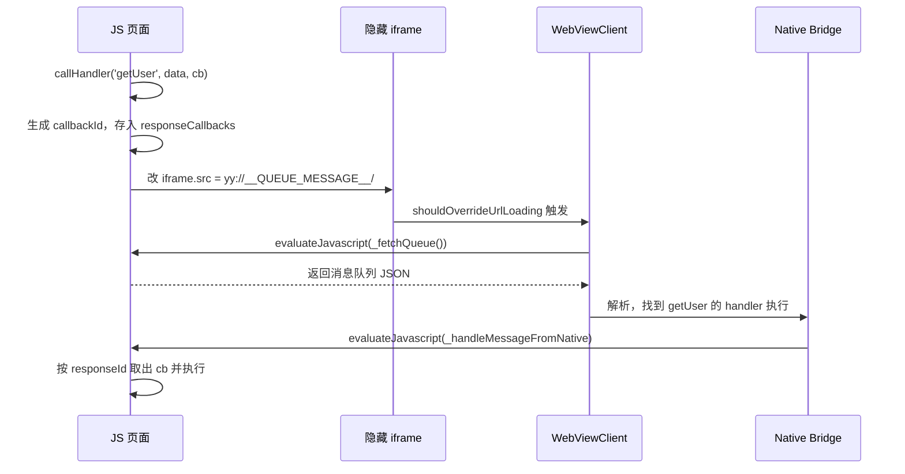

混合开发（Hybrid）里绕不开一个问题：**运行在 WebView 里的网页（JS）和运行在 Android 虚拟机里的原生代码（Java/Kotlin），怎么互相调用？** 本文从底层原理讲起，梳理官方提供的几种交互方式，拆解 JsBridge 到底是什么、如何自己实现一个，最后给出目前推荐的两套现代方案及完整代码。

## WebView 是两个世界的边界

Android 里的 `WebView` 内部跑着一个浏览器内核（现代版本是 Chromium）。**Native 运行在 Android 虚拟机里，JS 运行在 WebView 的 JS 引擎（V8）里，两者内存不互通。** 所谓「交互」，本质是在这条边界上找到几个官方开的「口子」，把调用意图和数据（通常序列化成字符串 / JSON）从一端搬到另一端。

方向只有两个：`Native → JS` 和 `JS → Native`。后面所有花哨的框架，都不过是这四五个原生 API 的组合封装。

## Native → JS：调用网页里的函数

### loadUrl("javascript:...") —— 老方式

```kotlin
webView.loadUrl("javascript:showMessage('hello')")
```
{: file="Native → JS（旧）" }

- API 16 及以下唯一选择。
- **拿不到返回值**，且会走一次完整的 loadUrl 流程，有性能开销，早期还会导致焦点 / 滚动异常。

### evaluateJavascript() —— 4.4（API 19）后推荐

```kotlin
webView.evaluateJavascript("showMessage('hello')") { value ->
    // value 是 JS 表达式的返回值（JSON 字符串形式）
    Log.d("JsBridge", "JS 返回: $value")
}
```
{: file="Native → JS（推荐）" }

- 异步执行，不阻塞、不刷新页面。
- **能拿到 JS 的返回值**（通过 `ValueCallback`）。
- 必须在主线程调用。

## JS → Native：调用原生方法的三条路

### 路线 A：addJavascriptInterface —— 官方「注入对象」

Native 把一个对象直接映射到 JS 的 `window` 上：

```kotlin
class AndroidBridge(private val context: Context) {
    /**
     * 供 JS 直接调用的原生方法。
     * Native method exposed to JS.
     * @param msg JS 传入的消息内容
     * @return String 返回给 JS 的结果
     */
    @JavascriptInterface  // 4.2(API 17) 起必须加，否则 JS 调不到
    fun toast(msg: String): String {
        Toast.makeText(context, msg, Toast.LENGTH_SHORT).show()
        return "ok"
    }
}

webView.settings.javaScriptEnabled = true
webView.addJavascriptInterface(AndroidBridge(this), "AndroidBridge")
```
{: file="JS → Native：addJavascriptInterface" }

JS 端：

```javascript
// window.AndroidBridge 就是注入进来的对象
const result = window.AndroidBridge.toast("来自网页的问候");
```

> **历史安全漏洞（面试高频）**：Android 4.2 以前，`addJavascriptInterface` 会把对象的**所有** public 方法（包括继承自 `Object` 的）暴露给 JS。攻击者可通过反射 `getClass().getClassLoader()...` 一路拿到 `Runtime.getRuntime().exec()`，**执行任意命令**（CVE-2012-6636）。4.2 起引入 `@JavascriptInterface` 注解，只有被标注的方法才暴露，漏洞才被堵上。这正是早期各家自研 JsBridge 绕开它、改用 URL 拦截的核心动机。
{: .prompt-danger }

### 路线 B：拦截自定义 URL Scheme

JS 通过改变 `location.href` 或 `iframe.src` 发一个假请求，Native 在 `WebViewClient` 里拦截解析：

```javascript
// JS 端：发起一个自定义协议的"请求"
function callNative(action, params) {
    const iframe = document.createElement('iframe');
    iframe.style.display = 'none';
    iframe.src = `myapp://call?action=${action}&params=${encodeURIComponent(JSON.stringify(params))}`;
    document.body.appendChild(iframe);
    setTimeout(() => document.body.removeChild(iframe), 0);
}
```

```kotlin
webView.webViewClient = object : WebViewClient() {
    override fun shouldOverrideUrlLoading(view: WebView, request: WebResourceRequest): Boolean {
        val url = request.url.toString()
        if (url.startsWith("myapp://")) {
            handleBridgeCall(request.url)  // 解析 scheme，分发到原生逻辑
            return true  // 拦截，不真正加载
        }
        return false
    }
}
```
{: file="JS → Native：URL 拦截" }

- 优点：不依赖 `addJavascriptInterface`，规避了老版本安全漏洞。
- 缺点：URL 长度有限制（超长数据会被截断），且本身**没有返回值通道** —— 需要 Native 再用 `evaluateJavascript` 回调 JS 才能拿结果。这也是 JsBridge 框架要设计「回调机制」的根源。

### 路线 C：拦截 prompt / alert / console.log

JS 调用 `prompt()`，Native 在 `WebChromeClient.onJsPrompt` 里拦截。之所以偏爱 `prompt` 而不是 `alert` / `confirm`，是因为 **`prompt` 天然能带一个同步返回值**：

```kotlin
webView.webChromeClient = object : WebChromeClient() {
    override fun onJsPrompt(
        view: WebView, url: String, message: String,
        defaultValue: String, result: JsPromptResult
    ): Boolean {
        // message 里放约定好的调用协议
        val response = handleBridgePrompt(message)
        result.confirm(response)  // 同步把结果返回给 JS
        return true
    }
}
```
{: file="JS → Native：prompt 拦截" }

- 优点：能同步返回值、无 URL 长度限制。
- 缺点：语义 hack，且会和页面真实的 prompt 混淆，需协议区分。

## JsBridge 到底是什么

上面的原生 API 都很「原始」：

- `addJavascriptInterface` 每加一个功能要注册一个方法，无法优雅回调；
- URL 拦截没有返回值通道、有长度限制；
- 各方式风格割裂，JS 和 Native 两边写法不统一。

**JsBridge 就是在这些原生能力之上封装出的一套统一、双向、支持异步回调的通信框架。** 它让开发者面向一套一致的 API 编程：

```javascript
// JS 端理想的样子
bridge.callHandler('getUserInfo', { id: 1 }, (response) => { /* ... */ });  // 调 Native 并拿回调
bridge.registerHandler('onNativeEvent', (data, callback) => { /* ... */ }); // 注册给 Native 调
```

```kotlin
// Native 端对称的样子
bridge.registerHandler("getUserInfo") { data, callback -> callback("...") }
bridge.callHandler("onNativeEvent", data) { response -> /* ... */ }
```

它核心解决四件事：**① 统一的双向 API；② 支持回调（把异步结果送回发起方）；③ 消息队列管理；④ 用一个通道承载无限多个方法**（不用每加功能就 `addJavascriptInterface`）。代表实现：`marcuswestin/WebViewJavascriptBridge`（鼻祖）、Android 上广泛使用的 `lzyzsd/JsBridge`。

## 定制开发一个 JsBridge

下面给出经典设计（URL 拦截 + JS 消息队列 + 回调映射），这是理解 JsBridge 精髓的最佳模型。

### 1. 定义统一消息协议

一条消息就是一个 JSON 对象，靠几个字段实现「调用」和「回调」的对称：

```json
{
  "handlerName": "getUserInfo",
  "data": { "id": 1 },
  "callbackId": "cb_1_1234",
  "responseId": "cb_1_1234",
  "responseData": { "name": "x" }
}
```

关键洞察：**`callbackId` 和 `responseId` 是同一把钥匙**。发起方生成 `callbackId` 并暂存回调函数，接收方处理完把它原样放进 `responseId` 送回，发起方据此找到当初的回调执行。

### 2. JS 端核心实现

```javascript
(function () {
    const responseCallbacks = {};   // callbackId -> 回调函数
    const messageHandlers = {};     // handlerName -> 处理函数
    let uniqueId = 1;
    const sendMessageQueue = [];    // 待 Native 取走的消息队列
    const CUSTOM_PROTOCOL = 'yy://';

    const bridge = {
        // 注册一个供 Native 调用的 handler
        registerHandler(name, handler) {
            messageHandlers[name] = handler;
        },
        // 调用 Native 的 handler，responseCallback 可选
        callHandler(name, data, responseCallback) {
            const message = { handlerName: name, data: data };
            if (responseCallback) {
                const callbackId = `cb_${uniqueId++}_${+new Date()}`;
                responseCallbacks[callbackId] = responseCallback;
                message.callbackId = callbackId;
            }
            sendMessageQueue.push(message);
            // 用 iframe.src 变化"戳"一下 Native，通知它来取队列
            messagingIframe.src = CUSTOM_PROTOCOL + '__QUEUE_MESSAGE__/';
        },
        // 供 Native 拉取消息队列
        _fetchQueue() {
            const json = JSON.stringify(sendMessageQueue);
            sendMessageQueue.length = 0;
            return json;
        },
        // 供 Native 把消息/回调推给 JS
        _handleMessageFromNative(messageJSON) {
            const message = JSON.parse(messageJSON);
            if (message.responseId) {
                // 这是 Native 对某次 callHandler 的回调
                const callback = responseCallbacks[message.responseId];
                callback && callback(message.responseData);
                delete responseCallbacks[message.responseId];
            } else {
                // 这是 Native 主动调用 JS 的 handler
                const handler = messageHandlers[message.handlerName];
                const responseCallback = message.callbackId
                    ? (data) => bridge._sendResponse(message.callbackId, data)
                    : null;
                handler && handler(message.data, responseCallback);
            }
        },
        _sendResponse(responseId, responseData) {
            sendMessageQueue.push({ responseId, responseData });
            messagingIframe.src = CUSTOM_PROTOCOL + '__QUEUE_MESSAGE__/';
        }
    };

    // 隐藏 iframe，用于触发 Native 拦截
    const messagingIframe = document.createElement('iframe');
    messagingIframe.style.display = 'none';
    document.documentElement.appendChild(messagingIframe);

    window.WebViewJavascriptBridge = bridge;
})();
```
{: file="bridge.js" }

### 3. Native 端核心实现

```kotlin
/**
 * 基于 URL 拦截 + 消息队列的 JsBridge 实现。
 * JsBridge implementation based on URL interception and message queue.
 */
class WebViewJsBridge(private val webView: WebView) {

    private val responseCallbacks = HashMap<String, (String) -> Unit>()   // 我方发起、等 JS 回调
    private val messageHandlers = HashMap<String, BridgeHandler>()        // 供 JS 调用的 handler
    private var uniqueId = 1

    /**
     * 注册供 JS 调用的原生 handler。
     * Register a native handler callable from JS.
     * @param name handler 名称
     * @param handler 处理逻辑
     */
    fun registerHandler(name: String, handler: BridgeHandler) {
        messageHandlers[name] = handler
    }

    /**
     * 主动调用 JS 端的 handler。
     * Call a JS handler from native side.
     * @param name JS handler 名称
     * @param data 传递的数据
     * @param callback JS 处理完后的回调（可空）
     */
    fun callHandler(name: String, data: String, callback: ((String) -> Unit)? = null) {
        val message = JSONObject().put("handlerName", name).put("data", data)
        if (callback != null) {
            val callbackId = "native_cb_${uniqueId++}"
            responseCallbacks[callbackId] = callback
            message.put("callbackId", callbackId)
        }
        dispatchToJs(message)
    }

    /**
     * 在 WebViewClient.shouldOverrideUrlLoading 里被调用，识别桥接协议。
     * Called from shouldOverrideUrlLoading to recognize the bridge protocol.
     * @param url 被拦截的 URL
     * @return Boolean 是否为桥接协议并已处理
     */
    fun handleUrl(url: String): Boolean {
        if (!url.startsWith("yy://")) return false
        if (url.contains("__QUEUE_MESSAGE__")) {
            // JS 通知有消息，去拉取队列
            webView.evaluateJavascript("WebViewJavascriptBridge._fetchQueue()") { queueJson ->
                processQueue(queueJson)
            }
        }
        return true
    }

    // 处理 JS 送来的消息队列
    private fun processQueue(queueJson: String) {
        // queueJson 是被 JSON 转义过的字符串，需先反转义再 parse
        val messages = JSONArray(JSONObject("{\"d\":$queueJson}").getString("d"))
        for (i in 0 until messages.length()) {
            val msg = messages.getJSONObject(i)
            val responseId = msg.optString("responseId")
            if (responseId.isNotEmpty()) {
                // JS 在回调我方之前的 callHandler
                responseCallbacks.remove(responseId)?.invoke(msg.optString("responseData"))
            } else {
                // JS 在调用我方 handler
                val handler = messageHandlers[msg.optString("handlerName")]
                val callbackId = msg.optString("callbackId")
                handler?.handle(msg.optString("data")) { responseData ->
                    // 处理完，把结果回给 JS
                    val response = JSONObject()
                        .put("responseId", callbackId)
                        .put("responseData", responseData)
                    dispatchToJs(response)
                }
            }
        }
    }

    // 通过 evaluateJavascript 把消息送进 JS
    private fun dispatchToJs(message: JSONObject) {
        val js = "WebViewJavascriptBridge._handleMessageFromNative('$message')"
        webView.post { webView.evaluateJavascript(js, null) }
    }

    fun interface BridgeHandler {
        fun handle(data: String, callback: (String) -> Unit)
    }
}
```
{: file="WebViewJsBridge.kt" }

### 4. 完整调用时序（JS 调 Native 并拿回调）



Native 主动调 JS 是完全对称的过程，只是发起方和回调存储位置互换。

## 现代方案一：WebMessageListener（官方推荐）

这是 Google 在 `androidx.webkit` 里提供的官方跨 WebView 版本方案，本质是把网页标准的 **`postMessage` 消息通道**接到了 Native。

- **安全**：注册时强制传入 **origin 允许列表**，只有白名单域名的页面才能拿到 bridge 对象，从根上防住「任意页面调你原生方法」。
- **标准语义**：走 `MessagePort` / structured-clone 那套 Web 标准，不是 hack。
- **回调在 UI 线程**：`onPostMessage` 带 `@UiThread` 注解，回调直接在主线程，不用自己切线程。
- **官方维护**：跟随 WebView 内核更新，没有 `addJavascriptInterface` 的历史包袱。

唯一约束：**只支持异步**（没有同步返回值），且需要 WebView 内核支持该 feature（用 `WebViewFeature.isFeatureSupported` 检测，老内核要有回退方案）。

### 引入依赖 & Feature 检测

```groovy
dependencies {
    implementation("androidx.webkit:webkit:1.12.0") // 用当前最新稳定版
}
```
{: file="build.gradle" }

任何 `androidx.webkit` 的能力都要先做特性检测（同一份代码跑在不同 WebView 内核上，能力不同）。

### 最简用法（理解原生 API 层）

```kotlin
import androidx.webkit.WebViewCompat
import androidx.webkit.WebViewFeature

if (WebViewFeature.isFeatureSupported(WebViewFeature.WEB_MESSAGE_LISTENER)) {
    WebViewCompat.addWebMessageListener(
        webView,
        "androidBridge",                       // 注入到 JS 的对象名 → window.androidBridge
        setOf("https://your.domain.com"),      // origin 白名单，"*" 表示不限（生产别用）
    ) { view, message, sourceOrigin, isMainFrame, replyProxy ->
        // 这里在 UI 线程被回调
        val text = message.data                // JS 发来的字符串
        replyProxy.postMessage("native 收到了：$text") // 回一条消息给 JS
    }
}
```
{: file="WebMessageListener 最简用法" }

对应官方签名（Kotlin）：

```kotlin
// WebViewCompat 静态方法
fun addWebMessageListener(
    webView: WebView,
    jsObjectName: String,
    allowedOriginRules: Set<String>,
    listener: WebViewCompat.WebMessageListener
)

// 监听器接口
interface WebMessageListener {
    @UiThread
    fun onPostMessage(
        view: WebView,
        message: WebMessageCompat,
        sourceOrigin: Uri,
        isMainFrame: Boolean,
        replyProxy: JavaScriptReplyProxy
    )
}

// JavaScriptReplyProxy.postMessage(message: String) —— 原生回消息给 JS
```
{: .nolineno }

### JS 端拿到的是什么

调用 `addWebMessageListener("androidBridge", ...)` 后，WebView 会**自动在匹配 origin 的每个页面注入 `window.androidBridge` 对象**：

```javascript
// 发消息给 Native
window.androidBridge.postMessage("hello from web");

// 接收 Native 回来的消息
window.androidBridge.onmessage = function (event) {
    console.log("native 说:", event.data);
};
// 或者 window.androidBridge.addEventListener("message", handler)
```

`postMessage` 只能传字符串（新内核也支持 ArrayBuffer），所以复杂参数统一 `JSON.stringify`。

### 完整封装：带 callback / Promise 的双向 Bridge

原生 API 是「发一条、收一条」的裸通道，实际项目需要**请求-响应配对**。做法是在消息里加 `callbackId`，因为传输层是真正的消息通道，实现比 URL 拦截干净得多。

```kotlin
/**
 * 基于 WebMessageListener 的原生桥接封装。
 * Native bridge built on top of WebMessageListener.
 */
class ModernJsBridge(private val webView: WebView) {

    // 方法名 -> 处理器（返回结果）
    private val handlers = HashMap<String, (JSONObject) -> Any?>()

    /**
     * 注册供 JS 调用的原生方法。
     * Register a native handler callable from JS.
     * @param name 方法名
     * @param handler 处理逻辑，入参为 JS 传来的 params
     */
    fun register(name: String, handler: (JSONObject) -> Any?) {
        handlers[name] = handler
    }

    /**
     * 绑定到 WebView，注入 window.androidBridge。
     * Attach to WebView and inject window.androidBridge.
     * @param allowedOrigins 允许访问的 origin 集合
     */
    fun attach(allowedOrigins: Set<String>) {
        if (!WebViewFeature.isFeatureSupported(WebViewFeature.WEB_MESSAGE_LISTENER)) {
            // 老内核回退：改用 addJavascriptInterface 方案（见方案二）
            return
        }
        WebViewCompat.addWebMessageListener(
            webView, "androidBridge", allowedOrigins
        ) { _, message, _, _, replyProxy ->
            val req = JSONObject(message.data ?: "{}")
            val method = req.optString("method")
            val params = req.optJSONObject("params") ?: JSONObject()
            val callbackId = req.optString("callbackId")

            val handler = handlers[method]
            val response = JSONObject().put("callbackId", callbackId)
            if (handler == null) {
                response.put("error", "no such method: $method")
            } else {
                // 若是耗时任务，可在子线程执行，完成后再 replyProxy.postMessage
                runCatching { handler(params) }
                    .onSuccess { response.put("data", it) }
                    .onFailure { response.put("error", it.message) }
            }
            replyProxy.postMessage(response.toString())
        }
    }
}
```
{: file="ModernJsBridge.kt" }

使用：

```kotlin
val bridge = ModernJsBridge(webView)
bridge.register("getToken") { JSONObject().put("token", "abc123") }
bridge.register("toast") { params ->
    Toast.makeText(this, params.optString("msg"), Toast.LENGTH_SHORT).show()
    "ok"
}
bridge.attach(setOf("https://your.domain.com"))
```

JS 端封装成 Promise：

```javascript
window.NativeBridge = (function () {
    const callbacks = {};
    let seq = 0;

    // 接收 Native 回复，按 callbackId 分发
    window.androidBridge.onmessage = function (event) {
        const msg = JSON.parse(event.data);
        const cb = callbacks[msg.callbackId];
        if (cb) {
            delete callbacks[msg.callbackId];
            msg.error ? cb.reject(new Error(msg.error)) : cb.resolve(msg.data);
        }
    };

    return {
        // 调用原生方法，返回 Promise
        call(method, params = {}) {
            return new Promise((resolve, reject) => {
                const callbackId = `cb_${++seq}_${Date.now()}`;
                callbacks[callbackId] = { resolve, reject };
                window.androidBridge.postMessage(
                    JSON.stringify({ method, params, callbackId })
                );
            });
        }
    };
})();

// 业务调用
const { token } = await NativeBridge.call("getToken");
await NativeBridge.call("toast", { msg: "你好" });
```
{: file="native-bridge.js" }

### 用 addDocumentStartJavaScript 自动注入

不想让每个网页都手写那段封装？用官方的**文档启动脚本注入**，在页面开始加载前就把 `window.NativeBridge` 注入好：

```kotlin
if (WebViewFeature.isFeatureSupported(WebViewFeature.DOCUMENT_START_SCRIPT)) {
    WebViewCompat.addDocumentStartJavaScript(
        webView,
        bridgeJsWrapper,                 // 上面那段 IIFE 字符串
        setOf("https://your.domain.com")
    )
}
```

`addWebMessageListener` 注入底层 `androidBridge`，`addDocumentStartJavaScript` 注入上层封装 —— 两者搭配就是一套零侵入、开箱即用的现代桥。

> **注意事项**：① `WEB_MESSAGE_LISTENER` 在较老的 WebView 内核不支持，务必用 `isFeatureSupported` 检测并回退到方案二；② 生产环境 origin 白名单别用 `"*"`，精确到域名；③ 仅支持异步，「立刻要同步结果」的场景得用方案二。
{: .prompt-warning }

## 现代方案二：基于 addJavascriptInterface 的现代框架（DSBridge 思路）

`addJavascriptInterface` 在 **API 17+ 且坚持 `@JavascriptInterface` 注解**后已经安全，且相比方案一有两个独特优势：

- **支持同步返回值**（Java 方法直接 `return`，JS 立刻拿到）。
- **兼容性拉满**，不依赖任何 feature 检测，几乎所有设备可用 —— 常作为方案一的回退。

代表库是 `wendux/DSBridge-Android`，它把这套模式产品化：**同步 + 异步双通道、按命名空间注册 API、无 URL 长度限制**。下面把它的核心机制拆开手写一遍。

### 核心机制：单一 dispatch 方法

不再「每加一个功能 `addJavascriptInterface` 一个方法」，而是**只注入一个对象、暴露一个通用 `call` 方法**，靠 method 名分发：

```kotlin
/**
 * 基于 addJavascriptInterface 的桥接实现（DSBridge 思路）。
 * Bridge implementation based on addJavascriptInterface (DSBridge style).
 */
class JsApiBridge(private val webView: WebView) {

    private val handlers = HashMap<String, (JSONObject) -> Any?>()

    /**
     * 注册供 JS 调用的原生方法。
     * Register a native handler callable from JS.
     * @param name 方法名
     * @param handler 处理逻辑
     */
    fun register(name: String, handler: (JSONObject) -> Any?) {
        handlers[name] = handler
    }

    /**
     * 注入到 WebView，暴露 window._native。
     * Inject into WebView, exposing window._native.
     */
    fun attach() {
        webView.settings.javaScriptEnabled = true
        webView.addJavascriptInterface(this, "_native")
    }

    /**
     * JS 同步调用入口，直接返回结果字符串。
     * Synchronous call entry from JS, returns result directly.
     * @param method 方法名
     * @param argsJson JS 传来的参数（JSON 字符串）
     * @return String 结果 JSON
     */
    @JavascriptInterface
    fun callSync(method: String, argsJson: String): String {
        val handler = handlers[method]
            ?: return JSONObject().put("error", "no such method").toString()
        val args = JSONObject(argsJson)
        return JSONObject().put("data", handler(args)).toString()
    }

    /**
     * JS 异步调用入口，处理完通过 evaluateJavascript 回调 JS。
     * Asynchronous call entry from JS, replies via evaluateJavascript.
     * @param method 方法名
     * @param argsJson 参数 JSON 字符串
     * @param callbackId JS 侧回调 id
     */
    @JavascriptInterface
    fun callAsync(method: String, argsJson: String, callbackId: String) {
        // 关键：此方法运行在 WebView 的 JavaBridge 私有线程，不是主线程！
        val handler = handlers[method] ?: return
        Thread {
            val result = runCatching { handler(JSONObject(argsJson)) }
                .getOrElse { JSONObject().put("error", it.message) }
            val payload = JSONObject().put("data", result).toString()
            // 回调 JS 必须切回主线程
            webView.post {
                webView.evaluateJavascript(
                    "window.__nativeCallback('$callbackId', $payload)", null
                )
            }
        }.start()
    }
}
```
{: file="JsApiBridge.kt" }

> **面试高频坑**：`@JavascriptInterface` 方法**不在 UI 线程执行**，而在 WebView 内部的 `JavaBridge` 后台线程。任何碰 UI 的操作（Toast、跳转、改控件）都要 `webView.post { }` 切回主线程，否则崩溃。这一点和方案一（`@UiThread`）正好相反。
{: .prompt-danger }

### JS 端：同步 + 异步（Promise）双通道

```javascript
window.JsBridge = (function () {
    const callbacks = {};
    let seq = 0;

    // 供 Native 异步回调
    window.__nativeCallback = function (callbackId, result) {
        const cb = callbacks[callbackId];
        if (cb) {
            delete callbacks[callbackId];
            result.error ? cb.reject(new Error(result.error)) : cb.resolve(result.data);
        }
    };

    return {
        // 同步调用，立即返回结果
        callSync(method, args = {}) {
            const raw = window._native.callSync(method, JSON.stringify(args));
            const r = JSON.parse(raw);
            if (r.error) throw new Error(r.error);
            return r.data;
        },
        // 异步调用，返回 Promise
        call(method, args = {}) {
            return new Promise((resolve, reject) => {
                const callbackId = `cb_${++seq}_${Date.now()}`;
                callbacks[callbackId] = { resolve, reject };
                window._native.callAsync(method, JSON.stringify(args), callbackId);
            });
        }
    };
})();

// 用法
const version = JsBridge.callSync("getAppVersion");       // 同步
const user = await JsBridge.call("login", { name: "x" }); // 异步
```
{: file="js-bridge.js" }

### 别忘了混淆规则

R8 / ProGuard 会重命名方法，导致 JS 调不到，必须 keep：

```plaintext
-keepclassmembers class com.your.pkg.JsApiBridge {
    @android.webkit.JavascriptInterface <methods>;
}
```
{: file="proguard-rules.pro" }

### 直接用 DSBridge

生产上不必手写，`DSBridge-Android` 已封装好上述全部能力（同步 / 异步、命名空间 `namespace.method`、`CompletionHandler` 处理异步与进度回调）：

```kotlin
// Native：注册 API 类
dwebView.addJavascriptObject(JsApi(), null)
class JsApi {
    @JavascriptInterface
    fun getToken(msg: Any): String = "abc"            // 同步
    @JavascriptInterface
    fun login(msg: Any, handler: CompletionHandler) { // 异步
        handler.complete("done")
    }
}
```

```javascript
import dsBridge from "dsbridge";
const token = dsBridge.call("getToken");                  // 同步
dsBridge.call("login", { name: "x" }, (r) => { /* ... */ }); // 异步
```

## 两方案对比与选型

| 维度 | 方案一 `WebMessageListener` | 方案二 `addJavascriptInterface`（DSBridge） |
|:---|:---|:---|
| 依赖 | `androidx.webkit` | 无（框架 API） |
| 安全性 | 内建 origin 白名单 | 需自己校验 URL / origin |
| 回调线程 | UI 线程（`@UiThread`） | **后台 JavaBridge 线程**，UI 操作需切主线程 |
| 同步返回值 | 仅异步 | 支持 |
| 兼容性 | 需 feature 检测（老内核不支持） | API 17+ 几乎全覆盖 |
| 通信模型 | Web 标准 `postMessage` 通道 | 反射注入对象 + 方法分发 |
| 官方态度 | 官方推荐 | 长期可用，历史有漏洞（已修） |

**选型建议**

- **新项目、可控 WebView 版本** → 首选**方案一**，安全性和线程模型最省心。
- **需要同步返回、或要兼容各种老设备** → 用**方案二**（DSBridge），并把它作为方案一的回退。
- **最稳的工程实践**：`attach()` 时先检测 `WEB_MESSAGE_LISTENER`，支持就走方案一，不支持自动降级到方案二 —— 对上层业务暴露同一套 `call()` API。

> 一句话总结：**所有 JsBridge 都是对 `evaluateJavascript` + `addJavascriptInterface` / URL 拦截 / `postMessage` 这几个原生口子的封装**，区别只在于封装得多优雅、多安全。理解了原理，选型和排障都会变得清晰。
{: .prompt-tip }

## 面试问题与解答

### Q1：WebView 里 JS 和 Native 为什么不能直接互相调用？「交互」的本质是什么？

因为二者不在同一个运行时：Native 跑在 Android 虚拟机里，JS 跑在 WebView 的 JS 引擎（V8）里，**两者内存不互通、没有共享的调用栈**。所谓交互，本质是在 WebView 这条边界上，利用官方开放的几个「口子」，把**调用意图和数据（通常序列化成字符串 / JSON）**从一端搬到另一端。方向只有两个：`Native → JS`（`loadUrl("javascript:")` / `evaluateJavascript`）和 `JS → Native`（`addJavascriptInterface` / URL 拦截 / `prompt` 拦截）。所有框架都是这几个原生 API 的组合封装。

### Q2：`loadUrl("javascript:...")` 和 `evaluateJavascript()` 有什么区别？

- `loadUrl("javascript:...")` 是 API 16 及以下的唯一选择：**拿不到返回值**，且会走一次完整的 loadUrl 流程，有性能开销，早期还会引发焦点 / 滚动异常。
- `evaluateJavascript()` 是 API 19（4.4）后的推荐方式：**异步执行、不刷新页面**，并能通过 `ValueCallback` **拿到 JS 表达式的返回值**（JSON 字符串形式）。必须在主线程调用。

### Q3：`addJavascriptInterface` 有什么著名的安全漏洞？后来是怎么修复的？

Android 4.2 以前，`addJavascriptInterface` 会把注入对象的**所有 public 方法（含继承自 `Object` 的）**都暴露给 JS。攻击者可以通过反射 `getClass().getClassLoader()...` 一路拿到 `Runtime.getRuntime().exec()`，从而**执行任意命令**（CVE-2012-6636）。4.2（API 17）起引入 `@JavascriptInterface` 注解，**只有被显式标注的方法才会暴露**，漏洞才被堵上。这也是早期各家自研 JsBridge 绕开它、改用 URL 拦截的核心动机。

### Q4：JS 调 Native 的三条路线各有什么优缺点？

- **A. `addJavascriptInterface`**：直接把对象注入到 `window`，能同步返回值；但需 `@JavascriptInterface` 注解、每加功能就得注册方法、且回调不优雅。
- **B. 拦截自定义 URL Scheme**（`shouldOverrideUrlLoading`）：规避了老版本安全漏洞；但 **URL 有长度限制**、且**本身没有返回值通道**，需要 Native 再用 `evaluateJavascript` 回调 JS。
- **C. 拦截 `prompt`**（`onJsPrompt`）：**天然能带同步返回值**（`result.confirm()`）、无长度限制；但属于语义 hack，会和页面真实的 prompt 混淆，需协议区分。

### Q5：为什么 URL 拦截偏爱 `prompt` 而不是 `alert` / `confirm`？

因为 `prompt` 在 JS 端调用后**能同步接收一个字符串返回值**（`window.prompt()` 的返回值），Native 在 `onJsPrompt` 里用 `result.confirm(response)` 就能把结果**同步**送回 JS。而 `alert` 无返回值、`confirm` 只能返回布尔值，都无法承载完整的数据回传。

### Q6：JsBridge 到底解决了什么问题？它的核心机制是什么？

原生 API 很「原始」：`addJavascriptInterface` 每加功能要注册方法、无法优雅回调；URL 拦截没有返回值通道、有长度限制；各方式风格割裂。JsBridge 就是在这些能力之上封装的**统一、双向、支持异步回调**的框架，核心解决四件事：**① 统一的双向 API；② 支持回调（把异步结果送回发起方）；③ 消息队列管理；④ 用一个通道承载无限多个方法**。

其经典实现的关键是**消息协议里的 `callbackId` / `responseId` 是同一把钥匙**：发起方生成 `callbackId` 并暂存回调函数，接收方处理完把它原样放进 `responseId` 送回，发起方据此找到当初的回调执行——从而在「无返回值通道」的裸机制上模拟出请求-响应配对。

### Q7：经典 JsBridge 里，JS 通知 Native「有消息」为什么要用一个隐藏 iframe？

因为 URL 拦截方案里，JS 没法直接「叫醒」Native，只能靠**改变 URL 触发 `shouldOverrideUrlLoading`**。用隐藏 iframe 的 `src` 变化（如 `yy://__QUEUE_MESSAGE__/`）去「戳」一下 Native，比直接改 `window.location.href` 更安全——不会影响主页面导航、不会打断当前页面状态。Native 收到这个信号后，再用 `evaluateJavascript` 调 `_fetchQueue()` 把 JS 攒的消息队列一次性取走。

### Q8：现代方案 `WebMessageListener` 相比传统方案好在哪？有什么约束？

优势：**① 安全**——注册时强制传入 origin 白名单，只有匹配域名的页面才能拿到 bridge 对象；**② 标准语义**——走 Web 标准的 `postMessage` / `MessagePort`，不是 hack；**③ 回调在 UI 线程**（`onPostMessage` 带 `@UiThread`）；**④ 官方维护**，无历史包袱。

约束：**只支持异步**（没有同步返回值），且**需要 WebView 内核支持该 feature**，必须用 `WebViewFeature.isFeatureSupported(WEB_MESSAGE_LISTENER)` 检测，老内核要有回退方案（降级到方案二）。

### Q9：`@JavascriptInterface` 方法运行在哪个线程？和方案一有什么区别？

`@JavascriptInterface` 方法**不在 UI 线程执行，而是在 WebView 内部的 `JavaBridge` 后台线程**。任何碰 UI 的操作（Toast、页面跳转、改控件）都必须 `webView.post { }` 切回主线程，否则崩溃。这一点和方案一（`WebMessageListener` 的 `onPostMessage` 带 `@UiThread`、天然在主线程）**正好相反**，是面试高频坑。

### Q10：用 `addJavascriptInterface` 的 JsBridge 上线时，为什么要加混淆规则？

R8 / ProGuard 在混淆时会**重命名方法**，一旦 `@JavascriptInterface` 方法被改名，JS 端按原名调用就会失败。所以必须 keep 住这些方法：

```plaintext
-keepclassmembers class com.your.pkg.JsApiBridge {
    @android.webkit.JavascriptInterface <methods>;
}
```

### Q11：两套现代方案怎么选型？

- **新项目、WebView 版本可控** → 首选 **`WebMessageListener`**，安全性和线程模型最省心。
- **需要同步返回值、或要兼容各种老设备** → 用 **`addJavascriptInterface`（DSBridge 思路）**，它支持同步 `return`、兼容性拉满（API 17+ 几乎全覆盖）。
- **最稳的工程实践**：`attach()` 时先检测 `WEB_MESSAGE_LISTENER`，支持就走方案一，不支持自动降级到方案二，**对上层业务暴露同一套 `call()` API**。
