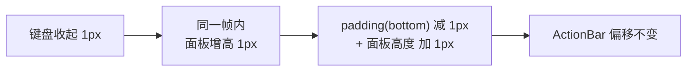

页面底部有一条固定 48dp 高的操作栏（ActionBar）。点击「字体」按钮时，需要在**软键盘**和**字体样式面板**之间来回切换。朴素实现是「先收键盘，等收完再展开面板」——结果 ActionBar 会先跟着键盘掉到屏幕底部，再被面板顶回来，切换过程明显上下跳动。

目标效果是**切换全程 ActionBar 在屏幕上的绝对位置纹丝不动，键盘和面板在它下方无缝互换**，类似 iOS 邮件客户端的观感。本文推导这背后的原理，并给出一份完整可运行的 Compose Demo。

## 抖动的根源

ActionBar 距屏幕底部的距离，实际上由两部分叠加而成：

```
ActionBar 底部偏移 = 当前键盘高度 + 面板高度
```

朴素实现之所以抖动，是因为这两个量在时间上是**串行**变化的：键盘先从满高收到 0（偏移跟着变小、ActionBar 下沉），面板再从 0 展开到目标高度（偏移再变大、ActionBar 弹回）。一先一后,自然就是「先掉下去、再弹回来」的两段式跳动。

解法的方向也就随之明确：让这两个量**同帧互补**——键盘每收 1px，面板同帧长 1px，两者之和恒定，ActionBar 就不会移动。

## 核心原理：高度互补恒等式

ActionBar 悬浮固定在根 `Box` 底部，自己用 `padding(bottom = 当前IME高度)` 逐帧消费 IME inset，面板挂在它下方。于是：

```
ActionBar 底部偏移 = imeHeightDp（bottom padding）+ panelHeight（面板高度）
```

让面板高度按下面的式子实时计算：

```
panelHeight = lastImeHeightDp（键盘最大稳定高度） - imeHeightDp（当前键盘高度）
```

代入即可得到：

```
ActionBar 底部偏移 = imeHeightDp + (lastImeHeightDp - imeHeightDp) = lastImeHeightDp（恒定）
```

关键在于 Compose 的 `WindowInsets.ime` 在 IME 动画期间会**逐帧更新**（API 30+ 由系统 `WindowInsetsAnimation` 驱动）。于是键盘每收 1px，面板同帧长 1px；键盘每弹 1px，面板同帧缩 1px，两项之和恒定，ActionBar 被「钉」在固定高度。**不需要任何手写动画**——面板高度天然被系统 IME 动画曲线驱动，与键盘完全同步。

> 恒等式只是骨架，真正落地还需要四个配套机制：记录键盘最大稳定高度作为常数项、控制切换的触发顺序、面板收尾时机、以及防止 inset 单帧抖动导致的闪烁。Demo 中都有实现，见下文代码里的机制 1～4 标注。
{: .prompt-tip }



## 完整 Demo 代码

前置条件（缺一不可，否则拿不到逐帧 IME inset）：

```xml
<!-- AndroidManifest.xml：Activity 需声明 adjustResize -->
<activity
    android:name=".KeyboardPanelDemoActivity"
    android:windowSoftInputMode="adjustResize" />
```
{: file="AndroidManifest.xml" }

```kotlin
package com.example.keyboardpaneldemo

import android.os.Bundle
import androidx.activity.ComponentActivity
import androidx.activity.compose.setContent
import androidx.compose.foundation.background
import androidx.compose.foundation.layout.Box
import androidx.compose.foundation.layout.BoxScope
import androidx.compose.foundation.layout.Column
import androidx.compose.foundation.layout.ExperimentalLayoutApi
import androidx.compose.foundation.layout.Row
import androidx.compose.foundation.layout.Spacer
import androidx.compose.foundation.layout.WindowInsets
import androidx.compose.foundation.layout.fillMaxSize
import androidx.compose.foundation.layout.fillMaxWidth
import androidx.compose.foundation.layout.height
import androidx.compose.foundation.layout.ime
import androidx.compose.foundation.layout.isImeVisible
import androidx.compose.foundation.layout.padding
import androidx.compose.foundation.layout.statusBarsPadding
import androidx.compose.material3.MaterialTheme
import androidx.compose.material3.Text
import androidx.compose.material3.TextButton
import androidx.compose.material3.TextField
import androidx.compose.runtime.Composable
import androidx.compose.runtime.LaunchedEffect
import androidx.compose.runtime.getValue
import androidx.compose.runtime.mutableStateOf
import androidx.compose.runtime.remember
import androidx.compose.runtime.rememberUpdatedState
import androidx.compose.runtime.setValue
import androidx.compose.runtime.snapshotFlow
import androidx.compose.ui.Alignment
import androidx.compose.ui.Modifier
import androidx.compose.ui.graphics.Color
import androidx.compose.ui.platform.LocalDensity
import androidx.compose.ui.platform.LocalFocusManager
import androidx.compose.ui.platform.LocalSoftwareKeyboardController
import androidx.compose.ui.unit.Dp
import androidx.compose.ui.unit.coerceAtLeast
import androidx.compose.ui.unit.dp
import androidx.core.view.WindowCompat
import kotlinx.coroutines.FlowPreview
import kotlinx.coroutines.flow.collectLatest
import kotlinx.coroutines.flow.debounce

// 底部操作栏固定高度
val ActionBarHeight = 48.dp

/**
 * 键盘与面板切换 Demo 的 Activity。
 * Activity for the keyboard/panel switching demo.
 */
class KeyboardPanelDemoActivity : ComponentActivity() {
    override fun onCreate(savedInstanceState: Bundle?) {
        super.onCreate(savedInstanceState)
        // 关闭 decorFitsSystemWindows，让 Compose 自行消费 inset，
        // 配合 adjustResize 才能在 IME 动画期间拿到逐帧的 ime inset
        WindowCompat.setDecorFitsSystemWindows(window, false)
        setContent {
            MaterialTheme {
                KeyboardPanelDemoScreen()
            }
        }
    }
}

/**
 * Demo 主页面：一个输入框 + 底部悬浮操作栏。
 * Demo screen: a text field plus a floating bottom action bar.
 */
@Composable
fun KeyboardPanelDemoScreen() {
    // 面板是否展开——整套切换逻辑唯一的业务状态
    var showFontPanel by remember { mutableStateOf(false) }
    var text by remember { mutableStateOf("") }

    Box(
        modifier = Modifier
            .fillMaxSize()
            .statusBarsPadding()
    ) {
        // 页面内容：点击输入框弹出键盘
        Column(modifier = Modifier.fillMaxSize()) {
            TextField(
                value = text,
                onValueChange = { text = it },
                modifier = Modifier
                    .fillMaxWidth()
                    .padding(16.dp),
                placeholder = { Text("点这里弹出键盘") }
            )
        }
        // 底部操作栏：与内容是兄弟关系，悬浮固定在 Box 底部
        BottomActionBar(
            showFontPanel = showFontPanel,
            onShowFontPanelChange = { showFontPanel = it }
        )
    }
}

/**
 * 底部操作栏 + 字体面板，包含全部防抖动机制。
 * Bottom action bar + font panel with the full anti-jitter mechanism.
 *
 * @param showFontPanel 面板是否展开
 * @param onShowFontPanelChange 面板展开状态变更回调
 */
@OptIn(ExperimentalLayoutApi::class, FlowPreview::class)
@Composable
fun BoxScope.BottomActionBar(
    showFontPanel: Boolean,
    onShowFontPanelChange: (Boolean) -> Unit,
) {
    val density = LocalDensity.current
    val keyboardController = LocalSoftwareKeyboardController.current
    val focusManager = LocalFocusManager.current

    // 当前 IME 高度：IME 动画期间逐帧更新，是整套方案的驱动源
    val imeHeightDp = with(density) { WindowInsets.ime.getBottom(density).toDp() }
    val isImeVisible = imeHeightDp > 0.dp

    // ============ 机制 4：稳定可见性，防单帧 inset 抖动导致闪烁 ============
    val keepVisible = rememberStableVisible(showFontPanel)
    if (!keepVisible) {
        return
    }

    // ============ 机制 1：记录键盘最大稳定高度（恒等式的常数项） ============
    var lastImeHeightDp by remember { mutableStateOf(0.dp) }
    // 局部变量包装为 State，确保 snapshotFlow 能读到每次重组后的最新值
    val currentImeHeightDp by rememberUpdatedState(imeHeightDp)
    val currentIsImeVisible by rememberUpdatedState(isImeVisible)
    LaunchedEffect(Unit) {
        // 键盘弹出过程中 imeHeightDp 逐帧递增，debounce(150) 不断丢弃中间值，
        // 只有高度停止变化 150ms（动画结束）后才落库，因此拿到的一定是最大稳定高度；
        // 用户手动调整键盘高度、切换输入法后同样会自动刷新
        snapshotFlow { currentImeHeightDp }
            .debounce(150)
            .collectLatest { height ->
                if (currentIsImeVisible && height > 0.dp) {
                    lastImeHeightDp = height
                }
            }
    }

    // ============ 机制 0：高度互补恒等式（方案核心） ============
    // panelHeight = lastIme - ime，与 padding(bottom = ime) 之和恒等于 lastIme，
    // 因此 ActionBar 距屏幕底部的距离在切换动画全程保持不变
    val panelTargetHeight = when {
        !showFontPanel -> 0.dp
        // 键盘从未弹出过时给 200dp 默认高度；clamp 到 0 防止新键盘更高时出现负数
        else -> (lastImeHeightDp.coerceAtLeast(200.dp) - imeHeightDp)
            .coerceAtLeast(0.dp)
    }

    // ============ 机制 3：面板 → 键盘的状态机收尾 ============
    val currentShowFontPanel by rememberUpdatedState(showFontPanel)
    LaunchedEffect(Unit) {
        snapshotFlow { currentImeHeightDp to lastImeHeightDp }
            .collect { (currentHeight, maxHeight) ->
                // 键盘弹起期间面板一直垫着补偿高度差；
                // 只有键盘高度覆盖面板目标高度（完全接管）后才关闭面板状态位
                val shouldClose = currentIsImeVisible &&
                        currentShowFontPanel &&
                        maxHeight > 0.dp &&
                        currentHeight >= maxHeight
                if (shouldClose) {
                    onShowFontPanelChange(false)
                }
            }
    }

    Column(
        modifier = Modifier
            .align(Alignment.BottomCenter)
            .fillMaxWidth()
            .background(Color(0xFFF2F2F2))
            // 底栏自己逐帧消费 IME inset：这是恒等式里的第一项
            .padding(bottom = imeHeightDp)
    ) {
        // ActionBar：固定 48dp 高的图标行
        Row(
            modifier = Modifier
                .fillMaxWidth()
                .height(ActionBarHeight)
                .padding(horizontal = 12.dp),
            verticalAlignment = Alignment.CenterVertically
        ) {
            // ============ 机制 2：切换触发顺序 ============
            TextButton(onClick = {
                if (showFontPanel) {
                    // 面板 → 键盘：直接唤起键盘（焦点未清除，输入框仍持有焦点），
                    // 面板高度会随键盘弹起逐帧缩小，最后由机制 3 关闭状态位
                    keyboardController?.show()
                } else {
                    // 键盘 → 面板：先置面板可见再收键盘，
                    // 保证键盘收起动画第一帧面板就已挂载并开始补偿高度
                    onShowFontPanelChange(true)
                    keyboardController?.hide()
                }
            }) {
                Text(if (showFontPanel) "键盘" else "字体")
            }
            Spacer(modifier = Modifier.weight(1f))
            TextButton(onClick = {
                // 彻底收起：关面板、清焦点、收键盘
                onShowFontPanelChange(false)
                focusManager.clearFocus()
                keyboardController?.hide()
            }) {
                Text("收起")
            }
        }
        // 字体面板：高度由恒等式实时驱动
        if (showFontPanel) {
            FontStylePanel(panelHeight = panelTargetHeight)
        }
    }
}

/**
 * 记住底部操作栏的稳定可见状态，避免 IME inset 瞬时抖动导致工具栏闪现。
 * Remember a stable visible state to avoid flicker caused by transient IME inset jitter.
 *
 * @param showFontPanel 面板是否展开
 * @return Boolean 操作栏是否应保持可见
 */
@OptIn(ExperimentalLayoutApi::class)
@Composable
fun rememberStableVisible(showFontPanel: Boolean): Boolean {
    val isImeVisible = WindowInsets.isImeVisible
    var keepVisible by remember { mutableStateOf(showFontPanel || isImeVisible) }
    val currentShowFontPanel by rememberUpdatedState(showFontPanel)
    val currentIsImeVisible by rememberUpdatedState(isImeVisible)
    LaunchedEffect(Unit) {
        // 焦点迁移时 IME inset 可能出现单帧级 visible 抖动，
        // 瞬时值直接驱动挂载会让底栏在一帧内卸载再挂载（闪现）；
        // 经 snapshotFlow 收集后更新落到下一帧组合，等效于对毛刺做采样平滑
        snapshotFlow {
            currentShowFontPanel || currentIsImeVisible
        }.collect { shouldKeepVisible ->
            keepVisible = shouldKeepVisible
        }
    }
    return keepVisible
}

/**
 * 字体样式面板（Demo 占位实现，实际项目中为字号/加粗/颜色等控件）。
 * Font style panel (placeholder; real project hosts font size/bold/color controls).
 *
 * @param panelHeight 面板高度，由互补恒等式实时计算
 */
@Composable
fun FontStylePanel(panelHeight: Dp) {
    Box(
        modifier = Modifier
            .fillMaxWidth()
            .height(panelHeight)
            .background(Color(0xFFE0E0E0)),
        contentAlignment = Alignment.Center
    ) {
        Text("字体样式面板")
    }
}
```
{: file="KeyboardPanelDemoActivity.kt" }

## 切换时序推演

假设键盘完全弹起时高度为 340dp，两个方向的切换过程如下：

**键盘 → 面板**（点击「字体」按钮）

| 时刻 | 键盘高度 | 面板高度 | ActionBar 偏移 | 说明 |
|---|---:|---:|---:|---|
| t0 | 340dp | 0dp | 340dp | 键盘全开，键盘独自垫着 |
| t1 | — | — | — | `onShowFontPanelChange(true)` + `keyboardController.hide()` |
| t2 | 250dp | 90dp | 340dp ✓ | 键盘收起中 |
| t3 | 100dp | 240dp | 340dp ✓ | 键盘收起中 |
| t4 | 0dp | 340dp | 340dp ✓ | 键盘收完，面板完整替代键盘 |

**面板 → 键盘**（点击「键盘」按钮）

| 时刻 | 键盘高度 | 面板高度 | ActionBar 偏移 | 说明 |
|---|---:|---:|---:|---|
| t0 | — | — | — | `keyboardController.show()` |
| t1 | 120dp | 220dp | 340dp ✓ | 键盘弹起中 |
| t2 | 300dp | 40dp | 340dp ✓ | 键盘弹起中 |
| t3 | 340dp | 0dp | 340dp ✓ | `imeHeight ≥ lastImeHeight` 触发 `onShowFontPanelChange(false)`，键盘完整替代面板 |

两个方向上 ActionBar 偏移始终是同一个常数 340dp，肉眼看不到任何位移。

## 机制对照表

| Demo 代码 | 职责 |
|---|---|
| `padding(bottom = imeHeightDp)` | 底栏自己逐帧消费 IME inset，把 ActionBar 位置变成可控算式 |
| `panelTargetHeight = lastIme - ime` | 高度互补恒等式，两项之和恒定 → ActionBar 零位移 |
| `snapshotFlow + debounce(150)` | 记录键盘最大稳定高度，作为恒等式的常数项 |
| 先 `onShowFontPanelChange(true)` 再 `hide()` | 键盘收起第一帧面板即开始补偿 |
| `currentHeight >= maxHeight` 时关面板 | 面板→键盘切换的状态机收尾 |
| `rememberStableVisible` | 平滑 inset 单帧抖动，防止底栏闪烁 |
| `adjustResize` + `setDecorFitsSystemWindows(false)` | 前置条件：让 Compose 拿到逐帧 IME inset |

## 面试话术

面试官如果问「讲一个你在项目中遇到的比较有挑战的技术问题，以及你是怎么解决的」，可以按 STAR 结构组织：

> **情境**：我在做富文本编辑页的工具栏时遇到一个交互难题。底部有一条操作栏，点「字体」按钮要在软键盘和字体样式面板之间切换。最初的实现是收起键盘、等键盘收完再展开面板，结果操作栏会先跟着键盘掉到屏幕底部，再被面板顶回来，视觉抖动很明显，反向切换也一样。产品要求做到 iOS 邮件客户端那种「工具栏纹丝不动、下方内容无缝替换」的效果。
>
> **任务**：让操作栏在键盘⇄面板切换的整个动画期间绝对位置保持不变，同时不能引入工具栏闪烁等次生问题。
>
> **行动**：第一步是找到问题本质——操作栏距屏幕底部的距离等于 IME 高度加面板高度，抖动的根源是这两个量在时间上串行变化（先减后增）。解法方向随之明确：让它们同帧互补，键盘每收 1px、面板同帧长 1px，两者之和恒定。Compose 的 `WindowInsets.ime` 在 IME 动画期间逐帧更新，我让底栏自己用 `padding(bottom = imeHeight)` 消费 inset，面板高度算成「键盘最大高度 - 当前键盘高度」，这样面板高度天然被系统 IME 动画曲线驱动，不需要任何自定义动画。恒等式需要一个常数——键盘完全弹出时的高度，我用 `snapshotFlow + debounce(150ms)` 监听 IME 高度，只有高度停止变化 150ms 才记录，天然过滤掉弹出过程中的中间值，同时兜底键盘从未弹出时的默认高度。另外还补齐了状态机闭环：面板切回键盘时，监听「当前 IME 高度 ≥ 记录的最大高度」作为关闭面板状态位的时机。最后处理了一个次生问题——焦点迁移时 IME inset 有单帧抖动导致工具栏闪现，我把可见性判断经 `snapshotFlow` 中转成稳定 state，相当于对毛刺做了采样平滑。
>
> **结果**：最终实现了切换全程操作栏零位移、面板与键盘高度像素级对齐，且适配不同输入法和用户手动调节键盘高度的场景。方案没有任何手写动画和硬编码高度，完全由系统 IME 动画驱动，代码量小、鲁棒性好。

**沉淀**：遇到 UI 联动抖动问题，先把「位置」写成显式算式，找出哪些变量在异步变化，再让它们同帧互补，比调动画时长、加延时这类「对时序」的做法可靠得多。
