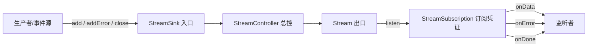
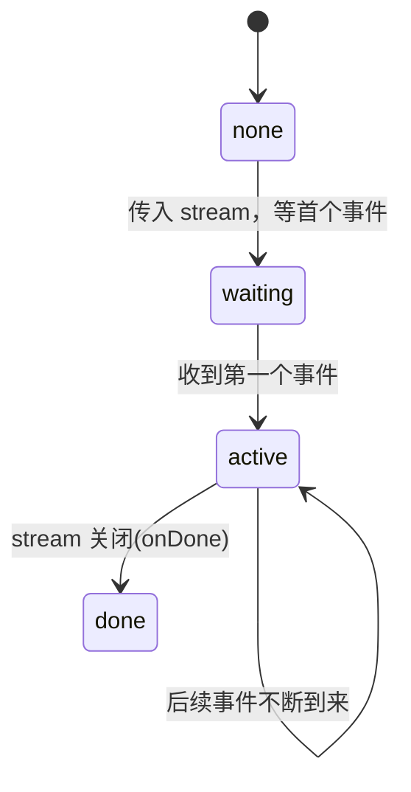

Flutter 里用得极多的 Stream 其实是 Dart 语言（`dart:async`）提供的核心能力。理解它最好的切入点是和 `Future` 对比：`Future` 代表**一个**将来才有的异步值（比如一次网络请求的结果），而 `Stream` 代表**一串**随时间陆续到达的异步事件序列（比如点击流、传感器数据、WebSocket 消息）。

| 维度 | `Future<T>` | `Stream<T>` |
|---|---|---|
| 产出数量 | 一个值（一次性） | 零到无限个值（持续） |
| 消费方式 | `await` / `.then()` | `await for` / `.listen()` |
| 结束标志 | 完成即结束 | 显式 `done` 事件收尾 |
| 生成语法 | `async` + `return` | `async*` + `yield` |
| 典型场景 | 单次请求、读文件 | 输入流、推送、定时刷新 |

## 事件时间线


_一个 Stream 就是一条随时间流动的事件时间线_

它会向监听者发出三种事件：**数据事件**（一个又一个的值）、**错误事件**（出问题时），最终以一个**完成事件**（done）收尾——之后不再有任何事件。这三种事件正好对应 `listen` 的三个回调（`onData` / `onError` / `onDone`）。

> 一个 Stream 的生命周期里，数据事件和错误事件可以交替出现任意多次，但 `done` 事件**最多只有一个**，且一旦发出，流即终结。
{: .prompt-tip }

## 核心角色

围绕 Stream 有几个配套对象，它们的关系可以用一张图串起来：



- `Stream` 本身是“出口”，你从它这端读事件。
- `StreamController` 是最常用的“总控”，同时持有一个可读的 `stream` 和一个可写的 `sink`，你往 sink 里 `add` 数据，监听者就能从 stream 收到。
- `StreamSink` 是“入口”，负责 `add(data)`、`addError(e)`、`close()`。
- `StreamSubscription` 是 `listen` 返回的“订阅凭证”，用来暂停（`pause`）、恢复（`resume`）、取消（`cancel`）订阅，也能事后替换 `onData`/`onError`/`onDone` 回调。

```dart
final controller = StreamController<int>();

// 订阅（拿到 subscription）
final sub = controller.stream.listen(
  (data) => print('收到: $data'),
  onError: (e) => print('出错: $e'),
  onDone: () => print('流结束'),
  cancelOnError: false, // 出错后是否自动取消，默认 false
);

// 从入口投递事件
controller.sink.add(1);
controller.sink.add(2);
controller.addError('something wrong');
controller.close(); // 触发 onDone；必须关闭，否则泄漏

// 用完取消订阅
await sub.cancel();
```

> `controller.add(...)` 是 `controller.sink.add(...)` 的快捷写法，两者等价。向**已经 `close` 的 controller** 再 `add`，会抛 `Bad state: Cannot add event after closing`。
{: .prompt-warning }

## 创建 Stream 的几种方式

### `async*` 生成器（最常用）

它让你像写同步代码一样“产出”事件，用 `yield` 发一个值、`yield*` 展开另一个 stream：

```dart
Stream<int> countStream(int max) async* {
  for (int i = 1; i <= max; i++) {
    await Future.delayed(const Duration(seconds: 1));
    yield i; // 每秒产出一个
  }
}

Stream<int> combined() async* {
  yield 0;
  yield* countStream(3); // 展开：把另一个 stream 的事件逐个转发
}
```

生成器是**惰性**的：函数体在有监听者时才开始执行；当订阅被 `cancel`，生成器会在下一个 `yield` 处停止，因此可以放心在里面写循环。

### `StreamController`：手动可控

需要把「基于回调的事件源」（定时器、原生监听、按钮点击）桥接成 Stream 时用它。关键是**尊重订阅状态**：在 `onListen` 里才启动事件源、在 `onCancel`/`onPause` 里停止，避免没人听时空转、甚至在没有监听者前就开始产出：

```dart
Stream<int> timedCounter(Duration interval, [int? maxCount]) {
  late StreamController<int> controller;
  Timer? timer;
  int counter = 0;

  void tick(_) {
    counter++;
    controller.add(counter);
    if (counter == maxCount) {
      timer?.cancel();
      controller.close(); // 通知监听者流结束
    }
  }

  controller = StreamController<int>(
    onListen: () => timer = Timer.periodic(interval, tick), // 有人订阅才启动
    onPause:  () => timer?.cancel(),                        // 暂停时停表
    onResume: () => timer = Timer.periodic(interval, tick), // 恢复时续表
    onCancel: () => timer?.cancel(),                        // 取消时释放
  );

  return controller.stream;
}
```

> `onListen` 在**第一个**监听者接入时触发，`onCancel` 在**最后一个**监听者离开时触发。这些回调会等当前正在派发的事件处理完再执行，保证时序。
{: .prompt-info }

### 工厂构造

- `Stream.fromIterable([1, 2, 3])`：把集合变成流。
- `Stream.periodic(duration, (i) => i)`：周期性发事件。
- `Stream.fromFuture(future)`：把单个 Future 变成只有一个事件的流。
- `Stream.value(x)` / `Stream.error(e)` / `Stream.empty()`：用于测试和边界情况。

## 消费 Stream：listen 与 await for

有两种消费方式。

`listen` 是**回调式**，不阻塞当前流程，适合 UI 事件、长期订阅；返回的 `StreamSubscription` 可随时暂停/取消。

`await for` 是**同步风格**，只能在 `async` 函数里用，会逐个等待事件，循环体执行完才处理下一个，直到流结束：

```dart
Future<int> sumStream(Stream<int> stream) async {
  var total = 0;
  await for (final value in stream) {
    total += value; // 一个一个来，流 done 后退出循环
  }
  return total;
}
```

`await for` 里 `break` / `return` 会**自动取消订阅**；遇到错误事件会抛异常，用 try/catch 包住，且「流关闭后要执行的代码」应放在循环之后：

```dart
try {
  await for (final line in lines) {
    print('收到 ${line.length} 个字符');
  }
  print('流已关闭'); // 正常结束后执行
} catch (e) {
  print('出错: $e');
}
```

一次性把流“收敛”成单个 `Future` 的便捷方法也很常用：`toList()`、`first`/`last`/`single`、`length`、`reduce`/`fold`、`forEach`、`any`/`every`/`contains`、`firstWhere`。

## 转换操作符

Stream 支持链式变换，每个操作返回**新的 Stream**，且惰性执行：

```dart
numbers
  .where((n) => n.isEven)         // 过滤
  .map((n) => n * 10)             // 映射（同步）
  .take(5)                        // 只取前 5 个
  .distinct()                     // 去重相邻重复
  .asyncMap((n) => fetch(n))      // 每个值做异步转换（串行，保序）
  .handleError((e) => log(e))     // 处理错误但不中断
  .listen(print);
```

| 操作符 | 作用 |
|---|---|
| `where` / `map` / `take` / `skip` | 过滤、映射、截取 |
| `expand` | 一对多展开（一个事件→多个事件） |
| `asyncMap` | 异步映射，**串行**且保持顺序 |
| `asyncExpand` | 异步展开，每个事件映射成一个子 Stream 再摊平（类似 flatMap） |
| `distinct` | 去掉相邻重复 |
| `handleError` | 拦截错误，可选 `test` 过滤 |
| `timeout` | 超时未来事件则触发 `onTimeout` |
| `transform` | 接入自定义 `StreamTransformer`（编解码常用） |

`transform` 常用于解码管道，例如按行读文件：

```dart
final lines = file.openRead()
    .transform(utf8.decoder)       // 字节 → 字符串
    .transform(const LineSplitter()); // 字符串 → 一行一个事件
```

> 需要更强的操作（`debounceTime`、`throttleTime`、`combineLatest`、`switchMap`、`merge` 等）时，社区常配合 [`rxdart`](https://pub.dev/packages/rxdart) 包使用。它还提供 `BehaviorSubject`（缓存最新值给新订阅者）、`PublishSubject`、`ReplaySubject` 等增强版 controller。
{: .prompt-tip }

## 单订阅流 vs 广播流

这是一个必须分清的区别。

- **单订阅（single-subscription）**：默认的 Stream，一生只能被 `listen` 一次，再次 listen 会抛异常。它会在被监听前（以及订阅暂停期间）**缓存事件**，监听后按序补发。适合一次性数据序列（文件读取、HTTP 响应体）。
- **广播流（broadcast）**：允许多个监听者同时订阅，适合事件总线式的场景。用 `StreamController.broadcast()` 创建，或对已有单订阅流调 `.asBroadcastStream()`。

关键差异：广播流**不为“未来的监听者”缓存**，监听者只能收到“订阅之后”发生的事件；如果当下没有监听者，`add` 的事件会被直接丢弃。

```dart
final ctrl = StreamController<String>.broadcast();
ctrl.stream.listen((e) => print('A: $e'));
ctrl.stream.listen((e) => print('B: $e')); // 两个监听者都能收到
ctrl.add('hello'); // A、B 都收到
```

| | 单订阅流 | 广播流 |
|---|---|---|
| 监听者数量 | 仅 1 个 | 多个 |
| 重复 `listen` | 抛异常 | 允许 |
| 事件缓存 | 监听前会缓存 | 不缓存，无人听即丢弃 |
| 创建 | `StreamController<T>()` | `StreamController<T>.broadcast()` |
| 场景 | HTTP 响应、文件流 | 事件总线、状态广播 |

判断状态可用 `isBroadcast`、`hasListener`、`isClosed`、`isPaused`。

## 在 Flutter UI 中：StreamBuilder

Flutter 把 Stream 和 UI 用 `StreamBuilder` 连起来，流每来一个事件就自动 rebuild：

```dart
StreamBuilder<int>(
  stream: _countStream,   // ⚠️ 存在 State 里，别在 build 里现建
  initialData: 0,
  builder: (context, snapshot) {
    if (snapshot.hasError) {
      return Text('错误: ${snapshot.error}');
    }
    switch (snapshot.connectionState) {
      case ConnectionState.waiting:
        return const CircularProgressIndicator();
      case ConnectionState.active:
      case ConnectionState.done:
        return Text('当前值: ${snapshot.data}');
      default:
        return const SizedBox();
    }
  },
)
```

`snapshot`（`AsyncSnapshot`）里带着最新数据（`data`/`hasData`）、错误（`error`/`hasError`）和连接状态（`connectionState`）。四种连接状态的流转：



> `StreamBuilder` 会在传入的 stream 变化时重新订阅。如果在 `build` 里直接 `create` 新 stream，父级每次 rebuild 都会新建并重订阅，导致状态丢失、重复请求。**务必把 stream 存在 `State` 字段或用状态管理持有**。
{: .prompt-warning }

与 `FutureBuilder` 相比：`FutureBuilder` 面向一次性结果，`StreamBuilder` 面向持续更新。更复杂的场景可用 `StreamProvider`（Provider）、`BlocBuilder`（BLoC）等封装。

## 背压与暂停

`StreamSubscription.pause()` / `resume()` 提供了简单的背压控制。暂停期间，单订阅流会**缓冲**新事件，恢复后补发；`async*` 生成器和实现良好的 `StreamController`（见前面的 `onPause`/`onResume`）会真正**停止产出**，避免缓冲无限增长。`pause()` 还能接收一个 `Future` 参数，在其完成前保持暂停。

## 内存管理与错误处理

Stream 最常见的坑是**忘记取消订阅导致内存泄漏**。凡是自己 `listen` 的订阅，都应该在 `dispose` 里 `cancel`；`StreamController` 用完要 `close`。

```dart
class _MyState extends State<MyWidget> {
  StreamSubscription<int>? _sub;

  @override
  void initState() {
    super.initState();
    _sub = someStream.listen(_onData);
  }

  @override
  void dispose() {
    _sub?.cancel(); // 关键：解除订阅
    super.dispose();
  }
}
```

错误处理上，`listen` 用 `onError` 捕获，`await for` 用 try/catch，链式转换中可用 `handleError`。默认单个错误**不会**终止流（`cancelOnError: false`），除非显式设为 `true`。

> 泄漏自查清单：① 每个 `listen` 是否都有对应的 `cancel`？② 每个自建 `StreamController` 是否都 `close`？③ `StreamBuilder` 的 stream 是否稳定持有、而非 build 里现建？
{: .prompt-danger }

## 与 Isolate、EventChannel 的关系

Stream 在 Flutter 里无处不在：`Isolate` 间通信的 `ReceivePort` 本身就是一个 Stream；Flutter 与原生通信的 `EventChannel.receiveBroadcastStream()` 返回的也是广播流（详见 [Flutter Channel 详解](/posts/Flutter-Channel-详解/)）。掌握 Stream 的订阅/取消/错误模型，这些能力就都能举一反三。

## 什么时候用 Stream

一次性的异步结果（单次请求、读一个文件）用 `Future` 就够了；需要“随时间持续变化”的数据才用 Stream——比如：

- 用户输入流、搜索框防抖
- 定时刷新、倒计时
- WebSocket / 服务端推送
- 原生侧的 `EventChannel`（传感器、定位、电量）
- 各种状态管理方案：**BLoC 就是围绕 Stream 构建的**，Riverpod / GetX 等也常暴露 Stream 接口

## 小结

- Stream 是 Dart 的**异步事件序列**，三种事件（data / error / done）对应 `listen` 的三个回调。
- 记牢四个角色：`Stream`(出口) / `StreamController`(总控) / `StreamSink`(入口) / `StreamSubscription`(订阅凭证)。
- 创建优先 `async*`，需要桥接回调源时用 `StreamController` 并**尊重订阅状态**。
- 分清**单订阅**（缓存、只能听一次）与**广播**（多听、不缓存）。
- UI 用 `StreamBuilder`，但 stream 要稳定持有。
- 最大的坑是泄漏：**该 `cancel` 的 `cancel`，该 `close` 的 `close`**。
