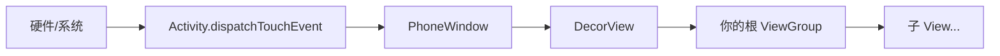
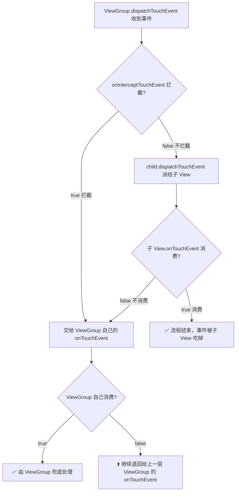
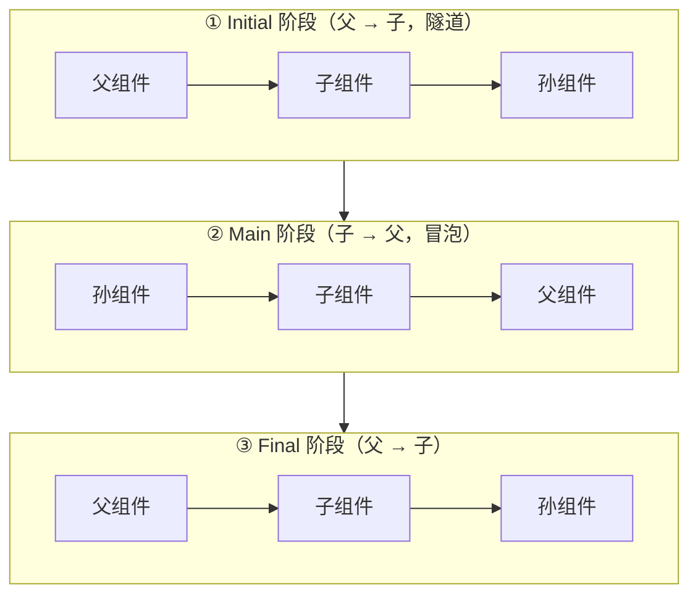

一句话概括：**Android 的触摸事件从上往下「派发」，每一层容器都可以选择「自己截胡」还是「继续往下发」，子控件处理不了还能「退回」给上层。** 这套机制就是事件分发与拦截。它是自定义 View、解决滑动冲突的地基，也是面试必考题。本文从一个比喻讲起，把三个核心方法、传递规则、源码脉络一次讲透，最后补上 Jetpack Compose 里对应的实现原理。

## 先用一个比喻建立直觉

把一次触摸想象成一份**待办文件**，在公司里自上而下传递：

- **Activity** 是总经理，文件最先到他手上。
- **ViewGroup**（如 `LinearLayout`、`RecyclerView`）是各级**部门主管**，手下带着若干下属。
- **View**（如 `Button`、`TextView`）是最基层的**员工**。

文件到了某位主管手里，他有三种态度：

1. **「这事我亲自处理」**——把文件截下来自己干，不再往下发。这就是**拦截（intercept）**。
2. **「派给下属去做」**——发给对应的员工。这就是**向下分发（dispatch）**。
3. 下属如果**搞不定**（不消费），文件会**逐级退回**，最终由上层主管兜底处理。

整个过程像一个「U 型」路线：**从上往下派发，从下往上回收**。理解了这个比喻，后面所有规则都是它的细化。

## 三个核心方法：谁负责什么

事件机制只围绕三个方法，记住它们各自的归属和职责，就掌握了一半：

| 方法 | 谁拥有它 | 职责 | 返回值含义 |
|---|---|---|---|
| `dispatchTouchEvent()` | Activity / ViewGroup / View 都有 | **分发的总入口**，决定事件往哪走 | `true` = 事件已被本链条消费，流程结束 |
| `onInterceptTouchEvent()` | **只有 ViewGroup 有** | 决定「要不要把事件截下来自己处理」 | `true` = 拦截，交给自己的 `onTouchEvent`；默认 `false` |
| `onTouchEvent()` | ViewGroup / View 都有 | **真正处理事件**的地方（点击、滑动等） | `true` = 消费掉；`false` = 我处理不了，退回上层 |

> `View` 没有 `onInterceptTouchEvent`——因为员工没有下属，谈不上「拦截派给谁」。它只需要决定「这活我干不干」（`onTouchEvent`）。而 `ViewGroup` 既是主管又可能亲自干活，所以三个方法都有。
{: .prompt-tip }

三者的调用关系可以浓缩成一段伪代码，这是整个机制的骨架：

```java
// ViewGroup.dispatchTouchEvent 的核心逻辑（高度简化）
public boolean dispatchTouchEvent(MotionEvent ev) {
    boolean consumed = false;
    if (onInterceptTouchEvent(ev)) {
        // 主管决定自己处理 → 走自己的 onTouchEvent
        consumed = super.dispatchTouchEvent(ev); // View 的实现里会调 onTouchEvent
    } else {
        // 不拦截 → 派给落在触摸点里的子 View
        consumed = child.dispatchTouchEvent(ev);
    }
    return consumed;
}
```
{: file="骨架伪代码" .nolineno }

## 事件从哪里来：传递的起点

用户手指按下屏幕后，事件并不是凭空出现在你的 View 上的，它有一条固定的入口链路：



- `Activity.dispatchTouchEvent` 是应用层的第一站。它内部把事件交给 `Window`，最终到达根布局 `DecorView`（它本质也是个 `ViewGroup`）。
- 从 `DecorView` 开始，就进入了 `ViewGroup → View` 的标准分发流程。

所以我们真正要研究的核心，是 **`ViewGroup` 拿到事件后的这套分发 + 拦截逻辑**。

## 分发主线：一次完整的 U 型旅程

下面是最重要的一张图，请对照着理解——它描述了一个事件（以 `ACTION_DOWN` 为例）在一层 ViewGroup + 一个子 View 之间的完整流转：



把这张图翻译成大白话：

1. **向下**：事件到达 ViewGroup，先问「要拦截吗？」。不拦截就往下发给子 View。
2. **到底**：子 View 用 `onTouchEvent` 决定吃不吃。吃了（`true`），旅程结束。
3. **向上（回收）**：子 View 不吃（`false`），事件退回给父 ViewGroup 的 `onTouchEvent` 处理；父的也不处理，再往上退……一直退到 Activity。

这就是「从上往下派发、从下往上回收」的完整 U 型。

### 「子 View 不处理就回退到上层」到底怎么理解

这句话初学者最容易误会，以为是事件像皮球一样被「物理弹回」父容器。其实不是。**回退退的不是事件本身，而是一个「没人要」的信号——靠 `dispatchTouchEvent` 的返回值一层层往上传。**

回看那段骨架伪代码里的这一行：

```java
consumed = child.dispatchTouchEvent(ev); // 派给子 View，并盯着它的返回值
```

父容器把事件派给子 View 后，**并不是撒手不管**，它死死盯着这次调用的返回值：

- 子 View 的 `onTouchEvent` 返回 `true`（我吃了）→ `child.dispatchTouchEvent` 返回 `true` → 父这里 `consumed = true`，直接把「搞定了」往上报，结束。
- 子 View 的 `onTouchEvent` 返回 `false`（我不要）→ 这次调用返回 `false` → 父容器发现「派下去没人接」，于是**改为自己下场**，把自己当成一个普通 View 去跑一遍自己的 `onTouchEvent` 试试。

所以「回退到上层」的准确含义是：**子 View 说不要，父容器就不再往下发，而是自己接手处理；父容器要是也不要（`onTouchEvent` 也返回 `false`），它的 `dispatchTouchEvent` 就跟着返回 `false`，于是「爷爷」容器又收到「没人要」的信号，重复同样的动作……一路向上，直到 Activity 兜底。**

用文件比喻就是：主管把文件派给下属，下属退回来说「这活我干不了」，主管不会硬塞回去，而是**自己动手试试**；自己也搞不定，就把文件退回给更上一级的主管——每一级都有一次「亲自处理」的机会。

举个能立刻上手验证的例子，层级 `Activity → LinearLayout → TextView`，手指按在 TextView 上：

1. 事件发到 `TextView`，它默认不可点击，`onTouchEvent` 返回 `false`——不消费。
2. `LinearLayout` 发现子 View 没接住，改调**自己的** `onTouchEvent`，默认也返回 `false`。
3. 于是 `LinearLayout.dispatchTouchEvent` 返回 `false`，最终由 `Activity.onTouchEvent` 兜底（通常什么也不做）。

把 `TextView` 换成 `Button`（默认 `clickable`），第 1 步 `Button.onTouchEvent` 对 DOWN 就返回 `true` 消费掉了，**整个回退过程根本不会发生**——这也正是下文「点击事件与 onTouchEvent 的关系」里说的：只要 View 是可点击的，它的 `onTouchEvent` 就会返回 `true`，把事件序列吃下。

> **回退其实只在 `ACTION_DOWN` 那一下认真做一次。** 如果 DOWN 一路退到顶都没人消费，系统就认定「这串手势没人认领」，后续的 MOVE、UP 不会再费劲往下派发，父容器直接自己处理。所以「回退」本质是 DOWN 阶段的一次**由内向外的冒泡认领**：从最里层 View 开始逐层问「你要吗」，谁第一个返回 `true` 谁就拿下整个手势；一个都没有，就归最外层兜底。这也是后面「DOWN 是站队时刻」那条铁律的由来。
{: .prompt-tip }

## 拦截的关键：onInterceptTouchEvent

`onInterceptTouchEvent` 是「拦截机制」这四个字的主角。有三个关键点必须搞清楚：

### 1. 它不是每个事件都会被问

在 `ViewGroup.dispatchTouchEvent` 里，只有满足以下条件才会去调用 `onInterceptTouchEvent`：

```java
final boolean intercepted;
if (actionMasked == MotionEvent.ACTION_DOWN
        || mFirstTouchTarget != null) {
    // mFirstTouchTarget != null 意味着：之前有子 View 消费了 DOWN
    final boolean disallowIntercept =
            (mGroupFlags & FLAG_DISALLOW_INTERCEPT) != 0;
    if (!disallowIntercept) {
        intercepted = onInterceptTouchEvent(ev);
    } else {
        intercepted = false; // 子 View 要求禁止拦截
    }
} else {
    // 没有子 View 消费过，且不是 DOWN → 直接自己处理，不再问
    intercepted = true;
}
```
{: file="ViewGroup.dispatchTouchEvent 片段（简化）" .nolineno }

翻译一下：
- `ACTION_DOWN` 时**一定会问**（一个手势的开始）。
- 如果 DOWN 已经被某个子 View 消费（`mFirstTouchTarget != null`），后续的 `MOVE`/`UP` 才会**继续问**是否拦截——这给了父容器「中途截胡」的机会（滑动冲突就靠它）。
- 如果 DOWN 没有任何子 View 消费，后续事件父容器直接自己扛，不再询问。

### 2. 一旦拦截，子 View 会收到 ACTION_CANCEL

假设子 View 已经消费了 `DOWN`，正处理到一半，父容器突然在某个 `MOVE` 上返回 `true` 拦截了。此时系统会给**子 View 补发一个 `ACTION_CANCEL`**，告诉它：「你别管了，这事被上面收走了」。子 View 应在收到 CANCEL 时复位自己的状态（比如取消按下高亮）。之后的事件全部交给父容器，且**不会再询问 `onInterceptTouchEvent`**。

> **拦截是「一锤子买卖」**：对同一个手势序列（从 DOWN 到 UP），一旦父容器拦截成功，剩余事件就都归它了，中途不会再放手还给子 View。
{: .prompt-warning }

### 3. 默认不拦截

`ViewGroup.onInterceptTouchEvent` 默认返回 `false`——普通容器不会挡你的事件，这也是为什么 `Button` 放在 `LinearLayout` 里能正常点击。只有像 `ScrollView`、`RecyclerView`、`ViewPager` 这类需要「抢滑动」的容器，才重写了它，在判断出用户是在滑动时返回 `true`。

## 处理终点：onTouchEvent 与点击事件的关系

`onTouchEvent` 是事件的最终归宿。这里有个常被忽视的细节——**点击事件（`onClick`）其实是在 `onTouchEvent` 里被识别的**。

`View.dispatchTouchEvent` 的处理顺序是：

```java
public boolean dispatchTouchEvent(MotionEvent event) {
    boolean result = false;
    ListenerInfo li = mListenerInfo;
    // ① 优先级最高：OnTouchListener
    if (li != null && li.mOnTouchListener != null
            && (mViewFlags & ENABLED_MASK) == ENABLED
            && li.mOnTouchListener.onTouch(this, event)) {
        result = true;
    }
    // ② OnTouchListener 没消费，才轮到 onTouchEvent
    if (!result && onTouchEvent(event)) {
        result = true;
    }
    return result;
}
```
{: file="View.dispatchTouchEvent 片段（简化）" .nolineno }

由此得出优先级：**`OnTouchListener.onTouch` > `onTouchEvent` > `OnClickListener.onClick`**。

- 如果你给 View 设了 `setOnTouchListener` 且 `onTouch` 返回 `true`，`onTouchEvent` **根本不会被调用**，`onClick` 自然也不会触发。
- `onClick` 是 `onTouchEvent` 在收到 `ACTION_UP` 且判定为一次有效点击时，内部调用 `performClick()` 触发的。所以只要一个 View 是 `clickable` 的（比如 `Button` 默认可点击，或设了 `OnClickListener`），它的 `onTouchEvent` 就会返回 `true`，从而消费整个事件序列。

## 必须刻进脑子里的五条铁律

> **① DOWN 是「站队」时刻。** 谁在 `ACTION_DOWN` 时消费了事件（`onTouchEvent` 返回 `true`），后续的 `MOVE`/`UP` 才会继续发给谁。DOWN 没接住，后面的都跟你无关。
{: .prompt-info }

> **② 不消费 DOWN，就收不到后续事件。** 一个 View 的 `onTouchEvent` 对 `DOWN` 返回 `false`，那么这一整个手势序列后面的 MOVE、UP 都不会再给它，直接由父容器处理。
{: .prompt-info }

> **③ 拦截只需成功一次。** 父容器一旦拦截，子 View 收到 CANCEL，剩余事件全归父容器，且不再询问拦截。
{: .prompt-info }

> **④ `dispatchTouchEvent` 返回 `true` = 事件已被消费，向上层报告「搞定了」；返回 `false` = 「没人要」，退回上层兜底。**
{: .prompt-info }

> **⑤ 拦截是父容器的权力，但子 View 有「否决权」**——`requestDisallowInterceptTouchEvent`（见下节）。
{: .prompt-info }

## 子 View 的反向控制：requestDisallowInterceptTouchEvent

前面都是父容器「自上而下」地决定拦不拦。但有时子 View 需要主动喊话：「爸，这个手势我要，你别拦我！」——这就是 `requestDisallowInterceptTouchEvent(true)`。

它的原理就是设置父容器的 `FLAG_DISALLOW_INTERCEPT` 标志位。回看前面 `dispatchTouchEvent` 的源码：一旦这个标志为 `true`，`onInterceptTouchEvent` **直接被跳过**，父容器丧失拦截能力。典型场景：`ViewPager` 里嵌了一个横向滑动的子控件，子控件在按下时调用它，避免被 ViewPager 抢走横滑手势。

```kotlin
// 子 View 在 DOWN 时告诉父容器：这次手势别拦我
override fun onTouchEvent(event: MotionEvent): Boolean {
    when (event.action) {
        MotionEvent.ACTION_DOWN ->
            parent.requestDisallowInterceptTouchEvent(true)
        MotionEvent.ACTION_MOVE -> {
            // 根据自己的需要，判断是否要交还控制权
            if (needParentScroll) {
                parent.requestDisallowInterceptTouchEvent(false)
            }
        }
    }
    return super.onTouchEvent(event)
}
```
{: file="内部拦截法的核心" }

> **一个大坑：它对 `ACTION_DOWN` 无效。** 因为 `ViewGroup` 每次收到 `DOWN` 时都会先调用 `resetTouchState()` 把 `FLAG_DISALLOW_INTERCEPT` 清掉——一个新手势开始，标志位归零。所以父容器对 DOWN 的 `onInterceptTouchEvent` 一定会被调用，你想禁止拦截 DOWN 是做不到的。这也决定了「内部拦截法」的父容器必须写成「DOWN 不拦截，其余交给子 View 用标志位控制」。
{: .prompt-danger }

## 实战：滑动冲突的两种经典解法

事件分发学完，最直接的用途就是解决**滑动冲突**——比如横向 `ViewPager` 里套竖向 `RecyclerView`，或者一个可上下拖动的面板里套列表。核心思路只有一句：**根据手指的滑动方向（dx、dy 的大小），决定这个手势归谁。** 落地有两种写法。

### 方案一：外部拦截法（推荐，逻辑集中在父容器）

**思路**：一切拦截判断放在父容器的 `onInterceptTouchEvent`。父容器根据自己的需要决定「这个 MOVE 我要不要抢」。

```kotlin
class OuterInterceptLayout(context: Context) : FrameLayout(context) {
    private var lastX = 0f
    private var lastY = 0f

    override fun onInterceptTouchEvent(ev: MotionEvent): Boolean {
        var intercepted = false
        val x = ev.x
        val y = ev.y
        when (ev.action) {
            // ① DOWN 绝不拦截，否则子 View 一个事件都收不到
            MotionEvent.ACTION_DOWN -> {
                intercepted = false
                lastX = x
                lastY = y
            }
            // ② MOVE 时才判断方向：横向滑动是我（父）想要的，就拦
            MotionEvent.ACTION_MOVE -> {
                val dx = x - lastX
                val dy = y - lastY
                intercepted = kotlin.math.abs(dx) > kotlin.math.abs(dy)
            }
            // ③ UP 不拦截，否则子 View 收不到 UP，onClick 会失效
            MotionEvent.ACTION_UP -> intercepted = false
        }
        lastX = x
        lastY = y
        return intercepted
    }
}
```
{: file="外部拦截法" }

**三条纪律**：`DOWN` 不拦（否则子 View 全盘接收不到）、`UP` 不拦（否则子 View 的点击/收尾失效）、只在 `MOVE` 按方向判断。逻辑集中、易维护，**首选这个**。

### 方案二：内部拦截法（配合 requestDisallowInterceptTouchEvent）

**思路**：父容器默认拦截除 DOWN 外的所有事件，把「到底给不给我」的决定权交到**子 View** 手里，由子 View 通过 `requestDisallowInterceptTouchEvent` 动态开关。

```kotlin
// 父容器：DOWN 放行，其余一律拦截，具体由子 View 用标志位控制
class InnerParentLayout(context: Context) : FrameLayout(context) {
    override fun onInterceptTouchEvent(ev: MotionEvent): Boolean {
        // DOWN 必须返回 false（否则子 View 收不到 DOWN，无法调 requestDisallow…）
        return ev.action != MotionEvent.ACTION_DOWN
    }
}

// 子 View：在 DOWN 时禁止拦截，MOVE 时按方向决定是否交还
class InnerChildView(context: Context) : View(context) {
    private var lastX = 0f
    private var lastY = 0f

    override fun onTouchEvent(event: MotionEvent): Boolean {
        val x = event.x
        val y = event.y
        when (event.action) {
            MotionEvent.ACTION_DOWN ->
                parent.requestDisallowInterceptTouchEvent(true)
            MotionEvent.ACTION_MOVE -> {
                val dx = x - lastX
                val dy = y - lastY
                // 需要父容器处理横向滑动时，主动交还控制权
                if (kotlin.math.abs(dx) > kotlin.math.abs(dy)) {
                    parent.requestDisallowInterceptTouchEvent(false)
                }
            }
        }
        lastX = x
        lastY = y
        // 关键：必须消费 DOWN（返回 true），否则收不到后续 MOVE，标志位控制无从谈起
        return true
    }
}
```
{: file="内部拦截法" }

> **内部拦截法有个容易踩空的隐含前提：子 View 必须消费掉 `DOWN`。** 如果这里直接 `return super.onTouchEvent(event)`，而子 View 又是个默认不可点击的裸 `View`——`View.onTouchEvent` 对不可点击的 View 会返回 `false`——那么子 View 根本没消费 DOWN，按「站队」铁律它收不到后续 MOVE，那句 `requestDisallowInterceptTouchEvent` 压根没机会执行，整个方案失效。子 View 消费 DOWN 还有第二重意义：让父容器的 `mFirstTouchTarget != null`，这样父容器后续每个 MOVE 才会继续调用 `onInterceptTouchEvent`，「交还控制权」才有生效的舞台。所以要么像上面显式 `return true`，要么保证子 View 本身就是消费事件的可交互控件（如可滚动列表）。而真正的「交还」是靠 `requestDisallowInterceptTouchEvent(false)` 清掉标志位后、父容器在下一个 MOVE 拦截并给子 View 补发 `ACTION_CANCEL` 完成的，**不是**靠子 View 返回 `false` 把事件丢回父容器。
{: .prompt-danger }

两种方案效果一致，**外部拦截法更直观常用**；内部拦截法在「子 View 更清楚自己什么时候需要手势」的场景下更灵活，但需要父子配合、心智负担更高。

## Jetpack Compose 的事件拦截原理

到了 Compose，UI 是可组合函数、没有了 `View` / `ViewGroup` 的对象层级，自然也就**没有 `onInterceptTouchEvent` 这个方法**了。但「父组件抢先于子组件处理事件」的需求依然存在，Compose 用一套**指针输入（Pointer Input）+ 三阶段分发**的机制来实现同样的能力。

### 底层入口：Modifier.pointerInput

所有手势的底层都是 `Modifier.pointerInput`，它提供一个协程作用域，让你用挂起函数「等待」指针事件：

```kotlin
Modifier.pointerInput(Unit) {
    awaitPointerEventScope {
        while (true) {
            val event: PointerEvent = awaitPointerEvent() // 挂起等待下一个指针事件
            val change = event.changes.first()
            // change.position 当前位置、change.pressed 是否按下、change.isConsumed 是否已被消费
        }
    }
}
```
{: file="pointerInput 基本用法" }

Compose 的手势最终都会汇聚成一个个 `PointerInputChange`，它带着位置、按压状态、是否被消费等信息，在**组件树上传播**。

### 关键：PointerEventPass 三个阶段

这是 Compose 事件拦截的**核心**。同一个指针事件，会在组件树上按**三个阶段（Pass）**分别传播一遍，方向不同：

| 阶段 | 传播方向 | 类比传统 View | 用途 |
|---|---|---|---|
| `Initial` | **父 → 子**（自上而下，隧道 tunneling） | ≈ `onInterceptTouchEvent` | 父组件**抢先**处理/拦截 |
| `Main` | **子 → 父**（自下而上，冒泡 bubbling） | ≈ 正常 `onTouchEvent` 顺序 | 默认阶段，最内层子组件优先 |
| `Final` | **父 → 子**（自上而下） | ≈ `ACTION_CANCEL` 通知 | 收尾：让子组件得知祖先「消费了什么」 |



**「拦截」在 Compose 里的实现方式**：父组件在 `Initial` 阶段就把事件**消费掉（consume）**，那么子组件在随后的 `Main` 阶段拿到的事件已经是「被消费过」的（`change.isConsumed == true`），子组件据此选择放弃处理——效果上等价于「被父容器拦截了」。

### consume：消费即拦截

```kotlin
// 父组件：在 Initial 阶段抢先消费，达到「拦截」子组件的效果
Modifier.pointerInput(Unit) {
    awaitPointerEventScope {
        while (true) {
            // 关键：指定 PointerEventPass.Initial，父组件先于子组件拿到事件
            val event = awaitPointerEvent(PointerEventPass.Initial)
            val change = event.changes.first()

            // 满足我的拦截条件（比如已判定为横向滑动）就消费掉
            if (shouldIntercept(change)) {
                change.consume() // 消费后，子组件在 Main 阶段会看到 isConsumed = true
            }
        }
    }
}
```
{: file="Compose 中「父拦截子」" }

对照子组件的处理：它默认在 `Main` 阶段等事件，一旦发现已被消费，就不再响应：

```kotlin
// 子组件：Main 阶段（默认）里，先看事件是否已被上层消费
Modifier.pointerInput(Unit) {
    awaitPointerEventScope {
        while (true) {
            val event = awaitPointerEvent() // 默认就是 PointerEventPass.Main
            val change = event.changes.first()
            if (change.isConsumed) continue // 已被父组件「拦截」，放弃
            // 否则正常处理自己的手势
        }
    }
}
```
{: file="子组件让出被消费的事件" }

> 传统 View 里，拦截是**父容器单方面**用 `onInterceptTouchEvent` 返回 `true` 强制截胡；Compose 里没有强制截胡，而是**通过「消费」这个协作信号**：谁先消费，其他人就自觉让出。`Initial` 阶段给了父组件「先手消费」的机会，这正是拦截的本质。
{: .prompt-tip }

### 更常用的高层手势 API

实际开发极少直接写 `awaitPointerEvent`，而是用封装好的高层 API，它们内部都基于上面的机制：

```kotlin
// 点击 / 长按 / 双击
Modifier.pointerInput(Unit) {
    detectTapGestures(
        onTap = { /* 点击 */ },
        onLongPress = { /* 长按 */ },
        onDoubleTap = { /* 双击 */ }
    )
}

// 拖动
Modifier.pointerInput(Unit) {
    detectDragGestures { change, dragAmount ->
        change.consume()
        // dragAmount.x / dragAmount.y 是本次位移
    }
}

// 更高层：可拖动 / 可滚动
Modifier.draggable(state, orientation = Orientation.Horizontal) { delta -> }
Modifier.scrollable(state, orientation = Orientation.Vertical)
```
{: file="常用手势 Modifier" }

### 嵌套滚动：nestedScroll ≈ 滑动冲突的解法

Compose 里嵌套滚动冲突（如可折叠标题栏 + 内部列表）用 `Modifier.nestedScroll` 解决。`NestedScrollConnection` 的 `onPreScroll` 就相当于「父容器的拦截时机」——父组件**在子组件滚动之前**先拿到滚动量，决定自己消费多少、剩多少给子组件：

```kotlin
val connection = remember {
    object : NestedScrollConnection {
        // 滚动分发给子组件「之前」，父组件先消费 —— 相当于 onInterceptTouchEvent 的时机
        override fun onPreScroll(available: Offset, source: NestedScrollSource): Offset {
            val consumed = /* 父组件想吃掉的量，比如先收起标题栏 */ 0f
            return Offset(0f, consumed)
        }
        // 子组件滚完后，把剩余的量交还父组件
        override fun onPostScroll(
            consumed: Offset, available: Offset, source: NestedScrollSource
        ): Offset = Offset.Zero
    }
}
Box(Modifier.nestedScroll(connection)) { /* 内部可滚动内容 */ }
```
{: file="nestedScroll 拦截滚动量" }

### 传统 View 与 Compose 对照速查

| 能力 | 传统 View | Jetpack Compose |
|---|---|---|
| 分发入口 | `dispatchTouchEvent` | `Modifier.pointerInput` |
| 父组件拦截 | `onInterceptTouchEvent` 返回 `true` | 在 `PointerEventPass.Initial` 阶段 `change.consume()` |
| 处理事件 | `onTouchEvent` | `PointerEventPass.Main` 中处理，或高层手势 API |
| 消费标志 | `dispatchTouchEvent` 返回 `true` | `change.consume()` / `change.isConsumed` |
| 子 View 阻止父拦截 | `requestDisallowInterceptTouchEvent(true)` | 子组件在 `Initial` 阶段抢先 `consume()` |
| 嵌套滚动冲突 | 外部/内部拦截法 | `Modifier.nestedScroll` |

可以看到，Compose 只是换了一套 API 和「协作式消费」的哲学，**背后「父组件有机会先手、事件靠消费来定归属」的思想和传统 View 一脉相承**。

## 面试话术

> **面试官问：讲一下 Android 的事件分发机制。**
>
> Android 的触摸事件遵循「**从上往下分发、从下往上回收**」的 U 型流程，核心是三个方法：`dispatchTouchEvent` 负责分发，是每一层的总入口；`onInterceptTouchEvent` 只有 ViewGroup 有，负责决定要不要拦截；`onTouchEvent` 负责真正处理事件。
>
> 事件从 Activity 出发，经 Window、DecorView 传到根 ViewGroup。每层 ViewGroup 拿到事件后，先在 `dispatchTouchEvent` 里调用 `onInterceptTouchEvent`：**不拦截就往下发给子 View，拦截就交给自己的 `onTouchEvent`**。事件传到最内层 View 后，如果它的 `onTouchEvent` 返回 `true` 就消费掉、流程结束；返回 `false` 就逐级退回，由上层 `onTouchEvent` 兜底。
>
> 几个关键点我特别注意：第一，**`ACTION_DOWN` 是站队时刻**，谁消费了 DOWN，后续的 MOVE、UP 才会继续发给谁，不消费 DOWN 就收不到后续事件；第二，**拦截是一锤子买卖**，父容器一旦在某个 MOVE 上拦截成功，会给子 View 补发一个 `ACTION_CANCEL`，之后事件全归父容器且不再询问拦截；第三，子 View 可以用 `requestDisallowInterceptTouchEvent(true)` 反向要求父容器别拦，但**它对 DOWN 无效**，因为 ViewGroup 每次收到 DOWN 都会重置这个标志位。
>
> 实际应用上，这套机制最常用来**解决滑动冲突**，比如横向 ViewPager 套竖向 RecyclerView。解法有两种：**外部拦截法**是在父容器的 `onInterceptTouchEvent` 里按滑动方向（比较 dx、dy）判断要不要拦，逻辑集中、我更常用；**内部拦截法**是父容器默认拦截除 DOWN 外的一切，再由子 View 用 `requestDisallowInterceptTouchEvent` 动态控制。写外部拦截法要守住三条纪律：DOWN 不拦、UP 不拦、只在 MOVE 按方向判断。
>
> 如果面试官追问 **Compose**：Compose 没有 ViewGroup 层级，所以没有 `onInterceptTouchEvent`，它用 `Modifier.pointerInput` 加 **`PointerEventPass` 三阶段分发**——`Initial` 阶段父组件先拿到事件（相当于拦截时机）、`Main` 阶段冒泡到父组件、`Final` 阶段做收尾。「拦截」的本质是**父组件在 `Initial` 阶段抢先 `consume()` 掉事件**，子组件在 `Main` 阶段发现 `isConsumed` 为 `true` 就主动让出。嵌套滚动冲突则用 `Modifier.nestedScroll`，它的 `onPreScroll` 就相当于父容器的拦截时机。所以两套体系「父组件有先手、靠消费定归属」的思想是一致的。

---

**一句话记忆法**：`dispatch` 管派发、`intercept` 管截胡、`onTouchEvent` 管干活；DOWN 决定站队、拦截补发 CANCEL、Compose 用 Initial 阶段的 consume 当拦截。理解到这，事件分发就再不是玄学了。
