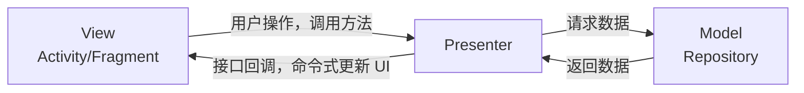
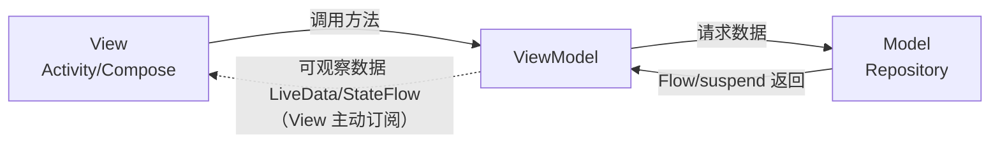
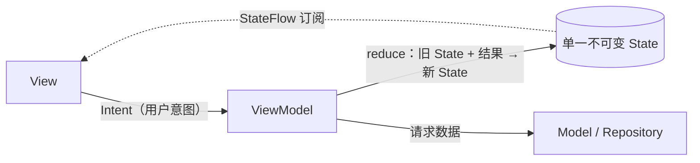

MVP、MVVM、MVI 不是三个互相孤立的发明，而是同一条演进链上的三代方案：每一代都在解决上一代暴露出的具体痛点。所以理解它们区别的最好方式，不是背对比表，而是搞清楚**每一次演进到底解决了什么问题**。本文用同一个页面需求把三种架构各实现一遍，再从五个维度做深度对比。

## 一、为什么会有这条演进链：从 MVC 说起

Android 原生的开发方式常被称作 MVC：布局 XML 勉强算 View，数据层算 Model，而 Activity/Fragment 名义上是 Controller。问题在于 Activity 实际上**既是 Controller 又是 View**——它持有控件、处理点击、发起请求、更新界面，所有职责搅在一起，随着业务膨胀变成动辄几千行的"上帝类"：

- 业务逻辑和 UI 操作耦合，**没法单元测试**（逻辑全依赖 Android 框架类）；
- 任何需求变动都要改同一个类，**牵一发动全身**。

后面三代架构的共同目标只有一个：**把"业务逻辑"从 Activity 里拆出去**。区别只在于拆出去之后，**双方怎么通信**。

## 二、MVP：用接口把 View 和逻辑隔开

### 2.1 结构



- **Model**：数据层（网络、数据库），与后两种架构中的含义相同；
- **View**：Activity/Fragment，实现 `IView` 接口，只做两件事——把用户操作转发给 Presenter、执行 Presenter 下发的 UI 命令；
- **Presenter**：业务逻辑中枢，持有 `IView` 接口引用（而非 Activity 本体），处理完逻辑后**命令式地**回调 View 的方法。

### 2.2 代码示例：加载用户资料页

```kotlin
// 契约接口：View 和 Presenter 的能力清单
interface UserContract {
    interface IView {
        fun showLoading()
        fun hideLoading()
        fun showUser(user: User)
        fun showError(message: String)
    }
    interface IPresenter {
        fun loadUser(userId: String)
        fun onDestroy()
    }
}

class UserPresenter(
    private var view: UserContract.IView?,   // 只依赖接口，不依赖 Activity
    private val repository: UserRepository
) : UserContract.IPresenter {

    override fun loadUser(userId: String) {
        view?.showLoading()
        repository.getUser(userId, object : Callback<User> {
            override fun onSuccess(user: User) {
                view?.hideLoading()
                view?.showUser(user)          // 命令式：一条条指挥 View 干活
            }
            override fun onError(e: Throwable) {
                view?.hideLoading()
                view?.showError(e.message ?: "加载失败")
            }
        })
    }

    override fun onDestroy() {
        view = null                           // 必须手动断开，否则泄漏 Activity
    }
}

class UserActivity : AppCompatActivity(), UserContract.IView {
    private lateinit var presenter: UserContract.IPresenter

    override fun onCreate(savedInstanceState: Bundle?) {
        super.onCreate(savedInstanceState)
        presenter = UserPresenter(this, UserRepository())
        binding.btnRefresh.setOnClickListener { presenter.loadUser("42") }
    }

    override fun showUser(user: User) { binding.tvName.text = user.name }
    override fun showLoading() { binding.progress.isVisible = true }
    override fun hideLoading() { binding.progress.isVisible = false }
    override fun showError(message: String) { toast(message) }

    override fun onDestroy() {
        presenter.onDestroy()                 // 手动管理生命周期
        super.onDestroy()
    }
}
```

### 2.3 MVP 解决了什么、又带来了什么

**解决了**：业务逻辑进了 Presenter，只依赖 `IView` 接口——测试时 mock 一个接口就能验证全部逻辑，Activity 瘦身成"纯执行者"。

**带来的痛点**（正是 MVVM 要解决的）：

1. **接口爆炸**：每个页面一套 Contract，View 的每种 UI 变化都要定义一个方法，`showXxx`/`hideXxx` 写到手软；
2. **生命周期与内存泄漏**：Presenter 持有 View 引用，Activity 销毁时必须手动置空；异步回调回来时 View 可能已经死了，到处都是 `view?.` 判空；
3. **配置更改数据丢失**：屏幕一旋转 Activity 重建，Presenter 里的数据默认跟着没了，要自己做保存恢复；
4. **双向强耦合**：View 和 Presenter 一对一互相持有，Presenter 几乎无法复用。

## 三、MVVM：把"命令 View"变成"View 观察数据"

### 3.1 结构



关键转变：Presenter **持有 View 并命令它**，而 ViewModel **完全不认识 View**——它只把数据暴露成可观察对象（`LiveData`/`StateFlow`），View 自己来订阅。依赖方向从"双向互持"变成了"单向依赖"（View → ViewModel）。

- **Model**：数据层，同上；
- **ViewModel**：持有并加工 UI 数据，暴露可观察字段；配合 Jetpack `ViewModel` 天然跨越配置更改存活；
- **View**：订阅 ViewModel 的数据，数据变了 UI 跟着变；用户操作时调用 ViewModel 的方法。

### 3.2 代码示例：同一个页面的 MVVM 写法

```kotlin
class UserViewModel(private val repository: UserRepository) : ViewModel() {

    // 典型 MVVM：多个独立的可观察字段
    private val _isLoading = MutableStateFlow(false)
    val isLoading: StateFlow<Boolean> = _isLoading.asStateFlow()

    private val _user = MutableStateFlow<User?>(null)
    val user: StateFlow<User?> = _user.asStateFlow()

    private val _error = MutableStateFlow<String?>(null)
    val error: StateFlow<String?> = _error.asStateFlow()

    fun loadUser(userId: String) {
        viewModelScope.launch {
            _isLoading.value = true
            _error.value = null
            runCatching { repository.getUser(userId) }
                .onSuccess { _user.value = it }
                .onFailure { _error.value = it.message }
            _isLoading.value = false
        }
    }
}

class UserActivity : AppCompatActivity() {
    private val viewModel: UserViewModel by viewModels()

    override fun onCreate(savedInstanceState: Bundle?) {
        super.onCreate(savedInstanceState)
        binding.btnRefresh.setOnClickListener { viewModel.loadUser("42") }

        // View 主动订阅，声明式地把数据映射到 UI
        lifecycleScope.launch {
            repeatOnLifecycle(Lifecycle.State.STARTED) {
                launch { viewModel.isLoading.collect { binding.progress.isVisible = it } }
                launch { viewModel.user.collect { it?.let { u -> binding.tvName.text = u.name } } }
                launch { viewModel.error.collect { it?.let { msg -> toast(msg) } } }
            }
        }
    }
    // 不需要 onDestroy 置空——ViewModel 根本不认识这个 Activity
}
```

### 3.3 MVVM 解决了什么、又带来了什么

**解决了 MVP 的全部四个痛点**：

- ViewModel 不持有 View → 无泄漏风险、无判空、无手动解绑；
- Jetpack ViewModel 跨配置更改存活 → 旋转屏幕数据还在；
- 不需要 Contract 接口 → 模板代码大减；
- 观察者模式 + 生命周期感知（LiveData / repeatOnLifecycle）→ 后台自动停止更新。

**带来的新痛点**（正是 MVI 要解决的）：

1. **状态分散**：一个页面的状态散落在 N 个可观察字段里（上例就有 3 个）。它们各自独立变化，**组合起来可能出现非法状态**——比如 `isLoading=true` 的同时 `error != null`，界面同时转圈又报错。字段越多，非法组合爆炸越快；
2. **状态变更入口多**：任何方法都能改任何字段，改动顺序不同结果就不同，出了 bug 很难回答"这个状态是谁、在什么时候改的"；
3. **事件与状态不分**：Toast/导航这类一次性事件塞进 LiveData/StateFlow 会有粘性问题（旋转屏幕重复弹）；
4. 数据绑定（DataBinding）版本的 MVVM 还有**双向绑定难调试**的问题——XML 里藏逻辑，断点都没地方打。

## 四、MVI：把所有状态收进一个不可变对象，把所有变更收进一个入口

### 4.1 结构



MVI 在 MVVM 的骨架上加了两条铁律，形成**封闭的单向数据流环**：

1. **唯一数据源**：整个页面只有一个不可变的 `State` 对象，UI 是它的纯函数映射（`UI = f(State)`）；
2. **唯一变更入口**：View 不能直接调用任意方法改任意字段，一切用户操作先包装成 `Intent`（意图），送进统一入口，由 ViewModel 归约（reduce）出新 State。

### 4.2 代码示例：同一个页面的 MVI 写法

```kotlin
// ① 单一 State：所有 UI 状态收进一个不可变 data class
data class UserUiState(
    val isLoading: Boolean = false,
    val user: User? = null,
    val error: String? = null
)

// ② Intent：穷举用户所有可能的操作
sealed interface UserIntent {
    data class LoadUser(val userId: String) : UserIntent
    object Retry : UserIntent
}

// ③ Effect：一次性事件与状态分离
sealed interface UserEffect {
    data class ShowToast(val message: String) : UserEffect
}

class UserViewModel(private val repository: UserRepository) : ViewModel() {

    private val _state = MutableStateFlow(UserUiState())
    val state: StateFlow<UserUiState> = _state.asStateFlow()

    private val _effect = Channel<UserEffect>(Channel.BUFFERED)
    val effect = _effect.receiveAsFlow()

    // 唯一入口：所有用户操作都从这里进来
    fun onIntent(intent: UserIntent) = when (intent) {
        is UserIntent.LoadUser -> loadUser(intent.userId)
        is UserIntent.Retry -> loadUser(lastUserId)
    }

    private fun loadUser(userId: String) {
        viewModelScope.launch {
            _state.update { it.copy(isLoading = true, error = null) } // reduce
            runCatching { repository.getUser(userId) }
                .onSuccess { user ->
                    _state.update { it.copy(isLoading = false, user = user) }
                }
                .onFailure { e ->
                    _state.update { it.copy(isLoading = false, error = e.message) }
                    _effect.send(UserEffect.ShowToast("加载失败"))   // 一次性事件走 Effect
                }
        }
    }
}

// ④ View（Compose）：State 的纯函数映射
@Composable
fun UserScreen(viewModel: UserViewModel) {
    val state by viewModel.state.collectAsStateWithLifecycle()

    LaunchedEffect(Unit) {
        viewModel.effect.collect { effect ->
            when (effect) {
                is UserEffect.ShowToast -> toast(effect.message)
            }
        }
    }

    when {
        state.isLoading -> LoadingView()
        state.error != null -> ErrorView(onRetry = { viewModel.onIntent(UserIntent.Retry) })
        state.user != null -> UserContent(state.user!!)
    }
}
```

### 4.3 MVI 解决了什么、又带来了什么

**解决了 MVVM 的痛点**：

- 状态收拢进一个 data class → **非法组合在类型层面就能约束**（还可以进一步用 sealed class 把 Loading/Success/Error 建模成互斥状态）；
- 变更收拢进 `onIntent` 一个入口 + 不可变 State → 每次变更都有迹可循，配合日志可以完整回放状态历史，调试体验质变；
- Effect 通道把一次性事件和状态显式分开 → 不再有粘性事件问题；
- 纯函数式的 reduce（旧 State + Intent → 新 State）→ 测试就是断言输入输出。

**代价**：

- **模板代码最多**：每个页面一套 State/Intent/Effect 三件套；
- **对象创建开销**：高频操作（如输入框每个字符）都走 Intent → copy 出新 State，有轻微性能与 GC 压力；
- **学习成本**：团队要接受"不能随手改字段"的纪律，reduce、单向环这些概念有上手门槛。

MVI 的完整讲解（数据流循环、Compose 完整示例）可以看姊妹篇：[Android MVI 架构详解](/posts/Android-MVI-架构详解/)。

## 五、五个维度的正面对比

### 5.1 数据流方向

- **MVP**：双向。View 调 Presenter，Presenter 回调 View，一来一回都是方法调用；
- **MVVM**：依赖单向（View → ViewModel），但数据变更是"多股细流"——每个可观察字段一条流，且任何方法都能改它们，用了 DataBinding 双向绑定后流向更乱；
- **MVI**：严格单向环。Intent → reduce → State → View → Intent…… 全部变更沿一个方向流动。

### 5.2 中间层如何"通知" View

- **MVP**：**命令式**——Presenter 主动调用 `view.showLoading()`，一条条下指令，View 被动挨打；
- **MVVM / MVI**：**声明式**——中间层只改数据，View 订阅数据自己刷新。区别是 MVVM 通知的是 N 个字段，MVI 通知的是 1 个完整快照。

### 5.3 状态管理

- **MVP**：没有统一的"状态"概念，UI 状态就是控件当前的样子，散落在 View 层；
- **MVVM**：状态在 ViewModel 里，但**分散**在多个可变的可观察字段中；
- **MVI**：状态在 ViewModel 里，且**集中**为单一不可变对象，是唯一数据源。

### 5.4 生命周期与泄漏

- **MVP**：Presenter 持有 View 引用，需手动 attach/detach，最容易泄漏；配置更改数据丢失；
- **MVVM / MVI**：ViewModel 不持有 View，配合 Jetpack ViewModel 跨配置更改存活，配合 repeatOnLifecycle / collectAsStateWithLifecycle 自动感知生命周期。

### 5.5 可测试性

- **MVP**：可测，但要 mock 整个 IView 接口，验证的是"调了哪些方法"（交互式断言，脆）；
- **MVVM**：可测，验证各个 StateFlow 的值，但状态分散意味着断言也分散；
- **MVI**：最好测——发一个 Intent，断言一个新 State，纯输入输出，连 mock 都常常不需要。

### 5.6 汇总表

| 维度 | MVP | MVVM | MVI |
| --- | --- | --- | --- |
| 数据流 | 双向方法调用 | 依赖单向，数据多股 | 严格单向环 |
| View 更新方式 | 命令式（回调接口） | 声明式（观察字段） | 声明式（观察单一 State） |
| 状态管理 | 无统一状态 | 分散在多个可观察字段 | 集中于单一不可变对象 |
| 中间层持有 View？ | 持有（接口引用） | 不持有 | 不持有 |
| 内存泄漏风险 | 高（需手动解绑） | 低 | 低 |
| 配置更改 | 数据丢失，需自救 | ViewModel 存活 | ViewModel 存活 |
| 一次性事件 | 直接回调，天然支持 | 无标准方案（粘性坑） | Effect 通道，显式建模 |
| 模板代码 | 多（Contract 接口） | 少 | 多（State/Intent/Effect） |
| 可测试性 | 中（mock 接口） | 良（断言字段） | 优（纯函数断言） |
| 匹配的 UI 范式 | XML + findViewById | XML + DataBinding/LiveData | **Jetpack Compose** |

## 六、演进逻辑一句话总结

> **MVP** 把逻辑从 Activity 拆出去，代价是双向耦合和手动生命周期；
> **MVVM** 用"观察数据"替代"命令 View"，解开了耦合，代价是状态散落各处；
> **MVI** 把状态收进一个不可变对象、把变更收进一个入口，换来完全可预测的单向环。

三者不是谁淘汰谁：MVI 本质上是 **MVVM + 单一状态 + 单一入口**的强约束版，Google 官方架构指南推荐的 UDF（单向数据流）就是 MVI 思想，但落地时用的仍是 ViewModel 这套 MVVM 基建。

## 七、怎么选

- **新项目 + Compose**：直接 MVI（或者说"带 UDF 纪律的 MVVM"），声明式 UI 和单一 State 是天作之合；
- **存量 XML 项目**：MVVM 是最稳的默认选择；页面复杂、状态多的模块可以局部引入 MVI 约束（把该页面的多个字段合并成一个 State）；
- **维护老 MVP 项目**：没必要为重构而重构；新页面可以用 MVVM 写，两者可以共存；
- 判断是否值得上 MVI 的信号：页面状态字段 ≥ 4 个、出现过"状态对不上"类 bug、需要状态回放/日志审计。

## 八、高频面试题

**Q1：MVP、MVVM、MVI 最核心的区别是什么？**

答：核心区别在**中间层与 View 的通信方式和状态管理方式**。MVP 是双向方法调用：Presenter 持有 View 接口，命令式地指挥 View 更新，状态散落在 View 层；MVVM 是单向依赖 + 观察者模式：ViewModel 不持有 View，暴露多个可观察字段由 View 订阅，状态集中到了 ViewModel 但分散在多个字段；MVI 在 MVVM 之上加两条强约束——所有状态合并为单一不可变 State（唯一数据源），所有变更经由 Intent 走唯一入口，形成严格的单向数据流环。一句话：MVP 命令式、MVVM 观察式、MVI 观察式 + 单一状态 + 单一入口。

**Q2：MVP 为什么容易内存泄漏？MVVM 怎么解决的？**

答：MVP 中 Presenter 持有 View（Activity）的引用，而 Presenter 常被异步任务（网络回调）间接持有——Activity 销毁后回调还没回来，整个 Activity 就被引用链锁住无法回收，所以必须在 onDestroy 手动把 view 置空，且异步回调处处判空。MVVM 反转了依赖方向：ViewModel 完全不持有 View，只暴露可观察数据，View 主动订阅且订阅本身生命周期感知（LiveData 自动解绑、Flow 配合 repeatOnLifecycle 自动取消），从结构上消灭了这条泄漏引用链。同时 Jetpack ViewModel 存活于配置更改之外，还顺带解决了旋转屏幕数据丢失问题。

**Q3：MVVM 的"状态分散"问题具体指什么？MVI 怎么解决？**

答：MVVM 中一个页面的状态通常拆成多个独立的可观察字段（isLoading、data、error……），它们各自变化、互不知晓，而 UI 的正确性取决于它们的**组合**——字段一多就可能出现非法组合，比如加载圈和错误提示同时显示；且任何方法都能改任何字段，出 bug 时很难追溯"这个状态谁改的"。MVI 把所有字段合并进一个不可变 data class（更进一步可用 sealed class 把 Loading/Success/Error 建模为互斥分支，非法组合直接无法表示），并规定变更只能通过 Intent 走唯一入口 reduce 出新对象——每个新 State 都是完整、自洽的快照，变更历史清晰可回放。

**Q4：MVI 里的 Intent 和 Android 的 Intent 是一回事吗？State 和 Effect 为什么要分开？**

答：不是一回事。MVI 的 Intent 指"用户意图"——把点击、输入、下拉刷新等操作建模成的 sealed class，与 `android.content.Intent` 毫无关系。State 和 Effect 分开是因为二者语义相反：State 是**持续性**的（可以随时重放最新值，重建后恢复界面正好需要它），用 StateFlow 承载；而 Toast、导航、弹窗是**一次性**的（只能消费一次，重放就是 bug——旋转屏幕不该再弹一次 Toast），所以要走单独的 Effect 通道，一般用 `Channel + receiveAsFlow`（不丢、不粘、恰好消费一次）承载。把一次性事件塞进 State/StateFlow 是 MVI 实践中最常见的错误。

**Q5：都说 MVI 适合 Compose，为什么？**

答：因为二者是同一个公式：`UI = f(State)`。Compose 是声明式 UI——界面由状态推导，状态变了自动重组；MVI 恰好保证"整个页面只有一个状态对象，且每次变更产生新对象"。于是 Composable 只需订阅这一个 StateFlow（`collectAsStateWithLifecycle`），拿到不可变 State 做纯函数渲染，不可变性也让 Compose 的跳过（skip）优化能可靠生效。反过来，MVP 的命令式回调（`view.showLoading()`）在没有"命令可执行"的 Compose 里根本无处安放。

**Q6：MVI 有什么缺点？什么情况下不建议用？**

答：① 模板代码多，每个页面一套 State/Intent/Effect；② 高频操作（输入框逐字符）每次都 copy 新 State，有对象创建和重组开销，需要做拆分或防抖；③ 团队学习成本，单向环、reduce 的纪律需要共识，写着不习惯反而容易退化成四不像。简单的表单页、纯展示页用 MVVM 甚至更薄的方案就够了；状态简单的老项目也没必要强行迁移。MVI 的收益在**状态复杂、交互多、要求可追溯**的页面上才充分体现。

**Q7：Google 官方推荐的到底是哪种架构？**

答：官方架构指南推荐的是"**带单向数据流（UDF）的分层架构**"：UI 层（View + ViewModel，ViewModel 暴露单一 UiState 的 StateFlow）、Domain 层（可选的 UseCase）、Data 层（Repository + DataSource）。它没有用 MVI 这个词，但"单一 UiState + 事件上行 / 状态下行"的约束就是 MVI 的核心思想；而承载它的组件（ViewModel、StateFlow）又是 MVVM 的基建。所以准确说法是：**以 MVVM 组件为载体、以 MVI（UDF）为纪律**，两者在现代 Android 里已经融合了。

## 参考

- [Android 官方架构指南：UI 层与单向数据流](https://developer.android.com/topic/architecture/ui-layer)
- 姊妹篇：[Android MVI 架构详解](/posts/Android-MVI-架构详解/)
