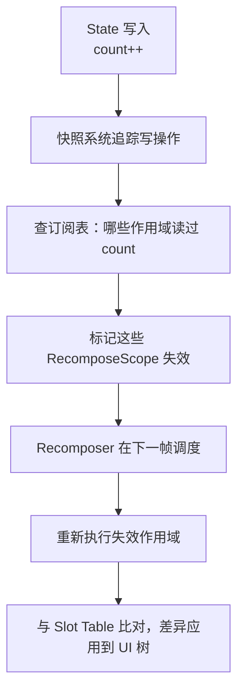
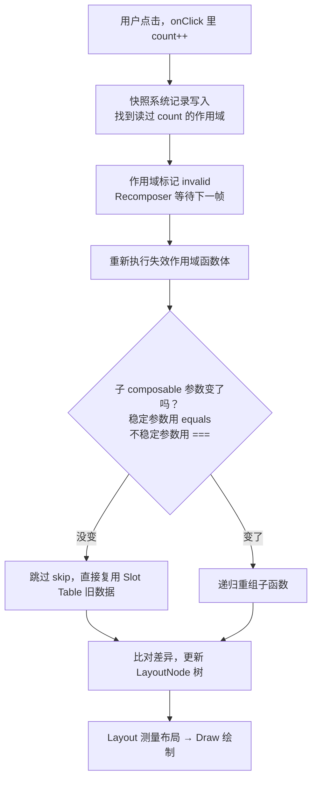

Jetpack Compose 已经是 Google 官方明确的 Android UI 开发方向，但"为什么要换掉用了十几年的 XML"以及"Compose 到底是怎么工作的"这两个问题，很多人只有模糊的印象。本文分三部分：先把 Compose 和 XML 的区别讲透，再深入 Compose 最核心的**重组（Recomposition）机制原理**，最后给出一套可落地的**重组性能优化**手段。

> 本文代码基于当前最新的 Compose 环境：Kotlin 2.x + Compose Compiler Gradle 插件（随 Kotlin 版本发布）+ Compose BOM。**Kotlin 2.0.20 起 Strong Skipping 模式已默认开启**，这会直接影响文中关于"跳过"的结论，请特别留意。
{: .prompt-info }

## 一、Compose 与 XML 的全面对比

### 1.1 本质区别：命令式 vs 声明式

XML View 体系是**命令式（Imperative）**的：界面是一棵有内部状态的 View 树，更新 UI 就是拿到 View 的引用，命令它改变自己：

```kotlin
// XML 时代：手动找到控件，命令式地逐个更新
val nameText = binding.tvName
val avatar = binding.ivAvatar

fun render(user: User) {
    nameText.text = user.name
    avatar.load(user.avatarUrl)
    // 状态一多就容易漏：比如忘了在退出登录时把 VIP 角标隐藏掉
    binding.vipBadge.isVisible = user.isVip
}
```

命令式的根本问题是：**UI 的真实状态散落在每个 View 的内部**（`TextView` 里存着文字、`ImageView` 里存着图片），代码要负责让这些内部状态和数据保持同步。同步路径随着状态数量呈组合式增长，漏掉任何一条就是 UI 不一致的 bug。

Compose 是**声明式（Declarative）**的，核心公式是：

$$
UI = f(state)
$$

你不再"更新"界面，而是**描述任意状态下界面应该长什么样**，状态变了框架自动把界面刷成最新描述：

```kotlin
@Composable
fun UserCard(user: User) {
    Row {
        AsyncImage(model = user.avatarUrl, contentDescription = null)
        Text(text = user.name)
        // 不存在"忘了隐藏"：isVip 为 false 时这个分支根本不会出现在 UI 树里
        if (user.isVip) {
            VipBadge()
        }
    }
}
```

### 1.2 多维度对比

| 维度 | XML (View 体系) | Jetpack Compose |
| --- | --- | --- |
| 编程范式 | 命令式，手动同步 UI 与状态 | 声明式，UI = f(state) |
| UI 描述 | XML 布局 + Kotlin 操作 View | 纯 Kotlin `@Composable` 函数 |
| 更新方式 | `findViewById`/ViewBinding 后调 setter | 状态变化自动触发重组 |
| 列表 | RecyclerView + Adapter + ViewHolder + DiffUtil | `LazyColumn { items(...) }` |
| 复用 | `<include>`/`<merge>`/自定义 View | 抽一个函数即复用 |
| 自定义绘制 | 继承 View，处理测量/绘制/事件分发/attrs | `Canvas` composable，几十行搞定 |
| 布局性能 | 多次测量遍历，嵌套深会掉帧 | 保证单次测量，嵌套深度基本不影响性能 |
| 性能风险点 | 布局嵌套、过度绘制 | 多余重组、不稳定参数 |
| 动画 | 属性动画 / MotionLayout，API 分散 | `animate*AsState` 等统一 API，一两行实现 |
| 主题/夜间模式 | themes.xml + 资源 qualifier | `MaterialTheme` + Kotlin 逻辑，动态换肤容易 |
| 预览 | Layout Editor 所见即所得 | `@Preview` 多状态/多设备并列预览，需编译 |
| 学习成本 | 低（资料沉淀多） | 需理解重组、稳定性、副作用等新心智模型 |

### 1.3 一个直观例子：列表页

同样实现"展示一个用户列表"，XML 需要 layout XML、item XML、Adapter、ViewHolder 四个部分；Compose 只需要：

```kotlin
@Composable
fun UserList(users: List<User>, onClick: (User) -> Unit) {
    LazyColumn {
        // key 让 Compose 精确识别每一项，增删时不错位重组（后文详述）
        items(users, key = { it.id }) { user ->
            UserCard(user = user, modifier = Modifier.clickable { onClick(user) })
        }
    }
}
```

没有 Adapter、没有 ViewHolder、没有 DiffUtil——`LazyColumn` 内部完成了复用与差分。这就是 Compose"代码量减少 30%~50%"的典型来源。

### 1.4 互操作与选型建议

两者可以互相嵌套，迁移不是"全有或全无"：

- XML 中嵌 Compose：`ComposeView`；
- Compose 中嵌 View：`AndroidView`（承载 WebView、地图、播放器等尚未 Compose 化的组件）。

**选型建议**：新项目直接上 Compose；老项目渐进迁移，新页面用 Compose、优先迁移状态复杂的页面。重度依赖仅有 View 版本的第三方 SDK、或包体积极度敏感（Compose 运行时约增加 1~2MB）时可以缓一缓。

## 二、重点：Compose 重组机制原理

声明式 UI 的代价是：框架必须自己弄清楚"状态变了之后，**哪些 UI 需要重新生成**"。Compose 解决这个问题的整套机制就是重组。理解重组要按顺序搞懂五件事：**Composition 与 Slot Table → 快照状态系统 → 重组作用域 → 跳过与稳定性 → Strong Skipping**。

### 2.1 Composition 与 Slot Table：Compose 的"UI 记忆"

`@Composable` 函数第一次执行时，Compose 会把执行过程中产生的所有信息——UI 节点树、`remember` 的值、每个函数的参数——记录到一个叫 **Slot Table** 的数据结构里（可以理解为一块按位置寻址的连续存储，类似 gap buffer）。这次首次执行叫 **Initial Composition（初始组合）**。

之后状态变化时，Compose 重新执行**受影响的** composable 函数，并将执行结果与 Slot Table 中的旧记录做比对，只把差异应用到 UI 树上——这个过程就是**重组（Recomposition）**。

这里有一个关键概念：**位置记忆化（Positional Memoization）**。Compose 编译器会给源码中每个 composable 调用点生成唯一的 key（基于调用位置），Slot Table 按这个 key 存取数据。所以：

```kotlin
@Composable
fun Counter() {
    // remember 把计算结果存进 Slot Table 的当前位置
    // 重组时同一位置直接取缓存，而不是重新执行 lambda
    val formatter = remember { DecimalFormat("#,###") }
    ...
}
```

`remember` 的本质就是"在 Slot Table 的当前位置存/取一个值"。同理，`if/else`、循环会改变"位置"，所以 `LazyColumn` 的 `items` 才需要 `key` 参数来提供稳定标识。

### 2.2 快照状态系统：Compose 怎么知道"状态变了"

重组的触发源是**状态读写**，而 Compose 的状态建立在**快照系统（Snapshot System）**之上：

```kotlin
var count by remember { mutableStateOf(0) }
```

`mutableStateOf` 返回的 `MutableState` 不是普通变量，它的读和写都会被快照系统拦截：

1. **读取被记录**：重组执行某个 composable 时，快照系统会记录"这个作用域读了哪些 State"，建立**State → 作用域**的订阅关系；
2. **写入被追踪**：任何线程对 State 的写入会通知快照系统，它查订阅表找出所有读过这个 State 的作用域，把它们标记为 invalid（失效）；
3. **调度重组**：`Recomposer` 在下一帧（通过 `MonotonicFrameClock` 与 Choreographer 对齐）重新执行所有失效的作用域。



快照系统还带来两个重要特性：

- **线程安全**：每个线程在自己的快照隔离中读写状态（类似数据库 MVCC），写入在快照提交时才对其他线程可见，所以后台线程改 State 也是安全的；
- **重组可以是乐观且可取消的**：Compose 可以在参数"预计会变"时提前开始重组，如果期间参数又变了，就丢弃这次重组重来。这也是为什么 **composable 函数必须无副作用**——一次被丢弃的重组里如果写了数据库、弹了 Toast，就会产生不可撤销的错误行为。副作用必须放进 `LaunchedEffect`/`DisposableEffect`/`SideEffect` 这些受控 API 中。

> 常见误区：以为"数据变了就会重组"。实际上普通变量、普通 `List` 的变化 Compose 根本感知不到——**只有对 `State` 的写入才会触发重组**。列表要用 `mutableStateListOf` 或整体替换 `State<List<T>>` 的值。
{: .prompt-warning }

### 2.3 重组作用域：重组的最小单位

重组不是重新执行整棵树，而是以 **RecomposeScope（重组作用域）**为单位。Compose 编译器会把每个**可重启（restartable）**的 composable 函数包装成一个独立的重组作用域——你可以在编译产物里看到类似这样的变换：

```kotlin
// 你写的代码
@Composable
fun Greeting(name: String) {
    Text("Hello $name")
}

// 编译器生成的等价逻辑（简化示意）
fun Greeting(name: String, $composer: Composer, $changed: Int) {
    $composer.startRestartGroup(键)   // 开启一个可重启组
    // ...函数体，参数比较、跳过判断都靠 $changed 位标记...
    $composer.endRestartGroup()?.updateScope { next ->
        Greeting(name, next, $changed or 0b1)  // 记录"如何重新执行我自己"
    }
}
```

编译器注入的 `$composer` 负责读写 Slot Table，`$changed` 是位标记，携带"每个参数相对上次是否变化、是否稳定"的信息——这是后面"跳过"的判断依据。

作用域机制带来一个精细的行为，官方称为 **donut-hole skipping（甜甸圈跳过）**：

```kotlin
@Composable
fun Parent() {
    var count by remember { mutableStateOf(0) }
    Column {                          // Column 是 inline 函数，不构成独立作用域
        Button(onClick = { count++ }) {
            Text("点击")
        }
        CountDisplay(count)           // 只有真正"读"了 count 的作用域才失效
    }
}

@Composable
fun CountDisplay(count: Int) {
    Text("count = $count")            // count 的读发生在这里
}
```

`count++` 之后失效的是**读取了 `count` 的最内层作用域**。中间层如果只是把 State 对象透传而没有读它的 `.value`，就像甜甜圈一样"中间的洞被跳过"。这也引出一个重要优化思路：**把状态读取尽量下推到叶子节点**（2.6 详述）。

另外注意：`Column`/`Row`/`Box` 是 **inline** 函数，不生成自己的作用域，它们内部的失效会上升到最近的非 inline 父作用域。

### 2.4 跳过与稳定性：重组的"防火墙"

一个作用域失效后，它内部调用的子 composable 是否也要重新执行？不一定——如果 Compose 能**证明**子函数的所有输入都没变，就直接**跳过（skip）**它。判断"没变"的依据是参数比较，而参数比较可信的前提是类型**稳定（Stable）**。

**稳定的定义**（满足全部三条）：

1. 两个实例 `equals` 相等，则永远相等；
2. 公有属性变化时会通知 Composition（如 `MutableState`）；
3. 所有公有属性也都是稳定类型。

**编译器的稳定性推断**：

- 基本类型、`String`、函数类型（lambda）→ 稳定；
- 全部属性为 `val` 且类型稳定的 data class → 推断为稳定；
- 含 `var` 属性、或含不稳定属性 → 不稳定；
- **接口、抽象类型 → 默认不稳定**（编译器无法预知实现）；
- **`List`/`Map`/`Set` 等集合接口 → 不稳定**（无法保证不可变）；
- **跨模块的类，若该模块未启用 Compose 编译器 → 不稳定**（没有稳定性元数据）。

不稳定参数在经典模式下的后果很直接：**只要父作用域重组，持有不稳定参数的子函数就无法跳过，被迫跟着重组**。

无法修改的类（第三方库、跨模块）可以用注解或配置文件干预：

```kotlin
// 承诺创建后属性永不变化
@Immutable
data class Snack(val id: Long, val name: String, val tags: Set<String>)

// 承诺可变但变化会通知 Composition（比 @Immutable 弱）
@Stable
interface UiState<T> {
    val value: T?
    val hasError: Boolean
}
```

也可以在模块里声明**稳定性配置文件**，把外部类批量标记为稳定：

```kotlin
// build.gradle.kts
composeCompiler {
    stabilityConfigurationFiles.add(
        project.layout.projectDirectory.file("compose_stability.conf")
    )
}
```

```
// compose_stability.conf：把外部类视为稳定
java.time.LocalDateTime
com.example.thirdparty.*
```
{: file="compose_stability.conf" }

### 2.5 Strong Skipping：新版编译器的默认行为

稳定性推断的严格性曾是 Compose 性能问题的最大来源——一个不小心传了 `List` 参数，整条链路都无法跳过。**Kotlin 2.0.20 起，Compose 编译器默认开启 Strong Skipping 模式**，规则大幅放宽：

| 行为 | 经典模式 | Strong Skipping（现默认） |
| --- | --- | --- |
| 可跳过条件 | 所有参数都是稳定类型 | 所有可重启函数**一律可跳过** |
| 稳定参数比较 | `equals` | `equals`（不变） |
| **不稳定参数比较** | 不比较，直接重组 | **实例相等（`===`）**，同一实例即跳过 |
| composable 内的 lambda | 捕获不稳定值则每次重组新建，导致子项无法跳过 | **自动 `remember` 记忆化**，以捕获值为 key |

编译器对 lambda 的自动记忆化相当于替你写了：

```kotlin
@Composable
fun MyComposable(unstable: UnstableClass, stable: StableClass) {
    // Strong Skipping 下编译器自动生成的等价代码：
    val lambda = remember(unstable, stable) {
        { use(unstable); use(stable) }
    }
}
```

这意味着以前"传个 ViewModel 方法引用导致整个列表项重组"的经典坑，现在默认就被填掉了。

> Strong Skipping 降低了稳定性的"惩罚"，但**没有让稳定性失去意义**：不稳定参数按 `===` 比较，如果你每次重组都创建新实例（比如在 composable 里 `list.map { ... }` 生成新 List），照样无法跳过。稳定类型的 `equals` 比较仍然是更可靠的跳过依据。如需对单个函数退回严格行为，可用 `@NonSkippableComposable` 标注。
{: .prompt-tip }

### 2.6 串起来：一次重组的完整流程



最后强调：重组只是三大阶段（**Composition → Layout → Draw**）的第一步。有些状态变化可以完全绕过 Composition，只触发 Layout 或 Draw——这正是下一章性能优化的重要抓手。

## 三、重组性能优化实战

优化重组的总原则只有三条：**让重组少发生、让重组范围小、让重组之外的阶段替它干活**。

### 3.1 用 derivedStateOf 砍掉高频触发

状态变化频率远高于 UI 需要响应的频率时，用 `derivedStateOf` 做"降频"：

```kotlin
val listState = rememberLazyListState()

LazyColumn(state = listState) { ... }

// 错误写法：firstVisibleItemIndex 滚动中每帧都变，每帧都触发重组
// val showButton = listState.firstVisibleItemIndex > 0

// 正确：只有布尔结果 true/false 翻转的那一刻才触发重组
val showButton by remember {
    derivedStateOf { listState.firstVisibleItemIndex > 0 }
}

AnimatedVisibility(visible = showButton) {
    ScrollToTopButton()
}
```

> `derivedStateOf` 有自身开销，只在"输入变化频率 >> 输出变化频率"时使用。如果只是想把两个 State 拼成一个字符串，直接写普通表达式即可。
{: .prompt-tip }

### 3.2 延迟状态读取：把工作推给 Layout/Draw 阶段

状态在哪个阶段被**读取**，就只会触发哪个阶段之后的工作。把读取从组合阶段推迟到布局/绘制阶段，可以完全跳过重组：

```kotlin
val listState = rememberLazyListState()

Image(
    ...
    // 错误：Modifier.offset(y = xx.dp) 在组合阶段读状态，滚动时每帧重组
    // 正确：lambda 版 offset 在 Layout 阶段才读，滚动时只重新布局、零重组
    modifier = Modifier.offset {
        IntOffset(x = 0, y = listState.firstVisibleItemScrollOffset / 2)
    }
)
```

```kotlin
val color by animateColorBetween(Color.Cyan, Color.Magenta)

Box(
    Modifier
        .fillMaxSize()
        // drawBehind 的 lambda 在 Draw 阶段读 color：
        // 颜色动画每帧只重绘，Composition 和 Layout 全部跳过
        .drawBehind { drawRect(color) }
)
```

同样的思路也适用于自己写的 composable——**用 lambda 传状态，而不是传值**：

```kotlin
@Composable
fun SnackDetail() {
    Box(Modifier.fillMaxSize()) {
        val scroll = rememberScrollState(0)
        // 传 () -> Int 而不是 scroll.value：
        // SnackDetail 作用域不再读这个状态，滚动时只有 Title 内部受影响
        Title(snack) { scroll.value }
    }
}

@Composable
private fun Title(snack: Snack, scrollProvider: () -> Int) {
    val offset = with(LocalDensity.current) { scrollProvider().toDp() }
    Column(Modifier.offset(y = offset)) { ... }
}
```

频繁变换的场景（跟手动画、视差）优先用 `graphicsLayer {}` lambda 版本，它把平移/缩放/透明度全部放到 Draw 阶段。

### 3.3 给 LazyList 提供 key 和 contentType

```kotlin
LazyColumn {
    items(
        items = messages,
        key = { it.id },                 // 增删时精确复用，避免位置错位导致的连锁重组
        contentType = { it.viewType }    // 同类型 item 之间复用组合结构
    ) { message ->
        MessageRow(message)
    }
}
```

不提供 `key` 时，列表头部插入一条数据会让**后面所有 item 的位置 key 全部对不上**，引发整列表重组；提供 `key` 后只有新增的那一项需要组合。

### 3.4 保证参数稳定性

即使 Strong Skipping 已默认开启，稳定性仍值得投入，因为 `===` 比较对"每次生成新实例"的写法无效：

```kotlin
// 问题：每次重组都 map 出新 List，=== 永远不等，UserList 永远无法跳过
UserList(users = uiState.users.map { it.toDisplayModel() })

// 修复 1：把转换挪进 ViewModel，UI 层拿到的是同一实例
// 修复 2：remember 缓存转换结果
val displayUsers = remember(uiState.users) { uiState.users.map { it.toDisplayModel() } }
UserList(users = displayUsers)
```

配套手段：

- 数据类尽量全 `val` + 稳定属性；无法推断时用 `@Immutable`/`@Stable` 显式承诺；
- 集合参数用 `kotlinx.collections.immutable` 的 `ImmutableList`（配 `@Immutable` 语义），或用稳定性配置文件把 `kotlin.collections.*` 声明为稳定；
- 跨模块的公共 model 模块记得也启用 Compose 编译器插件，否则它的类一律被视为不稳定。

### 3.5 remember 一切昂贵计算

组合阶段的函数体每次重组都会执行，昂贵计算必须缓存：

```kotlin
@Composable
fun ContactList(contacts: List<Contact>, comparator: Comparator<Contact>) {
    // 以输入为 key，输入不变就不重新排序
    val sorted = remember(contacts, comparator) {
        contacts.sortedWith(comparator)
    }
    LazyColumn { items(sorted, key = { it.id }) { ... } }
}
```

### 3.6 避免反向写状态（Backwards Write)

在组合阶段**写**一个已经被**读**过的状态，会造成"重组→写→再失效→再重组"的死循环：

```kotlin
@Composable
fun BadCounter() {
    var count by remember { mutableStateOf(0) }
    Text("count = $count")
    count++   // 反向写：读它的作用域刚执行完又被标记失效，无限重组
}
```

状态写入只应发生在事件回调（`onClick` 等）或受控副作用（`LaunchedEffect`）里。

### 3.7 度量工具：先测量，再优化

- **Layout Inspector**：实时查看每个 composable 的重组次数和跳过次数，定位"重组风暴"；
- **组合追踪（Composition Tracing）**：System Trace 中显示每个 composable 的耗时，定位慢函数；
- **编译器报告**：`composeCompiler { reportsDestination / metricsDestination }` 输出每个函数是否 skippable、每个类是否 stable 的报告，做稳定性专项治理；
- **Baseline Profiles**：Compose 是库不是系统框架，代码默认要走 JIT。为应用生成 Baseline Profile 可显著改善首帧和滚动性能，这往往比任何微观优化收益都大；
- 始终以 **release + minifyEnabled** 构建测性能，debug 版的 Compose 性能不具参考性。

## 四、高频面试问答

**Q1：Compose 和 XML 最本质的区别是什么？**

答：编程范式不同。XML 是命令式——UI 状态存在 View 内部，开发者手动调用 setter 保持数据与界面同步，同步路径多了容易漏。Compose 是声明式——UI = f(state)，开发者只描述状态到界面的映射，框架通过重组自动同步。其余差异（代码量、复用方式、动画 API）都是这个范式差异的衍生物。

**Q2：什么是重组？它是怎么被触发的？**

答：重组是状态变化后，Compose 重新执行受影响的 composable 函数、并把差异更新到 UI 树的过程。触发链路：composable 执行时对 `State` 的**读取**会被快照系统记录，建立 State 到重组作用域的订阅关系；之后任何对该 State 的**写入**会使订阅它的作用域失效，Recomposer 在下一帧重新执行这些作用域。注意只有 `State` 的写入能触发重组，普通变量变化 Compose 感知不到。

**Q3：重组的最小单位是什么？整个页面会全部重新执行吗？**

答：不会。最小单位是重组作用域（RecomposeScope），编译器为每个可重启的 composable 函数生成一个作用域。只有**真正读取了变化状态**的作用域会重新执行；父函数中间层如果只透传 State 对象而不读值，可以被跳过（donut-hole skipping）。另外 `Column`/`Row`/`Box` 是 inline 函数，不构成独立作用域，其失效会上升到最近的非 inline 父作用域。

**Q4：什么是稳定性？为什么 `List` 参数会导致无法跳过？**

答：稳定类型要求 equals 结果恒定、属性变化会通知 Composition、所有属性也稳定。编译器据此推断：全 `val` 的 data class 稳定；含 `var`、接口类型、集合接口（`List`/`Map`）以及未启用 Compose 编译器的跨模块类都不稳定。经典模式下，参数不稳定的函数不可跳过，父作用域一重组它必然跟着重组。治理手段：`@Immutable`/`@Stable` 注解、`kotlinx.collections.immutable`、稳定性配置文件。

**Q5：Strong Skipping 模式改变了什么？**

答：Kotlin 2.0.20 起默认开启。两点变化：① 所有可重启 composable 一律可跳过——稳定参数仍用 `equals` 比较，不稳定参数改用**实例相等（`===`）**比较，同一实例即可跳过；② composable 内的 lambda 自动被 `remember` 记忆化（以捕获值为 key），解决了"lambda 每次重组新建导致子项无法跳过"的经典坑。但它不是银弹：每次重组生成新实例的写法（如组合阶段 `map` 出新 List）在 `===` 下依然无法跳过。

**Q6：`remember` 和 `derivedStateOf` 的区别？**

答：`remember` 是"跨重组缓存"：把计算结果存进 Slot Table，key 不变就不重算，但它本身不产生状态、不触发重组。`derivedStateOf` 是"状态降频"：把一个或多个高频变化的 State 派生成低频 State，只有**派生结果**变化时才让订阅者重组，典型场景是 `firstVisibleItemIndex > 0` 这类布尔派生。两者常配合使用：`remember { derivedStateOf { ... } }`。

**Q7：为什么 composable 函数必须无副作用？**

答：因为重组是"乐观且可取消"的——Compose 可能提前开始一次重组，参数中途再次变化时丢弃它重来；跳过机制也使函数体的执行次数不可预期（可能执行多次，也可能被跳过）。如果函数体里有写数据库、弹 Toast 等副作用，就会出现执行次数不可控的错误行为。副作用必须放入 `LaunchedEffect`、`DisposableEffect`、`SideEffect` 等受控 API，由框架保证其生命周期语义。

**Q8：说几个重组性能优化的实际手段。**

答：按"少触发、小范围、换阶段"三个方向：① `derivedStateOf` 给高频状态降频；② 延迟状态读取——用 `Modifier.offset {}`、`graphicsLayer {}`、`drawBehind {}` 的 lambda 版本把读取推迟到 Layout/Draw 阶段，跳过重组；传 `() -> T` lambda 代替传值，缩小失效范围；③ LazyList 提供 `key` 和 `contentType`；④ 保证参数稳定，避免组合阶段生成新实例；⑤ `remember` 缓存昂贵计算；⑥ 避免反向写状态；⑦ 用 Layout Inspector 重组计数和编译器 metrics 报告定位问题，上线前配 Baseline Profile，用 release 包测性能。

**Q9：Compose 性能和 XML 相比到底怎么样？**

答：布局阶段 Compose 有优势——布局系统保证单次测量，嵌套深度基本不影响性能，不存在 `RelativeLayout` 双测量这类问题。但它引入了新的性能维度：重组开销，写法不当（不稳定参数、组合阶段读高频状态）会造成多余重组。冷启动因 Compose 是库（需 JIT）略慢于 View，用 Baseline Profile 可基本抹平。总体结论：两者性能相当，性能工作的重心从"减少布局嵌套"转移到了"控制重组范围"。

---

以上就是 Compose 与 XML 的对比、重组机制原理与优化实践。核心记忆锚点：**UI = f(state)、快照系统订阅状态读取、作用域是重组最小单位、稳定性决定能否跳过、Strong Skipping 已是默认**。
