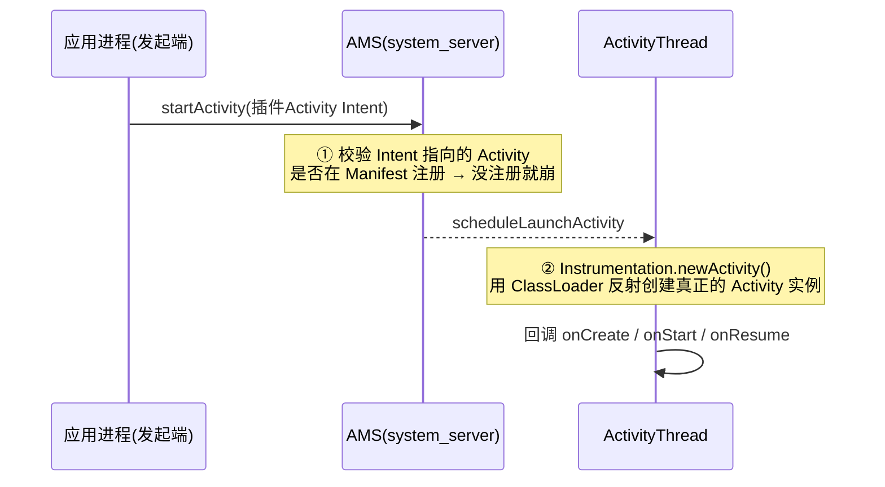
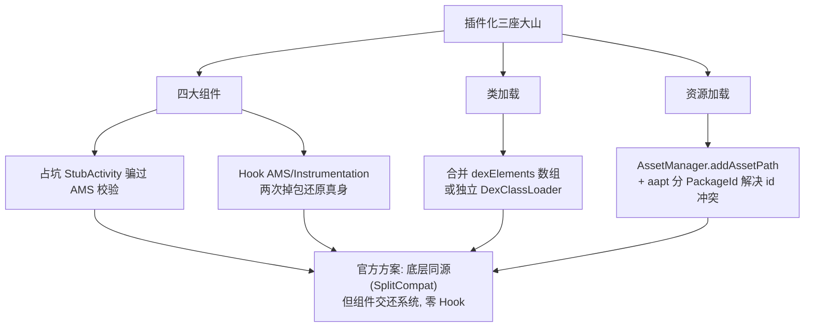

插件化和动态化是国内大厂 Android 高级岗的经典考察点。它考的不是"你会不会用某个框架"，而是你对 **ClassLoader、AssetManager、AMS、Instrumentation** 这一整套系统机制的理解深度。这篇文章会结合 Framework 源码，把插件化必须解决的三个核心问题——**类怎么加载、资源怎么加载、四大组件怎么运行**——一层层讲清楚，再对比主流框架的取舍，最后回到 Google 官方推荐的动态化方案。

> 本文源码基于 AOSP，不同 Android 版本细节略有差异，但核心机制一致。阅读需要你对 Activity 启动流程和 ClassLoader 双亲委派有基本了解。
{: .prompt-info }

## 一、先厘清概念：插件化 vs 动态化 vs 热修复

这三个词经常被混用，但目标和技术手段不同：

| 概念 | 目标 | 加载单位 | 是否需要重启 |
|---|---|---|---|
| **热修复** | 线上 bug 紧急修复 | 方法/类级别的补丁 | 通常不需要（运行时替换） |
| **插件化** | 功能模块独立开发、动态下发、解耦 APK 体积 | 完整的 APK/DEX（含四大组件、资源） | 插件可即时加载，组件按需启动 |
| **动态化** | 广义概念，泛指"发版后仍能改变 App 行为" | 从代码补丁到完整业务模块都算 | 视方案而定 |

**插件化是三者中最复杂的**，因为它要让一个"没有安装、系统完全不知道存在"的 APK，能像已安装应用一样运行四大组件、加载资源。这就必须"欺骗"系统。

插件化要解决的三座大山：

1. **类加载**：插件的 `.class`（打包进 dex）怎么被宿主的 ClassLoader 找到并加载？
2. **资源加载**：插件的 `R.layout.xxx`、图片、字符串怎么被读取？
3. **组件生命周期**：插件里的 Activity 没在 `AndroidManifest` 注册，`startActivity` 直接会崩，怎么让它跑起来？

下面逐个拆解。

## 二、第一座大山：类加载原理

### 2.1 Android 的 ClassLoader 体系

Android 虽然用 Java 语言，但字节码是 dex 格式，所以 ClassLoader 与标准 JVM 不同。核心是两个：

- **`PathClassLoader`**：只能加载**已安装** APK 里的 dex（系统用它加载宿主 App）。
- **`DexClassLoader`**：可以加载任意路径下的 dex/apk/jar——**这正是插件化的入口**。

两者都继承自 `BaseDexClassLoader`。看下 `DexClassLoader` 的源码有多简单（`libcore/dalvik/src/main/java/dalvik/system/DexClassLoader.java`）：

```java
public class DexClassLoader extends BaseDexClassLoader {
    public DexClassLoader(String dexPath, String optimizedDirectory,
                          String librarySearchPath, ClassLoader parent) {
        super(dexPath, null, librarySearchPath, parent);
    }
}
```
{: file="DexClassLoader.java" }

它几乎什么都没做，真正的逻辑全在父类 `BaseDexClassLoader`。

### 2.2 双亲委派与 DexPathList

`BaseDexClassLoader` 加载类的关键成员是 `pathList`（`DexPathList` 类型）。查找类时走的是标准双亲委派 → 委派失败后调用 `findClass`：

```java
// BaseDexClassLoader.java
@Override
protected Class<?> findClass(String name) throws ClassNotFoundException {
    // 委托给 DexPathList 去众多 dex 里查找
    Class c = pathList.findClass(name, suppressedExceptions);
    if (c == null) {
        throw new ClassNotFoundException("...");
    }
    return c;
}
```
{: file="BaseDexClassLoader.java" }

而 `DexPathList` 内部维护了一个**关键数组** `dexElements`：

```java
// DexPathList.java
/** list of dex/resource (class path) elements */
private Element[] dexElements;

public Class<?> findClass(String name, List<Throwable> suppressed) {
    // 遍历每一个 dex 文件，挨个尝试加载
    for (Element element : dexElements) {
        Class<?> clazz = element.findClass(name, definingContext, suppressed);
        if (clazz != null) {
            return clazz;   // 谁先找到用谁的
        }
    }
    return null;
}
```
{: file="DexPathList.java" }

**这个 `dexElements` 数组就是插件化类加载的命门。** 它是按顺序遍历的——只要我们能把插件 dex 对应的 `Element` **塞进这个数组**，宿主的 ClassLoader 就能加载插件里的类了。

### 2.3 两种主流的类加载方案

**方案 A：单 ClassLoader（数组合并 / dex 插桩）**

思路：把插件的 `dexElements` 合并进宿主 ClassLoader 的 `dexElements`。这也是 QQ 空间热修复、`MultiDex` 的经典做法：

```java
/**
 * 将插件 dex 合并进宿主 ClassLoader。
 * Merge plugin dex elements into host ClassLoader via reflection.
 * @param hostClassLoader 宿主的 ClassLoader
 * @param pluginDexPath 插件 apk/dex 路径
 */
public static void injectDexToHost(ClassLoader hostClassLoader,
                                   String pluginDexPath, String optDir) throws Exception {
    // 1. 用插件路径创建一个 DexClassLoader，拿到它的 dexElements
    DexClassLoader pluginLoader = new DexClassLoader(
            pluginDexPath, optDir, null, hostClassLoader);

    // 2. 反射取出宿主和插件各自的 dexElements 数组
    Object hostPathList = getField(hostClassLoader, BaseDexClassLoader.class, "pathList");
    Object pluginPathList = getField(pluginLoader, BaseDexClassLoader.class, "pathList");
    Object[] hostElements = (Object[]) getField(hostPathList, hostPathList.getClass(), "dexElements");
    Object[] pluginElements = (Object[]) getField(pluginPathList, pluginPathList.getClass(), "dexElements");

    // 3. 合并成新数组（插件在前=优先级更高，可用于热修复覆盖；在后=宿主优先）
    Object[] newElements = (Object[]) Array.newInstance(
            hostElements.getClass().getComponentType(),
            hostElements.length + pluginElements.length);
    System.arraycopy(pluginElements, 0, newElements, 0, pluginElements.length);
    System.arraycopy(hostElements, 0, newElements, pluginElements.length, hostElements.length);

    // 4. 把新数组写回宿主的 pathList
    setField(hostPathList, hostPathList.getClass(), "dexElements", newElements);
}
```

> **热修复的原理正在这里**：把补丁 dex 放在数组**最前面**，`findClass` 遍历时先命中补丁类，旧的 bug 类因为"谁先找到用谁"而被跳过（同一个类在前面找到就不会再往后走）。
{: .prompt-tip }

- **优点**：宿主和插件共用一个 ClassLoader，互相调用无障碍。
- **缺点**：没有类隔离，插件与宿主的类名冲突会出问题；插件卸载困难。

**方案 B：多 ClassLoader（每个插件独立 ClassLoader）**

VirtualApk、RePlugin、Shadow 等成熟框架多采用此方案：每个插件 APK 用一个独立的 `DexClassLoader`，`parent` 指向宿主 ClassLoader。

```java
// 每个插件独享 ClassLoader，天然隔离
DexClassLoader pluginClassLoader = new DexClassLoader(
        pluginApkPath,
        optimizedDir,
        pluginNativeLibDir,
        hostClassLoader   // parent 设为宿主，保证能反向访问宿主的公共类
);
```

- **优点**：类隔离干净，插件之间、插件与宿主之间互不污染，支持插件卸载/升级。
- **缺点**：宿主访问插件类需要反射或接口下沉；跨插件调用要处理 ClassLoader 可见性。

现代框架基本都走方案 B。**这也是一道高频追问："为什么不用一个 ClassLoader？"——答案就是类隔离和可卸载性。**

## 三、第二座大山：资源加载原理

类加载解决了"代码从哪来"，但插件里的布局、图片、字符串（也就是 `R` 资源）系统同样不认识。

### 3.1 AssetManager 的隐藏方法 addAssetPath

资源访问的底层是 `AssetManager`。它有一个 `@hide` 的方法 `addAssetPath`，能把**任意路径的 APK 资源**加进来：

```java
// AssetManager.java（@hide 方法）
/**
 * Add an additional set of assets to the asset manager...
 * @return the cookie of the added asset, 0 on failure.
 */
public final int addAssetPath(String path) {
    return addAssetPathInternal(path, false, false);
}
```
{: file="AssetManager.java" }

插件化加载资源的标准姿势：**反射创建一个新的 AssetManager，把插件 APK 路径 addAssetPath 进去，再包一个 Resources**：

```java
/**
 * 为插件 APK 创建独立的 Resources 对象。
 * Create a Resources instance that can read plugin apk resources.
 * @param context 宿主 context
 * @param pluginApkPath 插件 apk 绝对路径
 * @return Resources 可读取插件资源的 Resources 对象
 */
public static Resources createPluginResources(Context context, String pluginApkPath)
        throws Exception {
    // 1. 反射实例化 AssetManager（构造是 hide 的）
    AssetManager assetManager = AssetManager.class.newInstance();

    // 2. 反射调用 addAssetPath 把插件 apk 加进去
    Method addAssetPath = AssetManager.class.getMethod("addAssetPath", String.class);
    addAssetPath.invoke(assetManager, pluginApkPath);

    // 3. 用宿主的 DisplayMetrics/Configuration 构造 Resources
    Resources hostRes = context.getResources();
    return new Resources(assetManager,
            hostRes.getDisplayMetrics(),
            hostRes.getConfiguration());
}
```

### 3.2 两种资源方案的取舍

拿到 `Resources` 后，怎么让插件的 Activity 用上它？有两种流派：

- **独立资源**：插件用自己的 `Resources`，与宿主完全隔离。需要重写插件 `Context` 的 `getResources()`。问题：宿主和插件资源 id 相互不可见。
- **合并资源**：把宿主 APK 和插件 APK 一起 `addAssetPath` 进同一个 AssetManager，共享一份 Resources。问题：**资源 id 冲突**——aapt 编译时资源 id 的 PackageId 默认都是 `0x7f`，宿主和插件会撞。

**解决资源 id 冲突**是插件化工程化的核心难点，业界的做法是修改 aapt/aapt2，给插件分配不同的 **PackageId**（比如把插件的 `0x7f` 改成 `0x70`）：

- **VirtualApk**：修改 aapt，为每个插件分配独立 PackageId。
- **Atlas（手淘）**：类似思路，深度定制资源打包。
- **RePlugin**：插件用独立 Resources，尽量不与宿主共享，从而规避冲突。

> 面试时能主动讲出"aapt 资源 id 的 PackageId 段（0x7f）冲突以及分段解决"，是区分"读过原理"和"真做过插件化"的分水岭。
{: .prompt-warning }

## 四、第三座大山：四大组件的生命周期（最难）

前两座山靠反射就能翻过去，但四大组件——尤其是 Activity——不是 `new` 出来的普通对象，它由 **AMS（ActivityManagerService）** 统一调度，且启动前会做 **`AndroidManifest` 注册校验**。一个没注册的插件 Activity，`startActivity` 会直接抛：

```text
android.content.ActivityNotFoundException: Unable to find explicit activity class ...;
have you declared this activity in your AndroidManifest.xml?
```

这里以 Activity 为例，讲最经典的 **"占坑 + Hook"** 方案。

### 4.1 校验发生在哪：Activity 启动流程的两个关键点

简化后的 Activity 启动流程（以较新版本为例）：



关键在**两个校验/创建点**：

1. **① AMS 端校验**：AMS 拿到 Intent 后检查目标 Activity 是否已在系统 `PackageManagerService` 里注册。**插件 Activity 没注册，这一步就崩。**
2. **② 客户端创建**：AMS 校验通过后，通知应用进程的 `ActivityThread`，由 `Instrumentation.newActivity()` 用 ClassLoader 反射创建 Activity 实例。

### 4.2 占坑：先在 Manifest 里放一个"替身"

既然 AMS 只认已注册的 Activity，那就在宿主 `AndroidManifest.xml` 里**预先注册一个占坑 Activity**（StubActivity），把它的各种 launchMode、进程属性都配好：

```xml
<!-- 宿主 Manifest：预埋一个占坑 Activity -->
<activity
    android:name="com.host.stub.StubActivity"
    android:launchMode="standard" />
```
{: file="AndroidManifest.xml" }

### 4.3 "偷梁换柱"：两次 Hook

核心技巧是**在启动流程中把 Intent 掉包两次**：去 AMS 之前换成占坑的 StubActivity（骗过校验），回到客户端创建之前再换回真正的插件 Activity。

**第一次 Hook：欺骗 AMS（去程掉包）**

在 `startActivity` 到达 AMS 之前，把插件 Activity 的 Intent 替换成 StubActivity 的 Intent。Hook 点是应用进程持有的 AMS 代理对象（`ActivityManager` 的 `IActivityManagerSingleton` 或旧版本的 `gDefault`）：

```java
/**
 * Hook AMS 代理，在 startActivity 前把插件 Intent 换成占坑 StubActivity Intent。
 * Hook the AMS proxy to swap the plugin Intent with the pre-registered stub Intent.
 */
public static void hookAMS() throws Exception {
    // 1. 拿到 ActivityManager 里缓存的 IActivityManager 单例(不同版本字段名不同)
    Class<?> amClass = Class.forName("android.app.ActivityManager");
    Field singletonField = amClass.getDeclaredField("IActivityManagerSingleton");
    singletonField.setAccessible(true);
    Object singleton = singletonField.get(null);

    // 2. 取出 Singleton 里的真实 IActivityManager 实例
    Class<?> singletonClass = Class.forName("android.util.Singleton");
    Field instanceField = singletonClass.getDeclaredField("mInstance");
    instanceField.setAccessible(true);
    final Object realAMS = instanceField.get(singleton);

    // 3. 用动态代理包一层，拦截 startActivity 方法
    Class<?> iamClass = Class.forName("android.app.IActivityManager");
    Object proxyAMS = Proxy.newProxyInstance(
            Thread.currentThread().getContextClassLoader(),
            new Class[]{iamClass},
            (proxy, method, args) -> {
                if ("startActivity".equals(method.getName())) {
                    // 找到参数里的 Intent，替换成占坑 Intent，并把原始 Intent 存起来
                    int index = findIntentIndex(args);
                    Intent realIntent = (Intent) args[index];
                    Intent stubIntent = new Intent();
                    stubIntent.setClassName("com.host", "com.host.stub.StubActivity");
                    stubIntent.putExtra(EXTRA_REAL_INTENT, realIntent); // 保存真实目标
                    args[index] = stubIntent;
                }
                return method.invoke(realAMS, args);   // 转发给真实 AMS
            });

    // 4. 把代理写回，之后所有 startActivity 都会先经过我们的代理
    instanceField.set(singleton, proxyAMS);
}
```

这样 AMS 收到的是**已注册的 StubActivity**，校验轻松通过。

**第二次 Hook：还原真身（回程掉包）**

AMS 校验通过后，会通过 `ActivityThread` 的 `Handler`（`mH`）发消息回来创建 Activity。我们在**创建 Activity 之前**把 Intent 换回插件 Activity。Hook 点是 `ActivityThread.mH` 的 `Callback`：

```java
/**
 * Hook ActivityThread.mH 的 Callback，在真正创建 Activity 前把 StubIntent 换回插件 Intent。
 * Restore the real plugin Intent right before the Activity is instantiated.
 */
public static void hookActivityThreadHandler() throws Exception {
    // 1. 反射拿到 ActivityThread 的 mH (Handler)
    Class<?> atClass = Class.forName("android.app.ActivityThread");
    Object currentActivityThread = getStaticField(atClass, "sCurrentActivityThread");
    Handler mH = (Handler) getField(currentActivityThread, atClass, "mH");

    // 2. 给 Handler 设置一个 Callback (Handler.dispatchMessage 会优先走 Callback)
    Field callbackField = Handler.class.getDeclaredField("mCallback");
    callbackField.setAccessible(true);
    callbackField.set(mH, (Handler.Callback) msg -> {
        // EXECUTE_TRANSACTION(159) 或旧版 LAUNCH_ACTIVITY(100)
        if (msg.what == EXECUTE_TRANSACTION) {
            // 从 ClientTransaction 里取出 Intent，换回之前存的真实 Intent
            restoreRealIntent(msg.obj);
        }
        return false;   // 返回 false，让系统继续正常处理
    });
}
```

这样系统最终用 `Instrumentation.newActivity()` 创建时，拿到的就是真正的插件 Activity。而 `newActivity` 用的 ClassLoader 我们也要提前替换成能加载插件类的 ClassLoader（第二座山已解决）。

### 4.4 另一个更优雅的 Hook 点：Instrumentation

上面 Hook `mH` 稍显 hack，更稳的做法是 **Hook `Instrumentation`**。`ActivityThread` 里有个 `mInstrumentation` 字段，所有 Activity 的创建（`newActivity`）和生命周期回调（`callActivityOnCreate` 等）都经过它。替换成自定义 `Instrumentation` 就能统一接管：

```java
/**
 * 自定义 Instrumentation，接管 Activity 的 Intent 还原与创建。
 * Custom Instrumentation to intercept Activity creation and restore plugin Intent.
 */
public class PluginInstrumentation extends Instrumentation {

    private final Instrumentation base;   // 原始 Instrumentation

    public PluginInstrumentation(Instrumentation base) {
        this.base = base;
    }

    // 去程：startActivity 前把插件 Intent 换成占坑 Intent（反射调用 base 的 hide 方法）
    public ActivityResult execStartActivity(Context who, IBinder contextThread,
            IBinder token, Activity target, Intent intent, int requestCode, Bundle options) {
        // ... 替换成 StubActivity intent，保存 realIntent ...
        return realExecStartActivity(base, /* args... */);
    }

    // 回程：创建 Activity 前把 Intent 换回来，并用插件 ClassLoader 加载
    @Override
    public Activity newActivity(ClassLoader cl, String className, Intent intent)
            throws Exception {
        Intent realIntent = intent.getParcelableExtra(EXTRA_REAL_INTENT);
        if (realIntent != null) {
            String realClass = realIntent.getComponent().getClassName();
            // 用能加载插件类的 ClassLoader 创建真正的插件 Activity
            return super.newActivity(pluginClassLoader, realClass, realIntent);
        }
        return super.newActivity(cl, className, intent);
    }
}
```

**Service、BroadcastReceiver、ContentProvider** 也各有对应方案：Service 常用"代理分发"（一个 StubService 转发多个插件 Service 的生命周期）；静态广播转动态广播；ContentProvider 用一个 StubProvider 统一分发。原理都是"占坑 + 分发/Hook"，不再展开。

## 五、主流框架横向对比

理解了原理，就能看懂各框架的取舍。这也是面试常问的"你了解哪些插件化框架，区别是什么"：

| 框架 | 出品方 | 组件方案 | 类加载 | 特点 |
|---|---|---|---|---|
| **DroidPlugin** | 360 | 大量 Hook 系统服务，几乎不改插件 | 多 ClassLoader | 免安装运行任意 APK，Hook 面极广，兼容性差、维护停滞 |
| **VirtualApk** | 滴滴 | Hook AMS + Instrumentation，改 aapt 分 PackageId | 多 ClassLoader | 组件全支持，工程化成熟，侵入系统较深 |
| **RePlugin** | 360 | 只 Hook `ClassLoader` 一处，组件用坑位映射 | 多 ClassLoader | 追求"最少 Hook"，稳定性好，插件独立资源 |
| **Shadow** | 腾讯 | **零反射零 Hook**，插件当普通 APK 编译期处理 | 多 ClassLoader | 无 hidden API 依赖，兼容性最好，被官方限制 Hook 的新系统友好 |
| **Atlas** | 阿里手淘 | 容器化，深度定制打包 | 多 ClassLoader | 超大型 App bundle 化，接入成本高 |

**趋势要点**：从 Android 9（P）开始，系统对 **非 SDK 接口（hidden API）** 逐步限制，早期依赖大量反射 hidden API 的框架（如 DroidPlugin）在新系统上频繁失效。腾讯 **Shadow** 的"零 Hook、零反射"思路正是这个背景下的产物——它把动态化能力尽量放到编译期和框架层，不去反射系统私有 API，因此对新系统兼容性最好。这是回答"插件化现在还能用吗"的关键论据。

## 六、Google 官方方案：Dynamic Feature Module

聊插件化必须提官方态度：**Google 从未支持第三方插件化**（依赖 hidden API、绕过安装校验，安全和稳定性都不可控）。官方给出的动态化方案是 **Play Feature Delivery（Dynamic Feature Module，DFM）**，基于 **Android App Bundle（AAB）**。

它的本质与第三方插件化完全不同：

- **动态模块仍是"同一个 App"的一部分**，由 Google Play 在**安装时或按需**下发、由**系统 PackageManager 正式合并安装**，不存在"欺骗 AMS"。
- 组件都是正常注册的，**无需任何 Hook**。

按需下载模块的核心 API：

```kotlin
/**
 * 按需请求下载并安装一个动态功能模块。
 * Request on-demand install of a dynamic feature module.
 */
val splitInstallManager = SplitInstallManagerFactory.create(context)

val request = SplitInstallRequest.newBuilder()
    .addModule("videoEditor")   // 动态模块名
    .build()

splitInstallManager.startInstall(request)
    .addOnSuccessListener { sessionId -> /* 下载中 */ }
    .addOnFailureListener { e -> /* 处理失败 */ }
    .addOnCompleteListener { /* 安装完成，模块的 Activity/资源即可正常访问 */ }
```

而 DFM 能"下载后立刻访问新资源和代码"，靠的正是 **`SplitCompat`**——它在运行时把新下载的 split APK 的 dex 和资源挂到当前 ClassLoader 和 AssetManager 上。**注意看它的底层做法，和我们前两座山讲的一模一样**：

```kotlin
class MyApplication : SplitCompatApplication() {
    // SplitCompatApplication 内部会调用 SplitCompat.install(context)
    // 其原理同样是: 把 split apk 的 dexElements 合并进 ClassLoader、
    //             把 split apk addAssetPath 进 AssetManager
}
```

所以 **DFM 是"合法版的插件化"**：类加载和资源加载用的是同一套底层机制（合并 dexElements、addAssetPath），但组件的注册和调度交还给系统，从而彻底摆脱了 Hook AMS 的兼容性风险。这是面试里非常出彩的对比点。

## 七、总结：一张图看懂插件化



一句话记住：**插件化 = 用反射解决类加载和资源加载 + 用占坑和 Hook 骗过四大组件的系统校验**。理解了这个，所有框架都只是这套思路在"Hook 多少、隔离多少、兼容多少"上的不同权衡。

---

## 附：面试回答模板

> 面试官提问："了解插件化吗？讲讲它的实现原理。"

**开场（先给框架，抓住结构分）：**

"插件化的目标是让一个未安装的 APK 能像已安装应用一样运行。它本质要解决三个问题：**类怎么加载、资源怎么加载、四大组件怎么运行**。前两个靠反射，第三个最难，要靠占坑加 Hook。"

**第一层——类加载：**

"Android 的 `BaseDexClassLoader` 内部有个 `DexPathList`，里面维护一个 `dexElements` 数组，`findClass` 时会顺序遍历每个 dex。插件化就是想办法把插件 dex 对应的 Element 塞进这个数组。有两种做法：一种是反射合并到宿主 ClassLoader 的 `dexElements`（热修复也是这个原理，把补丁放数组最前面，利用'谁先找到用谁'覆盖旧类）；另一种是给每个插件独立的 `DexClassLoader`、parent 指向宿主，好处是类隔离干净、可卸载，主流框架都用这种。"

**第二层——资源加载：**

"资源底层是 `AssetManager`，它有个 hide 方法 `addAssetPath` 能加载任意路径的 APK 资源。插件化就反射 new 一个 AssetManager，把插件 APK addAssetPath 进去，再包一个 Resources。难点是资源 id 冲突——aapt 默认 PackageId 都是 `0x7f`，宿主和插件会撞，所以像 VirtualApk 会改 aapt 给插件分配不同的 PackageId。"

**第三层——四大组件（重点，体现深度）：**

"以 Activity 为例。启动流程里有两个关键点：AMS 会校验目标 Activity 是否在 Manifest 注册，客户端 `ActivityThread` 用 `Instrumentation.newActivity` 反射创建实例。插件 Activity 没注册，第一步就崩。经典方案是'占坑 + 两次 Hook'：先在宿主 Manifest 预注册一个 StubActivity 占坑；`startActivity` 到 AMS 之前，Hook AMS 代理把 Intent 换成 StubActivity 骗过校验；等 AMS 回调到客户端创建 Activity 之前，再 Hook `ActivityThread.mH` 的 Callback 或者替换 `Instrumentation`，把 Intent 换回真正的插件 Activity，并用插件 ClassLoader 加载。Service、Provider 类似，用代理分发。"

**升华——框架对比与趋势（拿高分的关键）：**

"框架的区别就在于 Hook 的多少：DroidPlugin Hook 最狠、几乎不改插件但兼容性差；VirtualApk、RePlugin 走多 ClassLoader、Hook 相对可控；腾讯 Shadow 追求零反射零 Hook，因为从 Android 9 开始系统限制 hidden API，反射系统私有接口越来越不可靠。所以现在更推荐 Google 官方的 **Dynamic Feature Module**——它底层用 `SplitCompat`，做的还是合并 dexElements 和 addAssetPath 这套，但组件的注册和调度交还给系统 PackageManager，完全不用 Hook AMS，是'合法版的插件化'。真实项目里，除非有强热更新诉求，我会优先选官方 AAB 动态下发，兼容性和合规性都更好。"

> **回答技巧**：这个话题最容易踩的坑是"只会背某个框架的 API"。高级岗要展现的是**对 Framework 机制的理解**（ClassLoader、AssetManager、AMS、Instrumentation）和**技术选型的判断力**（为什么现在少用第三方插件化、官方方案的取舍）。把"三座大山 + 占坑 Hook + 官方 DFM 对比"这条线讲通，深度就出来了。
{: .prompt-tip }
