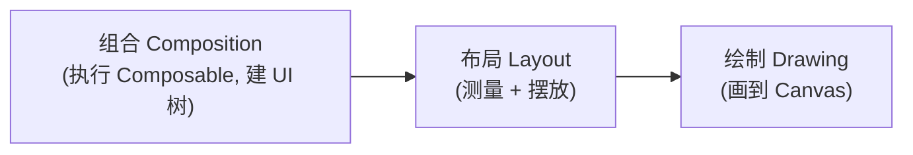

Compose 已经是 Android 面试的必考项。本文把社区高频出现的 Compose 面试题按板块整理成一份复习清单，**每道题先讲清原理，再附一段口语化的"面试这样答"**。重组机制和副作用 API 的深度原理，本站已有两篇专文（[Compose 与 XML 对比及重组机制详解](/posts/Jetpack-Compose-%E4%B8%8E-XML-%E5%AF%B9%E6%AF%94%E5%8F%8A%E9%87%8D%E7%BB%84%E6%9C%BA%E5%88%B6%E8%AF%A6%E8%A7%A3/)、[Compose Effect 全解析](/posts/Jetpack-Compose-%E4%B8%AD%E7%9A%84-Effect-%E5%85%A8%E8%A7%A3%E6%9E%90-%E6%8E%8C%E6%8F%A1%E5%89%AF%E4%BD%9C%E7%94%A8%E5%A4%84%E7%90%86%E7%9A%84%E4%B8%83%E7%A7%8D%E6%AD%A6%E5%99%A8/)），本文侧重"面试怎么问、怎么答"。

> 本文结论基于 Kotlin 2.x + Compose BOM 的当前环境。**Kotlin 2.0.20 起 Strong Skipping 已默认开启**，涉及"跳过重组"的题目要按新结论回答，这是 2025 年后面试的新考点。
{: .prompt-info }

## 一、基础概念

### 1. Compose 和 XML View 体系的本质区别是什么？

XML 是**命令式**：UI 状态散落在每个 View 内部，代码负责拿到 View 引用、手动把数据同步进去，状态一多同步路径就爆炸，漏一条就是 UI 不一致的 bug。

Compose 是**声明式**：核心公式 `UI = f(state)`。你不再"更新"界面，而是描述任意状态下界面应该长什么样，状态变了框架自动把 UI 刷成最新描述。此外两者的更新粒度也不同：View 体系的 `invalidate` 以 View 为单位；Compose 的重组以**读了这个状态的代码块**为单位，理论粒度更细。

> 💡 **面试这样答**：本质区别是命令式和声明式。XML 时代 UI 的真实状态存在每个 View 内部，我要负责把数据一条条同步进去；Compose 里 UI 就是状态的函数，我只描述"状态长什么样界面就长什么样"，同步工作交给框架的重组机制。好处是消灭了"忘了更新某个控件"这类不一致 bug，代价是需要理解重组、稳定性这套新模型。

### 2. @Composable 函数的本质是什么？加了这个注解编译器做了什么？

`@Composable` 不是普通注解，而是**改变函数类型**的注解（类似 `suspend`）。Compose 编译器插件会给每个 Composable 函数：

1. **注入 `$composer` 参数**：函数体内所有对状态的读取、对子 Composable 的调用都通过它记录到"槽表（SlotTable）"里；
2. **注入 `$changed` 参数**：位掩码，记录每个参数相对上次是否变化，是"跳过重组"的判断依据;
3. **插入分组（group）标记**：把函数体切成可以独立重启的重组作用域。

所以 Composable 函数只能在 Composable 上下文中调用——因为它需要 `$composer` 这个隐式参数。

> 💡 **面试这样答**：`@Composable` 和 `suspend` 很像，都是编译期改写函数签名。编译器会给函数偷偷加一个 `$composer` 参数和一个记录参数变化的 `$changed` 位掩码，函数执行过程其实是在往一棵槽表里"登记" UI 节点和状态读取关系。正因为有这个隐式参数，Composable 函数只能被 Composable 函数调用。重组时框架就靠 `$changed` 判断参数没变的函数直接跳过。

### 3. Compose 的三大阶段（Phases）是什么？

每一帧 Compose 经过三个阶段，对应 View 体系的 measure/layout/draw 但多了组合：



关键考点是**状态读取发生在哪个阶段，就只重跑那个阶段**。比如在 lambda 里读取偏移量（`Modifier.offset { }`）只触发布局阶段重跑，不触发重组；`graphicsLayer { }` 里读状态只重跑绘制。这是性能优化的重要手段（跳过组合阶段）。

> 💡 **面试这样答**：三个阶段是组合、布局、绘制。组合阶段执行 Composable 函数生成 UI 树，后两个阶段和传统 measure/draw 类似。Compose 会记录每个状态是在哪个阶段被读的，状态变化只重跑对应阶段。所以做动画或者跟手势的位移，要用 lambda 版的 `offset` 或 `graphicsLayer`，把状态读取推迟到布局/绘制阶段，避免每帧都重组。

## 二、状态管理

### 4. remember 和 rememberSaveable 的区别？

- `remember`：把计算结果存进组合的槽表，**跨重组**存活；但组合销毁（页面退出）或 **Activity 重建（旋转屏幕、进程被杀）就没了**。
- `rememberSaveable`：在 `remember` 基础上接入 `SavedInstanceState` 机制，**配置变更、进程重建后也能恢复**；要求值能存进 Bundle（基本类型/Parcelable，或自定义 `Saver`）。

> 💡 **面试这样答**：`remember` 解决的是"重组时值不被重置"，它存在组合内部，页面旋转就丢了；`rememberSaveable` 多做一步，把值写进 SavedInstanceState，所以配置变更甚至进程被杀重建都能恢复。选择上：纯 UI 瞬时状态用 remember，用户输入这类需要恢复的用 rememberSaveable，业务状态则应该提升到 ViewModel 里。

### 5. mutableStateOf 为什么能自动触发重组？（快照系统）

`mutableStateOf` 返回的 `MutableState` 是一个**可观察对象**，背后是 Compose 的**快照系统（Snapshot）**：

- **读**：组合阶段读取 `state.value` 时，快照系统会记录"当前重组作用域依赖了这个状态"（读观察者）；
- **写**：修改 `state.value` 时，快照系统通知所有依赖它的作用域**失效（invalidate）**，Recomposer 在下一帧调度这些作用域重新执行。

快照还提供了**隔离与原子性**：每个快照像一个"事务"，写入先发生在自己的快照里，`apply` 后才对其他快照可见，这也是 Compose 能在后台线程安全组合的基础。

> 💡 **面试这样答**：`mutableStateOf` 创建的是快照系统管理的可观察状态。读它的时候，Compose 把"谁读了我"记在快照的读观察者里，粒度是重组作用域；写它的时候快照系统把这些作用域标记失效，下一帧只重组失效的部分。快照本身类似数据库事务，读写隔离、apply 才生效，所以状态修改是线程安全的，Compose 也能据此做并行组合。

### 6. 什么是状态提升（State Hoisting）？为什么要做？

把子组件内部的状态挪到调用方，子组件退化为"**状态进（参数）、事件出（回调）**"的无状态组件：

```kotlin
// 提升前：有状态，外界无法控制/读取
@Composable
fun SearchBar() {
    var text by remember { mutableStateOf("") }
    TextField(value = text, onValueChange = { text = it })
}

// 提升后：无状态，可复用、可测试、单一数据源
@Composable
fun SearchBar(text: String, onTextChange: (String) -> Unit) {
    TextField(value = text, onValueChange = onTextChange)
}
```

价值：**单一数据源**（避免状态复制不同步）、可复用、可预览、易测试，也是**单向数据流（UDF）**的基础——状态从上往下流，事件从下往上传。

> 💡 **面试这样答**：状态提升就是把 state 从子组件挪到父级，子组件变成"参数进、回调出"的无状态组件。核心目的是单一数据源和单向数据流：状态只有一个持有者，往下流；事件往上传，由持有者统一修改。这样组件可复用可测试，状态不会在多个副本间失去同步。实际项目里屏幕级状态一般提升到 ViewModel，用 StateFlow 暴露，UI 层 `collectAsStateWithLifecycle` 收集。

### 7. derivedStateOf 的作用？和 remember(key) 有什么区别？

`derivedStateOf` 用来**从其他状态派生新状态，且只在"计算结果变化"时才触发重组**：

```kotlin
val listState = rememberLazyListState()
// firstVisibleItemIndex 每滚一项都变，但 showButton 只在跨过 0/非 0 边界时变
val showButton by remember {
    derivedStateOf { listState.firstVisibleItemIndex > 0 }
}
```

区别：`remember(key) { ... }` 是 **key 变了就重算**（在重组中同步进行）；`derivedStateOf` 是**源状态变了就重算，但结果不变就不通知重组**。判断口诀：**源变化频率远高于结果变化频率时，用 derivedStateOf**。

> 💡 **面试这样答**：`derivedStateOf` 做的是"降频"。比如滚动位置每帧都变，但"是否显示回到顶部按钮"只在边界处变一次，用它包起来后，只有结果真正变化才触发重组。而 `remember(key)` 只是缓存，key 一变就重算重组。所以判断标准是输入变化比输出频繁得多时用 derivedStateOf，否则用 remember(key) 就够了。

## 三、重组与性能

### 8. 什么是重组？重组的范围（作用域）怎么确定？

重组是**状态变化后，Compose 重新执行读取了该状态的 Composable 代码**的过程。范围不是整棵树，而是**最近的可重启作用域（Restartable Scope）**——通常就是读取该状态的那个非 inline Composable 函数体。

注意 `Row/Column/Box` 是 **inline 函数，不构成重组作用域**，在里面读状态会把失效范围放大到外层第一个非 inline 的 Composable。这也是"读状态尽量下沉到叶子组件"这条优化建议的原因。

> 💡 **面试这样答**：重组是状态变了以后重新执行相关 Composable。范围由"谁读了这个状态"决定，最小单位是可重启作用域，基本对应一个非 inline 的 Composable 函数。有个坑是 Row、Column 这些布局是 inline 的，不算作用域，在它们里面直接读状态会连累整个外层函数重组。所以优化时要么把读状态的代码抽成小组件，要么用 lambda 把读取推迟到布局/绘制阶段。

### 9. 什么是稳定性（Stability）？Strong Skipping 改变了什么？

重组到达一个 Composable 时，能否**跳过**它取决于参数比较。编译器把类型分为：

- **稳定（Stable）**：基本类型、String、函数类型、全 `val` 且属性都稳定的 data class，或标了 `@Stable`/`@Immutable` 的类。稳定参数用 `equals` 比较，没变就跳过。
- **不稳定（Unstable）**：有 `var` 属性、`List/Map/Set` 等接口类型（编译器无法保证实现不可变）、来自没接 Compose 编译器的模块的类。经典结论是"**参数不稳定 → 永不跳过**"。

**Strong Skipping（Kotlin 2.0.20 起默认开启）改变了这个结论**：不稳定参数改用**实例相等（===）**比较，同一个对象引用也能跳过；同时非 remember 的 lambda 会被自动记忆。所以现在"unstable 一定不跳过"已经过时，但**稳定性仍影响跳过命中率**（`equals` 相等但引用不同的新对象，仍会导致重组）。

> 💡 **面试这样答**：稳定性是编译器对"参数没变时能不能信任 equals 跳过重组"的推断。全 val 的 data class、加了 @Immutable 的类是稳定的，参数没变就跳过；带 var 或 List 这种接口类型是不稳定的。以前不稳定参数永远不跳过，但 Kotlin 2.0.20 之后 Strong Skipping 默认开了，不稳定参数改成比引用，同一个实例也能跳过，lambda 也自动 remember 了。所以现在做优化重点不再是见 List 就换 ImmutableList，而是先开重组统计看真有没有多余重组，再针对性处理。

### 10. Compose 性能优化有哪些实战手段？

面试常考"列表卡顿/重组风暴怎么排查优化"，可按这个清单答：

1. **先测量再优化**：Layout Inspector 看重组次数，开启 Composition Tracing / 编译器 metrics 报告定位不稳定类；
2. **缩小重组范围**：状态读取下沉到小组件；频繁变化的读取用 `Modifier.offset{}`/`graphicsLayer{}` 推迟到布局/绘制阶段；
3. **降频**：滚动位置、进度这类高频源用 `derivedStateOf`；
4. **Lazy 列表加 key**：`items(list, key = { it.id })`，让增删移动时复用而非全量重组，配合 `contentType` 提升复用率；
5. **别在组合中做重活**：组合阶段不做 IO/排序/格式化，重计算放 `remember` 或 ViewModel；
6. **释放版本验证**：R8 + baseline profile 后再评估，debug 包性能不代表线上。

> 💡 **面试这样答**：我的思路是先测量再动手。用 Layout Inspector 的重组计数和编译器的稳定性报告找到"谁在多余重组"。然后三板斧：一是缩小作用域，把读状态的代码抽成叶子组件，跟手的动画用 lambda 版 offset 跳过组合阶段；二是用 derivedStateOf 给高频状态降频；三是 LazyColumn 一定加稳定 key 和 contentType。另外注意 debug 包没有 R8 和 baseline profile，性能结论要拿 release 包验证。

## 四、副作用与生命周期

### 11. LaunchedEffect、DisposableEffect、SideEffect 的区别和使用场景？

| API | 时机 | 典型场景 |
|---|---|---|
| `LaunchedEffect(key)` | 进入组合时启动协程，key 变化时**取消重启**，离开组合时取消 | 请求数据、收集 Flow、播放动画、弹 Snackbar |
| `DisposableEffect(key)` | 进入组合/ key 变化时执行，**必须返回 onDispose** 做清理 | 注册/反注册监听器、生命周期观察者 |
| `SideEffect` | **每次成功重组后**都执行 | 把 Compose 状态同步给非 Compose 对象（如埋点、更新第三方 SDK） |

配套考点：`rememberCoroutineScope` 用于**用户事件回调里**手动启动协程（点击后滚动列表）；`rememberUpdatedState` 用于**长生命周期 Effect 里引用最新回调**而不重启 Effect。

> 💡 **面试这样答**：区分标准是生命周期和是否需要清理。LaunchedEffect 是"进入组合启动一个协程，key 变了取消重开，离开自动取消"，适合发请求收 Flow；DisposableEffect 强制返回 onDispose，适合注册监听这种必须成对反注册的；SideEffect 每次重组后都跑，用来把 Compose 状态同步给外部对象。另外点击事件里要用 rememberCoroutineScope 自己 launch，因为那是用户触发的，不该绑在组合生命周期上；Effect 里要引用最新的 lambda 但又不想重启，就用 rememberUpdatedState 包一层。

### 12. Composable 的生命周期是什么样的？怎么感知 Activity 生命周期？

Composable 生命周期只有三件事：**进入组合（Enter）→ 0 次或多次重组 → 离开组合（Leave）**。它和 Activity/Fragment 生命周期是两套体系。

感知宿主生命周期的标准做法：

```kotlin
val lifecycleOwner = LocalLifecycleOwner.current
DisposableEffect(lifecycleOwner) {
    val observer = LifecycleEventObserver { _, event ->
        if (event == Lifecycle.Event.ON_RESUME) { /* ... */ }
    }
    lifecycleOwner.lifecycle.addObserver(observer)
    onDispose { lifecycleOwner.lifecycle.removeObserver(observer) }
}
```

收集 Flow 时用 `collectAsStateWithLifecycle()`（它内部就是 `repeatOnLifecycle`），后台时自动停止收集，避免浪费。

> 💡 **面试这样答**：Composable 自己的生命周期很简单：进入组合、若干次重组、离开组合，用 LaunchedEffect 和 DisposableEffect 就能挂钩子。它和 Activity 生命周期是解耦的，需要感知时通过 LocalLifecycleOwner 拿到宿主 lifecycle，在 DisposableEffect 里注册观察者、onDispose 里反注册。日常最常见的场景是收集 Flow，直接用 collectAsStateWithLifecycle，它内部封装了 repeatOnLifecycle，页面到后台自动停流。

## 五、布局与列表

### 13. LazyColumn 的原理？和 RecyclerView 有什么区别？key 参数起什么作用？

`LazyColumn` 只**组合可见区域（加少量预取）内的 item**，滚出屏幕的 item 的组合会被销毁（节点可进入复用池）。与 RecyclerView 的区别：

- RecyclerView 复用的是 **View 对象**（ViewHolder 池），Compose "复用"的是**组合节点结构**，模型不同但目的都是省创建成本；
- 不需要 Adapter/DiffUtil，数据变化走重组 diff；
- `key` 的作用：默认按**位置**标识 item，插入/删除会导致后面所有 item 的状态错位、全量重组；提供稳定业务 key 后，Compose 能识别"是同一个 item 挪了位置"，保住 `remember` 状态并跳过内容未变的 item。

> 💡 **面试这样答**：LazyColumn 只组合可见的 item，滚出去的销毁，和 RecyclerView 目的一样但机制不同——RecyclerView 池化的是 View 对象，LazyColumn 是组合层面的懒创建，不需要 Adapter 和 DiffUtil。key 很关键：不加 key 时 item 按位置识别，头部插一条数据整个列表都认为自己变了，remember 的状态还会错位；加了稳定 key，框架能认出 item 只是移动，状态跟着走，内容没变的直接跳过，增删动画也是靠它。

### 14. Modifier 的原理？为什么顺序很重要？

Modifier 是一条**有序的装饰链**，每个元素包裹后面的元素。测量时约束从链头往链尾传，所以**顺序直接决定效果**：

```kotlin
// 先 padding 后 background：背景不含 padding 区域
Modifier.padding(16.dp).background(Color.Red)
// 先 background 后 padding：背景含 padding 区域
Modifier.background(Color.Red).padding(16.dp)
```

`clickable` 与 `padding` 的顺序同理，决定点击热区大小。实现上，Modifier 链会被折叠成 `Modifier.Node` 树挂在 LayoutNode 上（Compose 1.5+ 的 Node 体系，避免了旧版每次重组重建 Modifier 实例的开销）。

> 💡 **面试这样答**：Modifier 是个有序链，每一项包住后面的部分，测量约束从外往里传，所以顺序就是语义。经典例子是 padding 和 background 谁先谁后决定背景要不要覆盖留白，clickable 放 padding 前面点击区域就包含留白。另外自定义组件要把 `modifier: Modifier = Modifier` 作为第一个可选参数暴露出去，让调用方控制外部布局行为，这是官方 API 规范。

### 15. CompositionLocal 是什么？什么时候该用？

CompositionLocal 是**沿组合树隐式向下传值**的机制，解决"层层透传参数"的问题。`MaterialTheme` 的颜色、字体，`LocalContext`、`LocalLifecycleOwner` 都是它实现的。

- `compositionLocalOf`：值变化时，**只重组读取处**；
- `staticCompositionLocalOf`：值变化时重组整个 `provides` 范围，但读取无追踪开销，适合几乎不变的值（如主题对象、依赖容器）。

**慎用**：它是隐式依赖，滥用会让组件依赖不透明、难测试。适合"横切且几乎所有 UI 都要"的东西（主题、语言、密度），业务数据老老实实走参数。

> 💡 **面试这样答**：CompositionLocal 是组合树里的隐式参数通道，祖先 provides、后代 current 读取，MaterialTheme 和 LocalContext 都是这么实现的。两个变体：compositionLocalOf 值变了只重组读的地方，static 版本变了整段重组但读取零开销，所以主题这种基本不变的用 static。使用原则是只放横切关注点，业务数据不要塞进去，不然依赖关系变隐式，组件没法单独测试。

## 六、架构与互操作

### 16. Compose 中如何配合 ViewModel 实现单向数据流（UDF）？

标准结构：ViewModel 持有 `StateFlow<UiState>`（一个不可变 data class 表示整屏状态），UI 收集为 State；用户事件通过回调上传给 ViewModel 处理：

```kotlin
class ListViewModel : ViewModel() {
    private val _uiState = MutableStateFlow(ListUiState())
    val uiState: StateFlow<ListUiState> = _uiState.asStateFlow()

    fun onQueryChange(q: String) { _uiState.update { it.copy(query = q) } }
}

@Composable
fun ListScreen(vm: ListViewModel = viewModel()) {
    val state by vm.uiState.collectAsStateWithLifecycle()
    ListContent(state = state, onQueryChange = vm::onQueryChange)
}
```

一次性事件（弹 Toast、导航）建议**建模进 UiState**（消费后清除）而不是用 SharedFlow 发射，避免丢事件。

> 💡 **面试这样答**：我会做一个不可变的 UiState data class，ViewModel 用 StateFlow 暴露，UI 用 collectAsStateWithLifecycle 收集，事件通过方法回调上去，ViewModel 里 update + copy 改状态——状态下行、事件上行，形成闭环。Screen 层只负责收集和分发，真正的 UI 拆成接收纯参数的 Content 组件，方便预览和测试。一次性事件我倾向也放进 UiState 里消费后清除，比 SharedFlow 可靠。

### 17. Compose 和 View 如何互操作？迁移策略是什么？

双向都支持：

- **View 里嵌 Compose**：布局里放 `ComposeView`，`setContent { }`；注意在 RecyclerView 里要处理好 `ViewCompositionStrategy`；
- **Compose 里嵌 View**：`AndroidView(factory = { MapView(it) }, update = { ... })`，地图、WebView、广告 SDK 这类没有 Compose 版的组件靠它。

迁移策略：**自底向上、增量进行**——新页面直接 Compose，老页面从叶子组件开始替换；主题先用 `Material Theme Adapter` / 桥接方案统一，保证混排期间视觉一致。

> 💡 **面试这样答**：完全可以混用。View 树里放 ComposeView，Compose 里用 AndroidView 包 WebView、地图这些还没有 Compose 实现的控件。迁移我主张增量：新功能直接上 Compose，存量页面从叶子控件往上替换，而不是整页重写；先统一主题和设计 token，避免混排期两套观感。我们项目里（如果被追问）列表页是最先迁的，因为 LazyColumn 去掉 Adapter 样板代码收益最明显。

## 高频追问速查表

| 追问 | 一句话要点 |
|---|---|
| 重组是异步还是同步？ | 状态写入后标记失效，由 Recomposer 在下一帧统一调度，不是写入即重组 |
| Composable 会并行执行吗？ | 框架保留并行组合的能力，所以 Composable 必须无副作用、幂等 |
| 为什么 lambda 里读状态能省重组？ | 状态读取延迟到布局/绘制阶段，跳过了组合阶段 |
| List 参数一定要换 ImmutableList 吗？ | Strong Skipping 后不必然；先看重组统计，引用不变即可跳过 |
| remember 和 ViewModel 存状态怎么选？ | 瞬时 UI 状态 remember，需恢复的 rememberSaveable，业务/屏幕状态 ViewModel |
| LaunchedEffect(Unit) 有什么坑？ | key 永不变化，回调易过期，需配合 rememberUpdatedState |

## 参考资料

- [Jetpack Compose 官方性能最佳实践](https://developer.android.com/develop/ui/compose/performance/bestpractices)
- [Top 50 Jetpack Compose Interview Questions and Answers 2026 — Index.dev](https://www.index.dev/interview-questions/jetpack-compose)
- [Jetpack Compose Interview Questions — Outcome School (Amit Shekhar)](https://medium.com/outcomeschool/jetpack-compose-interview-questions-c3bd7f5d947f)
- [20 Jetpack Compose Interview Questions (2026) — SharpSkill](https://sharpskill.dev/en/blog/android/jetpack-compose-interview-questions)
- [A Deep Dive into Jetpack Compose Stability — Ahmed Nabil](https://ahmednmahran.medium.com/the-invisible-performance-killer-a-deep-dive-into-jetpack-compose-stability-236a810c16fb)
- [一篇长文，带你通透 Compose 的重组作用域和性能优化 — wanandroid](https://wanandroid.com/article/26994/detail)
