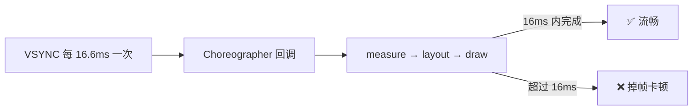

性能优化是 Android **中高级岗的必考题**，也是最能拉开区分度的一块——初级答"我用了 LeakCanary"，高级答"我怎么建立指标、定位瓶颈、验证收益、上线监控"。本文不堆零散技巧，而是把性能优化按**启动、内存、卡顿、包体积**四大方向做一次系统梳理，每个方向都回答四个问题：**衡量什么指标、问题常出在哪、有哪些优化手段、用什么工具**。

本站已有多篇相关专文，本文负责把它们串成体系，深入细节时会给出链接：[应用启动流程](/posts/Android应用启动流程分析/)、[内存泄漏案例](/posts/Android-Memmory-Leak/)、[ANR 定位与解决](/posts/Android进阶知识-ANR的定位与解决/)、[屏幕刷新机制](/posts/屏幕刷新机制/)、[Choreographer 详解](/posts/Choreographer详解/)、[RecyclerView 四级缓存](/posts/彻底搞懂RecyclerView四级缓存复用机制/)。

> **贯穿全文的第一原则：先测量，再优化。** 凭感觉优化（过早优化）往往做了无用功甚至帮倒忙。正确的闭环是：**建立指标 → 定位瓶颈 → 针对性优化 → 验证收益 → 上线监控**。下面每个方向都遵循这个思路。
{: .prompt-tip }

## 一、启动优化：让用户更快看到内容

### 衡量什么

启动分三种，优化重点是最慢的**冷启动**：

- **冷启动**：进程不存在，要新建进程、初始化 Application、再走 Activity 生命周期到首帧。最慢，是优化重点。
- **温启动 / 热启动**：进程还在，只是重建或切回 Activity，快得多。

关键指标：

- **TTID（Time To Initial Display）**：首帧显示时间，用户"看到界面"的耗时。
- **TTFD（Time To Full Display）**：完全可交互时间，调用 `reportFullyDrawn()` 上报。
- 命令行量：`adb shell am start -W 包名/Activity`，看 `TotalTime`。

### 冷启动都花在哪

进程创建是系统的事，我们能优化的主要是 **Application 初始化**、**首屏 Activity 与布局**（原理见 [应用启动流程](/posts/Android应用启动流程分析/)）。

### 优化手段

- **Application onCreate 瘦身**（收益最大）：很多卡顿来自一堆三方 SDK 在主线程同步 `init`。手段：
  - **异步初始化**：不影响首屏的 SDK 丢子线程；
  - **延迟初始化**：真正用到时再初始化，或用 `IdleHandler` 在主线程空闲时做；
  - **按需 / 分级初始化**：用 Jetpack **App Startup** 或自建启动器管理初始化依赖顺序。
- **避免主线程重活**：启动路径上杜绝主线程 I/O、反射、大 JSON 解析、读大 SharedPreferences（换 **MMKV / DataStore**）。
- **闪屏优化**：用 `windowBackground` 或 **SplashScreen API** 避免白屏/黑屏，让用户"感觉"更快。
- **首屏布局优化**：层级扁平化、`ViewStub` 延迟加载非首屏内容、异步 inflate。
- **Baseline Profiles（基线配置文件）**：现代重点。把启动路径上的热点代码提前 AOT 编译，实测能显著降低冷启动时间。

工具：`am start -W`、**Perfetto / Systrace**（看主线程时间线上的耗时块）。

## 二、内存优化：防 OOM，也防卡顿

内存问题有两个后果：**OOM 直接崩溃**，以及**频繁 GC 拖慢主线程造成卡顿**。所以内存和卡顿是连着的。

### 内存泄漏：最常见的元凶

泄漏 = 该被回收的对象被长生命周期对象一直引用着，回收不掉，越积越多。高频场景（详细案例见 [内存泄漏案例和解析](/posts/Android-Memmory-Leak/)）：

| 泄漏场景 | 原因 | 修法 |
|---|---|---|
| 静态变量持有 Activity / Context | 静态生命周期 = 进程级 | 用 `ApplicationContext`；或及时置空 |
| 单例持有 Activity Context | 单例活得比 Activity 久 | 传 `ApplicationContext` |
| 非静态内部类 / Handler | 隐式持有外部 Activity | 静态内部类 + 弱引用；`removeCallbacks` |
| 未注销监听 / 广播 / 观察者 | 注册了没反注册 | 在 `onDestroy` 反注册 |
| 资源未关闭 | Cursor、Bitmap、IO 流 | `use {}` 或 finally 关闭 |

### Bitmap：内存大户

一张图解码后可能占几十 MB。优化：

- **按需采样**：`inSampleSize` 按控件尺寸缩放，别把 4000×3000 的原图塞进 200×200 的 ImageView。
- **合适的色彩格式**：不需要透明通道时用 `RGB_565`（比 `ARGB_8888` 省一半）。
- **交给图片框架**：Glide / Coil 自带**复用池、尺寸适配、生命周期绑定**，几乎不用自己 recycle。

### 内存抖动与其他

- **内存抖动**：短时间频繁创建/销毁大量小对象（如 `onDraw`、列表 bind 里 new 对象）触发频繁 GC → 卡顿。修法：复用对象、别在高频回调里创建对象。
- **合适的数据结构**：`SparseArray` / `ArrayMap` 替代 `HashMap<Integer, X>`，避免自动装箱和额外开销。
- **缓存有度**：`LruCache` 设合理上限，别无限缓存。

工具：**LeakCanary**（自动抓泄漏）、**Android Studio Profiler - Memory**（看曲线、抓 Heap Dump）、**MAT** 分析引用链。

## 三、卡顿优化：守住每一帧的 16ms

### 为什么是 16ms

屏幕以固定刷新率刷新（60Hz 即每 **16.6ms** 一帧，90/120Hz 更短）。系统靠 **VSYNC 信号 + Choreographer** 驱动每一帧的 measure/layout/draw。**如果一帧的活没在 16ms 内干完，这一帧就"掉帧"**，画面卡顿（原理见 [屏幕刷新机制](/posts/屏幕刷新机制/) 与 [Choreographer 详解](/posts/Choreographer详解/)）。

### 卡顿的常见根因

- **主线程干重活**：I/O、网络、复杂计算、大 JSON 解析 → **移到子线程**。
- **布局问题**：层级太深、**过度绘制（overdraw）**（同一像素被反复画）→ 用 **ConstraintLayout 扁平化**、去掉多余背景、`merge`/`ViewStub`。
- **频繁 GC**：即内存抖动，见上一节。
- **列表卡顿**：`RecyclerView` 复用没用好、`onBindViewHolder` 里做重活 → 见 [RecyclerView 四级缓存](/posts/彻底搞懂RecyclerView四级缓存复用机制/)、`setHasFixedSize`、DiffUtil 局部刷新。

**ANR 是卡顿的极端**：主线程被卡超过阈值（输入 5s、广播前台 10s 等）就 ANR，定位方法见 [ANR 的定位与解决](/posts/Android进阶知识-ANR的定位与解决/)。

### 工具

- **Perfetto / Systrace**：看每帧时间线、哪个阶段超时。
- **GPU 呈现模式分析 / Layout Inspector**：看 overdraw 和层级。
- **线上监控**：用 `Choreographer.FrameCallback` 统计掉帧，或 `Looper` 的 `Printer` 监控主线程每条消息耗时，配合 APM 采集卡顿堆栈。

## 四、包体积优化：提升下载与安装转化

### APK 由什么组成

`classes.dex`（代码）+ `res/`（资源）+ `assets/` + `lib/`（native `.so`）+ `META-INF`。优化就是逐块瘦身。

### 优化手段

- **代码瘦身**：开启 **R8**（`minifyEnabled true` 混淆 + 去无用代码）与 **资源压缩**（`shrinkResources true`）；移除不用的三方库。
- **资源瘦身**：
  - 图片用 **WebP**、能矢量化的用 **VectorDrawable**；
  - `resConfigs` 只保留需要的语言和屏幕密度（如只留 `zh` + `xxhdpi`）；
  - Lint 清理无用资源、合并重复资源。
- **so 库瘦身**：按 ABI 拆分，通常只保留 `arm64-v8a`（+ 视情况 `armeabi-v7a`），别把 x86 一起打包。
- **App Bundle（AAB）**：上传 `.aab`，Google Play 按用户设备**只下发所需的密度、语言、ABI**，是当前官方推荐的体积优化方式。
- **动态化**：Dynamic Feature（按需下载功能模块）、资源/图片在线下发。

工具：**APK Analyzer**（看各部分占比，定位大头）。

## 五、总结：一张表 + 一套方法论

| 方向 | 核心指标 | 主要抓手 | 关键工具 |
|---|---|---|---|
| **启动** | 冷启动 TTID/TTFD | Application 瘦身、异步/延迟初始化、Baseline Profile | `am start -W`、Perfetto |
| **内存** | 泄漏、峰值、GC 频率 | 修泄漏、Bitmap 采样、防抖动 | LeakCanary、Profiler、MAT |
| **卡顿** | 掉帧率、帧耗时 | 主线程减负、布局扁平化、列表复用 | Perfetto、GPU 分析、APM |
| **包体积** | APK/AAB 大小 | R8+资源压缩、WebP、ABI 拆分、AAB | APK Analyzer |

> 💡 **贯穿所有方向的方法论**：**测量优先、抓大放小、上线监控**。先用工具找到真正的瓶颈（而不是凭感觉），优先解决占比最大的问题，优化后用同样的指标验证收益，最后接入线上 APM 持续监控——防止优化完又被新代码劣化。这套"闭环"思维，比任何单点技巧都更能体现资深水平。
{: .prompt-info }

## 六、面试话术（口语化背诵版）

### Q1：启动优化你会怎么做？

> 💡 **这样答**：先量化，用 `am start -W` 和 Perfetto 看冷启动时间和主线程时间线，找到耗时大头。最常见的大头是 Application onCreate 里一堆三方 SDK 同步初始化，我会把不影响首屏的改成异步或延迟初始化，用 App Startup 管理依赖顺序；同时杜绝启动路径上的主线程 I/O、反射、读大 SP。再配合闪屏用 SplashScreen API 避免白屏、首屏布局扁平化和 ViewStub 延迟加载。如果追求极致，还会上 Baseline Profile 把启动热点代码提前 AOT 编译。核心是先测量再针对性优化。

### Q2：内存泄漏怎么排查和解决？

> 💡 **这样答**：工具上主要用 LeakCanary 自动捕获泄漏、给出引用链，复杂的用 Profiler 抓 Heap Dump 再用 MAT 分析。常见泄漏就那几类：静态变量或单例持有了 Activity Context、非静态内部类和 Handler 隐式持有外部类、监听器广播注册了没反注册、Cursor/流没关。修法对应就是长生命周期场景用 ApplicationContext、Handler 用静态内部类加弱引用并及时 removeCallbacks、在 onDestroy 反注册、资源用 use 关闭。另外 Bitmap 是内存大头，要按控件尺寸采样、用合适的色彩格式，一般交给 Glide 这类框架管理。

### Q3：卡顿怎么定位和优化？为什么是 16ms？

> 💡 **这样答**：屏幕 60Hz 每 16.6ms 刷新一帧，系统靠 VSYNC 和 Choreographer 驱动每帧的 measure/layout/draw，一帧没在 16ms 内完成就掉帧、表现为卡顿。定位我用 Perfetto 看哪一帧、哪个阶段超时，用 GPU 呈现模式或 Layout Inspector 看过度绘制和层级。优化就是几条主线：主线程别干重活，I/O 计算移到子线程；布局扁平化、去 overdraw；避免内存抖动导致频繁 GC；列表用好 RecyclerView 的复用和局部刷新。卡顿的极端就是 ANR，主线程超时被系统判定无响应。

### Q4：包体积怎么优化？

> 💡 **这样答**：先用 APK Analyzer 看 dex、资源、so 各占多少，抓大头。代码上开 R8 混淆加去无用代码、开 shrinkResources 压资源、删没用的库；资源上图片用 WebP、能矢量的用 VectorDrawable、用 resConfigs 只保留需要的语言和密度；so 库按 ABI 拆分只留 arm64。最有效的是发布 App Bundle，让商店按用户设备只下发需要的部分。再进一步可以用动态特性模块按需下载、资源在线化。

### Q5：讲一个你实际做过的性能优化？

> 💡 **这样答（结构化模板）**：可以套"背景—测量—定位—优化—收益—监控"来讲：先说遇到什么问题（比如首页冷启动 3 秒被投诉），用什么工具量化（am start -W + Perfetto 发现 Application 初始化占 1.5 秒），定位到具体原因（几个统计 SDK 主线程同步 init），怎么改（异步化 + 延迟到首帧后），收益是多少（冷启动从 3 秒降到 1.8 秒），最后接了线上启动耗时监控防止劣化。**有数据、有闭环**，比罗列技巧更打动面试官。

> 💡 **收尾加分项**：可以拔高一句——"我理解性能优化不是一堆孤立技巧，而是一套工程闭环：**建指标、定瓶颈、做优化、验收益、上监控**。而且四个方向是互相关联的，比如内存抖动会引发卡顿、启动时的重初始化也会拉高内存峰值，所以要系统地看，而不是头痛医头。"
{: .prompt-tip }
