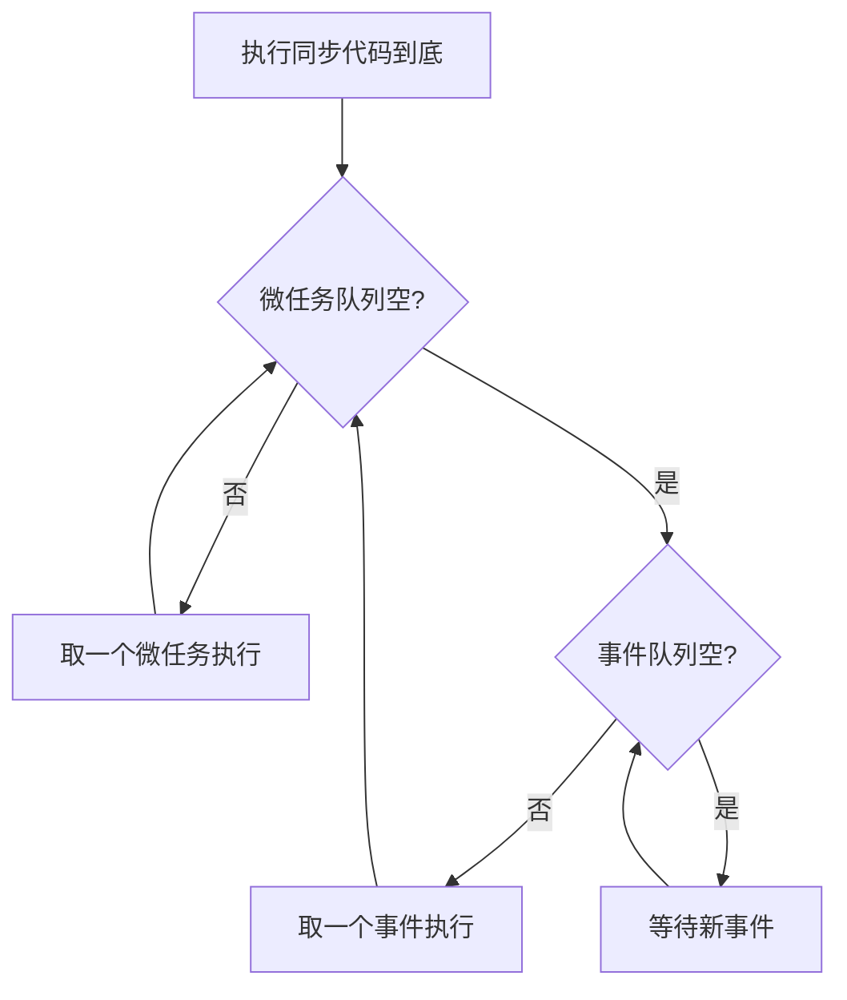
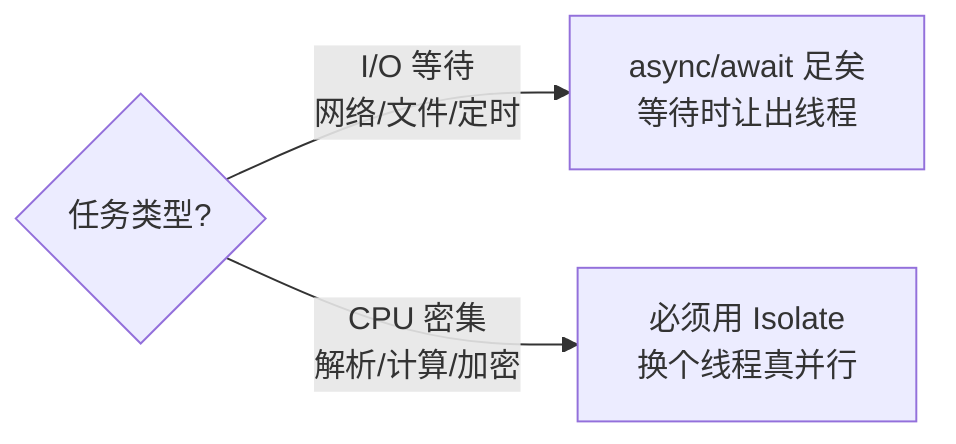
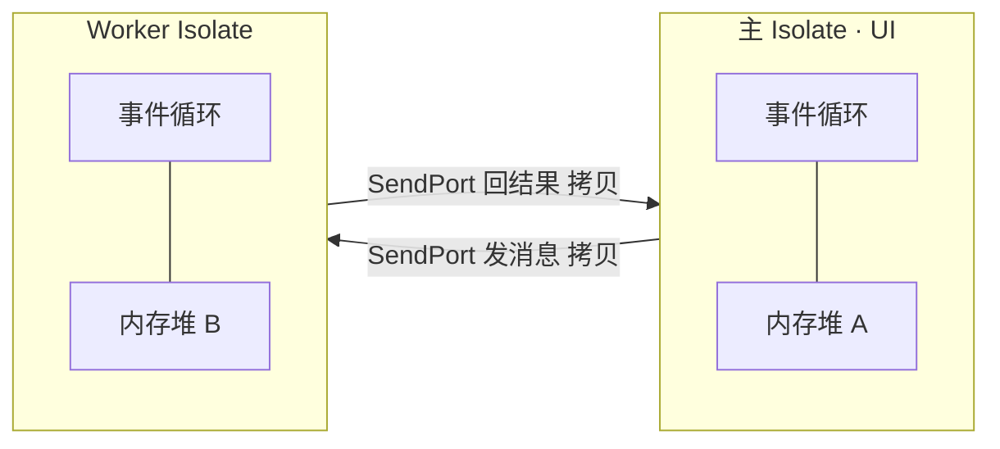

"Dart 是单线程的，为什么还能处理异步？""`async/await` 到底开没开新线程？""什么时候必须用 Isolate？"——这几个问题几乎是 Flutter 面试的必考题，也是很多人一直没彻底想通的地方。根源在于 Dart 用两套完全不同的机制处理并发：**事件循环**负责异步（并发但不并行），**Isolate** 负责真正的并行。这篇一次讲透。

> 关联阅读：Dart 主 isolate 就是 Flutter 的 UI 线程。为什么 CPU 密集计算会导致掉帧、掉帧发生在哪条线程，见[《Flutter 渲染管线：从 build 到上屏》](/posts/Flutter渲染管线从build到上屏详解/)。异步的另一半——Stream，见[《Flutter Stream 详解》](/posts/Flutter-Stream-详解/)。
{: .prompt-info }

## 先立三个结论

- **每个 Isolate 是单线程的**，内部有且只有一个事件循环。所谓"异步"不是多线程，而是**单线程上的任务调度**。
- **`async/await` 不开新线程**。它只是把函数在等待点切开、稍后接着执行，CPU 密集的活儿照样卡住这个线程。
- **Isolate 才是真并行**。它有独立的内存和事件循环，**不共享内存**，只能靠消息传递通信。

把这三条记住，后面全是展开。

## 一、单线程 + 事件循环

Dart 程序从 `main` 所在的**主 Isolate** 启动。这个 isolate 是单线程的，它跑一个永不停歇的事件循环，逻辑简化成一句话：

```dart
while (eventQueue.waitForEvent()) {
  eventQueue.processNextEvent();
}
```

但实际上有**两个**队列，优先级不同：**微任务队列（microtask queue）** 和 **事件队列（event queue）**。

调度规则是死的，记住就行：

1. 先把当前同步代码跑到底。
2. **清空整个微任务队列**（期间新产生的微任务也要一起清完）。
3. 从事件队列取**一个**事件处理。
4. 回到第 2 步：再次清空微任务队列，再取下一个事件……如此循环。



**核心：微任务优先级高于事件。** 只要微任务队列没清空，事件队列里的任务就得一直等着。这也意味着——如果你在微任务里不停地再塞微任务，事件队列会被"饿死"，UI 事件、定时器都得不到执行。

### 谁进哪个队列

| 进**微任务队列** | 进**事件队列** |
|---|---|
| `scheduleMicrotask(...)` | `Future(() => ...)`（构造函数） |
| `Future.microtask(...)` | `Future.delayed(...)` |
| 已完成 Future 的 `.then` 回调 | `Timer` 定时器 |
| `await` 后的续体（continuation） | I/O 完成、网络返回 |
| | 用户手势、屏幕刷新等 |

一句话概括：**微任务是"当前这轮马上要接着做的收尾工作"，事件是"下一轮才轮到的外部/延迟任务"。**

## 二、执行顺序实战：猜输出

把规则套到一段代码上，你就彻底懂了。先别看答案，自己排一下顺序：

```dart
void main() {
  print('1 同步');
  Future(() => print('2 事件队列'));            // → 事件队列
  Future.microtask(() => print('3 微任务'));     // → 微任务队列
  scheduleMicrotask(() => print('4 微任务'));    // → 微任务队列
  Future.value().then((_) => print('5 微任务 then')); // 已完成 → 微任务
  print('6 同步');
}
```

输出顺序是：

```console
1 同步
6 同步
3 微任务
4 微任务
5 微任务 then
2 事件队列
```

推导：

1. 同步代码先跑完——打印 `1`、`6`。中间那几个 `Future` 只是**登记任务**，没立刻执行。
2. 同步结束，清空微任务队列，按入队顺序：`3` → `4` → `5`。（`Future.value()` 是已完成的 future，它的 `.then` 直接排进微任务）
3. 微任务清空后，才处理事件队列里的 `2`。

> 只要能默写出这个顺序、并说清"为什么 5 在 2 前面"（微任务优先于事件），事件循环这道题就稳了。
{: .prompt-tip }

### await 的本质：切函数 + 续体入微任务

`await` 常被误解成"卡在这里等"。实际上编译器把 `await` **当成一个切割点**：`await` 之前的代码同步执行；遇到 `await`，函数**立即返回**（把控制权交还事件循环），等被 await 的 future 完成后，**后半段代码作为一个微任务被排回队列**继续执行。

```dart
Future<void> demo() async {
  print('A');            // 同步执行
  await Future(() {});   // 让出控制权，后半段变成续体
  print('B');            // future 完成后，作为微任务恢复执行
}
```

所以 `await` 不是"线程在那儿死等"，而是"我先让开，好了再叫我"。整个过程始终在**同一个线程**上。这就引出了下一个关键点。

## 三、async/await 不解决"卡顿"

既然 `await` 只是切函数、始终单线程，那么一段**纯 CPU 计算**（比如解析超大 JSON、图像处理、复杂加解密、递归斐波那契）即使写成 `async`，也**照样会阻塞事件循环**——因为它没有"等待点"可以让出，CPU 一直被它占着，微任务和事件都排不上，UI 就卡住掉帧。

```dart
// 反例：这样写并不能避免卡 UI
Future<int> heavy() async {
  return slowFib(45); // 一个同步的重计算，async 救不了它
}
```

**结论**：`async/await` 只对 **I/O 等待型** 任务有意义（网络、文件、定时器——这些"等"的时间里线程可以去干别的）；对 **CPU 密集型** 任务无能为力。后者要真并行，必须请出 Isolate。



## 四、Isolate：真正的并行

Isolate 是 Dart 的并行单元。和线程最大的不同是：**Isolate 之间不共享内存**。每个 isolate 有自己独立的内存堆和事件循环，彼此隔离，所以不需要锁，也就没有多线程里的数据竞争问题。

代价是：它们**只能通过消息传递通信**，且消息是**拷贝**过去的（`SendPort` / `ReceivePort`），不能直接传引用共享对象。



### 用法一：Isolate.run —— 一次性计算（首选）

从 Dart 2.19 起，`Isolate.run` 是把一段重计算丢到后台最简单的方式：传入一个函数，它在新 isolate 里跑，结果异步返回，全程不阻塞主 isolate。

```dart
int slowFib(int n) => n <= 1 ? 1 : slowFib(n - 1) + slowFib(n - 2);

Future<void> main() async {
  // 主 isolate 不被阻塞，UI 依旧流畅
  final result = await Isolate.run(() => slowFib(40));
  print('Fib(40) = $result');
}
```

大 JSON 解析同理，一行搞定：

```dart
final data = await Isolate.run(() => jsonDecode(bigJsonString));
```

### 用法二：Isolate.spawn —— 长期 worker

如果需要一个**长期存活、反复通信**的后台 isolate（比如持续处理一个任务流），就用 `Isolate.spawn` 手动搭端口：

```dart
Future<void> start() async {
  final receivePort = ReceivePort();
  receivePort.listen(_handleResponsesFromIsolate); // 监听 worker 回传
  await Isolate.spawn(_startRemoteIsolate, receivePort.sendPort);
}
```

`spawn` 需要自己管理 `SendPort`/`ReceivePort` 的双向握手，样板较多，但换来一个可长期复用的 worker。**大多数"算一次就好"的场景，用 `Isolate.run` 就够了。**

### 用法三：Flutter 的 compute

Flutter 早年提供的 `compute(fn, message)` 本质就是"spawn 一个 isolate 跑一次函数再回收"，是 `Isolate.run` 的前身：

```dart
final result = await compute(_parseJson, jsonString);
```

新代码优先用 `Isolate.run`（更通用、支持闭包捕获）；`compute` 仍可用，但要求入参函数是顶层或静态函数。

> 消息传递的限制：能跨 isolate 发送的对象类型有限（基本类型、List/Map、`SendPort`、`TransferableTypedData` 等），且默认是**深拷贝**，传大对象有序列化开销。所以 isolate 适合"传入小参数、内部算大数据、传出小结果"的场景；别指望用它共享一大坨可变对象。
{: .prompt-warning }

## 五、什么时候用 Isolate —— 决策清单

按顺序自问：

1. 这个任务是在**等**（网络/磁盘/定时），还是在**算**（CPU 占满）？
   - 在等 → `async/await` 即可，别上 isolate。
   - 在算 → 继续往下。
2. 这个计算会不会**明显阻塞一帧**（超过约 16ms）？
   - 会 → 用 `Isolate.run` 挪到后台。
   - 偶尔的小计算 → 未必值得，isolate 有启动和消息拷贝成本。
3. 是**算一次**还是**反复算**？
   - 一次 → `Isolate.run` / `compute`。
   - 反复、长期 → `Isolate.spawn` 建常驻 worker。

典型该上 isolate 的活：大 JSON/协议解析、图片编解码与滤镜、加解密与压缩、复杂算法（大规模排序、路径计算）、本地数据库大批量处理。

## 面试回答话术

**Q1：Dart 是单线程的，为什么能做异步？**

> "关键要区分并发和并行。Dart 每个 isolate 是单线程的，靠事件循环在这一个线程上做任务调度实现并发——不是同时执行，而是快速切换。事件循环维护两个队列，微任务队列和事件队列，规则是先跑完同步代码，然后清空整个微任务队列，再从事件队列取一个事件，之后每处理一个事件前都会再清空一次微任务队列。所以异步的本质是把任务拆成小块、排进队列轮流执行，而不是开线程。"

**Q2：微任务队列和事件队列有什么区别？谁优先？**

> "微任务优先级更高。只要微任务队列不空，事件队列就得等。哪些进微任务：scheduleMicrotask、Future.microtask、已完成 Future 的 then 回调、还有 await 之后的续体。哪些进事件队列：Future 构造函数、Future.delayed、Timer、I/O 完成、用户手势这些。一个要注意的坑是，如果在微任务里不断产生新的微任务，会把事件队列饿死，导致 UI 事件和渲染都得不到执行。"

**Q3：`async/await` 开新线程了吗？能解决卡顿吗？**

> "没开线程，全程还是同一个线程。await 的本质是把函数在等待点切开：await 前同步执行，遇到 await 就立即返回、让出控制权，等被 await 的 future 完成后，后半段作为一个微任务排回来继续执行。正因为始终单线程，async/await 只对 I/O 等待型任务有用——等的时候线程能去干别的。对 CPU 密集型任务它没用，一段重计算即使写成 async 也会占满线程、阻塞事件循环、卡住 UI，这种必须用 Isolate。"

**Q4：Isolate 和线程有什么区别？为什么它不需要加锁？**

> "最大区别是 Isolate 之间不共享内存。每个 isolate 有独立的内存堆和事件循环，完全隔离，所以天然没有数据竞争，也就不需要锁。代价是它们不能直接共享对象，只能通过 SendPort 和 ReceivePort 传消息，而且消息是深拷贝过去的。这套设计避免了传统多线程共享内存带来的一大类并发 bug，换来的是通信要走消息、传大对象有序列化开销。"

**Q5：实际项目里你怎么用 Isolate？`Isolate.run`、`spawn`、`compute` 怎么选？**

> "先判断任务是等还是算，只有 CPU 密集、会明显阻塞一帧的才上 isolate。算一次的场景我首选 Isolate.run，一行就能把函数丢到后台、异步拿结果，比如大 JSON 解析、图片处理、加解密。需要长期存活、反复通信的 worker 才用 Isolate.spawn，自己管端口。compute 是 Flutter 早期的写法，本质是 spawn 跑一次再回收，等价于 Isolate.run，新代码我更倾向用 Isolate.run，因为它更通用、还能捕获闭包。"

## 小结

- Dart 并发分两层：**事件循环**（单线程、并发不并行）负责异步；**Isolate**（独立内存、真并行）负责重计算。
- 事件循环两个队列，**微任务优先于事件**；同步跑完 → 清空微任务 → 取一个事件 → 再清微任务，循环往复。
- `async/await` 不开线程，只是"切函数 + 续体入微任务"，**只解决 I/O 等待，不解决 CPU 密集卡顿**。
- Isolate **不共享内存、靠消息拷贝通信**；一次性计算用 `Isolate.run`（首选），长期 worker 用 `Isolate.spawn`，`compute` 是 Flutter 的老写法。
- 判断口诀：**在"等"就用 async，在"算"且会卡帧就用 Isolate。**
