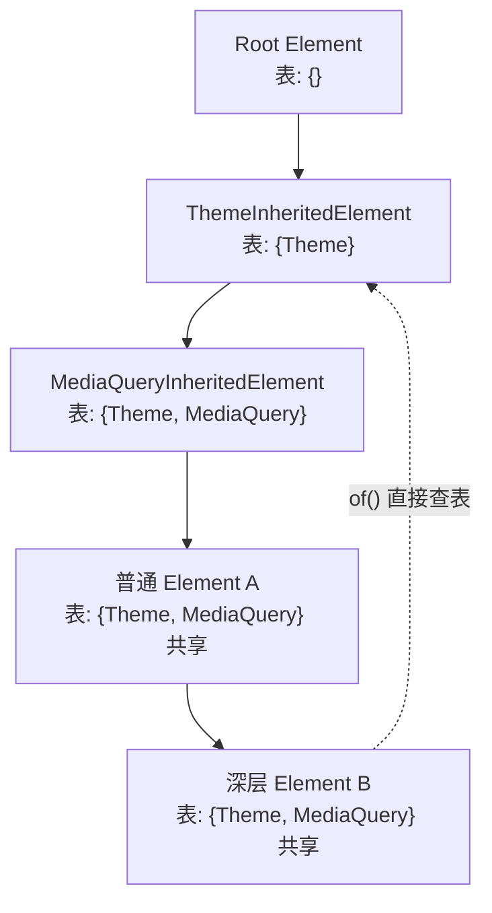
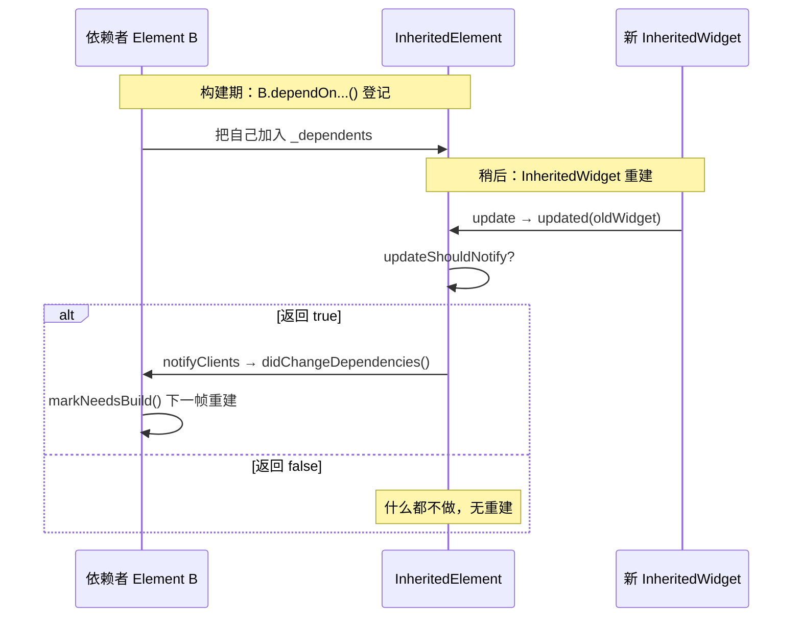
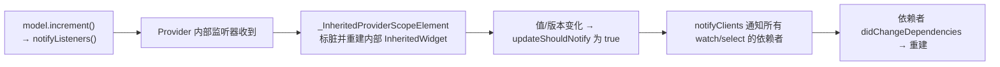
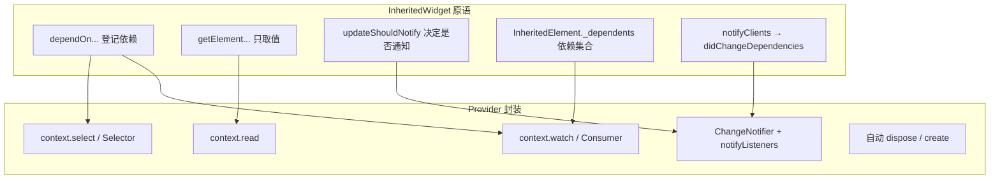

上一篇[《Flutter 状态管理横评》](/posts/Flutter状态管理横评Provider-Riverpod-Bloc-GetX/)里反复出现一句话：所有状态管理方案的地基都是 `InheritedWidget`。这一篇就把这块地基彻底挖开——先讲清 `InheritedWidget` 的原理（依赖登记、O(1) 查找、定向通知），再顺着它看 **Provider 到底做了什么封装**。看完你会发现，`context.watch`/`read`/`select` 这些 API 全都能对应到 `InheritedWidget` 的底层原语上，Provider 并不神秘。

> 前置：本文大量涉及 Element 层。如果对 Widget / Element / RenderObject 三棵树、`BuildContext` 本体是 Element 这些还不熟，建议先读[《Flutter 三棵树：Widget、Element、RenderObject 详解》](/posts/Flutter三棵树Widget-Element-RenderObject详解/)。
{: .prompt-info }

## InheritedWidget 解决什么问题

Flutter 的数据默认是**逐层通过构造函数向下传**的。当一个深层子 Widget 想拿到顶层的主题、路由、用户信息，如果靠构造函数一层层透传，中间每个 Widget 都要被迫加参数——这就是"逐层钻孔"（prop drilling）问题。

`InheritedWidget` 提供的能力是：**把数据"挂"在树的某个节点上，任意深度的后代都能以 O(1) 的代价直接取到，并在数据变化时被精准地通知重建。** 你平时用的 `Theme.of(context)`、`MediaQuery.of(context)`、`Navigator.of(context)`，底层全是 `InheritedWidget`。

## 三个关键 API

理解 `InheritedWidget` 只需抓住三个方法：

```dart
class MyInherited extends InheritedWidget {
  const MyInherited({required this.data, required super.child});
  final int data;

  // ① 后代通过这个静态方法拿到本组件（并登记依赖）
  static MyInherited? of(BuildContext context) {
    return context.dependOnInheritedWidgetOfExactType<MyInherited>();
  }

  // ② 数据变了要不要通知依赖者重建？由你决定
  @override
  bool updateShouldNotify(MyInherited oldWidget) => data != oldWidget.data;
}
```

- **`dependOnInheritedWidgetOfExactType<T>()`**：后代在自己的 `build` 里调用它，做两件事——**找到**最近的类型为 `T` 的 InheritedWidget 并返回，同时把当前 Element **登记为它的依赖者**。
- **`getElementForInheritedWidgetOfExactType<T>()`**：只**找**不**登记依赖**。拿到值但以后它变了不会通知你重建（这正是 `read` 的底层）。
- **`updateShouldNotify(oldWidget)`**：InheritedWidget 重建时被调用，返回 `true` 才通知依赖者。这是性能开关——数据没实质变化就返回 `false`，避免无谓重建。

## 原理一：O(1) 查找的秘密

很多人以为 `of(context)` 是从当前节点一路向上遍历祖先去找，那是 O(树高)。真相是 **O(1) 哈希查找**。

秘密在 Element 挂载时。每个 Element 都持有一张 `_inheritedElements` 表（`PersistentHashMap<Type, InheritedElement>`），记录了**从根到当前节点路径上所有 InheritedWidget**，按类型索引。这张表是父节点传给子节点的：

- 普通 Element 挂载时，直接复用父节点那张表（共享引用，不复制）。
- 如果自己就是个 InheritedElement，则在父表基础上**添加一份自己**，再往下传。



所以 `dependOnInheritedWidgetOfExactType<Theme>()` 本质就是 `_inheritedElements[Theme]` 一次哈希取值——不管树多深，都是常数时间。这也是为什么 `Theme.of(context)` 在任意深度调用都毫无性能压力。

## 原理二：依赖登记与定向通知

查找只是一半，另一半是"数据变了怎么精准通知"。这靠 InheritedElement 维护一份**依赖者集合**。

当 Element B 调用 `dependOnInheritedWidgetOfExactType<MyInherited>()` 时：

1. 从表里取到对应的 `InheritedElement`。
2. 调用它的 `updateDependencies`，把 **B 自己加进这个 InheritedElement 的 `_dependents` 集合**。
3. 返回 widget 值。

之后当 `MyInherited` 重建时，框架在 Element 层这样处理（简化）：

```dart
// InheritedElement.updated → 在 update 流程中被调用
void updated(InheritedWidget oldWidget) {
  if (widget.updateShouldNotify(oldWidget)) {
    notifyClients(oldWidget); // 只有需要通知时才走
  }
}

void notifyClients(InheritedWidget oldWidget) {
  for (final Element dependent in _dependents.keys) {
    // 通知每个登记过的依赖者
    dependent.didChangeDependencies();
  }
}
```

`didChangeDependencies()` 最终会 `markNeedsBuild()`，让每个依赖者在下一帧重建。



**关键洞察**：通知是**定向的**——只有真正 `dependOn` 过它的后代才会被重建，没依赖它的兄弟节点纹丝不动。这就是 InheritedWidget"高效精准刷新"的根源，也是它比"整棵子树 setState"强的地方。

> 面试高频点：为什么 `context.read`（不登记依赖）适合放在按钮回调里？因为回调只是想拿到对象去调方法，并不关心它以后变不变，登记依赖反而会让这个 Widget 无谓重建。`read` 走的正是"只找不登记"的 `getElementForInheritedWidgetOfExactType`。
{: .prompt-tip }

## InheritedWidget 的局限：为什么还需要 Provider

`InheritedWidget` 本身只是个**只读的数据传递管道**，直接拿来做状态管理有几处别扭：

1. **它是不可变的**。想管理"可变状态"，得自己在外面包一个 `StatefulWidget`，把 state 放 `State` 里，再用 InheritedWidget 暴露下去——样板一堆。
2. **`updateShouldNotify` 要手写**，容易写错（写反了、忘了比较某字段）。
3. **只能传数据，改数据要另想办法**（通常再传一个回调或 controller 下去）。
4. **没有生命周期管理**，比如一个 `ChangeNotifier` 用完谁来 `dispose`。

Provider 要做的，就是把这些脏活全部封装掉。

## Provider 的实现本质：一层"好用的"InheritedWidget

`Provider` 的核心是 `InheritedProvider`，它内部藏着一个真正的 InheritedWidget——`_InheritedProviderScope`（对应的 Element 是 `_InheritedProviderScopeElement`）。**你用的所有 Provider，本质都是把值塞进这个内部 InheritedWidget，再暴露一套更友好的 API。**

### API 到原语的一一对应

| Provider 用法 | 底层其实是 |
|---|---|
| `context.watch<T>()` | `dependOnInheritedWidgetOfExactType`（**登记依赖**，值变则重建） |
| `context.read<T>()` | `getElementForInheritedWidgetOfExactType`（**不登记**，只取值） |
| `context.select<T,R>(fn)` | 登记依赖，但只在**选出的切片 R 变化**时才重建 |
| `Provider.of<T>(context, listen: true)` | 等价于 `watch` |
| `Provider.of<T>(context, listen: false)` | 等价于 `read` |
| `Consumer<T>` | 在 builder 里帮你 `watch<T>()`，用于**缩小重建范围** |
| `Selector<T,R>` | 用 `select` 的逻辑，只在 R 变化时重建子树 |

看这张表就明白：**`watch` 和 `read` 的区别，根子上就是"登不登记依赖"这一个选择**——正是前面 InheritedWidget 那两个 API 的差异。Provider 只是给它们换了个顺手的名字。

### ChangeNotifierProvider：把 notifyListeners 接到重建上

`ChangeNotifierProvider` 是最常用的一个，它解决了"InheritedWidget 不可变"的问题。链路是这样的：

```dart
ChangeNotifierProvider(
  create: (_) => CounterModel(), // CounterModel extends ChangeNotifier
  child: const MyApp(),
);
```



拆解：

1. Provider 内部对你的 `ChangeNotifier` 添加了监听（`addListener`）。
2. 你调用 `notifyListeners()`，监听器被触发。
3. Provider 让内部的 `_InheritedProviderScopeElement` 标脏、重建那个内部 InheritedWidget，并让 `updateShouldNotify` 返回 `true`。
4. 于是走到前面讲的 `notifyClients` → 所有 `watch`/`select` 过它的 Widget 收到 `didChangeDependencies`，下一帧重建。
5. 当 Provider 被移出树，自动 `dispose` 掉这个 ChangeNotifier——生命周期管理也帮你做了。

一句话：**ChangeNotifierProvider = InheritedWidget 的定向通知 + ChangeNotifier 的可变状态 + 自动 dispose**，把手写 InheritedWidget 那四处别扭全补上了。

### Consumer 与 Selector：重建范围的手术刀

`Consumer<T>` 的本质极其简单——它就是个在 `builder` 内部帮你调 `context.watch<T>()` 的 Widget。价值在于**把订阅点下沉**：只有 `Consumer` 包住的那一小块进重建，外层不动。

```dart
Consumer<CounterModel>(
  builder: (context, model, child) => Text('${model.count}'),
  child: const ExpensiveStaticWidget(), // 这块不随 count 重建，通过 child 透传
)
```

`Selector<T,R>` 更进一步，对应 `select`：只有当你选出的那部分 `R` 发生变化时才重建，即使 `T` 里别的字段变了也不管——用于把重建范围压到最小。

```dart
// model 里 name 变了不会重建这里，只有 count 变才重建
Selector<CounterModel, int>(
  selector: (_, model) => model.count,
  builder: (_, count, __) => Text('$count'),
)
```

这两个都不是黑魔法，只是把"在哪登记依赖、登记多细的依赖"这件事包装成了更好用的 Widget。

## 从原语到 Provider：一张全景对照



## 面试回答话术

**Q1：InheritedWidget 的作用和原理是什么？**

> "InheritedWidget 解决的是跨层级共享数据的问题，避免逐层通过构造函数透传。原理上有两个关键点：第一，查找是 O(1) 的——每个 Element 挂载时会从父节点继承一张按类型索引的哈希表，记录了路径上所有 InheritedWidget，所以 `of(context)` 其实是一次哈希取值，跟树多深无关。第二，通知是定向的——后代调用 `dependOnInheritedWidgetOfExactType` 时会把自己登记进对应 InheritedElement 的依赖者集合，当这个 InheritedWidget 重建、且 `updateShouldNotify` 返回 true 时，框架只通知这些登记过的依赖者调用 `didChangeDependencies` 重建，没依赖它的节点完全不动。"

**Q2：`context.watch` 和 `context.read` 有什么区别？底层差在哪？**

> "watch 会订阅，值变化时当前 Widget 会重建；read 只取一次值，不订阅，之后变化不会触发重建。底层差异就一个：watch 走 `dependOnInheritedWidgetOfExactType`，会把自己登记为依赖者；read 走 `getElementForInheritedWidgetOfExactType`，只找不登记。所以按钮回调里想拿 model 调方法，应该用 read，否则这个 Widget 会因为登记了依赖而无谓重建。"

**Q3：既然有 InheritedWidget，为什么还需要 Provider？**

> "因为 InheritedWidget 本身只是个只读的数据管道，直接做状态管理有几处别扭：它不可变，想管理可变状态得自己包一层 StatefulWidget；`updateShouldNotify` 要手写容易出错；改数据得另传回调；还没有生命周期管理。Provider 就是把这些脏活封装掉——它内部其实还是一个 InheritedWidget，只是外面套了更友好的 API 和自动的 dispose。"

**Q4：ChangeNotifierProvider 是怎么把 `notifyListeners` 变成 UI 刷新的？**

> "Provider 内部对你的 ChangeNotifier 加了监听。当你 `notifyListeners`，Provider 就让内部那个 InheritedWidget 对应的 Element 标脏重建，并让 `updateShouldNotify` 返回 true，于是触发 InheritedElement 的 `notifyClients`，所有 watch 或 select 过它的 Widget 收到 `didChangeDependencies`，在下一帧重建。本质就是把 ChangeNotifier 的通知，转接到了 InheritedWidget 的定向通知机制上。而且 Provider 移出树时会自动 dispose 掉这个 notifier。"

**Q5：Consumer 和 Selector 的意义是什么？**

> "它们都是用来缩小重建范围的。Consumer 本质就是在 builder 里帮你 watch，好处是可以只把需要刷新的那一小块包起来，外层不重建，还能通过 child 参数把不变的子树透传出去避免重建。Selector 更进一步，只有你选出来的那部分数据变化时才重建，T 里别的字段变了都不管，用于把重建范围压到最小。两个都不是魔法，只是把'在哪登记依赖、登记多细'包装成了 Widget。"

## 小结

- `InheritedWidget` 两大原理：**O(1) 哈希查找**（Element 继承按类型索引的祖先表）+ **定向通知**（依赖者登记进 `_dependents`，`updateShouldNotify` 为真时 `notifyClients` 精准重建）。
- `dependOn...`（登记依赖）与 `getElement...`（只取值）的差异，正是 `watch` 与 `read` 的根子。
- `Provider` 不神秘：内部就是一个 `_InheritedProviderScope`（InheritedWidget），外加友好 API 与自动生命周期管理。
- `ChangeNotifierProvider` = **定向通知 + 可变状态 + 自动 dispose**；`Consumer`/`Selector` 是缩小重建范围的手术刀。
- 吃透这一篇，再回看[《Flutter 状态管理横评》](/posts/Flutter状态管理横评Provider-Riverpod-Bloc-GetX/)里 Riverpod、Bloc、GetX，会发现它们只是在这套地基上换了不同的"可监听对象"和封装取舍。
