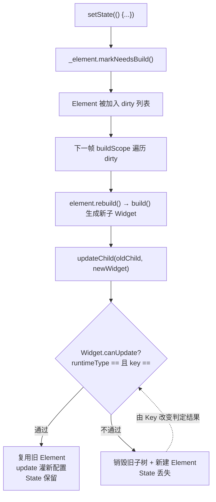
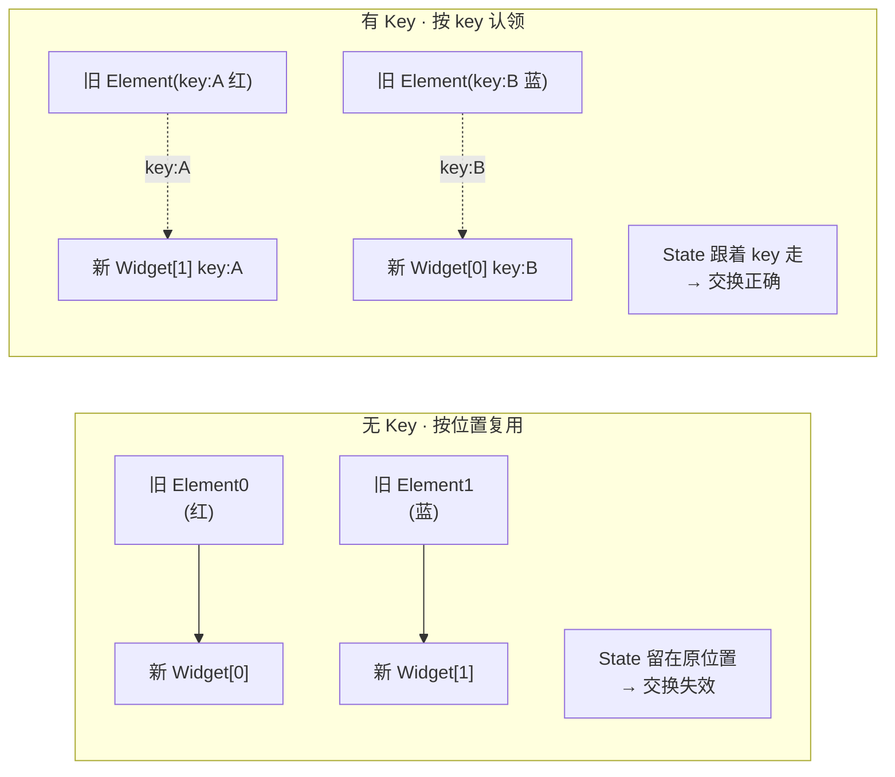
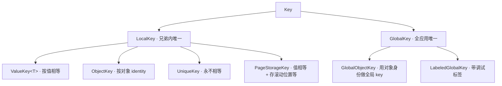

这是 Flutter 渲染原理系列的第三篇。前两篇《Flutter 三棵树：Widget、Element、RenderObject 详解》和《Flutter 渲染管线：从 build 到上屏》分别讲了**结构**和**流程**。这一篇聚焦一个每天都在用、却最容易踩坑的三角关系：**`setState` 触发了什么 → Element 如何决定复用还是重建 → `Key` 如何干预这个决定**。搞懂这条链，"交换列表项后状态错乱""动画莫名重来""输入框内容串位"这类经典 bug 就不再是玄学。

## 一张图看懂三者关系



一句话串起来：**`setState` 只负责标脏，真正决定"复用还是重建"的是 `canUpdate`，而 `Key` 是你唯一能插手 `canUpdate` 的把手。**

## 第一环：setState 到底做了什么

很多人以为 `setState` 会"刷新界面"，其实它做的事非常克制。看它的源码（简化）：

```dart
void setState(VoidCallback fn) {
  final Object? result = fn() as dynamic;
  assert(() {
    // fn 不能返回 Future，防止误用 async 回调
    if (result is Future) throw FlutterError('setState() callback ...');
    return true;
  }());
  _element!.markNeedsBuild(); // 关键就这一行
}
```

`fn()` 只是同步执行你传进去的那段修改状态的代码，然后调用 `markNeedsBuild()`。**它没有立刻 build，更没有渲染。**

`markNeedsBuild` 也很简单：把当前 Element 标记为 dirty，加进全局的脏 Element 列表，并请求下一帧。

```dart
void markNeedsBuild() {
  if (_lifecycleState != _ElementLifecycle.active) return;
  if (dirty) return;      // 已经脏了，不重复加
  _dirty = true;
  owner!.scheduleBuildFor(this); // 加入 dirty 列表 + scheduleFrame
}
```

由此推出几个重要结论：

- **`setState` 是同步标脏、异步生效**。真正的 build 发生在下一帧的 `buildScope` 里，所以一次事件里连续调用 N 次 `setState`，只会合并成一次重建。
- **`setState` 里别写耗时/异步逻辑**。它期望 `fn` 是一段同步的、纯粹改状态的代码；网络请求这类异步操作应在外面 `await` 完拿到结果，再用 `setState` 把结果写进去。
- **脏的粒度是 Element 级**。谁 `setState` 就标记谁那个 Element，重建从该节点开始向下，而不是整棵树。所以"把 `setState` 下沉到更小的 Widget"能显著缩小重建范围。

> 常见误区：`setState(() {})` 传空函数也能刷新——能，因为它照样会 `markNeedsBuild`。但这是坏味道：说明你在 `setState` 外面偷偷改了状态。状态变更应当写在 `fn` 里，语义才清晰。
{: .prompt-warning }

## 第二环：Element 如何更新——updateChild 五分支

下一帧，`buildScope` 遍历 dirty 列表，对每个脏 Element 调用 `rebuild → performRebuild → build()`，拿到新的子 Widget 后，交给 `updateChild` 决定子节点的命运。这是整条链的核心，五个分支（源码简化）：

```dart
Element? updateChild(Element? child, Widget? newWidget, Object? newSlot) {
  // ① 新配置为空 → 卸载旧孩子
  if (newWidget == null) {
    if (child != null) deactivateChild(child);
    return null;
  }

  Element newChild;
  if (child != null) {
    // ② 完全是同一个 Widget 实例（典型：const）→ 直接复用，连 update 都免了
    if (child.widget == newWidget) {
      if (child.slot != newSlot) updateSlotForChild(child, newSlot);
      newChild = child;
    }
    // ③ canUpdate 通过 → 复用旧 Element，灌入新配置
    else if (Widget.canUpdate(child.widget, newWidget)) {
      if (child.slot != newSlot) updateSlotForChild(child, newSlot);
      child.update(newWidget);
      newChild = child;
    }
    // ④ canUpdate 不通过 → 丢弃旧的（可能进 inactive 列表等待 GlobalKey 复活）
    else {
      deactivateChild(child);
      newChild = inflateWidget(newWidget, newSlot);
    }
  } else {
    // ⑤ 本来就没孩子 → 直接新建
    newChild = inflateWidget(newWidget, newSlot);
  }
  return newChild;
}
```

对照分支看行为，绝大多数"复用/重建"疑问都能自答：

| 场景 | 命中分支 | 结果 |
|---|---|---|
| 子 Widget 是 `const`，前后同一实例 | ② | 整棵子树 diff 短路，最省 |
| 类型 + key 都没变（只是属性变了） | ③ | 复用 Element，State 保留，RenderObject 复用 |
| 类型变了（`Container`→`Padding`） | ④ | 旧子树销毁重建，**State 丢失** |
| 同类型但 key 变了 | ④ | 同样销毁重建，**State 丢失** |
| 位置原来是空的 / 新增节点 | ⑤ | 新建 |

而 `canUpdate` 本身极其简单——正是它把复杂的 UI diff 收敛成两条判据：

```dart
static bool canUpdate(Widget oldWidget, Widget newWidget) {
  return oldWidget.runtimeType == newWidget.runtimeType
      && oldWidget.key == newWidget.key;
}
```

**类型相同 且 key 相等 → 认为是"同一个东西的新配置"，复用。否则重建。**

### 多子节点的更新：Row/Column 里的"配对"

单子节点好办，多子节点（`Row`、`Column`、`ListView` 的一屏）才是 Key 真正发光的地方。`updateChildren` 会把"旧 Element 列表"和"新 Widget 列表"做配对：先从两端向中间用 `canUpdate` 逐个匹配，中间无法顺序匹配的部分，则**用 key 建一张哈希表来跨位置认领**。

- 没有 key 时，匹配**只能按位置**（第 i 个旧的配第 i 个新的）。一旦顺序变化或中间增删，位置对不上，就会大面积走分支 ④ 重建。
- 有 key 时，即使位置变了，也能靠 key 在哈希表里找到"原来的自己"，走分支 ③ 复用。

这正是下一环的主题。

## 第三环：Key 如何改变判定结果

`Key` 是你唯一能塞进 `canUpdate` 的变量。它的价值只在一个场景凸显：**同层、多个同类型、且各自持有状态、且顺序会变**。缺任何一个条件，Key 通常都不必要。

### 经典翻车现场：交换两个有状态的色块

```dart
class ColorBox extends StatefulWidget {
  const ColorBox({super.key});
  @override
  State<ColorBox> createState() => _ColorBoxState();
}

class _ColorBoxState extends State<ColorBox> {
  // 颜色是 State，随机生成后存在这里
  final Color color = _randomColor();
  @override
  Widget build(BuildContext c) => Container(width: 80, height: 80, color: color);
}
```

现在把两个 `ColorBox` 放进 `Row`，点击按钮交换它们的顺序：

```dart
// 没有 Key
Row(children: _boxes); // _boxes = [ColorBox(), ColorBox()]，交换后 [ColorBox(), ColorBox()]
```

**现象：颜色纹丝不动，交换像没生效。** 因为两个 Widget 类型相同、key 都是 null，`canUpdate` 恒为 true，Element 严格按位置复用：位置 0 的 Element（连同它的 `_ColorBoxState` 和颜色）永远待在位置 0。你换的只是两个廉价的 Widget 壳，State 没跟着走。

加上 key，一切正常：

```dart
// 有 Key
[ColorBox(key: ValueKey('A')), ColorBox(key: ValueKey('B'))]
// 交换后 [ColorBox(key: ValueKey('B')), ColorBox(key: ValueKey('A'))]
```

**现象：颜色跟着交换。** 因为多子节点更新时会用 key 认领，带 `ValueKey('A')` 的新 Widget 会找到原来那个持有 A 颜色的 Element 去复用，State 就跟着 key 走对了位置。



### 反向陷阱：不该加 Key 却加了 UniqueKey

Key 用错方向同样出事。如果你在**每次 build 都给同一个节点生成一个新的 `UniqueKey`**：

```dart
// 反例：每帧 key 都不一样
TextField(key: UniqueKey())
```

那么每次重建时 `canUpdate` 因 key 不等而恒为 false，Element 每帧都被销毁重建——`TextField` 的输入内容、焦点、滚动位置全丢，还白白浪费重建开销。**记住：想复用就要让 key 在多次 build 间保持稳定；`UniqueKey` 是"强制不复用"的工具，只在你确实想重置状态时用。**

## Key 家族速查

Flutter 的 Key 分成两大类：`LocalKey`（只在兄弟间比较，用于 `canUpdate`）和 `GlobalKey`（全局唯一，能跨树定位）。



| Key | 相等判据 | 典型用途 |
|---|---|---|
| `ValueKey<T>` | 值 `==` 相等 | 列表项用业务 id：`ValueKey(item.id)` |
| `ObjectKey` | 对象 identity（`identical`） | 值可能重复、但对象唯一时 |
| `UniqueKey` | 永不相等 | 强制重建/重置状态 |
| `PageStorageKey` | 同 ValueKey，额外持久化滚动位置等 | 多 Tab/多列表保留滚动位置 |
| `GlobalKey` | 全局唯一实例 | 跨树拿 State/Context/RenderObject |

### LocalKey：绝大多数场景够用

给列表项加 key，几乎总是首选 `ValueKey(唯一业务 id)`：

```dart
ListView(
  children: users.map((u) => UserTile(key: ValueKey(u.id), user: u)).toList(),
)
```

不要用列表下标 `ValueKey(index)` 当 key——一旦插入/删除/排序，下标会整体位移，等于没加 key 甚至更糟。key 要绑定**数据的身份**，不是它当前的位置。

### GlobalKey：强大但昂贵

`GlobalKey` 是另一个维度的东西。它全局唯一，让你能在树外拿到一个节点的实体：

```dart
final _formKey = GlobalKey<FormState>();
// ...
Form(key: _formKey, child: ...);
// 之后任意地方：
_formKey.currentState?.validate();   // 拿到 State
_formKey.currentContext;             // 拿到 BuildContext
_formKey.currentWidget;              // 拿到 Widget
```

它还有一个隐藏能力：**跨位置迁移 Element 而不丢状态**。当一个带 GlobalKey 的 Widget 从树的一个位置"移动"到另一个位置时，旧 Element 会先进 inactive 列表，新位置能靠 GlobalKey 把它"复活"过来，State/RenderObject 完整保留——这是 `Hero` 动画等特性的底层机制之一。

代价也实打实，别滥用：

- 每个 GlobalKey 要在全局表里注册/注销，有额外开销。
- **同一时刻一个 GlobalKey 只能挂在一个 Element 上**。把同一个 GlobalKey 同时用在两处，会抛 "Multiple widgets used the same GlobalKey" 异常。
- 拿到 `currentState` 是命令式操作，容易破坏声明式的数据流。能用 `Provider`/回调/状态提升解决的，就别为了拿 State 而上 GlobalKey。

> 选型口诀：**列表复用用 `ValueKey(业务id)`；只是想强制重置状态用 `UniqueKey`；要在树外命令式地拿 `State`/触发方法才用 `GlobalKey`。** 大多数日常代码根本不需要 Key。
{: .prompt-tip }

## 什么时候需要 Key —— 决策清单

按顺序自问，命中"否"就不用加 Key：

1. 这些节点是**同一父节点下的兄弟**吗？（Key 只在兄弟间比较）
2. 它们**类型相同**吗？（不同类型 `canUpdate` 已经会重建）
3. 它们各自**持有状态**（`StatefulWidget` 或内部有动画/输入）吗？（无状态节点重建无所谓）
4. 它们的**相对顺序/数量会动态变化**（排序、插入、删除、筛选）吗？

四条全"是"→ 该加 Key，用 `ValueKey(业务id)`。只要有一条"否"，通常都不必加。

## 面试回答话术

把这条链拆成一问一答，每段都可以直接开口复述。

**Q1：`setState` 调用后发生了什么？会立刻刷新界面吗？**

> "不会立刻刷新。`setState` 只做两件事：先同步执行你传进去的那段改状态的代码，然后调用 `markNeedsBuild` 把当前 Element 标脏、加进 dirty 列表并请求下一帧。真正的 build 和渲染发生在下一帧的 buildScope 里。所以一次事件里连续多次 setState 会被合并成一帧，也正因为它期望同步执行，setState 里不该写异步或耗时逻辑——异步结果应该在外面 await 完再用 setState 写回去。"

**Q2：Element 是怎么决定复用还是重建的？**

> "核心在 Element 的 `updateChild`，我一般会讲它的几个分支：新配置为空就卸载；如果新旧是同一个 Widget 实例（比如 const）就直接复用、连 update 都免；否则看 `canUpdate`——它只比较两样东西，runtimeType 和 key，两者都相等就复用旧 Element、把新配置灌进去，State 和 RenderObject 都保留；不相等就销毁旧子树、新建，State 会丢。所以类型变了、或者 key 变了，都会触发重建。"

**Q3：Key 到底解决什么问题？举个例子。**

> "Key 是唯一能塞进 canUpdate 的变量。经典例子是 Row 里放两个有状态的色块，颜色存在各自的 State 里，点按钮交换顺序。不加 key 时，两个 Widget 类型相同、key 都是 null，Element 严格按位置复用，State 留在原位，所以颜色纹丝不动、交换像没生效。加上 ValueKey 后，多子节点更新会用 key 认领，State 就跟着 key 走到正确的位置，交换才正常。本质是：没 key 只能按位置匹配，有 key 能按身份跨位置匹配。"

**Q4：列表项的 key 应该用什么？用下标行不行？**

> "应该用绑定数据身份的值，比如 `ValueKey(item.id)`。不能用列表下标当 key，因为一旦插入、删除或排序，下标会整体位移，等于 key 没起到区分身份的作用，甚至比不加还糟。key 要标识'这是哪条数据'，而不是'它现在排第几'。"

**Q5：ValueKey、UniqueKey、GlobalKey 有什么区别？**

> "ValueKey 按值相等判断，是列表复用最常用的；UniqueKey 每次都不相等，是'强制不复用、重置状态'的工具，只在你确实想重建时用，千万别在每次 build 里给同一个节点 new 一个 UniqueKey，那会导致输入框内容、焦点每帧都丢。GlobalKey 是另一个维度的，它全局唯一，能让你在树外拿到某个节点的 State、Context 或 RenderObject，比如 `GlobalKey<FormState>` 去调 validate，还能跨位置迁移 Element 不丢状态。但它有注册开销、同一时刻只能挂一处，能用状态提升或 Provider 解决的就别用它。"

**Q6：什么时候需要加 Key，什么时候不用？**

> "我有个四条判断：这些节点是不是同父的兄弟、类型是否相同、是否各自持有状态、顺序或数量是否会动态变化。四条全中才需要加，用 ValueKey 绑业务 id。只要有一条不满足——比如是静态布局、单子节点、或者本来就无状态——通常都不用加。大多数日常代码其实并不需要 Key。"

## 小结

- `setState` 只是**同步改状态 + `markNeedsBuild` 标脏**，异步生效、按帧合并、粒度是 Element；不要在里面写异步逻辑。
- Element 的 `updateChild` 五分支决定复用还是重建，裁判是 `canUpdate`——**类型相同且 key 相等才复用**。
- `Key` 是你唯一能干预 `canUpdate` 的把手，只在"同父、同类型、有状态、顺序会变"时才需要，列表项首选 `ValueKey(业务id)`。
- `UniqueKey` 是强制重建的工具，`GlobalKey` 是跨树命令式拿 State 的重武器，都别滥用。
- 结合前两篇《Flutter 三棵树》《Flutter 渲染管线》一起看，Flutter 的"重建—复用—渲染"闭环就完整了。
