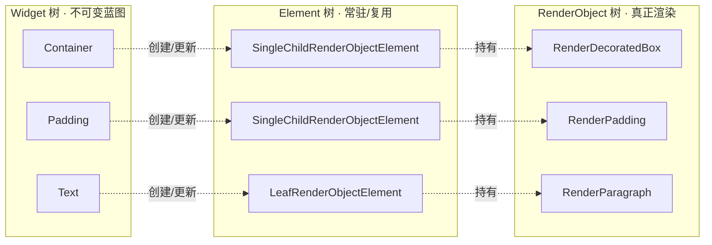
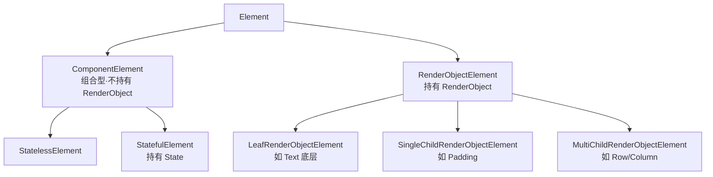
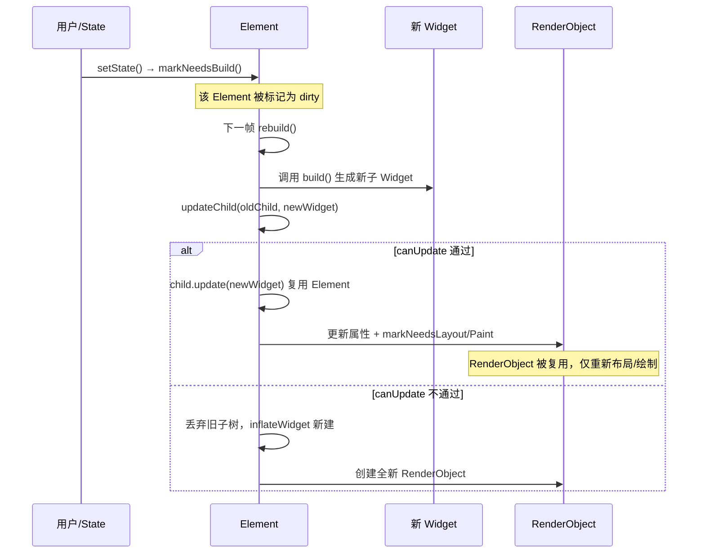

写 Flutter 时你天天在写 `Widget`，但真正把像素画到屏幕上的并不是它。Flutter 的 UI 由**三棵并行的树**协作完成：`Widget` 树、`Element` 树、`RenderObject` 树。理解这三棵树各自的职责与协作方式，是搞懂 Flutter 重建、性能优化、`Key` 用法乃至各种"玄学 bug"的根基。

本文只讲结构与协作机制；从一帧的完整生命周期（build → layout → paint → 上屏）视角看渲染，见姊妹篇《Flutter 渲染管线：从 build 到上屏》。

## 一句话概括三棵树

| 树 | 是什么 | 生命周期 | 类比 |
|---|---|---|---|
| Widget | UI 的**不可变配置**（蓝图） | 极短，每帧可被大量重建 | 建筑图纸 |
| Element | Widget 的**实例化节点**，维护树结构与状态 | 长，尽量复用 | 施工队/现场协调 |
| RenderObject | 真正负责**布局、绘制、命中测试** | 长，跟随 Element | 盖好的房子 |

核心关系：**Widget 描述"想要什么"，Element 决定"复用还是重建"，RenderObject 负责"真的画出来"**。Widget 廉价可抛，Element 和 RenderObject 昂贵要复用。



> 注意：**不是每个 Widget 都对应一个 RenderObject**。`StatelessWidget`、`StatefulWidget` 是"组合型"Widget，它们只负责 `build` 出别的 Widget，其 Element 不持有 RenderObject。只有 `RenderObjectWidget`（如 `Padding`、`Opacity`、`RichText` 底层）才会创建 RenderObject。所以真实的 RenderObject 树往往比 Widget 树"矮"很多。
{: .prompt-info }

## 第一棵树：Widget —— 不可变的配置

Widget 的本质是一份**不可变的配置描述**。它的字段全是 `final`，构造出来就不能改。

```dart
@immutable
abstract class Widget {
  const Widget({this.key});
  final Key? key;

  // 关键：Widget 自己会创建对应的 Element
  Element createElement();

  // 关键：判断两个 Widget 能否用于"更新"同一个 Element
  static bool canUpdate(Widget oldWidget, Widget newWidget) {
    return oldWidget.runtimeType == newWidget.runtimeType
        && oldWidget.key == newWidget.key;
  }
}
```

两个设计要点，决定了 Flutter 的整套心智模型：

1. **Widget 是一次性的、廉价的**。`setState` 之后整个 `build` 方法重跑，会 new 出一大堆全新的 Widget 对象——这很正常，因为 Widget 只是轻量配置，创建成本极低。真正昂贵的 Element / RenderObject 并不会跟着重建。
2. **`canUpdate` 是复用的裁判**。当新旧 Widget 的 `runtimeType` 相同且 `key` 相等时，Flutter 认为"还是同一个东西，只是配置变了"，于是**复用**原来的 Element，只把新配置灌进去；否则丢弃旧 Element 子树、重建新的。这条规则是理解 `Key` 的钥匙。

> 常见误区：以为"重建 Widget = 重新渲染整个界面 = 卡"。恰恰相反，重建 Widget 只是重新生成配置对象，Flutter 会拿新配置去和旧 Element 做 diff，能复用就复用。这正是 `const` 构造函数能优化性能的原因——`const` Widget 是编译期常量，重建时引用不变，diff 阶段直接跳过。
{: .prompt-tip }

## 第二棵树：Element —— 承上启下的中枢

Element 是三棵树里最"沉默"但最关键的一棵。你几乎从不直接写 Element，但它做了所有脏活：

- **维护真正的树形结构**：父子关系、遍历、挂载/卸载，都在 Element 层完成。
- **持有 Widget 与 RenderObject 的引用**，充当两者的桥梁。
- **管理状态**：`StatefulWidget` 的 `State` 对象其实挂在 `StatefulElement` 上，这正是"重建 Widget 而状态不丢"的原因。
- **就是 `BuildContext`**：你在 `build(BuildContext context)` 里拿到的 `context`，本体就是当前的 Element。

```dart
abstract class Element implements BuildContext {
  Widget? _widget;          // 当前配置
  Element? _parent;         // 树结构在 Element 层
  RenderObject? get renderObject; // 关联的渲染对象（若有）

  // 挂载：首次插入树
  void mount(Element? parent, Object? newSlot) { ... }

  // 更新：拿新 Widget 更新自己（复用路径）
  void update(covariant Widget newWidget) { _widget = newWidget; }

  // 卸载：从树上移除
  void unmount() { ... }
}
```

### Element 的三种主要子类



- `StatelessElement` / `StatefulElement`：对应组合型 Widget，`build` 出子 Widget，不碰渲染。
- `StatefulElement` 额外持有 `State`：`createElement` 时调用 `widget.createState()` 生成 State，并把它挂在自己身上。**State 属于 Element，不属于 Widget**——所以 Widget 每帧重建，State 依然健在。
- `RenderObjectElement` 家族：负责创建/更新 RenderObject，并把子 Element 的 RenderObject 挂到自己的 RenderObject 上（`insertRenderObjectChild` 等）。

### updateChild：整套 diff 的心脏

Element 每次重建时，都要处理"我的孩子该怎么办"，核心就是这个方法（逻辑简化）：

```dart
Element? updateChild(Element? child, Widget? newWidget, Object? newSlot) {
  // 1. 新配置为空 → 卸载旧孩子
  if (newWidget == null) {
    if (child != null) deactivateChild(child);
    return null;
  }

  if (child != null) {
    // 2. 同一个 Widget 实例（比如 const）→ 直接复用，连 update 都省了
    if (child.widget == newWidget) {
      return child;
    }
    // 3. canUpdate 通过 → 复用旧 Element，灌入新配置
    if (Widget.canUpdate(child.widget, newWidget)) {
      child.update(newWidget);
      return child;
    }
    // 4. canUpdate 不通过 → 丢弃旧的
    deactivateChild(child);
  }

  // 5. 新建 Element 并挂载
  return inflateWidget(newWidget, newSlot);
}
```

把这五个分支记牢，Flutter 里绝大多数"重建/复用"行为都能推导出来：

- 类型和 key 都没变 → 走分支 3，**原地更新，RenderObject 复用**，性能最好。
- 类型变了（比如 `Container` 换成 `Padding`）→ 走分支 4+5，**旧子树整个销毁重建**，State 丢失、动画重来。
- `const` 的子 Widget → 走分支 2，连 `update` 都跳过。

## 第三棵树：RenderObject —— 真正干活的那棵

RenderObject 才是把 UI 变成像素的地方。它负责三件事：**布局（layout）**、**绘制（paint）**、**命中测试（hit test）**。

```dart
abstract class RenderObject {
  // 布局：接收父级约束，确定自己的尺寸
  void layout(Constraints constraints, {bool parentUsesSize = false});
  void performLayout();

  // 绘制：把自己画到 canvas 上
  void paint(PaintingContext context, Offset offset);

  // 标脏：请求下一帧重新布局/绘制
  void markNeedsLayout();
  void markNeedsPaint();
}
```

日常最常打交道的是 `RenderBox`（笛卡尔坐标系下的盒模型），它遵循 Flutter 的核心布局协议：**约束沿树向下传递，尺寸沿树向上返回，父级决定子级位置**（Constraints go down, Sizes go up, Parent sets position）。这套协议的完整展开放在渲染管线那篇里讲。

这里只需记住定位：**RenderObject 昂贵且有状态**（缓存了布局结果、绘制层等），所以 Flutter 竭尽全力复用它。你写 Widget 时的每一次 `canUpdate` 命中，省下的就是重建 RenderObject 的开销。

## 三棵树如何协同：从 setState 到复用

把上面拼起来，看一次 `setState` 到底发生了什么：



关键结论：

1. `setState` 只把当前 Element 标记为 dirty，**不会**重建整棵树，更不会立刻重画。
2. 重建发生在 Widget 层，是廉价的对象创建。
3. Element 层用 `canUpdate` 做 diff，尽量原地更新。
4. RenderObject 只有在确实需要时才被标脏、重新 layout/paint。

## Key 的本质：干预复用判定

理解了 `canUpdate`，`Key` 就不再玄学。`canUpdate` 比较两样东西：`runtimeType` 和 `key`。当同层有**多个同类型 Widget**、且它们的相对顺序会变时，光靠类型无法区分谁是谁，Element 就可能"张冠李戴"地复用错对象——典型症状：交换列表项后，颜色/动画/输入框内容错乱。

经典例子：两个有状态的色块交换位置。

```dart
// 无 Key：Element 按位置复用，State 留在原位 → 颜色不跟着走，交换"失效"
[StatefulColorBox(), StatefulColorBox()]

// 加 Key：canUpdate 靠 key 匹配，State 跟着 Widget 走 → 交换正确
[StatefulColorBox(key: ValueKey('red')), StatefulColorBox(key: ValueKey('blue'))]
```

- **`ValueKey` / `ObjectKey`**：用值/对象身份标识"这是哪一个"，最常用于列表项。
- **`UniqueKey`**：每次都不等，强制不复用（慎用，会丢状态）。
- **`GlobalKey`**：全局唯一，能跨树定位到具体 Element / State / RenderObject（`currentState`、`currentContext`）。代价大，别滥用——它会带来重定位开销，且同一时刻不能挂在两处。

> 什么时候需要 Key？记住一句判断：**当"同类型兄弟节点"的顺序会发生变化、且它们各自持有状态时，才需要 Key**。静态布局、单子节点、无状态子树，通常都不需要。
{: .prompt-warning }

## 常见面试问答速记

**Q：为什么 Widget 要设计成不可变？**
A：不可变让 Widget 成为廉价、可安全缓存、可 `const` 化的配置。重建即"生成一份新配置"，再交给 Element 层做 diff——这套"声明式 + diff 复用"的模型，正是靠 Widget 的不可变性支撑的。

**Q：State 存在哪里？为什么重建不丢？**
A：State 挂在 `StatefulElement` 上，不在 Widget 上。Widget 每帧重建，但只要 `canUpdate` 命中、Element 被复用，其持有的 State 就一直健在。

**Q：三棵树是否一一对应？**
A：Widget 树和 Element 树基本一一对应（每个被 inflate 的 Widget 有一个 Element）；RenderObject 树只对应其中的 `RenderObjectWidget`，节点更少、更"矮"。

**Q：`BuildContext` 是什么？**
A：就是当前 Element 的接口视图。它能向上查找祖先（`dependOnInheritedWidgetOfExactType` 等），也能定位自己在树中的位置——这也是为什么 `context` 不能跨 `build` 乱存乱用。

**Q：`const` 构造为什么能优化性能？**
A：`const` Widget 是编译期常量，多次"重建"拿到的是同一个实例。`updateChild` 里 `child.widget == newWidget` 直接命中，整棵子树的 diff 被短路跳过。

## 小结

- Flutter 用三棵树把"描述 UI"和"渲染 UI"解耦：**Widget 廉价可弃，Element 复用中枢，RenderObject 昂贵渲染**。
- 复用与否由 `Widget.canUpdate`（类型 + key）裁定，`updateChild` 五分支是全部 diff 行为的源头。
- `State` 归 Element 所有，所以重建不丢状态；`Key` 是你干预复用判定的手段。
- 想进一步看这三棵树在一帧内如何驱动 build/layout/paint/上屏，接着读《Flutter 渲染管线：从 build 到上屏》。

## 面试回答话术

下面把三棵树相关的高频问题拆成一问一答，每个回答都是可以直接开口复述的口语版。整套围绕"廉价重建 + diff 复用 + State 归 Element"这三个钩子展开，面试官往哪个方向追问，你都有落点。

**Q1：讲讲 Flutter 的三棵树，它们分别是干什么的？**

> "Flutter 的 UI 由三棵并行的树协作：Widget、Element、RenderObject。一句话分工——**Widget 描述想要什么，Element 决定复用还是重建，RenderObject 负责真正画出来**。展开说：Widget 是不可变的配置，字段全是 final，非常轻；Element 是承上启下的中枢，真正的树结构、挂载卸载都在这层，它同时持有 Widget 和 RenderObject 的引用；RenderObject 才是干活的，负责 layout、paint、命中测试。设计上 Widget 是廉价可抛的、Element 和 RenderObject 是昂贵需要复用的，整套声明式 UI 的性能就建立在'廉价重建 + diff 复用'这个模型上。"

**Q2：三棵树是一一对应的吗？**

> "Widget 树和 Element 树基本一一对应，每个被 inflate 的 Widget 都有一个对应的 Element。但 RenderObject 树不是——不是每个 Widget 都有 RenderObject。StatelessWidget、StatefulWidget 这类组合型 Widget 只负责 build 出别的 Widget，不碰渲染，只有 RenderObjectWidget（比如 Padding、Opacity）才会创建 RenderObject。所以真实的 RenderObject 树往往比 Widget 树矮很多。"

**Q3：`setState` 之后整个 build 重跑、new 出一堆新 Widget，这不会很浪费吗？**

> "不会，这恰恰是设计意图。Widget 只是不可变的配置对象，创建成本极低，重建它就是'生成一份新配置'。真正昂贵的 Element 和 RenderObject 并不会跟着重建。新配置生成后，会交给 Element 层用 `canUpdate`（比较 runtimeType 和 key）做 diff：能复用就原地更新、只把新配置灌进去，不能复用才销毁重建。所以'重建 Widget'和'重新渲染界面'完全是两回事。"

**Q4：能具体说说复用和重建是怎么判定的吗？**

> "核心是 Element 的 `updateChild` 方法，我一般会背它的几个分支：新配置为空就卸载旧孩子；如果是同一个 const 实例，连 update 都跳过直接复用；`canUpdate` 通过（类型和 key 都没变）就复用旧 Element、灌入新配置，这时 RenderObject 也一起复用，性能最好；`canUpdate` 不通过（比如 Container 换成了 Padding）就把旧子树整个销毁、重新 inflate 一个，这会导致 State 丢失、动画重来。把这几个分支记熟，Flutter 里绝大多数重建/复用行为都能推导出来。"

**Q5：`StatefulWidget` 每帧都在重建，State 为什么不会丢？**

> "因为 State 根本不挂在 Widget 上，而是挂在 StatefulElement 上。Widget 每帧重建，但只要 `canUpdate` 命中、Element 被复用，它持有的 State 就一直健在。反过来，一旦 canUpdate 不通过、Element 被销毁重建，State 才会真正丢失——这也是为什么类型突变或 Key 用错会导致状态莫名其妙丢失。"

**Q6：那 `BuildContext` 到底是什么？**

> "它本体就是当前的 Element，只是以接口的形式暴露给我们。所以在 build 里拿到的 context，其实就是这个节点在树里的位置。它能向上查找祖先，比如 `dependOnInheritedWidgetOfExactType` 去拿 InheritedWidget，也能定位自己在树中的位置。正因为它绑定的是具体 Element，所以不能跨 build、跨异步随便存起来乱用。"

**Q7：Key 到底解决什么问题？什么时候需要加？**

> "Key 是干预 `canUpdate` 判定的手段。当同层有多个同类型 Widget、且它们的顺序会变、又各自带状态时，光靠 runtimeType 区分不了谁是谁，Element 就可能复用错对象——典型症状就是交换列表项后颜色、动画或输入框内容错乱。这时给它们加 ValueKey，让 canUpdate 靠 key 匹配，状态就能跟着 Widget 一起走。判断准则一句话：**只有'同类型兄弟节点'的顺序会变、且它们各自持有状态时才需要 Key**；静态布局、单子节点、无状态子树通常都不需要。至于 GlobalKey，它能跨树定位到具体 Element/State/RenderObject，但代价大，别滥用。"

**Q8：`const` 构造为什么能优化性能？**

> "`const` Widget 是编译期常量，多次'重建'拿到的其实是同一个实例。所以在 `updateChild` 里，`child.widget == newWidget` 这个引用相等判断会直接命中，整棵子树的 diff 被短路跳过，连 update 都不用走。这就是为什么大家都推荐尽量给不变的子树加 const。"
