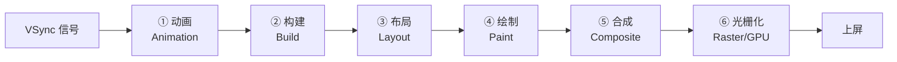
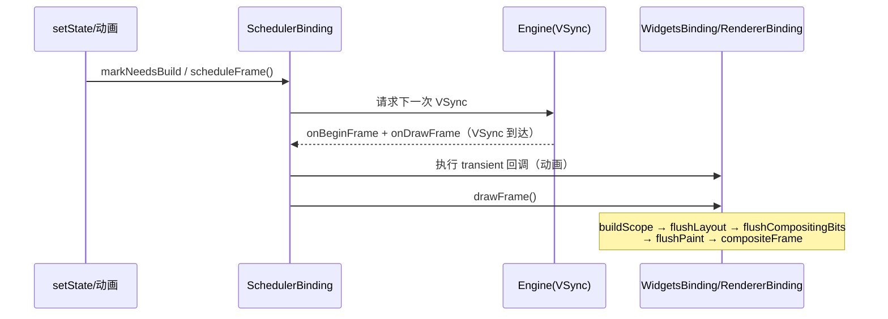
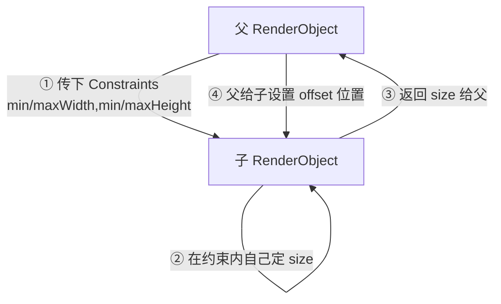
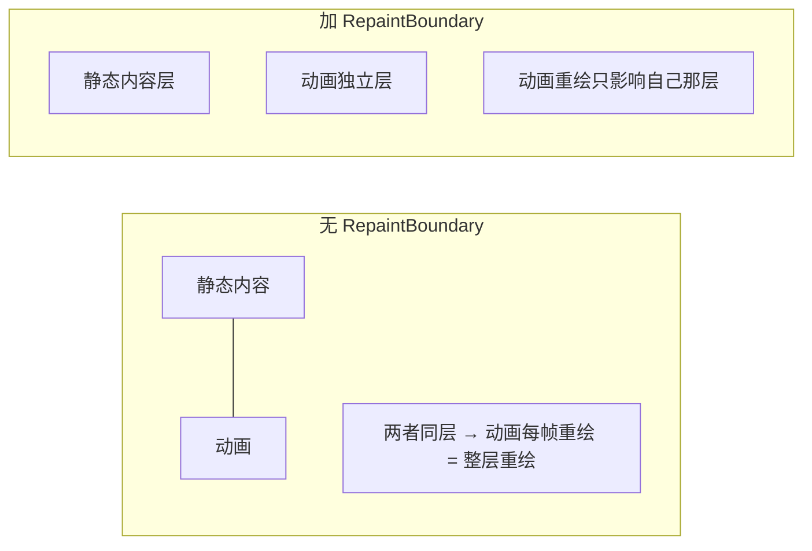

上一篇[《Flutter 三棵树：Widget、Element、RenderObject 详解》](/posts/Flutter三棵树Widget-Element-RenderObject详解/)讲清了 UI 的**静态结构**。这一篇讲**动态过程**：从一次 `setState` 或一帧信号开始，Flutter 是如何一步步把 UI 变成屏幕上的像素的。这条流水线就是"渲染管线"（rendering pipeline），也是理解 Flutter 掉帧与性能优化的地基。

## 一帧的全景流水线

Flutter 的目标是每秒 60/120 帧，即每帧只有约 16.6ms / 8.3ms。屏幕的垂直同步信号（VSync）到来时，引擎唤醒 Dart 侧，跑完整条流水线，赶在下一次 VSync 前把内容交给 GPU 合成上屏。



| 阶段 | 干什么 | 主角 | 产出 |
|---|---|---|---|
| ① Animation | 推进动画、执行帧回调 | `Ticker` / `SchedulerBinding` | 新的动画值 |
| ② Build | 重跑脏 Widget 的 `build` | Element | 更新后的 Element/RenderObject 树 |
| ③ Layout | 定尺寸、定位置 | RenderObject | 每个节点的 size 与 offset |
| ④ Paint | 生成绘制指令、切分图层 | RenderObject | Layer 树 |
| ⑤ Composite | 组合图层为场景 | Layer | `Scene` |
| ⑥ Raster | GPU 光栅化上屏 | Engine（Skia/Impeller） | 屏幕像素 |

> 前五步跑在 Dart 的 **UI 线程**，第⑥步的光栅化跑在独立的 **Raster 线程**（旧称 GPU 线程）。两条线程流水作业：UI 线程算出这一帧的 Layer 树，交给 Raster 线程去光栅化，自己接着算下一帧。所以"卡顿"要分清是 build/layout 慢（UI 线程掉帧）还是绘制太复杂（Raster 线程掉帧）——排查手段完全不同。
{: .prompt-info }

## 谁来敲响这一帧：帧调度

流水线不会无缘无故启动，它由 `SchedulerBinding` 统一调度。触发链条大致是：



要点：`setState` 并**不会立刻**渲染，它只是 `markNeedsBuild` 把 Element 标脏，再 `scheduleFrame` 请求引擎在下一次 VSync 回调。真正的工作发生在 VSync 到来时的 `drawFrame`。这就是"一次事件里多次 `setState` 只会合并成一帧"的原因。

## ② Build：把脏 Element 重建

VSync 到来后，`buildScope` 会遍历所有被标脏的 Element（`dirty` 列表），按**从上到下**的深度顺序重跑它们的 `build`，用上一篇讲的 `updateChild` 做 diff、复用或重建子树。

- 标脏入口：`setState` → `Element.markNeedsBuild()`。
- 只有脏的 Element 及其在 build 中新产生的子节点会被重建，未受影响的子树整体跳过。
- Build 结束后，需要重新布局的 RenderObject 已经通过 `markNeedsLayout` 进入待布局队列。

这一阶段的性能铁律：**让 `build` 尽量便宜、让脏范围尽量小**。常见手段——`const` 化子树、把易变部分下沉到更小的 Widget、用 `ValueListenableBuilder`/`Selector` 缩小重建范围，都是在压缩 Build 阶段的工作量。

## ③ Layout：约束向下，尺寸向上

布局是渲染管线里最容易被问、也最值得吃透的一段。Flutter 的盒布局遵循三句话协议：

> **Constraints go down. Sizes go up. Parent sets position.**
> 约束沿树向下传递，尺寸沿树向上返回，父节点决定子节点的位置。
{: .prompt-tip }



一个 `RenderBox` 收到的 `BoxConstraints` 包含 `minWidth/maxWidth/minHeight/maxHeight` 四个值。它必须在这个范围内**自己决定尺寸**，然后把 size 回报给父级；父级再根据自己的布局逻辑（居中、排列、堆叠……）给每个子级设置 `offset`。

由此能解释很多"布局玄学"：

- **子 Widget 想要多大，得看父给的约束**。`SizedBox(width: 100)` 在被 `Expanded` 强制拉伸的父约束下可能"不生效"，因为父传下的是紧约束（min==max）。
- **`double.infinity` 报错**：当父传下无界约束（如 `ListView` 的主轴、`Row` 里未包 `Expanded`），子级又想占满无穷大，就会 `RenderFlex overflow` 或 unbounded constraints 报错。
- **一次布局，单趟完成**：Flutter 布局是单次遍历（不像 Web 的多次回流），前提是每个 RenderObject 只依赖父给的约束和子返回的尺寸——这也是它高效的原因。

### relayout boundary：布局标脏为什么不总是往上冒

`markNeedsLayout` 并不总会一路标脏到根节点。当某个 RenderObject 满足"**它的尺寸只由父给的约束决定、与子无关**"（`parentUsesSize == false` 且约束是紧约束等条件）时，它就是一个 **relayout boundary**（重布局边界）。标脏冒泡到这里就停住，重新布局的范围被局部化，不会拖累整棵树。

## ④ Paint：生成绘制指令与图层切分

布局定好了每个节点的 size 和 offset，Paint 阶段负责把它们变成绘制指令。每个 RenderObject 的 `paint(context, offset)` 往 `Canvas` 上发命令（画矩形、文字、图片……），并按需把内容切分到不同的 **Layer（图层）** 上。

Paint 的标脏入口是 `markNeedsPaint`——比如颜色变了但尺寸没变，就只需重绘不需重新布局。Paint 同样有边界机制，这就引出了性能优化里最重要的一个 Widget。

### RepaintBoundary：把频繁重绘的区域隔离出去

默认情况下，相邻的 RenderObject 会被绘制进**同一个图层**。这意味着：图层里任意一小块要重绘，整个图层都得重绘。如果一个高频动画（比如不断旋转的 loading）和一大片静态复杂内容处在同一图层，静态内容会被反复无意义地重绘。

`RepaintBoundary` 会强制其子树独占一个图层：

```dart
RepaintBoundary(
  child: SpinningLoader(), // 只有这块自己重绘，不牵连外面的静态内容
)
```



> `RepaintBoundary` 不是越多越好。每个边界都会新建一个图层，图层过多会增加合成（Composite）阶段的开销和内存占用。原则是：**只在"高频重绘 + 周围有较重静态内容"**的地方加，比如动画、`ListView` 的 item（框架已默认为其加了）、视频/画布区域。
{: .prompt-warning }

## ⑤ Composite & ⑥ Raster：图层合成与上屏

Paint 产出的是一棵 **Layer 树**。合成阶段（`compositeFrame`）把这些图层按层级、变换、裁剪、透明度等关系组织成一个 `Scene`，通过 `dart:ui` 提交给引擎。

引擎侧的 **Raster 线程**拿到 Layer 树后，用渲染后端（**Skia** 或新一代的 **Impeller**）把矢量绘制指令光栅化成真正的像素，最终交给 GPU 显示上屏。

分层的价值正体现在这里：位置/透明度/变换类的改动，很多时候只需在合成阶段调整图层参数，**根本不用重新走 Paint**——这也是 `Transform`、`Opacity`（在有 RepaintBoundary 时）、`AnimatedOpacity` 能做得较廉价的底层原因。

## 三个标脏方法：管线的"局部重入口"

整条管线不必每帧从头全跑。三个 `markNeedsXxx` 决定了下一帧从哪个阶段、在多大范围内重入：

| 方法 | 触发场景 | 会重跑的阶段 |
|---|---|---|
| `markNeedsBuild` | `setState`、依赖的 `InheritedWidget` 变化 | Build → Layout → Paint → Composite |
| `markNeedsLayout` | 尺寸相关属性变化 | Layout → Paint → Composite |
| `markNeedsPaint` | 只有外观变化（颜色、阴影） | Paint → Composite |

优化的方向非常清晰：**能只标 Paint 就别惊动 Layout，能只标 Layout 就别惊动 Build**。选对 Widget（例如用 `CustomPainter` 直接在 Paint 层做视觉变化，而不是 `setState` 重建）本质上就是在选择"从哪一级重入管线"。

## 掉帧排查心法

把一帧掉帧问题对应到管线阶段，思路就清楚了：

- **UI 线程掉帧**（build/layout/paint 慢）：`build` 太重、布局层级太深、一次 `setState` 脏范围过大。→ 缩小重建范围、`const` 化、拆分 Widget、检查是否有同步重活（大 JSON 解析、大列表一次性构建）该移出 build。
- **Raster 线程掉帧**（绘制太贵）：复杂的 `Opacity`/`ClipPath`/`BackdropFilter`/阴影、图层过多。→ 用 `RepaintBoundary` 合理分层、减少昂贵的裁剪与滤镜、考虑 Impeller。
- **区分工具**：`flutter run --profile` + DevTools 的 Performance/Timeline，能直接看到每帧在 UI 线程和 Raster 线程各花了多久，定位到底卡在哪一段。

> 一条实用经验：先用 Performance Overlay（`showPerformanceOverlay: true`）看两条曲线，上面那条是 Raster、下面那条是 UI，哪条频繁越过红线，就往对应线程的方向查，别一上来就瞎优化。
{: .prompt-tip }

## 小结

- 一帧 = **动画 → Build → Layout → Paint → Composite → Raster** 六步流水线，前五步在 UI 线程，光栅化在 Raster 线程。
- 由 `SchedulerBinding` + VSync 驱动；`setState` 只标脏、请求下一帧，不立即渲染。
- 布局协议一句话：**约束向下、尺寸向上、父定位置**；`relayout boundary` 把重布局局部化。
- Paint 阶段按 Layer 分层，`RepaintBoundary` 是隔离高频重绘的关键，但别滥用。
- 三个 `markNeedsXxx` 决定管线重入的起点，性能优化的核心就是"尽量从更靠后的阶段、更小的范围重入"。
- 结构篇见[《Flutter 三棵树：Widget、Element、RenderObject 详解》](/posts/Flutter三棵树Widget-Element-RenderObject详解/)，两篇合起来就是 Flutter 渲染原理的完整拼图。

## 面试回答话术

下面把渲染管线相关的高频问题拆成一问一答，每个回答都是可以直接开口复述的口语版。整套始终围绕"从哪一级、多大范围重入管线"这个核心，既讲得清原理，又能自然落到性能优化。

**Q1：Flutter 一帧是怎么渲染出来的？渲染管线讲一下。**

> "Flutter 每一帧走的是一条固定流水线：VSync 信号到来后，依次是**动画、Build、Layout、Paint、Composite、Raster** 六步。Build 是重跑脏 Widget 的 build，Layout 定尺寸和位置，Paint 生成绘制指令并按图层切分，Composite 把图层组合成场景，最后 Raster 做光栅化上屏。这里我会特别强调一个划分：前五步跑在 Dart 的 UI 线程，最后的光栅化跑在独立的 Raster 线程，两条线程流水作业。因为排查卡顿的第一步，就是先分清到底是 UI 线程掉帧还是 Raster 线程掉帧，两者的优化手段完全不同。"

**Q2：`setState` 调用后是马上就渲染吗？**

> "不是。`setState` 并不会立刻渲染，它只做两件事：`markNeedsBuild` 把当前 Element 标脏，然后 `scheduleFrame` 向引擎请求下一次 VSync。真正的渲染工作发生在 VSync 到来时的 `drawFrame`。所以一次事件里连续调用多次 `setState`，也只会合并成一帧，不会重复渲染——这是由 SchedulerBinding 统一调度的。"

**Q3：Flutter 的布局机制是怎样的？为什么有时候 `SizedBox` 设了宽度却不生效？**

> "Flutter 的盒布局协议一句话概括：**约束向下、尺寸向上、父定位置**。父级把 BoxConstraints 传给子级，子级只能在这个约束范围内自己决定尺寸、再把 size 返回，父级最后给子级设置 offset。整个过程是单趟遍历，不像 Web 会多次回流。`SizedBox(width:100)` 不生效，通常就是因为父级传下来的是紧约束，min 等于 max，把子级的尺寸给锁死了，比如它被 Expanded 包着。同理，Row 里不包 Expanded 就 overflow，也是约束传递的结果。"

**Q4：布局或重绘时，标脏会一路冒泡到根节点吗？**

> "不一定。以布局为例，`markNeedsLayout` 遇到 relayout boundary 就会停住，不会继续往上冒。当一个 RenderObject 的尺寸只由父给的约束决定、和子级无关时，它就是一个重布局边界，重新布局的范围被局部化了，不会拖累整棵树。Paint 也有类似的边界机制，这就引出了 RepaintBoundary。"

**Q5：RepaintBoundary 是干什么的？为什么能优化性能？**

> "默认情况下相邻的内容会被画进同一个图层，所以图层里任何一小块要重绘，整层都得跟着重绘。如果一个高频动画和一大片静态内容处在同一图层，静态内容就会被反复无意义地重绘。`RepaintBoundary` 会强制它的子树独占一个图层，这样动画重绘只影响它自己那一层。但我会补一句：它不是越多越好，每个边界都会新建图层、增加合成阶段的开销和内存占用，所以只在'高频重绘 + 周围有较重静态内容'的地方加，比如动画、画布区域；ListView 的 item 框架已经默认帮你加了。"

**Q6：UI 线程掉帧和 Raster 线程掉帧怎么区分、分别怎么优化？**

> "先用 DevTools 的 Performance 或者 Performance Overlay 看两条曲线，哪条频繁越过红线就往哪个方向查。UI 线程掉帧一般是 build 太重、布局层级太深、一次 setState 脏范围过大，或者在 build 里做了大 JSON 解析这种同步重活，优化方向是缩小重建范围、const 化、拆分 Widget、把重活移出 build。Raster 线程掉帧一般是绘制太贵，比如复杂的 Opacity、ClipPath、BackdropFilter、阴影或者图层过多，优化方向是合理用 RepaintBoundary 分层、减少昂贵的裁剪和滤镜，也可以考虑用 Impeller。"

**Q7：你做 Flutter 性能优化的整体方法论是什么？**

> "我会把整条管线收到三个标脏方法上：`markNeedsBuild`、`markNeedsLayout`、`markNeedsPaint`，它们决定下一帧从哪个阶段、多大范围重入管线。优化的核心思路就一句——**能只标 Paint 就别惊动 Layout，能只标 Layout 就别惊动 Build**。具体手段比如缩小 setState 的脏范围、给不变子树加 const、用 ValueListenableBuilder 或 Selector 精确刷新、视觉变化用 CustomPainter 直接在 Paint 层做而不是 setState 重建，本质都是在选择'从更靠后的阶段、更小的范围'重入管线。"
