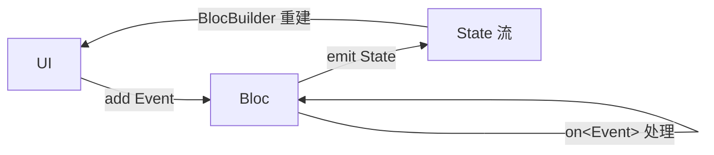
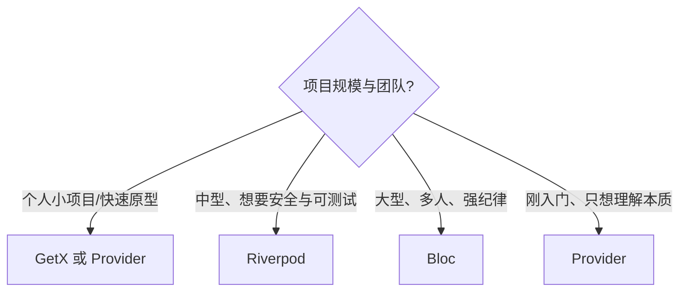

"Flutter 状态管理到底该用哪个"大概是社区里最经久不衰的争论。原因也不难理解：Flutter 官方只给了 `setState` 和 `InheritedWidget` 两块地基，上层方案百花齐放。本文横向对比四个最主流的方案——**Provider、Riverpod、Bloc、GetX**，用同一个例子把它们的写法、心智模型、优缺点摆在一起，最后给一份可落地的选型建议。

> 前置知识：状态管理的本质，是"状态变化 → 通知 UI 重建"。不管哪个方案，底层都绕不开 `InheritedWidget`（用于在树中向下传递依赖）和某种"可监听对象"（`ChangeNotifier` / `Stream` / `ValueNotifier`）。理解这一点，看每个方案就都是"换了层皮"。相关机制见[《Flutter 三棵树》](/posts/Flutter三棵树Widget-Element-RenderObject详解/)里对 `InheritedWidget` 与 `BuildContext` 的讨论。
{: .prompt-info }

## 先建立评价坐标系

抛开信仰，比较状态管理方案就看这几个维度：

| 维度 | 说明 |
|---|---|
| 样板代码 | 实现同一功能要写多少"仪式性"代码 |
| 学习曲线 | 概念多不多、心智负担大不大 |
| 编译期安全 | 拿错类型/忘了 provide，是编译报错还是运行时崩 |
| 是否依赖 BuildContext | 拿状态要不要 `context`，影响可测试性与在非 UI 层的可用性 |
| 可测试性 | 业务逻辑能否脱离 Widget 单测 |
| 关注点分离 | 是否强制把 UI 和逻辑分开 |
| 生态与边界 | 只管状态，还是把路由、DI、网络都包了 |

带着这套坐标，逐个看。

## 统一示例：计数器 + 异步加载

为了公平对比，四个方案都实现同一个需求：一个同步计数器，外加一个"异步拉取用户名"的场景（覆盖 loading/error/data 三态）。

## Provider —— 官方推荐的最小共识

`Provider` 是对 `InheritedWidget` 的封装，长期是 Flutter 官方文档推荐的入门方案。核心三件套：用 `ChangeNotifier` 装状态、用 `ChangeNotifierProvider` 注入树、用 `context.watch` / `Consumer` 消费。

```dart
// 1. 状态载体：继承 ChangeNotifier，变更后 notifyListeners()
class CounterModel extends ChangeNotifier {
  int _count = 0;
  int get count => _count;

  void increment() {
    _count++;
    notifyListeners(); // 通知所有监听者重建
  }
}

// 2. 注入：在树的上层 provide
ChangeNotifierProvider(
  create: (_) => CounterModel(),
  child: const MyApp(),
);

// 3. 消费：watch 会订阅并重建，read 只取值不订阅
class CounterText extends StatelessWidget {
  @override
  Widget build(BuildContext context) {
    final count = context.watch<CounterModel>().count;
    return Text('$count');
  }
}

// 触发变更（在按钮回调里，用 read 避免不必要订阅）
onPressed: () => context.read<CounterModel>().increment(),
```

**优点**：概念少、上手快、和官方结合紧密；`Consumer`/`Selector` 能做局部重建优化。
**缺点**：依赖 `BuildContext` 取值，容易写出 `Provider not found` 这类**运行时**错误（编译期不拦截）；同类型多实例要靠 `ProviderKey`/嵌套区分，略笨拙；异步态要自己搭 `FutureProvider` 或在 model 里手动管 loading/error。

## Riverpod —— Provider 的"编译期安全"进化版

`Riverpod` 出自 Provider 同一作者（名字就是 Provider 的字母重排），目标是修掉 Provider 的两大痛点：**不再依赖 `BuildContext`**、**编译期安全**。它的 provider 是全局声明的顶层变量，拿错、忘 provide 直接编译不过。这里用当前的 Riverpod 3.x 推荐写法（`Notifier` / `AsyncNotifier`）。

```dart
// 1. 同步状态：Notifier + NotifierProvider
class Counter extends Notifier<int> {
  @override
  int build() => 0; // 初始状态

  void increment() => state++; // 直接改 state 即自动通知
}
final counterProvider = NotifierProvider<Counter, int>(Counter.new);

// 2. 异步状态：AsyncNotifier，天然带 loading/error/data 三态
class UserName extends AsyncNotifier<String> {
  @override
  Future<String> build() async => fetchUserName(); // 异步初始化
}
final userNameProvider = AsyncNotifierProvider<UserName, String>(UserName.new);

// 3. 注入：根部包一层 ProviderScope（整个应用一次即可）
runApp(const ProviderScope(child: MyApp()));

// 4. 消费：ConsumerWidget 提供 ref，ref.watch 订阅
class Home extends ConsumerWidget {
  @override
  Widget build(BuildContext context, WidgetRef ref) {
    final count = ref.watch(counterProvider);
    final userName = ref.watch(userNameProvider);

    // AsyncValue 用 switch 优雅处理三态
    return Column(children: [
      Text('$count'),
      switch (userName) {
        AsyncData(:final value) => Text('用户：$value'),
        AsyncError(:final error) => Text('出错：$error'),
        _ => const CircularProgressIndicator(),
      },
      ElevatedButton(
        onPressed: () => ref.read(counterProvider.notifier).increment(),
        child: const Text('+1'),
      ),
    ]);
  }
}
```

如果引入 `riverpod_generator`，还能用 `@riverpod` 注解 + 代码生成进一步减少样板：

```dart
@riverpod
String label(Ref ref) => 'Hello world'; // 生成 labelProvider
```

**优点**：**编译期安全**（拿错直接报错，告别 `ProviderNotFound`）；不依赖 `BuildContext`，逻辑层能脱离 UI；`AsyncNotifier` 把异步三态和缓存、自动 dispose 都内建了；provider 之间可组合（一个 watch 另一个）。
**缺点**：概念比 Provider 多（`ref`、`AsyncValue`、`autoDispose`、`family`）；代码生成流派要配 `build_runner`，多一层构建；全局 provider 变量对习惯"依赖挂在树上"的人有认知转换成本。

## Bloc / Cubit —— 事件驱动、强纪律

`Bloc` 走的是另一条路：把状态管理建模成**事件流 → 状态流**，强制单向数据流和关注点分离，在大型团队、复杂业务里最受青睐。它提供两个层级：轻量的 `Cubit`（直接方法调用 + `emit`）和完整的 `Bloc`（事件驱动）。

先看轻量的 `Cubit`：

```dart
// Cubit：适合简单场景，直接方法 + emit
class CounterCubit extends Cubit<int> {
  CounterCubit() : super(0); // 初始状态 0
  void increment() => emit(state + 1);
}
```

再看完整的 `Bloc`——用 `sealed class` 定义事件，`on<Event>` 注册处理器：

```dart
// 1. 事件：sealed 保证穷尽匹配
sealed class CounterEvent {}
final class CounterIncrementPressed extends CounterEvent {}

// 2. Bloc：事件进 → 状态出
class CounterBloc extends Bloc<CounterEvent, int> {
  CounterBloc() : super(0) {
    on<CounterIncrementPressed>((event, emit) => emit(state + 1));
  }
}
```

UI 侧用 `BlocProvider` 注入、`BlocBuilder` 消费：

```dart
BlocProvider(
  create: (_) => CounterBloc(),
  child: BlocBuilder<CounterBloc, int>(
    builder: (context, state) => Column(children: [
      Text('$state'),
      ElevatedButton(
        // 派发事件
        onPressed: () => context.read<CounterBloc>().add(CounterIncrementPressed()),
        child: const Text('+1'),
      ),
    ]),
  ),
);
```

异步场景把 `on<Event>` 处理器写成 `async`，先 `emit(Loading())` 再 `emit(Success/Failure)`，配合一个 `sealed` 的 State 类穷尽三态即可。



**优点**：**单向数据流 + 强制关注点分离**，逻辑完全脱离 UI，可读性和可维护性在大项目里最好；配套 `bloc_test`、`bloc` DevTools、`hydrated_bloc`（持久化）等生态成熟；事件可追溯，天然适合日志、埋点、时间旅行调试。
**缺点**：样板代码最多（事件类、状态类、handler 一个不少），简单页面显得"杀鸡用牛刀"；学习曲线相对陡（`Cubit` 缓一点，`Bloc` 概念多）。

## GetX —— 全家桶，极简样板

`GetX` 是四者里最"激进"的：它不只做状态管理，还把**路由、依赖注入、国际化、工具方法**打包进一个库，主打**零样板、不依赖 BuildContext**。响应式写法用 `.obs` + `Obx`：

```dart
// 1. Controller：变量加 .obs 变成响应式
class CounterController extends GetxController {
  var count = 0.obs; // RxInt
  void increment() => count++; // 直接改，UI 自动更新
}

// 2. 注入 + 取用：Get.put 放入，Get.find 取出（也可 Get.lazyPut）
final c = Get.put(CounterController());

// 3. 消费：Obx 自动追踪用到的 .obs 变量并局部重建
Obx(() => Text('${c.count}'));

// 触发
onPressed: c.increment,
```

异步同样简洁，`RxStatus` 或直接用可空的 `.obs` + 判空即可，甚至能用 `GetX` 自带的 `GetConnect` 发网络请求。

**优点**：**样板极少**、上手极快；不需要 `context` 就能拿状态、跳路由、弹 snackbar，写小项目/原型非常爽；一个库解决一大堆事，减少选型和依赖。
**缺点**：**把太多关注点耦合进一个库**，与 Flutter 惯用法（声明式、依赖挂树上）偏离较大；`Get.find` 这种全局服务定位器容易滋生隐式依赖和"魔法"，大项目里可测试性和可维护性受质疑；社区对其架构争议较大，团队协作时规范约束弱。

> 选型提醒：GetX 的"爽"很大程度来自绕过了 Flutter 的一些约束（全局单例、无 context 访问）。小项目/个人项目收益明显；但在多人协作的大型项目里，这些"便利"往往会变成后期维护的隐性成本。用之前想清楚项目规模。
{: .prompt-warning }

## 横向对比总表

| 维度 | Provider | Riverpod | Bloc / Cubit | GetX |
|---|---|---|---|---|
| 样板代码 | 少 | 中（codegen 更少） | 多 | 极少 |
| 学习曲线 | 平缓 | 中 | 较陡 | 平缓 |
| 编译期安全 | ✗（运行时报错） | ✓ | 部分 | ✗ |
| 依赖 BuildContext | 是 | 否 | 取值否/注入是 | 否 |
| 异步三态支持 | 手动/FutureProvider | 内建 `AsyncValue` | 手动建 State | 手动/RxStatus |
| 关注点分离 | 弱约束 | 中 | 强制 | 弱约束 |
| 可测试性 | 中 | 高 | 高 | 中低 |
| 生态边界 | 仅状态 | 仅状态（+DI 能力） | 状态为主，生态成熟 | 全家桶 |
| 适合规模 | 中小 | 中大 | 大 | 小/原型 |

## 选型建议：没有银弹，只有场景



落到一句话建议：

- **想先理解状态管理本质、或维护老项目** → `Provider`。它离 `InheritedWidget` 最近，学会它再看别的都是变体。
- **新项目、追求编译期安全和可测试性** → `Riverpod`。它基本是"Provider 做对了的样子"，异步场景尤其省心，是目前社区新项目的主流推荐。
- **大型项目、多人协作、业务复杂、重视可维护性与调试** → `Bloc`。样板换来的是纪律和可追溯性，规模越大越划算。
- **个人项目、原型、追求开发速度** → `GetX`。爽是真爽，但要清楚它的架构取舍，别在大项目里为一时便利埋雷。

> 一个务实的观点：状态管理方案没有绝对优劣，**团队统一 + 用对场景**远比"选到最强的那个"重要。一个项目里最忌讳的是四种方案混着用。
{: .prompt-tip }

## 面试回答话术

**Q1：Flutter 有这么多状态管理方案，它们的本质区别是什么？**

> "本质上它们都在做同一件事——'状态变化后通知 UI 重建'，底层都绕不开 InheritedWidget 做依赖传递，加上某种可监听对象比如 ChangeNotifier、Stream 或 ValueNotifier。区别在于'皮'：Provider 是对 InheritedWidget 的轻封装；Riverpod 把 provider 提成全局变量做到编译期安全、不依赖 context；Bloc 用事件流到状态流强制单向数据流和关注点分离；GetX 则是响应式加全家桶。所以我理解它们不是谁取代谁，而是在'样板量、安全性、纪律性'之间做不同取舍。"

**Q2：Provider 和 Riverpod 什么关系？为什么会有 Riverpod？**

> "Riverpod 是 Provider 同一个作者写的，名字就是 Provider 的字母重排，可以理解成'Provider 做对了的版本'。它主要修两个痛点：一是 Provider 取值依赖 BuildContext，容易在运行时抛 ProviderNotFound；二是 Provider 编译期不安全。Riverpod 把 provider 变成全局顶层变量，拿错或忘了 provide 直接编译不过，也不再需要 context，逻辑层能脱离 UI。它的 AsyncNotifier 还把异步的 loading/error/data 三态和自动 dispose 内建了，异步场景特别省心。"

**Q3：Bloc 的核心思想是什么？和 Cubit 有什么区别？**

> "Bloc 的核心是单向数据流：UI 派发 Event，Bloc 在 on<Event> 里处理并 emit 出新的 State，UI 再根据 State 重建，整条链路可追溯。它强制把业务逻辑和 UI 分开，所以在大型项目和多人协作里可维护性最好，配套的 bloc_test、DevTools、时间旅行调试也很成熟。Cubit 是 Bloc 的简化版，去掉了 Event 层，直接暴露方法调用 emit，适合逻辑较简单的场景；需要事件可追溯、可穷尽时再上完整的 Bloc。"

**Q4：GetX 争议在哪？你会在什么项目里用它？**

> "GetX 争议主要在于它把状态、路由、依赖注入、工具方法全耦合进一个库，而且靠全局单例和服务定位器 Get.find 绕过了 Flutter 的很多约束，写起来样板极少、不用 context 很爽。但代价是隐式依赖多、和 Flutter 声明式惯用法偏离、大项目里可测试性和规范约束偏弱。所以我会在个人项目、快速原型这种追求速度的场景用它；多人协作的大型项目我更倾向 Riverpod 或 Bloc。"

**Q5：如果让你给一个新的中大型项目选型，你怎么选？**

> "我会优先考虑 Riverpod 或 Bloc。如果团队更看重开发效率和编译期安全、异步场景多，选 Riverpod;如果业务特别复杂、多人协作、需要强纪律和可追溯的调试，选 Bloc。Provider 我一般留给小项目或维护老代码。最关键的一条是团队统一，一个项目里最忌讳几种方案混用，那比选哪个都更伤维护性。"

## 小结

- 所有方案的本质都是"状态变化 → 通知重建"，底层是 `InheritedWidget` + 可监听对象，差异在样板量、安全性和纪律性的取舍。
- **Provider**：官方最小共识，概念少但运行时才报错；**Riverpod**：编译期安全、不依赖 context、异步内建，新项目主流；**Bloc**：单向数据流、强制分离，大项目最稳；**GetX**：全家桶、样板极少，小项目爽、大项目慎用。
- 选型没有银弹：**按项目规模和团队选，并全项目统一**，比追"最强方案"重要得多。
- 想深入理解它们共同的地基，回看[《Flutter 三棵树》](/posts/Flutter三棵树Widget-Element-RenderObject详解/)里的 `InheritedWidget` 与 `BuildContext`，以及[《Flutter 渲染管线》](/posts/Flutter渲染管线从build到上屏详解/)里状态变化如何驱动重建。
