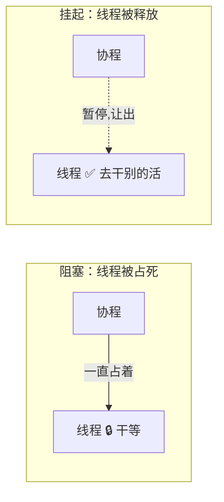
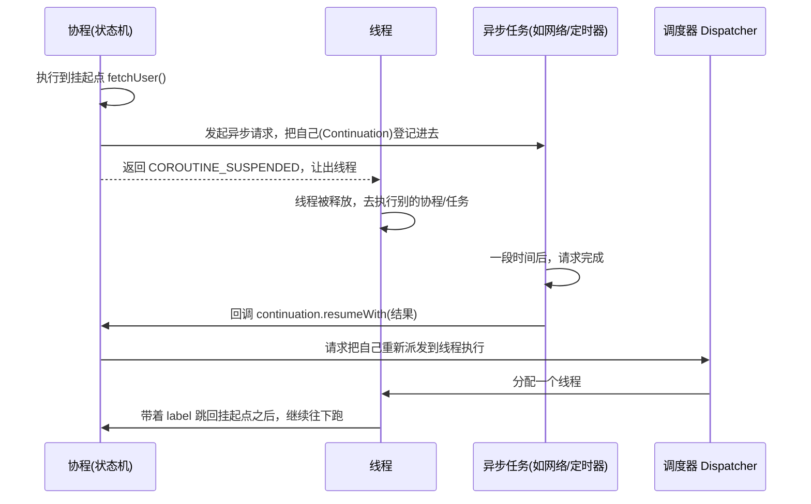

"协程能挂起，挂起时不阻塞线程"——这句话人人会背，但**挂起到底发生了什么？线程被谁释放了？恢复时又怎么知道从哪儿接着跑？** 这篇文章只干一件事：把 suspend 的**挂起与恢复原理**从头到尾讲透。

> 协程的整体本质、与线程的对比、完整用法、结构化并发等，我在 [Kotlin 协程的本质与详细使用讲解](/posts/Kotlin协程的本质与详细使用讲解/) 里系统讲过。本文是它的"放大镜"，**只聚焦挂起/恢复这一个机制**，讲得更细更通俗，两篇搭配着看效果最好。
{: .prompt-tip }

## 一、先破除最大的误解：挂起 ≠ 阻塞

很多 bug 和面试翻车都源于把这两个词搞混，先用一个类比彻底分开它们。

**阻塞（Block）像在柜台前干等**：你去餐厅点了餐，然后**站在取餐柜台前一动不动地等**，直到餐做好。这期间柜台被你占着，后面的人没法用——对应线程被占住，啥也干不了。

**挂起（Suspend）像取号后去坐下**：你点完餐拿了个号码牌，**离开柜台去座位上刷手机**，柜台立刻空出来给别人用；等餐做好了广播叫你的号，你再回柜台取。这期间**柜台（线程）是自由的**，你（协程）只是"暂停"在等餐这一步，没占着柜台。



**关键结论**：挂起挂起的是**协程**（那个"任务"），而**线程被释放了**去执行其他工作。所以成千上万个协程可以复用少量线程——这正是协程"轻量"的根源。

那么问题来了：协程"暂停"在半路，它的执行进度存在哪？恢复时又靠什么接着跑？答案是下面这个主角。

## 二、核心主角：Continuation —— 一张"游戏存档"

理解挂起恢复，只需要理解一个东西：**Continuation（续体）**。它的接口简单到只有一个方法：

```kotlin
interface Continuation<in T> {
    val context: CoroutineContext
    fun resumeWith(result: Result<T>)  // “从上次挂起的地方，带着这个结果继续”
}
```

**类比：Continuation 就是一张游戏存档**。玩游戏打到一半要下线，你**存个档**（记录当前进度和"接下来该干嘛"），关机走人；下次**读档**，游戏从存档点原样继续，而不是从头开始。

对应到协程：

- **挂起** = 把"当前执行到哪、接下来要做什么"打包成一个 Continuation（**存档**），然后让出线程离开；
- **恢复** = 调用这个 Continuation 的 `resumeWith(结果)`（**读档**），协程从挂起点带着结果继续往下跑。

所以 **Continuation 的本质就是一个"高级回调"**——它封装了"挂起点之后的所有剩余代码"。挂起时把它交出去，等异步结果好了，谁('别人')调一下 `resumeWith`，协程就活过来了。

## 三、suspend 编译后偷偷变了什么：CPS 变换

`suspend` 关键字不是运行时魔法，而是**编译期**的改写。编译器对每个挂起函数做一件事：**偷偷塞进一个 Continuation 参数**。这套做法有个名字叫 **CPS（Continuation-Passing Style，续体传递风格）**。

```kotlin
// 你写的
suspend fun fetchUser(): User

// 编译器实际生成的（近似）
fun fetchUser(cont: Continuation<User>): Any?
```

注意两个变化：

1. **多了个 `cont: Continuation<User>` 参数**：这就是那张"存档"，调用者把"接下来要干嘛"传进来。
2. **返回类型变成了 `Any?`**：因为这个函数现在有**两种可能的返回**：
   - 如果能立刻算出结果 → 直接返回 `User`；
   - 如果要等异步（比如网络请求）→ 返回一个特殊标记 **`COROUTINE_SUSPENDED`**，意思是"**我挂起了，结果以后通过 `cont.resumeWith` 给你**"。

**类比：留个回电号码**。你打客服电话查一件事，如果客服能马上答就当场告诉你（直接返回结果）；如果要查很久，就让你**留个电话号码**（把 Continuation 交出去）先挂断，查好了再**回拨给你**（`resumeWith`）。`COROUTINE_SUSPENDED` 就是那句"这事儿得查一会儿，稍后回电"。

> 这也顺便解释了一个常见问题：**为什么挂起函数只能在协程或另一个挂起函数里调用？** 因为调用它必须传入那个隐藏的 `Continuation` 参数，而这个参数只有在协程上下文里才有。这就是所谓的"挂起函数会传染/染色"——一处 suspend，调用链上全得 suspend。
{: .prompt-info }

## 四、多个挂起点怎么办：label 状态机

一个挂起函数里可能有**好几个挂起点**：

```kotlin
suspend fun loadPage() {
    val user = fetchUser()          // 挂起点 1
    val posts = fetchPosts(user)    // 挂起点 2
    render(user, posts)
}
```

每次恢复时，协程怎么知道"这是第几次回来、该从哪个挂起点往下跑"？编译器的办法是：**把整个函数体改写成一个状态机**，用一个 `label` 字段记录"执行到第几步"。

下面是**大幅简化**的示意（真实字节码更复杂，但思想就是这样）：

```kotlin
// loadPage 被改写成一个状态机，label 记录进度
fun loadPage(cont: Continuation<Unit>): Any? {
    val sm = cont as? LoadPageStateMachine ?: LoadPageStateMachine(cont)
    when (sm.label) {
        0 -> {
            sm.label = 1                       // 先把进度推进到 1
            val r = fetchUser(sm)              // 把状态机自己当作 Continuation 传下去
            if (r == COROUTINE_SUSPENDED) return COROUTINE_SUSPENDED  // 挂起，让出线程
            // 没挂起就继续往下（fall-through），走到 case 1
        }
        1 -> {
            val user = sm.result as User       // 恢复时从这里取上一步的结果
            sm.user = user
            sm.label = 2
            val r = fetchPosts(user, sm)
            if (r == COROUTINE_SUSPENDED) return COROUTINE_SUSPENDED
        }
        2 -> {
            render(sm.user, sm.result as List<Post>)
            return Unit
        }
    }
    // ...
}
```

**类比：带存档点的交互式小说**。整本书被切成几段，每个挂起点就是一个**存档点**。`label` 记录"你读到第几个存档点了"。每次 `resumeWith` 恢复，就带着 `label` **跳到对应的那一段**继续读，而不是从第一页重来。上一步的异步结果，则通过状态机对象的字段（`sm.result`、`sm.user`）保存和传递。

几个关键点：

- 这个状态机对象（`ContinuationImpl` 的子类）**从头到尾就一个实例**，被反复复用——每次挂起把局部变量存进它的字段，每次恢复再取出来，`label` 不断自增。
- 它**既是"存档"（Continuation），又是"要继续执行的逻辑"**：`resumeWith` 内部就是再调一次 `loadPage(自己)`，靠 `label` 跳到下一段。这就是挂起-恢复能"接着跑"的底层真相。

## 五、串起来：一次完整的挂起-恢复之旅

把前面的碎片拼成完整流程。以"协程里发起一个网络请求"为例：



用一句话复述：**执行到挂起点 → 把自己(Continuation)登记给异步任务 → 返回 `COROUTINE_SUSPENDED` 让出线程 → 线程去干别的 → 异步完成后回调 `resumeWith` → 调度器把协程重新派到线程上，靠 `label` 跳回原地继续。** 全程没有任何线程在"干等"。

**`delay` 为什么不阻塞线程？** 现在就好理解了：`delay` 不是 `Thread.sleep`。它做的是——挂起当前协程、向一个**定时器**注册"n 毫秒后 `resume` 我"，然后立刻让出线程。时间没到的这段时间里，线程完全空闲、可以跑别的协程。时间一到，定时器回调 `resumeWith`，协程恢复。所以一万个 `delay` 也不会占用一万个线程。

## 六、三个容易被追问的澄清

- **挂起一定会切线程吗？** 不一定。**挂起和切线程是两回事**。挂起只是"暂停+让出"；切不切线程由**调度器**决定（`withContext(Dispatchers.IO)` 才会切）。一个挂起函数完全可能恢复后还在原来的线程上。
- **挂起是"协作式"的**。协程不能像线程那样被系统随时抢占，它**只能在挂起点主动让出**。所以如果你在协程里写了个不含任何挂起点的死循环或重 CPU 计算，它会一直霸占线程，别的协程根本没机会跑——这也是"协程里别做无挂起点的长耗时同步操作"的原因。
- **`suspend` 修饰符本身不产生挂起**。它只是个"标记"，告诉编译器"这个函数里*可能*有挂起点、需要做 CPS 变换"。一个 `suspend` 函数如果内部没真正调用会挂起的函数，它其实一次都不会挂起。

## 七、面试话术（口语化背诵版）

### Q1：协程的"挂起"和"阻塞"有什么区别？

> 💡 **这样答**：阻塞是线程停在那里干等，这期间线程被占死、什么也干不了；挂起挂起的是协程这个任务，它会在挂起点暂停并**让出线程**，线程被释放去执行别的工作，等异步结果好了协程再恢复。打个比方，阻塞是站在取餐柜台前一直等，挂起是取了号去座位上等、把柜台让给别人。正因为挂起不占线程，少量线程才能跑成千上万个协程。

### Q2：`suspend` 关键字编译后到底做了什么？

> 💡 **这样答**：核心是 CPS 变换，也就是续体传递。编译器会给每个挂起函数偷偷加一个 `Continuation` 参数，返回类型也变成 `Any?`。这个函数要么直接返回结果，要么在需要等异步时返回一个特殊标记 `COROUTINE_SUSPENDED`，表示"我先挂起，结果以后通过这个 Continuation 的 resumeWith 回调给你"。Continuation 你可以理解成一张存档，封装了挂起点之后要继续执行的逻辑。

### Q3：一个挂起函数里有多个挂起点，恢复时怎么知道从哪继续？

> 💡 **这样答**：编译器把函数体改写成一个状态机，用一个 `label` 字段记录执行到第几个挂起点。每个挂起点对应状态机的一个分支。每次 resumeWith 恢复，就带着 label 跳到对应的分支继续执行，上一步的结果和局部变量都存在状态机对象的字段里。这个状态机对象本身就是那个 Continuation，从头到尾复用一个实例，label 不断自增。就像带存档点的交互式小说，读档时跳到对应存档点接着读，而不是从头来。

### Q4：为什么挂起函数只能在协程或其他挂起函数中调用？

> 💡 **这样答**：因为 CPS 变换后，调用挂起函数必须传入那个隐藏的 Continuation 参数，而这个参数只有在协程上下文里才拿得到。普通函数没有它，所以调不了。这也就是"挂起函数会传染"的原因——调用链上只要有一处 suspend，往上一路都得是 suspend，直到某个协程构建器（launch、async）那里提供最初的 Continuation。

### Q5：`delay` 为什么不会阻塞线程？

> 💡 **这样答**：因为 `delay` 不是 `Thread.sleep`。它会挂起当前协程、向一个定时器注册"多少毫秒后恢复我"，然后立刻让出线程。等待期间线程是空闲的，可以去跑别的协程；时间一到，定时器回调 resumeWith 把协程恢复。所以哪怕同时有一万个 delay，也不需要一万个线程。

### Q6：挂起一定会切换线程吗？

> 💡 **这样答**：不一定，挂起和切线程是两码事。挂起只是暂停并让出线程；要不要切线程、切到哪，是由调度器决定的，比如 `withContext(Dispatchers.IO)` 才会切到 IO 线程。一个挂起函数恢复后完全可能还在原来的线程上。把这俩分清是理解协程调度的关键。

> 💡 **收尾加分项**：可以升华一句——"所以协程本质上是**编译器帮我们把回调地狱自动改写成了状态机**。我们用顺序代码的写法写异步逻辑，编译器在背后把它切成一个个挂起点、用 Continuation 存档、用 label 状态机恢复。这就是为什么说协程是'用户态的、由编译器和库实现的一场魔术'，跟操作系统线程完全不是一个层面的东西。"
{: .prompt-tip }
