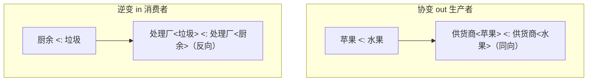

Kotlin 的**委托（Delegation）**和**型变（Variance）**是两个"看着简单、一问就懵"的知识点：`by lazy` 天天用却说不清原理，`out`/`in` 见过无数次却分不清谁是协变谁是逆变。

这两个话题里，**型变和 Java 泛型是同一套地基**——不懂 Java 泛型的类型擦除和通配符，就理解不了 Kotlin 的 `out`/`in` 优雅在哪。所以本文从 Java 泛型讲起，全程用生活类比，最后落到委托，文末附面试话术。

> 本文假设你了解基本的继承和子类型概念（"子类可以当父类用"）。如果对泛型完全陌生，跟着第一节的类比走即可，不需要预备知识。
{: .prompt-tip }

## 一、先打地基：Java 泛型解决什么问题？

### 没有泛型的年代：装什么都靠强转

泛型出现之前，Java 的容器只能装 `Object`，取出来还得手动强转：

```java
List list = new ArrayList();
list.add("hello");
String s = (String) list.get(0);  // 必须强转
list.add(123);                    // 编译器拦不住！塞个 Integer 进去也没报错
String bad = (String) list.get(1); // 运行时 ClassCastException 崩溃
```

问题很明显：**编译器不知道容器里装的是什么，类型错误要等到运行时才爆炸**。

### 泛型的本质：给容器贴一张"类型标签"

泛型就是**把类型也变成一个参数**。`List<String>` 相当于给这个列表贴了张"只装 String"的标签，编译器就能在编译期帮你核对，装错直接报错：

```java
List<String> list = new ArrayList<>();
list.add("hello");
list.add(123);          // 编译不通过！编译器帮你拦住了
String s = list.get(0); // 不用强转，编译器知道就是 String
```

**一句话**：泛型把"类型检查"从运行时提前到了编译时，用一张编译期的标签换来类型安全。

### 类型擦除：Java 泛型的"手套"只在编译期戴着

这是 Java 泛型最关键、也最爱考的一点：**Java 的泛型只存在于编译期，运行时会被"擦除"掉**。

打个比方：编译器检查代码时戴着一副"类型手套"，严格核对每个泛型标签；**一旦编译完成，手套就摘掉了**，`List<String>` 和 `List<Integer>` 在运行时变回同一个光秃秃的 `List`，里面的 `String`、`Integer` 都退化成 `Object`。

```java
List<String> a = new ArrayList<>();
List<Integer> b = new ArrayList<>();
// 运行时它俩是同一个类！打印结果都是 class java.util.ArrayList
System.out.println(a.getClass() == b.getClass()); // true
```

**为什么要擦除？** 为了兼容泛型出现之前的老代码。代价是运行时"丢失了类型信息"，于是带来几个著名限制：不能 `new T()`、不能 `T.class`、不能 `instanceof List<String>`。

> Kotlin 也基于 JVM，同样有类型擦除。但 Kotlin 提供了 `inline fun <reified T>` ——用 `reified` 关键字 + 内联，能在运行时"找回"泛型的真实类型，绕过擦除的限制。这也是面试常问的 Kotlin 相对 Java 的一个改进点。
{: .prompt-info }

### 泛型默认"不可变"：为什么 `List<String>` 不是 `List<Object>`？

这是理解型变的**核心前提**。直觉上 `String` 是 `Object` 的子类，那 `List<String>` 应该也是 `List<Object>` 的子类吧？**错。**

假设它成立，会发生灾难：

```java
List<String> strings = new ArrayList<>();
List<Object> objects = strings;  // 假设这行合法
objects.add(123);                // 往"Object 列表"里塞个 Integer，看起来没毛病
String s = strings.get(0);       // 但 strings 和 objects 是同一个列表！取出 Integer 当 String → 崩
```

为了堵死这个漏洞，Java 规定：**泛型之间没有继承关系**，`List<String>` 和 `List<Object>` 是毫不相干的两个类型。这个特性叫**不可变（Invariant，或称不型变）**。

### 通配符：需要"灵活"时的两把钥匙

不可变太死板了。有时我确实想写一个"能接收各种 List"的方法，于是 Java 提供了**通配符 `?`**，分两种：

- **`? extends T`（上界通配符）**：接收 T 或 T 的子类型。因为不知道具体是哪个子类，**只能读、不能写**（你能保证取出来的是 T，但不知道该往里放哪种子类）。类比"**只出货的供货商**"。
- **`? super T`（下界通配符）**：接收 T 或 T 的父类型。**只能写、不能安全地读**（你能放 T 进去，但取出来只能当 Object）。类比"**只进货的消费者**"。

Java 有个著名口诀 **PECS**——**Producer Extends, Consumer Super**：

- 这个泛型参数是**生产者**（往外提供数据，你读它）→ 用 `extends`；
- 是**消费者**（往里塞数据，你写它）→ 用 `super`。

```java
// 从 src 读数据（src 是生产者）→ extends；往 dest 写数据（dest 是消费者）→ super
void copy(List<? extends T> src, List<? super T> dest) { ... }
```

记不住 PECS 没关系，下一节 Kotlin 会用更直白的 `out`/`in` 把它翻译成"人话"。

## 二、Kotlin 的型变：out 和 in

Kotlin 把 Java 那套绕来绕去的通配符，换成了两个一目了然的关键字：**`out`（协变）和 `in`（逆变）**。而且 Kotlin 支持在**定义类的时候**就声明好型变（叫**声明处型变**），不用像 Java 那样每次用的时候都写一长串 `? extends`。

### out：协变 —— 只出不进的"供货商"

`out` 表示这个泛型参数**只会出现在输出位置**（作为返回值往外给），不会作为输入。这时子类型关系**保持同方向**，叫**协变**。

**类比**：一个"**苹果供货商**"能不能当"**水果供货商**"用？当然能——你要水果，它给你苹果，苹果也是水果，完全 OK。所以 `供货商<苹果>` 可以看作 `供货商<水果>` 的子类型，跟着 `苹果 <: 水果` 同方向变化。

```kotlin
// List 在 Kotlin 里是只读的，声明为 List<out E>，所以是协变的
val apples: List<Apple> = listOf(Apple(), Apple())
val fruits: List<Fruit> = apples  // ✅ 合法！List<Apple> 是 List<Fruit> 的子类型
// 因为 List 只能往外“读”水果，不能往里“写”，绝不会出现“塞错子类”的问题
```

**记忆**：`out` = **out 出去** = 只做**生产者/供货商** = **协变**，对应 Java 的 `? extends`。

### in：逆变 —— 只进不出的"处理厂"

`in` 表示这个泛型参数**只会出现在输入位置**（作为参数被消费），不会作为返回值。这时子类型关系**反转**，叫**逆变**。

**类比**：一个"**能处理所有垃圾的处理厂**"能不能当"**厨余垃圾处理厂**"用？能——你只有厨余垃圾，一个啥都能处理的全能厂当然也能处理厨余。所以 `处理厂<垃圾>` 可以看作 `处理厂<厨余>` 的子类型，跟 `厨余 <: 垃圾` **反方向**，这就是逆变。

```kotlin
// Comparator 只“消费”对象（拿来比较），声明为 Comparator<in T>，逆变
val anyComparator: Comparator<Any> = Comparator { a, b -> a.hashCode() - b.hashCode() }
val stringComparator: Comparator<String> = anyComparator  // ✅ 合法！
// 一个能比较任意 Any 的比较器，当然也能拿来比较 String
```

**记忆**：`in` = **in 进来** = 只做**消费者/处理厂** = **逆变**，对应 Java 的 `? super`。

### 一张图记住方向



### 声明处型变 vs 使用处型变

Kotlin 相对 Java 最爽的一点：

- **Java 是使用处型变**：`List<String>` 本身不带型变，每次用到"想灵活"的地方都得写 `List<? extends Number>`，又长又要反复写。
- **Kotlin 是声明处型变**：在**定义类/接口时**就把 `out`/`in` 写好一次（比如标准库的 `interface List<out E>`），之后所有使用处自动享受型变，不用重复声明。

> Kotlin 也保留了**使用处型变**作为补充：写 `Array<out Any>` 相当于 Java 的 `Array<? extends Any>`，在个别地方临时放宽。还有个 **星投影 `*`**（如 `List<*>`），表示"不关心具体类型参数"，类似 Java 的裸通配符 `List<?>`。
{: .prompt-info }

### Java 通配符 ↔ Kotlin 型变对照表

| 含义 | Java | Kotlin | 类比 | 能读/能写 |
|---|---|---|---|---|
| 协变 | `? extends T` | `out T` | 供货商（只出货） | 只读 |
| 逆变 | `? super T` | `in T` | 处理厂（只进货） | 只写 |
| 不可变 | `T` | `T` | 既进又出 | 读写都行，但无子类型关系 |

## 三、Kotlin 委托：把活儿"外包"出去

**委托**的核心思想一句话：**"这件事我不自己干，交给另一个对象替我干。"** 它是"**组合优于继承**"的直接体现——不通过继承复用代码，而是持有一个对象、把工作转发给它。Kotlin 用一个 `by` 关键字把这件事做到了语言级别。分两种。

### 3.1 类委托：省掉一堆手写转发

假设你想做一个"带日志的列表"，它是一个 `List`，但大部分方法都想直接复用现成的列表实现。Java 里你得实现 `List` 接口、然后把几十个方法一个个手动转发给内部的列表对象，全是样板代码。

Kotlin 用 `by` 一行搞定——**把接口的实现委托给一个现成对象**：

```kotlin
/**
 * 带日志的列表：List 接口的实现全部委托给内部的 inner，
 * 只挑自己关心的方法（如 add）重写。
 */
class LoggingList<T>(private val inner: MutableList<T>) : MutableList<T> by inner {
    override fun add(element: T): Boolean {
        println("添加了元素: $element")  // 只加自己的逻辑
        return inner.add(element)         // 其余照常
    }
    // 其它几十个方法（size、get、remove...）编译器自动转发给 inner，一行不用写
}
```

`by inner` 的意思是：`MutableList` 接口里那些我没重写的方法，**全部自动转发给 `inner`**。省下的正是那一大坨转发样板。

### 3.2 属性委托：属性的 get/set 交给别人管

更常用的是**属性委托**——把一个属性的"读"和"写"逻辑交给另一个对象。语法也是 `by`：

```kotlin
val lazyValue: String by lazy { println("计算中..."); "结果" }
```

它的约定很简单：被委托的对象只要提供 `getValue`（和可写属性的 `setValue`）方法，编译器就会把 `lazyValue` 的读取翻译成调用委托对象的 `getValue`。下面是几个最常用的内置委托。

**① `by lazy`：延迟初始化（最高频）**

第一次访问才执行 lambda 计算值，之后直接返回缓存结果。适合"创建昂贵、又不一定用得上"的对象：

```kotlin
val database: Database by lazy {
    println("只在第一次访问时初始化")
    Database.connect()
}
// database 没被访问前，connect() 根本不会执行
```

`by lazy` 默认是**线程安全**的（`LazyThreadSafetyMode.SYNCHRONIZED`），多线程同时首次访问也只会初始化一次。确定单线程可用 `lazy(LazyThreadSafetyMode.NONE)` 提高性能。

**② `Delegates.observable`：值变化时收到通知**

```kotlin
import kotlin.properties.Delegates

var name: String by Delegates.observable("初始值") { _, old, new ->
    println("name 从 $old 变成了 $new")  // 每次赋值都会回调
}
name = "小明"  // 打印：name 从 初始值 变成了 小明
```

还有个 `Delegates.vetoable`，可以在回调里返回 `false` **否决**这次赋值。

**③ `by map`：从 Map 里取属性值**

常用于把一份 Map（比如解析 JSON 得到的）直接映射成对象属性：

```kotlin
class User(map: Map<String, Any?>) {
    val name: String by map   // 实际取 map["name"]
    val age: Int by map       // 实际取 map["age"]
}
val user = User(mapOf("name" to "小红", "age" to 18))
println(user.name)  // 小红
```

**④ 自定义委托**

实现 `getValue`/`setValue`（或标准库的 `ReadWriteProperty` 接口）就能造自己的委托，比如做一个"存取都走 SharedPreferences"的属性委托，是 Android 里非常实用的封装。

> **属性委托的本质是语法糖**：编译器会为 `by` 的属性生成一个隐藏字段持有委托对象，并把属性的读写改写成对委托对象 `getValue`/`setValue` 的调用。所以它没有魔法，只是编译器帮你把转发代码写好了。
{: .prompt-tip }

## 四、面试话术（口语化背诵版）

### Q1：说说 Java 泛型的类型擦除？

> 💡 **这样答**：Java 泛型只在编译期有效，编译器用它做类型检查，编译完成后类型信息会被擦除，`List<String>` 和 `List<Integer>` 在运行时是同一个 `List` 类，泛型参数退化成 `Object`。这么设计是为了兼容泛型出现之前的老代码。代价是运行时拿不到泛型的真实类型，所以不能 `new T()`、不能 `T.class`、不能对泛型做 `instanceof`。补充一点，Kotlin 虽然也基于 JVM 有擦除，但可以用 `inline` 加 `reified` 关键字在运行时保留泛型类型，绕过这个限制。

### Q2：为什么 `List<String>` 不是 `List<Object>` 的子类？

> 💡 **这样答**：因为泛型默认是不可变的。假如 `List<String>` 能当 `List<Object>` 用，我就能通过 `List<Object>` 的引用往里塞个 Integer，可它实际是个 String 列表，取出来强转就会崩溃。为了类型安全，Java 干脆规定不同泛型参数之间没有继承关系。想要灵活性就得用通配符 `? extends` 或 `? super` 显式放开。

### Q3：协变、逆变是什么？out 和 in 怎么区分？

> 💡 **这样答**：协变用 `out`，表示泛型参数只作为输出、只读，子类型关系保持同方向——好比一个"苹果供货商"可以当"水果供货商"用，`List<Apple>` 就能赋值给 `List<Fruit>`。逆变用 `in`，表示泛型参数只作为输入、只写，子类型关系反转——好比一个"能处理所有垃圾的厂"可以当"厨余处理厂"用，`Comparator<Any>` 能赋值给 `Comparator<String>`。记忆口诀就是 out 出去做生产者是协变、in 进来做消费者是逆变，对应 Java 的 extends 和 super，也就是 PECS。

### Q4：Kotlin 的型变和 Java 的通配符有什么区别？

> 💡 **这样答**：主要是**声明处型变**和**使用处型变**的区别。Java 是使用处型变，型变信息写在使用的地方，每次都得写一长串 `? extends`/`? super`，又啰嗦又容易忘。Kotlin 是声明处型变，在定义类或接口的时候就用 `out`/`in` 声明一次，比如标准库的 `List<out E>`，之后所有使用的地方自动享受协变，不用重复写。Kotlin 也保留了使用处型变和星投影 `*` 作为补充。

### Q5：Kotlin 的类委托解决了什么问题？

> 💡 **这样答**：解决装饰/代理时的样板代码问题，是"组合优于继承"的体现。比如我想给一个 List 加点额外逻辑，又不想继承具体实现，就可以实现 List 接口、内部持有一个真正的 List，把大部分方法转发给它。Java 里这些转发方法得一个个手写，Kotlin 用 `by` 一个关键字就让编译器自动生成所有转发，我只需要重写自己关心的那几个方法。

### Q6：`by lazy` 的原理是什么？

> 💡 **这样答**：`by lazy` 是属性委托的一种。它接收一个 lambda，返回一个 Lazy 对象作为委托；属性第一次被读取时才执行 lambda 计算值并缓存，之后直接返回缓存。它默认是线程安全的，用了双重检查锁保证多线程首次访问也只初始化一次。如果确定是单线程场景，可以用 `LazyThreadSafetyMode.NONE` 省掉同步开销。本质上它就是编译器把属性的 get 改写成了调用 Lazy 对象的 getValue。

> 💡 **收尾加分项**：可以主动串一句——"其实型变和委托背后是同一种设计哲学：型变让泛型在类型安全的前提下尽量灵活，委托让代码用组合代替继承来复用。Kotlin 做的很多事，都是把 Java 里啰嗦、易错的写法，用编译器语法糖变得又短又安全。"
{: .prompt-tip }
