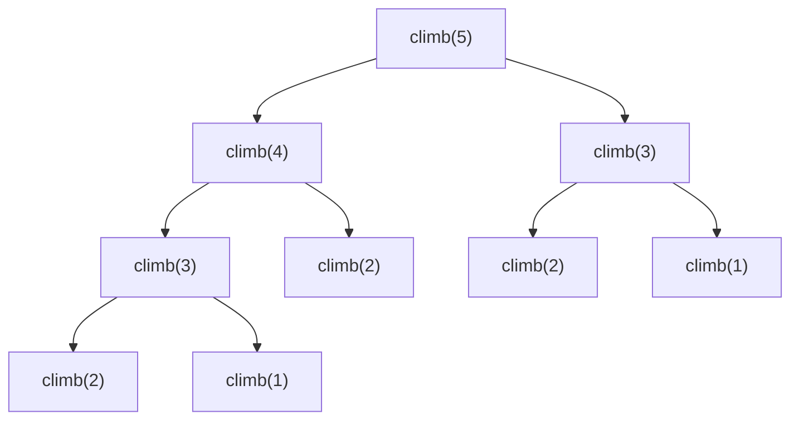

动态规划（Dynamic Programming，DP）大概是算法里最让人头疼的一块——很多人觉得它"靠灵感"。但真相是：**DP 是最讲套路的算法，一旦掌握固定框架，绝大多数入门题都能按部就班地推出来。**

本文是算法专题的第三篇，前两篇分别是 [数组·链表·哈希·二叉树](/posts/数组链表哈希二叉树高频算法面试题整理/) 和 [栈·队列·字符串](/posts/栈队列字符串高频算法面试题整理/)。本篇不堆题，而是先讲透 DP 的**思维套路**，再用一梯子经典题由易到难演练，让你以后见到 DP 题知道"该往哪想"。

> 想先补数据结构基础的，可以看 [一文通俗读懂常见数据结构](/posts/通俗理解常见数据结构/)。
{: .prompt-tip }

## 一、什么是动态规划？从"爬楼梯"打通思路

### 一个会重复计算的递归

看个经典问题：**爬楼梯**，每次能爬 1 或 2 阶，爬到第 `n` 阶有多少种走法？

稍加思考：到第 `n` 阶，要么从第 `n-1` 阶迈 1 步，要么从第 `n-2` 阶迈 2 步。所以 **到第 n 阶的走法数 = 到 n-1 阶的走法数 + 到 n-2 阶的走法数**。直接翻译成递归：

```kotlin
fun climb(n: Int): Int {
    if (n <= 2) return n
    return climb(n - 1) + climb(n - 2)  // 每次分裂成两个子问题
}
```

这段代码能跑，但**慢到爆炸**——它是 `O(2ⁿ)`。为什么？画出递归树就看到问题了：



`climb(3)` 被算了 2 次、`climb(2)` 被算了 3 次……**同一个子问题被反复重复计算**。这就是 DP 要解决的核心痛点。

### DP 的核心：拆成子问题 + 记住答案

动态规划的思想就两句话：

1. **把大问题拆成小问题**（大问题的解由小问题的解推出来）；
2. **把每个小问题的答案记下来，只算一次**（避免上面那种重复计算）。

爬楼梯的重复计算，只要拿个数组把算过的答案存起来就消失了——`O(2ⁿ)` 瞬间变 `O(n)`。这就是 DP 的威力。

> **DP vs 普通分治递归**：分治的子问题通常是**独立、不重叠**的（比如归并排序左右两半互不相干）；DP 的子问题是**重叠**的（爬楼梯里 `climb(3)` 被多个地方需要）。正因为重叠，才需要"记住答案"——这是 DP 区别于普通递归的本质。
{: .prompt-info }

## 二、DP 解题的固定套路（五步法）

以后拿到任何 DP 题，套这五步走，别靠灵感：

1. **定义状态 `dp[i]`**：想清楚 `dp[i]` 到底"表示什么"。这是最关键、最难的一步，定义对了后面全顺。
2. **写状态转移方程**：`dp[i]` 怎么由更小的 `dp[j]` 推出来。这是 DP 的核心公式。
3. **确定初始条件（base case）**：最小的子问题答案是什么（如 `dp[0]`、`dp[1]`）。
4. **确定遍历顺序**：保证算 `dp[i]` 时，它依赖的更小状态已经算好了。
5. **举例验证**：拿个小例子手推一遍 `dp` 数组，验证方程对不对。

DP 有两种等价的写法：

- **自顶向下：记忆化搜索**——还是递归，但把算过的结果缓存起来（就是给上面的 `climb` 加个 `memo` 数组）。
- **自底向上：递推**——从最小子问题开始，用循环一步步填满 `dp` 数组。面试更常用这种。

下面用五道题演练，你会看到这套框架反复出现。

## 三、爬楼梯（简单）：一维 DP 入门

> 每次爬 1 或 2 阶，爬到第 `n` 阶有多少种走法？

套五步法：

- **状态**：`dp[i]` = 爬到第 `i` 阶的走法数。
- **转移方程**：`dp[i] = dp[i-1] + dp[i-2]`。
- **初始化**：`dp[1] = 1`，`dp[2] = 2`。
- **遍历顺序**：从小到大。

```kotlin
/**
 * 爬楼梯：每次爬 1 或 2 阶，求爬到第 n 阶的走法数（递推 DP）。
 * Climbing stairs, bottom-up DP.
 * @param n 楼梯阶数
 * @return Int 走法总数
 */
fun climbStairs(n: Int): Int {
    if (n <= 2) return n
    val dp = IntArray(n + 1)
    dp[1] = 1
    dp[2] = 2
    for (i in 3..n) {
        dp[i] = dp[i - 1] + dp[i - 2]  // 状态转移
    }
    return dp[n]
}
```

- 时间 `O(n)`，空间 `O(n)`。

**空间优化：滚动变量**。注意 `dp[i]` 只用到前两个状态，根本不用整个数组，用两个变量滚动即可把空间降到 `O(1)`：

```kotlin
fun climbStairs2(n: Int): Int {
    if (n <= 2) return n
    var a = 1  // dp[i-2]
    var b = 2  // dp[i-1]
    for (i in 3..n) {
        val cur = a + b
        a = b
        b = cur
    }
    return b
}
```

这种"只保留必要的前几个状态"的技巧叫**滚动数组 / 状态压缩**，是 DP 优化空间的常用手段。

## 四、打家劫舍（中等）：带"选择"的一维 DP

> 沿街房屋各有金额 `nums`，不能偷相邻两家（会报警），求能偷到的最大金额。

这题引入 DP 最常见的模式——**"选或不选"**：对第 `i` 家，你有两个选择。

- **状态**：`dp[i]` = 偷到第 `i` 家为止能拿到的最大金额。
- **转移方程**：`dp[i] = max(dp[i-1], dp[i-2] + nums[i])`
  - `dp[i-1]`：**不偷**第 `i` 家，金额就是偷到上一家的最大值；
  - `dp[i-2] + nums[i]`：**偷**第 `i` 家，那第 `i-1` 家不能偷，得接在 `dp[i-2]` 后面。
  - 两者取大。
- **初始化**：`dp[0] = nums[0]`，`dp[1] = max(nums[0], nums[1])`。

```kotlin
/**
 * 打家劫舍：不能偷相邻两家，求最大金额。
 * House robber, cannot rob adjacent houses.
 * @param nums 每家的金额
 * @return Int 能偷到的最大金额
 */
fun rob(nums: IntArray): Int {
    if (nums.isEmpty()) return 0
    if (nums.size == 1) return nums[0]
    val dp = IntArray(nums.size)
    dp[0] = nums[0]
    dp[1] = maxOf(nums[0], nums[1])
    for (i in 2 until nums.size) {
        // 偷当前家（+dp[i-2]）还是不偷（dp[i-1]），取最优
        dp[i] = maxOf(dp[i - 1], dp[i - 2] + nums[i])
    }
    return dp[nums.size - 1]
}
```

- 时间 `O(n)`，空间 `O(n)`（同样可用滚动变量压到 `O(1)`）。

**"选或不选"是 DP 的万金油模型**：背包、子序列、股票买卖等一大批题的本质都是"每一步在若干选择里取最优"，认出这个模式，转移方程就好写了。

## 五、零钱兑换（中等）：求"最少个数"的一维 DP

> 给不同面额的硬币 `coins` 和目标金额 `amount`，求凑出 `amount` 所需的**最少硬币数**，凑不出返回 `-1`。

- **状态**：`dp[i]` = 凑出金额 `i` 所需的最少硬币数。
- **转移方程**：`dp[i] = min(dp[i - coin] + 1)`，对每个面额 `coin` 取最小——凑 `i` 元 = 凑 `i-coin` 元再加一枚 `coin`。
- **初始化**：`dp[0] = 0`（凑 0 元需要 0 枚）；其余初始化成一个"不可能"的大值。

```kotlin
/**
 * 零钱兑换：求凑出 amount 的最少硬币数，凑不出返回 -1。
 * Coin change, minimum number of coins.
 * @param coins 硬币面额数组
 * @param amount 目标金额
 * @return Int 最少硬币数，无解返回 -1
 */
fun coinChange(coins: IntArray, amount: Int): Int {
    val dp = IntArray(amount + 1) { amount + 1 }  // 用 amount+1 表示“不可能”
    dp[0] = 0
    for (i in 1..amount) {
        for (coin in coins) {
            if (coin <= i) {
                // 凑 i 元 = 凑 (i-coin) 元 + 当前这枚硬币
                dp[i] = minOf(dp[i], dp[i - coin] + 1)
            }
        }
    }
    return if (dp[amount] > amount) -1 else dp[amount]
}
```

- 时间 `O(amount × coins.size)`，空间 `O(amount)`。

**为什么不能用贪心？** 直觉上"每次尽量用大面额"看着对，但会翻车：面额 `[1,3,4]` 凑 `6`，贪心是 `4+1+1=3` 枚，而最优是 `3+3=2` 枚。这类"求最优组合"的问题，DP 遍历所有可能才能保证最优，是它优于贪心的地方。

## 六、0-1 背包（经典模型）：二维 DP 的代表

背包问题是 DP 里最重要的模型，很多题本质都是它的变体。

> 有 `n` 件物品，第 `i` 件重 `weight[i]`、价值 `value[i]`。背包容量 `W`，每件物品**只能拿一次（0 或 1 件）**。求能装下的最大总价值。

这里又是"**选或不选**"，但多了一个"容量"维度，所以是二维 DP：

- **状态**：`dp[i][j]` = 从前 `i` 件物品里挑、背包容量为 `j` 时的最大价值。
- **转移方程**：对第 `i` 件物品，
  - **不拿**：`dp[i-1][j]`；
  - **拿**（前提 `j >= weight[i]`）：`dp[i-1][j - weight[i]] + value[i]`；
  - 取两者较大。

```kotlin
/**
 * 0-1 背包：每件物品最多拿一次，求容量 W 内的最大价值。
 * 0-1 knapsack problem.
 * @param weight 每件物品的重量
 * @param value 每件物品的价值
 * @param W 背包容量
 * @return Int 能装下的最大总价值
 */
fun knapsack(weight: IntArray, value: IntArray, W: Int): Int {
    val n = weight.size
    val dp = Array(n + 1) { IntArray(W + 1) }
    for (i in 1..n) {
        for (j in 0..W) {
            // 默认不拿第 i 件
            dp[i][j] = dp[i - 1][j]
            // 装得下就考虑拿，取更优
            if (j >= weight[i - 1]) {
                dp[i][j] = maxOf(dp[i][j], dp[i - 1][j - weight[i - 1]] + value[i - 1])
            }
        }
    }
    return dp[n][W]
}
```

- 时间 `O(n × W)`，空间 `O(n × W)`。

**空间优化到一维**：因为 `dp[i]` 只依赖上一行 `dp[i-1]`，可以压成一维数组 `dp[j]`，但**内层容量要从大到小遍历**（保证每件物品只被用一次）：

```kotlin
fun knapsack1D(weight: IntArray, value: IntArray, W: Int): Int {
    val dp = IntArray(W + 1)
    for (i in weight.indices) {
        for (j in W downTo weight[i]) {  // 逆序！保证每件只拿一次
            dp[j] = maxOf(dp[j], dp[j - weight[i]] + value[i])
        }
    }
    return dp[W]
}
```

"0-1 背包内层逆序、完全背包内层正序"是背包问题的经典考点，能讲清这个逆序的原因就说明真懂了。

## 七、最长公共子序列（中等）：二维字符串 DP

> 求两个字符串 `text1`、`text2` 的最长公共子序列（LCS）的长度。子序列是删掉一些字符但不改变顺序得到的序列，如 `"ace"` 是 `"abcde"` 的子序列。

字符串 DP 的经典套路——用二维 `dp` 表示两个串的前缀关系：

- **状态**：`dp[i][j]` = `text1` 前 `i` 个字符和 `text2` 前 `j` 个字符的 LCS 长度。
- **转移方程**：
  - 若 `text1[i-1] == text2[j-1]`（当前两字符相同）：`dp[i][j] = dp[i-1][j-1] + 1`；
  - 否则：`dp[i][j] = max(dp[i-1][j], dp[i][j-1])`（丢掉其中一个串的当前字符取较优）。
- **初始化**：`dp[0][*] = dp[*][0] = 0`（空串的 LCS 为 0）。

```kotlin
/**
 * 最长公共子序列的长度。
 * Length of the longest common subsequence.
 * @param text1 字符串 1
 * @param text2 字符串 2
 * @return Int 最长公共子序列长度
 */
fun longestCommonSubsequence(text1: String, text2: String): Int {
    val m = text1.length
    val n = text2.length
    val dp = Array(m + 1) { IntArray(n + 1) }
    for (i in 1..m) {
        for (j in 1..n) {
            dp[i][j] = if (text1[i - 1] == text2[j - 1]) {
                dp[i - 1][j - 1] + 1              // 字符相同，公共长度 +1
            } else {
                maxOf(dp[i - 1][j], dp[i][j - 1]) // 不同，取丢掉一个字符后的较优
            }
        }
    }
    return dp[m][n]
}
```

- 时间 `O(m × n)`，空间 `O(m × n)`。

编辑距离、最长公共子串等一大批字符串题，都是这套"二维前缀 DP"的变体，掌握 LCS 就掌握了一个模板。

## 结语：DP 的套路与常见类型

回顾全文，DP 题的解法高度模板化，核心永远是那五步，尤其**定义对状态、写对转移方程**。常见的 DP 类型也就这么几类：

| 类型 | 代表题 | 状态特征 |
|---|---|---|
| 线性 DP | 爬楼梯、打家劫舍 | `dp[i]` 由前几个状态推出 |
| 背包 DP | 0-1 背包、零钱兑换 | 多一个"容量/目标"维度 |
| 二维 / 字符串 DP | 最长公共子序列、编辑距离 | `dp[i][j]` 表示两个前缀的关系 |
| 区间 DP | 戳气球、最长回文子串 | `dp[i][j]` 表示区间 `[i,j]` 的解 |

> 💡 **面试建议**：DP 题当场想不出来是常事，关键是**展示思考过程**——先说暴力递归，画递归树点出"子问题重叠"，再自然引出"加记忆化 / 改递推"。写代码前**先把状态定义和转移方程说清楚**，比闷头写更能拿分。练习时死磕这两步：`dp[i]` 表示什么、它怎么从更小的状态推来。想通了这两点，DP 就从"玄学"变成了"套路"。至此算法专题的三篇就凑齐了，配合 [数组链表哈希二叉树](/posts/数组链表哈希二叉树高频算法面试题整理/) 和 [栈队列字符串](/posts/栈队列字符串高频算法面试题整理/) 一起复习效果最佳。
{: .prompt-tip }
