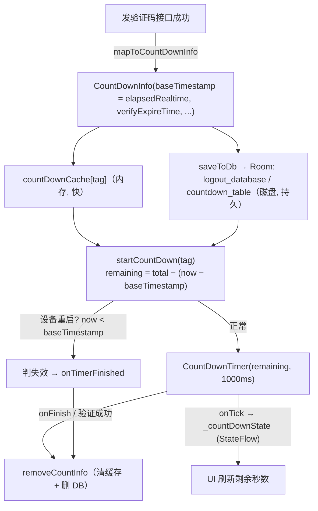

一句话概括：**倒计时不要存「还剩几秒」，而要存「一个不可篡改的时间基准点 + 总时长」，每次进来用当前时间反推剩余。** 这样 App 被杀重启能无缝续算、设备重启能自动判失效、用户改系统时间也没法作弊。本文以验证码重发冷却场景为例，拆解一个可持久化倒计时组件 `CountDownUtil` 的完整设计与源码脉络。

## 一、功能定位

`CountDownUtil` 是一个 `object` 单例，负责**验证码发送后的倒计时**（手机短信、邮箱、Passkey）。核心诉求是：

1. 在倒计时期间不允许重复发送验证码（重发按钮置灰、显示剩余秒数）。
2. **App 被杀死重启后**，倒计时要能从上次的时间点继续，而不是重新从 0 开始或直接清零。
3. **设备重启后**，之前的倒计时应判定为已失效（因为验证码在服务端也已过期，且本地计时基准已无法比较）。

它通过 `MutableStateFlow<Int>` 向 UI 推送剩余秒数，UI 层收集 `countDownState` 即可实时刷新。

---

## 二、关键数据结构

### CountDownInfo（内存模型）

```kotlin
data class CountDownInfo(
    val targetTimestamp: Long,     // 目标结束时间（基于 elapsedRealtime，仅用于 isCountDownActive 快速判断）
    val verifyExpireTime: Int,     // 验证码总时长（秒），最大 180
    val showVoiceCallDuration: Int,// 语音播报相关时长
    val baseTimestamp: Long,       // 倒计时启动那一刻的 SystemClock.elapsedRealtime()（基准点，核心字段）
    val callResult: Int = CALL_RESULT_DEFAULT
)
```

### CountDownEntity（Room 持久化实体）

存于 Room 数据库表 `countdown_table`，主键为 `mobile`（实际是 tag：`region+mobile` / `Email` / `PassKeyCountDown`）。字段与 `CountDownInfo` 一一对应，其中 `baseTimestamp` 是在数据库 **version 2→3** 迁移中新增的列（默认值 0）。

数据库名为 `logout_database`（`LogoutDatabase`），意味着这些数据是登出也要保留、只在业务显式移除时才删除的持久数据。

---

## 三、倒计时是怎么实现的

### 1. 计时器本体：`CountDownTimer`

真正的「滴答」依赖 Android 系统的 `android.os.CountDownTimer`，间隔 1000ms：

```kotlin
private fun runTimer(tag: String, duration: Long) {
    countDownTimer?.cancel()
    countDownTimer = object : CountDownTimer(duration, 1000) {
        override fun onTick(millisUntilFinished: Long) {
            val count = (millisUntilFinished.toFloat() / 1000).roundToInt()
            if (currentTag == tag) {          // 只有当前 UI 观察的 tag 才推送
                _countDownState.value = count
            }
        }
        override fun onFinish() { onTimerFinished(tag) }
    }.start()
}
```

注意 `duration` 不是固定的总时长，而是**每次启动时重新计算出来的「剩余时间」**——这正是重启后能续算的关键。

### 2. 启动/恢复：`startCountDown`

```kotlin
fun startCountDown(tag: String, countInfo: CountDownInfo? = null) {
    currentTag = tag
    scope.launch {
        val info = countInfo ?: getCountInfo(tag)   // 优先用传入的，否则从缓存/DB恢复
        ...
        val elapsedRealtimeNow = SystemClock.elapsedRealtime()
        val remaining: Long
        if (elapsedRealtimeNow < info.baseTimestamp) {
            // 设备重启：当前开机时长比记录的基准还小 → 判定已结束
            remaining = -1
        } else {
            val totalDuration = info.verifyExpireTime * 1000L
            val timePassed = elapsedRealtimeNow - info.baseTimestamp
            remaining = totalDuration - timePassed
        }
        if (remaining <= 0) { onTimerFinished(tag); return@launch }
        countDownCache[tag] = info
        saveToDb(tag, info)
        runTimer(tag, remaining)          // 用剩余时间启动系统计时器
    }
}
```

**剩余时间 = 总时长 − 已流逝时间**，而「已流逝时间」= 现在的 `elapsedRealtime` − 启动时记录的 `baseTimestamp`。所以无论 App 中途被杀多久，只要设备没重启，再次 `startCountDown` 都能算出正确的剩余秒数并接着走。

### 3. 快速判断：`isCountDownActive`

界面进来时先问一句「这个 tag 的倒计时还在有效期吗？」。如果在，就不必再请求发送验证码接口，直接续上倒计时；如果不在，才去请求新验证码。

```kotlin
val isActive = info.targetTimestamp > SystemClock.elapsedRealtime()
```

### 4. 结束与清理

- `onTimerFinished`：把状态置 0 并 `removeCountInfo`（清内存缓存 + 删 DB 记录）。
- `stopCountDown`：只取消计时器，不动数据（切页面用）。
- `stopAndRemoveCountDown`：取消计时器并删数据（验证成功、验证码被消耗后调用）。

---

## 四、如何保证「设备重启 / App 杀死重启」后信息不丢失

这套机制的精髓在于**用两个不同的时间源分别解决「持久化」和「防欺骗」两个问题**。

### 关键设计：为什么用 `SystemClock.elapsedRealtime()` 而不是 `System.currentTimeMillis()`

| 时间源 | 特性 | 问题 |
|--------|------|------|
| `System.currentTimeMillis()` | 墙上时钟（绝对时间） | 用户可手动改系统时间来「作弊」跳过倒计时 |
| `SystemClock.elapsedRealtime()` | 自**开机**以来的毫秒数（含休眠） | 用户无法篡改，但**设备重启后会归零** |

代码选择了 `elapsedRealtime`，好处是防篡改，代价是需要额外处理「重启归零」问题——而这恰好被用来天然地识别设备重启（见下）。

> 把 `elapsedRealtime` 的「设备重启归零」从缺点变成了重启检测手段：`now < baseTimestamp` 只可能由重启造成。这是整套设计里最巧的一步。
{: .prompt-tip }

### 场景一：App 被杀死后重启（设备没重启）✅ 续算

1. 每次 `startCountDown` / `addCountDownInfo` 都会调用 `saveToDb`，把 `CountDownInfo`（含 `baseTimestamp`）通过 Room 写入 `logout_database` 磁盘数据库。
2. App 重启后内存缓存 `countDownCache` 为空，`getCountInfo` 会**回退到数据库读取**：
   ```kotlin
   countDownCache[tag] ?: countDownDao.getCountDownInfo(tag)?.let { ... }
   ```
3. 由于设备没重启，`elapsedRealtime` 是连续递增的，`elapsedRealtimeNow − baseTimestamp` 就是 App 死掉这段时间也算进去的真实流逝时间，`remaining` 计算准确 → **倒计时无缝续上**。

> 持久化载体是 **Room 数据库文件**（不是内存、不是随进程消失的 SharedPreferences 缓存），所以进程被杀不影响数据。
{: .prompt-info }

### 场景二：设备重启 ✅ 判定失效

设备重启后 `SystemClock.elapsedRealtime()` 从 0 重新计。此时旧记录里的 `baseTimestamp` 是重启前某个较大的开机时长值，于是：

```kotlin
if (elapsedRealtimeNow < info.baseTimestamp) {
    // 现在的开机时长 < 记录的基准 → 一定发生过重启
    remaining = -1   // 触发 onTimerFinished，清理数据
}
```

`isCountDownActive` 里也有对称判断：`elapsedRealtimeNow < info.baseTimestamp` 即视为重启，`removeCountInfo` 后返回 false。

这样处理是合理的：验证码在服务端本就有时效（≤180s），设备重启耗时通常也让验证码过期，判定失效并让用户重新获取更安全。

### 场景三：兼容旧数据 ✅ 优雅降级

`baseTimestamp` 是后来（DB v3）才加的字段，旧版本写入的记录该字段为 0：

```kotlin
if (info.baseTimestamp == 0L) {
    // 旧格式数据，无法判断，直接当作失效并清除
    removeCountInfo(tag); return false
}
```

---

## 五、数据流总览



---

## 六、持久化三要素小结

| 要素 | 作用 | 对应实现 |
|------|------|----------|
| **落盘介质** | 进程被杀也不丢 | Room 数据库 `logout_database`（磁盘文件） |
| **计时基准 `baseTimestamp`** | 跨进程重启续算 + 识别设备重启 | `SystemClock.elapsedRealtime()` |
| **剩余时间动态计算** | 不依赖计时器持续运行 | `remaining = total − (now − baseTimestamp)` |

**一句话总结**：把「计时状态」转化为「一个不可篡改的时间基准点 + 总时长」并持久化到数据库；每次启动都用当前时间与基准点的差值反推剩余时间，从而做到 App 杀死可续算、设备重启可识别失效。

---

## 七、代码中已知的注意点（源码注释提示）

1. 部分错误码对应的 `onError` 也会消耗验证码，理论上应调用 `removeCountInfo`，但当前未覆盖全，可能导致这类情况下只能等倒计时结束才能重发。
2. 不同接口传入 `startCountDown` 的 `tag` 若相同，`isCountDownActive` 可能误判。
3. `MAX_DURATION = 180s` 为上限，`mapToCountDownInfo` 中对异常的 `verifyExpireTime` 兜底为 180。

---

## 八、怎么把这个设计讲清楚

下面按讲述结构组织，既可整段复述，也可按 STAR 拆开答。

### 8.1 一句话开场（30 秒电梯版）

> 「我做过登录/验证码模块里的一个**可持久化倒计时组件**。它要解决的核心痛点是：验证码发送后有 60~180 秒的重发冷却，而这个冷却状态在 **App 被杀死重启、甚至设备重启后都不能丢**，否则用户杀进程重进就能无限刷验证码。我的方案是**不存『剩余多少秒』，而是存一个防篡改的时间基准点，每次进来实时反推剩余时间**，用 Room 落盘保证进程被杀不丢，用 `elapsedRealtime` 保证用户改系统时间也没法作弊。」

### 8.2 STAR 结构详版

**S / T（背景与任务）**

- 登录页发验证码后需要倒计时冷却，禁止重复发送（防刷、也省短信费用）。
- 难点在于**状态持久性**：普通用 `CountDownTimer` 只活在内存里，进程一被杀就归零，用户杀进程重进即可绕过；同时要防住用户手动改系统时间。

**A（做法 —— 这是重点，要体现设计思考）**

1. **状态建模的转变**：不持久化「还剩几秒」这种会随时间失真的值，而是持久化 `baseTimestamp`（启动时刻）+ `verifyExpireTime`（总时长）。剩余时间是**每次读取时动态算出来的**：`remaining = total − (now − baseTimestamp)`。这样即使进程被杀停摆一段时间，重进也能算出真实剩余。

2. **时间源的选型**：用 `SystemClock.elapsedRealtime()` 而不是 `System.currentTimeMillis()`。
   - `currentTimeMillis` 是墙上时钟，用户改系统时间就能跳过倒计时；
   - `elapsedRealtime` 是自开机的单调时钟，用户改不了，**防作弊**；
   - 它唯一「缺点」是设备重启会归零 —— 但反而利用这一点：如果发现 `now < baseTimestamp`，就说明设备重启过，直接判倒计时失效。**把缺点变成了重启检测手段**。

3. **持久化落盘**：用 Room 数据库（而不是 SharedPreferences 内存缓存），保证进程被杀数据仍在磁盘。读取时做**两级缓存**：先查内存 `HashMap`，miss 再回退查 DB，兼顾性能和持久性。

4. **健壮性 / 兼容性**：`baseTimestamp` 是后加的字段，通过 Room Migration（v2→v3）加列并给旧数据默认 0；读取时对 `baseTimestamp == 0` 的旧格式数据做**优雅降级**，直接判失效而不是崩溃或误判。

**R（结果）**

- 实现了 App 杀进程重启无缝续算、设备重启自动失效、且用户无法通过改系统时间绕过的倒计时。
- 组件做成单例 + `StateFlow` 对外暴露，UI 只需 collect 一个状态流，手机号/邮箱/Passkey 三种场景用同一套逻辑（按 tag 区分）。

### 8.3 高频追问 & 参考答案

- **Q：为什么不直接把剩余秒数存下来，App 重启时读出来接着倒？**
  A：存下来的那一刻起它就过时了——你不知道进程被杀了多久。存「基准时间点 + 总时长」，任何时刻都能算出准确剩余，本质是**把易变的派生值换成不变的原始事实**。

- **Q：为什么不用 `System.currentTimeMillis()`？**
  A：它能被用户在设置里改，改了就能跳过倒计时。`elapsedRealtime` 单调递增、用户不可控，防作弊。

- **Q：那 `elapsedRealtime` 设备重启就归零了，倒计时不就乱了？**
  A：正好用它来检测重启——`now < baseTimestamp` 只可能是重启导致的，此时判失效即可。而且验证码在服务端本来也就 180 秒内过期，重启后判失效在业务上完全合理。

- **Q：为什么用 Room 不用 SharedPreferences？**
  A：两者都能落盘，但这里数据是结构化的（多字段、多 tag 记录），Room 更合适；而且项目里这张表放在「登出也保留」的数据库里，语义上更清晰，也方便做迁移。

- **Q：并发/线程安全怎么处理？**
  A：单例用 `@Volatile + synchronized` 双检锁；DB 操作全部走 `Dispatchers.IO` 协程，计时器回调在主线程更新 `StateFlow`。

### 8.4 可以主动暴露的「不足与改进」（体现工程 sense）

主动说局限，往往比只讲优点更能体现工程判断：

- 部分错误码的 `onError` 其实也消耗了验证码，但没能全部覆盖 `removeCountInfo`，会导致个别情况下只能等倒计时结束才能重发 —— 改进方向是和后端对齐错误码语义。
- 不同接口若传入相同 `tag`，`isCountDownActive` 可能误判 —— 改进方向是给 tag 加业务前缀做命名空间隔离。
- 目前重启判定依赖单调时钟，若要更精确可再结合服务端返回的过期时间戳做二次校验。
