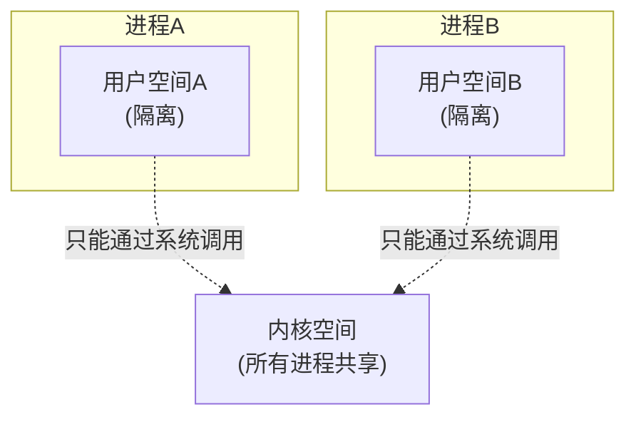
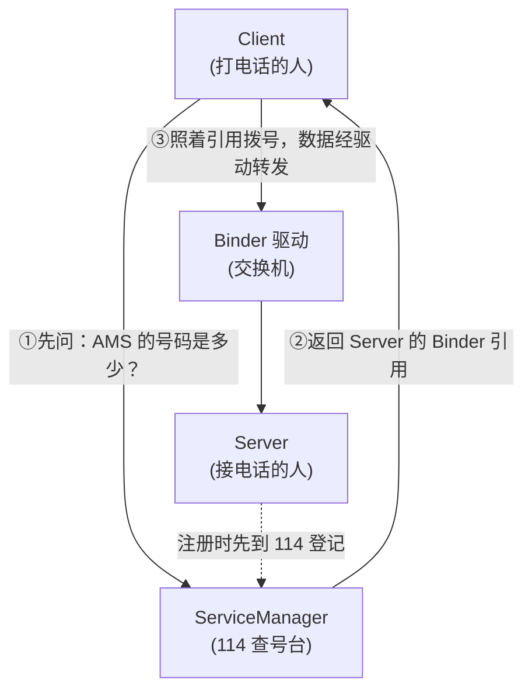
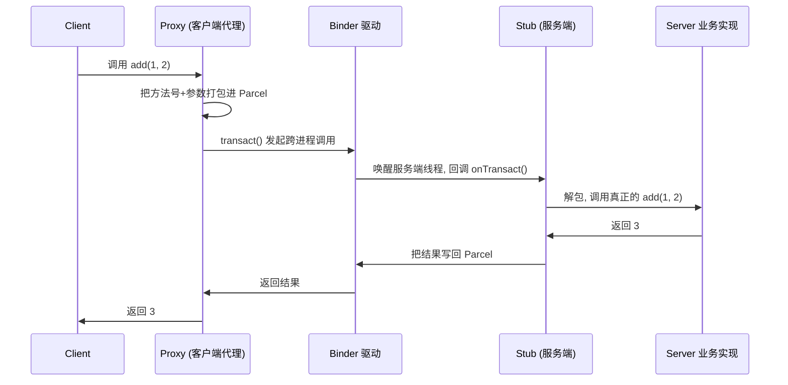

只要你写 Android，就每天在用 Binder——只是你没意识到。启动一个 Activity、`getSystemService` 拿到一个系统服务、发一条广播、绑定一个远程 Service……这些操作背后**全是进程之间在对话，而搬运消息的就是 Binder**。

Binder 是 Android 面试的"硬骨头"：它横跨应用层和内核，很多人能背出"一次拷贝""ServiceManager"这些词，却说不清它们到底怎么串起来的。本文用一个贯穿全文的类比——**打电话**——把它讲透。看完你应该能自己讲清楚：为什么要有 Binder、它凭什么快、AIDL 背后发生了什么。

> 本文侧重"讲明白原理"。它和你可能感兴趣的这几篇强相关：[Android 应用启动流程分析](/posts/Android应用启动流程分析/)、[关于 Android Service 真正的完全详解](/posts/关于Android-Service真正的完全详解，你需要知道的一切/)——四大组件的启动全都走 Binder 和系统服务通信。
{: .prompt-tip }

## 一、先搞懂：进程之间为什么不能直接通信？

要理解 Binder 解决的问题，得先知道操作系统给进程立的一堵墙——**进程隔离**。

现代操作系统里，每个进程都有一块**独立的虚拟地址空间**，彼此看不见对方的内存。这是为了安全和稳定：如果 A 进程能随便读写 B 进程的内存，一个流氓 App 就能偷光你所有数据，一个进程崩溃也可能带崩整个系统。

这块虚拟地址空间又分成两半：

- **用户空间（User Space）**：进程自己的代码和数据待的地方，**各进程互相隔离，谁也访问不了谁的**。
- **内核空间（Kernel Space）**：操作系统内核待的地方，**所有进程共享同一个内核空间**。

关键就在这里：**用户空间互相隔离，但内核空间是共享的**。所以进程间通信（IPC）的思路只有一条——**借助共享的内核空间当"中转站"**。这就好比两个不能见面的人，只能通过一个双方都信任的中间人传话。

## 二、传统 IPC 差在哪？Binder 凭什么更好？

Linux 本身就有一堆 IPC 方式：管道、消息队列、共享内存、Socket。Android 为什么还要另起炉灶搞个 Binder？因为它更看重两件事：**性能**和**安全**。

### 传统 IPC：数据要拷贝两次

以管道、消息队列为例，A 给 B 发数据的过程是：

1. 数据从 **A 的用户空间** 拷贝到 **内核空间**（一次拷贝）；
2. 数据再从 **内核空间** 拷贝到 **B 的用户空间**（第二次拷贝）。

**一来一回拷了两次**，数据大的时候性能就很难看。共享内存虽然是 0 次拷贝，但它没有天然的收发控制，权限管理复杂、容易出错，不适合做通用的系统级通信。

### 安全性：传统 IPC 不知道对方是谁

传统 IPC 大多靠"名字"或"路径"访问，接收方无法可靠地知道**发消息的到底是哪个进程、有没有权限**，身份可以伪造。

### Binder 的答案：一次拷贝 + 内核校验身份

Binder 用一个巧妙的设计做到了**只拷贝一次**，同时由内核给每次通信盖上"身份戳"（发送方的 UID/PID），接收方无法被冒充。下一节专门讲这个"一次拷贝"到底怎么做到的。

## 三、核心魔法：Binder 为什么只拷贝一次？

这是 Binder 最精髓、也是面试最爱问的一点。答案是四个字：**内存映射（mmap）**。

先记住传统 IPC 慢在"内核缓冲区和接收方用户空间是两块独立的内存，必须拷贝一次才能过去"。Binder 的做法是**让这两块内存变成同一块物理内存**：

Binder 驱动在内核里开辟一块缓冲区，然后通过 `mmap` 把这块缓冲区**同时映射到接收方进程的用户空间**。也就是说——**内核里的这块内存，和接收方用户空间看到的那块内存，其实指向同一块物理内存**。

于是发送数据时只需要：

- 发送方调用 `copy_from_user`，把数据从 **发送方用户空间** 拷贝到 **内核缓冲区** —— 就这一次；
- 因为内核缓冲区已经映射到了接收方用户空间，**接收方直接就能读到，不用再拷贝**。

> **一句话记住**：传统 IPC 是「用户空间 → 内核 → 用户空间」拷两次；Binder 靠 mmap 让「内核缓冲区」和「接收方用户空间」共用同一块物理内存，所以只需要「发送方用户空间 → 内核缓冲区」这一次拷贝。**又比共享内存安全，又比管道快**，这就是它的取舍。
{: .prompt-info }

## 四、四个角色：一次"打电话"要几个人配合？

Binder 通信有四个角色，用打电话来类比一下就非常清楚：

| Binder 角色 | 打电话类比 | 职责 |
|---|---|---|
| **Client（客户端）** | 打电话的人 | 发起请求的进程 |
| **Server（服务端）** | 接电话的人 | 提供服务的进程 |
| **ServiceManager** | 114 查号台 | 管理"服务名 → 服务地址"的映射，帮 Client 找到 Server |
| **Binder 驱动** | 电信基站/交换机 | 真正在两个进程间搬运数据，工作在内核，对上层透明 |

完整流程串起来就是：

1. **Server 注册**：Server 启动时，先把自己（比如 AMS）"登记"到 ServiceManager，相当于去 114 登记「我叫 activity，我的号码在这」。
2. **Client 查询**：Client 想用某个服务，先问 ServiceManager「activity 这个服务的引用给我」。
3. **拿到引用后通信**：Client 拿到的其实是 Server 的一个**代理（Binder 引用）**，之后所有调用都通过 Binder 驱动这个"交换机"转发给真正的 Server。

> **ServiceManager 自己也是个 Binder 服务**，它的引用是一个约定好的固定值（handle = 0）。这就解决了"先有鸡还是先有蛋"的问题：所有进程一出生就知道 0 号是 114，不需要再去查号台查号台的号码。
{: .prompt-tip }

## 五、Binder 实体与引用：号码和"真人"的关系

有一个概念一定要分清，否则后面 AIDL 看不懂：

- 在 **Server 进程**里，Binder 对象是一个**实体（binder_node）**——它是"真人本体"。
- 当这个 Binder 被传给 **Client 进程**时，Client 拿到的不是本体，而是一个**引用/句柄（handle）**——相当于"号码"。

Client 拿着号码（引用）发起调用，Binder 驱动负责把"号码"翻译成"真人"，找到对应的 Server 实体并把请求转过去。**同一个 Binder 实体，可以被很多 Client 各自持有一份引用**，就像同一个人的电话号码可以存在很多人的通讯录里。

## 六、应用层：AIDL 背后到底发生了什么？

平时我们不会直接跟 Binder 驱动打交道，而是用 **AIDL**。你写一个 `.aidl` 接口，编译器自动生成一堆代码，核心是两个东西：

- **Stub**：给 **Server** 用的抽象类，继承自 `Binder`，你在服务端继承它并实现真正的业务方法。
- **Proxy**：给 **Client** 用的代理类，Client 调用它，它内部负责把方法调用"打包"成数据发出去。

一次跨进程方法调用的过程是这样的：

几个关键点：

- **Parcel** 是 Binder 传输数据的载体，负责把参数"序列化"成一段可以跨进程搬运的字节，到对面再"反序列化"回来。这也是为什么跨进程传的对象必须实现 `Parcelable`。
- Client 调用 `Proxy` 的方法，感觉就像调用本地方法一样，但底层其实经历了 `transact()` → 驱动 → `onTransact()` 这一整趟。这种"让远程调用看起来像本地调用"的设计就叫 **代理模式**。
- 默认情况下，Client 的调用是**同步阻塞**的：它会一直等 Server 返回结果才继续。如果不需要返回值，可以用 `oneway` 声明成异步，发完就走不等结果。

### 你天天用的系统服务，全是 Binder 代理

`getSystemService()` 拿到的 AMS、WMS、PMS 这些系统服务，运行在 **system_server 进程**里，和你的 App 不是一个进程。你拿到的是它们的 **Binder 代理**，每次调用都通过 Binder 跨进程跑到 system_server 去执行。启动 Activity 时 App 和 AMS 的那一大段来回，本质就是 Binder 通信（可结合 [Android 应用启动流程分析](/posts/Android应用启动流程分析/) 一起看）。

## 七、几个绕不开的细节（也是高频考点）

### 1. Binder 线程池

每个使用 Binder 的进程，都有一个由内核管理的 **Binder 线程池**，专门用来处理别的进程发来的请求（即执行 `onTransact`）。线程池默认最大 **16 个线程**（1 个主 Binder 线程 + 最多 15 个）。

**这解释了一个经典坑**：AIDL 服务端的方法是在 Binder 线程池里执行的，**不是主线程**，所以里面不能直接更新 UI；反过来，如果服务端方法里做耗时操作，可能把线程池占满导致别的请求排队。

### 2. 传输数据有大小限制：1MB

Binder 为每个进程映射的内核缓冲区大小是有限的，大约 **1MB**（准确说是 `1MB - 8KB` 左右），而且是**整个进程所有 Binder 事务共享**的。

**这解释了另一个经典崩溃**：`TransactionTooLargeException`。当你想通过 Intent、Bundle 跨进程传一个大 Bitmap 或者一大坨数据时，一旦超过这个限制就会崩。正确做法是传文件路径、URI，或者用共享内存等方式，而不是把大数据塞进 Binder 事务。

### 3. 为什么 Android 偏爱 Binder？

综合前面几点，可以总结成三句话：

- **性能好**：一次拷贝，只比共享内存多一次，比管道/Socket 少一半。
- **安全**：内核给每次通信盖上发送方的 UID/PID，身份无法伪造，还能做权限控制。
- **面向对象、好用**：通过 AIDL/代理，跨进程调用写起来跟调用本地对象几乎一样。

## 八、面试话术（口语化背诵版）

下面把高频问题整理成"面试可以直接说出口"的版本，尽量口语化、有逻辑、能体现深度。

### Q1：什么是 Binder？为什么 Android 要用它而不用传统 IPC？

> 💡 **这样答**：Binder 是 Android 里最主要的进程间通信机制。因为操作系统有进程隔离，两个进程的用户空间互相访问不了，只能借助共享的内核空间中转。Linux 本来就有管道、Socket、共享内存这些 IPC，但 Android 更看重性能和安全：管道、Socket 要拷贝两次数据，共享内存虽然快但不好做权限控制。Binder 用内存映射做到了**只拷贝一次**，性能接近共享内存；同时由内核在每次通信时打上发送方的 UID/PID，身份没法伪造，安全性也有保障。再加上它通过 AIDL 让跨进程调用写起来跟本地调用一样方便，所以成了 Android 的首选。

### Q2：Binder 为什么只需要一次拷贝？（最高频）

> 💡 **这样答**：关键在内存映射 mmap。传统 IPC 慢，是因为数据要先从发送方用户空间拷到内核，再从内核拷到接收方用户空间，两次。Binder 驱动会在内核开一块缓冲区，通过 mmap 把这块缓冲区**同时映射到接收进程的用户空间**，让它俩指向同一块物理内存。这样发送时只要用 `copy_from_user` 把数据从发送方用户空间拷到内核缓冲区，接收方因为共享了这块内存直接就能读到，所以总共只拷贝了一次。

### Q3：Binder 通信有哪几个角色，怎么协作？

> 💡 **这样答**：四个角色，可以用打电话理解。Client 是打电话的、Server 是接电话的、ServiceManager 是 114 查号台、Binder 驱动是交换机。Server 启动时先去 ServiceManager 登记自己；Client 想用服务时先问 ServiceManager 要到 Server 的 Binder 引用，之后拿着这个引用发请求，数据由 Binder 驱动在内核里转发给 Server。ServiceManager 自己也是个 Binder 服务，它的句柄固定是 0，所以所有进程天生就知道怎么找到它，解决了"先有鸡还是先有蛋"的问题。

### Q4：AIDL 的原理是什么？Stub 和 Proxy 是干嘛的？

> 💡 **这样答**：AIDL 本质是帮我们自动生成 Binder 通信的模板代码，核心是 Stub 和 Proxy。Stub 在服务端，继承自 Binder，我在里面实现真正的业务；Proxy 在客户端，是个代理。客户端调用 Proxy 的方法时，Proxy 把方法编号和参数打包进 Parcel，调用 `transact` 发起跨进程调用；Binder 驱动唤醒服务端线程回调 `onTransact`，服务端解包、执行真正的方法、再把结果打包回来。整个过程用了代理模式，让远程调用看起来像本地调用。要注意传输的对象必须能被 Parcel 序列化，也就是实现 Parcelable。

### Q5：为什么会有 TransactionTooLargeException？

> 💡 **这样答**：因为 Binder 给每个进程映射的内核缓冲区大概只有 1MB，而且是整个进程所有 Binder 事务共享的。当我通过 Intent 或 Bundle 跨进程传一个大 Bitmap 或者一大块数据、超过这个限制时，就会抛 TransactionTooLargeException。解决办法是别把大数据塞进 Binder，改成传文件路径、URI，或者走共享内存这类方式。

### Q6：AIDL 服务端的方法运行在哪个线程？

> 💡 **这样答**：运行在服务端进程的 Binder 线程池里，不是主线程。这个线程池默认最大 16 个线程。所以两点要注意：一是服务端方法里不能直接更新 UI，因为不在主线程；二是如果方法里做耗时操作，会占着线程池的线程，并发请求一多就会排队甚至阻塞。

> 💡 **收尾加分项**：如果面试官还想深挖，可以主动补一句——「我们平时 `getSystemService` 拿到的 AMS、WMS 这些系统服务，其实都是运行在 system_server 进程里的 Binder 代理，启动 Activity、发广播这些操作本质上都是我的 App 通过 Binder 和系统服务在通信。」这句话能体现你把 Binder 和整个 Android 框架串起来了。
{: .prompt-tip }
