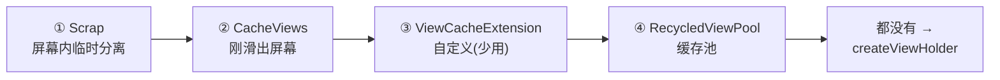
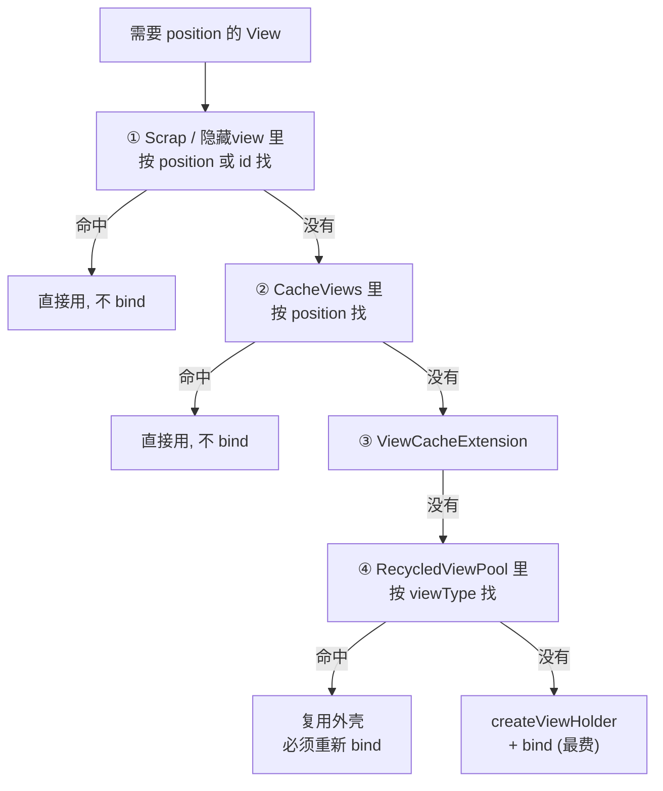

RecyclerView 顾名思义——**Recycler，回收再利用**。它能流畅滑动上万条数据，靠的就是一套精巧的缓存复用机制。这套机制常被叫作"四级缓存"，是 Android 列表优化和面试的必考内容。

很多人能背出"Scrap、Cache、Pool"这几个名字，却答不上来最关键的两个问题：**它们各自缓存的是什么？命中之后要不要重新 `onBindViewHolder`？** 本文把这套机制彻底讲清楚。

> 本文聚焦缓存复用这条主线。想了解 View 是怎么被测量绘制出来的，可以配合 [View 的绘制流程](/posts/View的绘制流程/) 一起看。
{: .prompt-tip }

## 一、先想明白：为什么需要缓存复用？

手机屏幕就那么大，一次最多显示十几个 item。假设一个列表有 1 万条数据，如果每滑动一下都为新出现的 item **重新 `new` 一个 View、重新 `findViewById`**，会带来两个昂贵的开销：

1. **创建 View（inflate 布局）**：要解析 XML、反射创建控件，很慢；
2. **绑定数据（bind）**：`findViewById` + 设置数据。

RecyclerView 的核心洞察是：**滑出屏幕的 item 和即将滑入屏幕的 item，布局结构往往是一样的**。既然如此，何必销毁重建？把滑出去的 ViewHolder **回收**起来，等新 item 进来时**复用**它——省下的正是上面那两笔开销。

所以理解缓存的关键，就是盯住这两笔开销分别能不能省：

- **能不能省下 `createViewHolder`（创建 View）？**
- **能不能省下 `onBindViewHolder`（绑定数据）？**

四级缓存的本质区别，就在于**命中不同的缓存，能省下的开销不一样**。

## 二、四级缓存分别是什么？

RecyclerView 的缓存都由内部类 `Recycler` 管理，从"离屏幕最近、最省事"到"最远、最费事"依次是：

| 级别 | 名称 | 缓存什么 | 命中后要 bind 吗？ | 默认大小 |
|---|---|---|---|---|
| ① | **Scrap**（`mAttachedScrap` / `mChangedScrap`） | 屏幕上正在重新布局、临时分离的 ViewHolder | **不用**（数据没变） | 不限 |
| ② | **CacheViews**（`mCachedViews`） | 刚滑出屏幕的 ViewHolder，按 position 精确匹配 | **不用**（原样恢复） | 2 |
| ③ | **ViewCacheExtension** | 开发者自定义的缓存 | 看实现 | 无 |
| ④ | **RecycledViewPool** | 按 viewType 分类的"净化后"ViewHolder | **要**（只复用外壳） | 每种 type 5 个 |

下面逐个说清楚。

### ① Scrap：屏幕内的"临时寄存"

当 RecyclerView 因为局部刷新（比如 `notifyItemChanged`）**重新布局**时，会先把当前屏幕上的 ViewHolder **临时分离**下来放进 Scrap，布局完再原样贴回去。

- `mAttachedScrap`：数据没变化的 ViewHolder，贴回去时**直接复用，不用重新 bind**。
- `mChangedScrap`：数据变了的 ViewHolder，用于做 change 动画。

**特点**：只在一次布局过程中短暂存在，是"寄存"而非"回收"，命中它连数据都不用重新绑。

### ② CacheViews：刚滑走的"临时缓存"

`mCachedViews` 缓存**刚刚滑出屏幕**的 ViewHolder，默认只存 **2 个**。它的精髓在于**按 position（位置）精确匹配**：

想象你把一个 item 往上滑出去一点点，又马上往下滑回来——这时它的 position 没变、数据没变，CacheViews 能精确命中，**原样恢复，不用重新 bind**。这就是为什么"来回小幅滑动"特别流畅。

**特点**：按 position 匹配，命中后**不需要重新 bind**，因为它保存的就是那个位置原本的样子。

### ③ ViewCacheExtension：自定义缓存

一个留给开发者自己实现的扩展缓存，绝大多数场景用不到，面试提一句"知道有这么个东西、一般不用"即可。

### ④ RecycledViewPool：真正的"回收站"

前两级都装不下时，ViewHolder 就进入 `RecycledViewPool`。这是真正意义上的"回收站"：

- 它**按 viewType 分类存放**（用 `SparseArray` 存，每种 type 默认存 **5 个**）；
- 进池之前 ViewHolder 会被**重置（清掉数据、位置等信息）**，变成一个"干净的空壳"；
- 所以从池里取出来复用时，**只省下了创建 View 的开销，数据必须重新 `onBindViewHolder`**。

**特点**：只按 viewType 匹配（不认 position），命中后**一定要重新 bind**。而且它可以被**多个 RecyclerView 共享**——这是嵌套列表优化的关键手段（后面讲）。

## 三、一次"要 View"的完整查找流程

当 RecyclerView 需要位置 `position` 的 View 时，`Recycler` 会按顺序去各级缓存里找（源码入口是 `tryGetViewHolderForPositionByDeadline`）：

一句话概括这张图：**越靠前的缓存越省事**。Scrap 和 CacheViews 连数据都不用重新绑（因为它们记得"这个位置原来长什么样"），Pool 只能帮你省下创建 View 的钱、数据得重新绑，全都落空才走最贵的"创建 + 绑定"。

> **面试高频区分点**：为什么 Scrap/Cache 命中不用 bind，而 Pool 命中要 bind？因为 **Scrap 和 CacheViews 是按 position 缓存的**，缓存的就是那个位置的完整样子，原样拿回来即可；而 **Pool 是按 viewType 缓存的**、进池时已被重置成空壳，它只知道"这是个什么类型的布局"，不知道该显示谁的数据，所以必须重新绑定。
{: .prompt-info }

## 四、用这套机制做列表优化

理解了原理，几个常见优化手段就都能说清"为什么有用"了：

- **`setItemViewCacheSize(size)`**：调大 CacheViews 的容量（默认 2）。列表来回滑动频繁时，加大它能提高"滑回来"的命中率，减少 bind。
- **多个 RecyclerView 共享 `RecycledViewPool`**：比如首页有多个横向 RecyclerView 嵌在一个竖向 RecyclerView 里、item 布局又相同，共享一个 Pool 能让它们互相复用 ViewHolder，减少创建。设置 `pool.setMaxRecycledViews(viewType, count)` 还能调整每种 type 的缓存数量。
- **`setHasFixedSize(true)`**：当 item 尺寸固定、不因数据变化而变时开启，能让 RecyclerView 跳过一些不必要的重新测量布局。
- **用 `DiffUtil` + 局部刷新代替 `notifyDataSetChanged`**：`notifyDataSetChanged` 会让所有可见 item 都重新绑定；而 `notifyItemChanged` 配合 **payload** 可以只刷新变化的那一小部分，甚至只更新 item 里的某个控件，避免整条重绑。

> 别滥用 `notifyDataSetChanged()`。它相当于告诉 RecyclerView"所有数据都可能变了"，会触发大范围重绑，还会丢失局部刷新动画。优先用 `DiffUtil` 算出差异做精准的增删改。
{: .prompt-warning }

## 五、面试话术（口语化背诵版）

### Q1：RecyclerView 为什么高效？说说它的缓存机制。

> 💡 **这样答**：核心是回收复用。屏幕一次只显示十几个 item，滑出去的 ViewHolder 结构往往和滑进来的一样，所以 RecyclerView 不销毁它，而是回收起来给新 item 复用，省下创建 View 和绑定数据这两笔开销。它有四级缓存：Scrap 是屏幕内重新布局时临时分离的，CacheViews 缓存刚滑出屏幕的、按位置匹配，ViewCacheExtension 是自定义的一般不用，RecycledViewPool 是按 viewType 分类的回收池。查找时从前往后依次找，越靠前越省事。

### Q2：四级缓存里，哪些命中后不用重新 bind，哪些要？为什么？

> 💡 **这样答**：Scrap 和 CacheViews 命中不用重新 bind，RecycledViewPool 命中一定要 bind。原因是缓存的匹配维度不同：Scrap 和 CacheViews 是**按 position 缓存**的，缓存的就是那个位置完整的样子，原样拿回来就行；而 Pool 是**按 viewType 缓存**的，ViewHolder 进池前会被重置成一个干净的空壳，只保留布局类型信息，不知道该显示谁的数据，所以取出来必须重新 onBindViewHolder。

### Q3：CacheViews 和 RecycledViewPool 有什么区别？

> 💡 **这样答**：三个区别。第一，匹配维度：CacheViews 按 position 精确匹配，Pool 按 viewType 匹配。第二，要不要 bind：CacheViews 命中直接复用，Pool 命中要重新绑数据。第三，作用域和大小：CacheViews 默认只存 2 个、属于单个 RecyclerView；Pool 每种 type 默认存 5 个，而且可以被多个 RecyclerView 共享。CacheViews 优化的是"来回小幅滑动"的场景，Pool 优化的是"大量同类型 item 反复创建"的场景。

### Q4：RecyclerView 有哪些性能优化手段？

> 💡 **这样答**：几个常用的。一是 `setItemViewCacheSize` 调大 CacheViews，提高来回滑动的命中率；二是多个布局相同的 RecyclerView 共享 RecycledViewPool，减少重复创建，嵌套列表尤其有用；三是 item 尺寸固定时 `setHasFixedSize(true)` 跳过不必要的重新布局；四是用 DiffUtil 加 payload 做局部刷新，别动不动 `notifyDataSetChanged`，避免全量重绑。再往上就是 item 布局层级扁平化、图片按需加载这些通用优化了。

> 💡 **收尾加分项**：可以主动补一句——"RecyclerView 的缓存复用思想其实和线程池、Bitmap 复用池是一脉相承的，都是**用一个对象池避免频繁创建销毁昂贵对象**，理解了这个模式，很多性能优化就触类旁通了。"
{: .prompt-tip }
