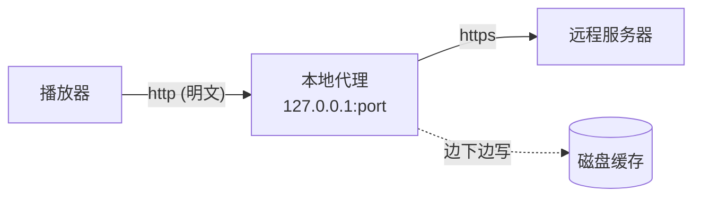
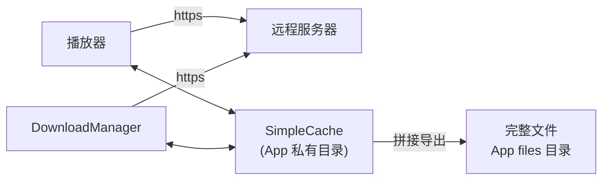
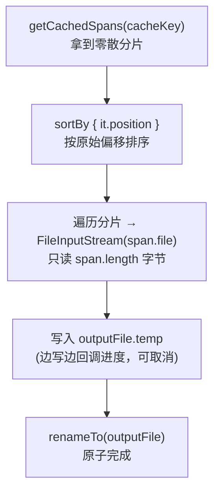

这篇记录的是在企业级协同办公客户端上做的一次播放器缓存方案改造。它和之前那篇偏实现细节的 [《基于 Media3 的视频缓存与完整文件导出实践》](/posts/基于-Media3-的视频缓存与完整文件导出实践/) 是姊妹篇：那篇讲「怎么用 Media3 把缓存做出来、把文件导出来」的完整代码；这篇讲「**为什么要从旧的本地 HTTP 代理切过来**」——一次由安全审计驱动的架构决策，以及切换过程中绕不开的几个原理问题。

> 更完整的产品与分层背景，可参考同一款客户端的架构复盘：[《企业级协同办公 Android 客户端架构复盘》](/posts/企业级协同办公-Android-客户端架构复盘/)。
{: .prompt-info }

## 一、背景：一次由安全审计驱动的切换

播放器的媒体缓存经历了一次方案切换：

- **旧方案**：ExoPlayer + 本地 HTTP 代理（思路类似 AndroidVideoCache / VideoProxy）。
- **新方案**：Media3 进程内缓存 + 自实现的「缓存导出」逻辑。

切换的**主要动因是旧方案存在安全风险**——应用市场审核与安全扫描直接把它标记为漏洞；同时新方案在能力统一、可维护性上也更优。下面按「旧方案错在哪 → 新方案好在哪 → 官方没提供的导出怎么补」这条线展开。

## 二、旧方案：本地 HTTP 代理是怎么缓存的

本地 HTTP 代理的核心做法是：**在 App 内部起一个本地 HTTP Server**，监听 `127.0.0.1:某端口`。播放器不再直接请求远程 `https://...`，而是请求 `http://127.0.0.1:port/xxx`，由这个本地代理去拉远程数据、边下边缓存、再回吐给播放器。



看起来很顺——播放器无感、缓存也做到了。但问题恰恰出在「起了一个本地监听端口」这件事本身。

## 三、旧方案的安全风险

风险本质来自「**在设备上开了一个谁都能连的本地监听端口**」：

1. **本地监听端口是暴露的攻击面**
   Android 上 loopback 端口没有进程级隔离，**同一台设备上任意一个其他 App 都能连接这个端口**。安全扫描（应用市场审核、渗透测试、等保检测）通常会直接把「App 开放本地 socket 监听」标记为漏洞。

2. **可能被当作开放代理滥用（类 SSRF）**
   如果代理是根据 URL 参数去拉远程资源的，恶意本地 App 就能借你的进程去请求任意地址，等于把你的 App 变成一个「跳板 / 开放代理」，甚至借此绕过一些网络限制。

3. **明文 HTTP + 请求头泄露**
   播放器到代理这一跳走的是明文 `http`（哪怕在 loopback 上）。而播放请求往往要带 `Referer` 这类鉴权 / 来源头，旧代理在转发时这些头存在从本地端口泄露的风险。同时为了让明文 loopback 生效，往往要放宽 `usesCleartextTraffic` / 网络安全配置，削弱了 App 整体的明文流量策略。

4. **端口可预测、无鉴权**
   端口容易被枚举，代理本身一般没有身份校验，其他 App 访问缓存内容没有门槛。

> 常见的一个反驳是「loopback 不是只有本机能访问吗？」。关键在于：**本机能访问 = 同设备任意 App 都能访问**——Android 没有做进程级的 loopback 隔离，所以它不是「只有我自己能连」，而是「装在这台手机上的每个 App 都能连」。
{: .prompt-warning }

## 四、新方案：Media3 缓存 + 导出

新方案完全走 Media3 进程内缓存，**不再起任何本地服务器**：

- 用 `SimpleCache` + `CacheDataSource` 在进程内直接读写缓存，缓存文件落在 App 私有目录；
- `DownloadManager` 做预加载，播放和下载**共用同一个 `SimpleCache`**；
- 自实现 `exportCacheFile`，把缓存分片拼接导出成一个真实文件到 App files 目录。



两套方案逐维度对比：

| 维度 | 旧方案（本地 HTTP 代理） | 新方案（Media3 缓存导出） |
| --- | --- | --- |
| 攻击面 | 开放本地监听端口，任意 App 可连 | 无 socket、无本地服务器，攻击面消除 |
| 数据流转 | 经本地端口中转，存在暴露点 | 缓存 / 导出文件全部在 App 私有沙箱内 |
| 加密 | 播放器↔代理为明文 loopback | 端到端 HTTPS，少一跳明文中转 |
| 依赖 | 第三方代理库 | Google 官方 Media3（ExoPlayer 演进版） |
| 能力 | 缓存与导出割裂 | 边播边缓存 / 预加载 / 导出共用同一套缓存 |

一句话总结：**旧方案的风险本质是「为了缓存而开了一个谁都能连的本地端口」；新方案把缓存收回到进程内 + App 沙箱里，用官方库直接管理，既去掉了那个端口攻击面，也保住了 HTTPS 全程加密。**

## 五、Media3 没有「导出」能力，是怎么补上的

有一个现实前提：**Media3 官方只提供「缓存」，不提供「把缓存导出成一个完整文件」这个能力。** 导出是业务层自己实现的。要理解它，先要理解 Media3 的缓存到底长什么样。

### 5.1 底层形态：分片（CacheSpan）

`SimpleCache` **不是**把一个视频存成一个完整文件，而是拆成很多**分片（`CacheSpan`）**，每个分片是缓存目录里一个独立的小文件，命名和索引由 Media3 内部（`StandaloneDatabaseProvider`）管理。

所以**没法直接去缓存目录抓文件用**——文件名是 Media3 的内部编码，内容是零散的片段。Media3 只暴露了读取分片列表的 API：`getCachedSpans(cacheKey)`。每个 `CacheSpan` 带有：

`position`
: 该分片在原始文件中的偏移

`length`
: 该分片有效长度

`file`
: 分片对应的磁盘文件

`isCached`
: 是否已缓存

### 5.2 导出 = 逆向拼接

导出做的就是「把零散分片按顺序还原成一个完整文件」：



几个关键点：

1. **按 `position` 排序**：分片在磁盘上是乱序的（边下边存、可能多线程），必须按在原始文件中的偏移排好，否则拼出来的文件是错乱的。不能用文件名或写入时间来排。
2. **只读 `span.length`**：Media3 的分片文件末尾可能有 padding，必须用 `bytesToReadInSpan = span.length` 控制只读有效长度，不能整块照抄。
3. **先写 `.temp` 再 rename**：全程写到 `xxx.temp`，拼完再 `renameTo` 成最终文件。中途失败 / 取消就删掉临时文件，保证导出结果**要么完整要么不存在**，不会留下一个「看着正常、其实残缺」的坏文件。
4. **全程可取消**：每个分片、每次读写循环都检查 `coroutineContext.isActive`，配合外层 `Job` 随时取消。

核心循环大致长这样（完整实现见姊妹篇）：

```kotlin
val cachedSpans = cache.getCachedSpans(cacheKey).toMutableList()
cachedSpans.sortBy { it.position }   // 按原始偏移排序，这是拼接正确的前提

for (span in cachedSpans) {
    if (!coroutineContext.isActive) throw CancellationException()
    if (!span.isCached || span.file == null) continue

    var bytesToReadInSpan = span.length   // 只读这个分片有效的长度
    FileInputStream(span.file).use { input ->
        while (bytesToReadInSpan > 0) {
            val read = input.read(buffer)
            if (read == -1) break
            val toWrite = min(read.toLong(), bytesToReadInSpan).toInt()
            outputStream.write(buffer, 0, toWrite)
            bytesToReadInSpan -= toWrite
        }
    }
}
```

> `SimpleCache` / `CacheDataSource` / `DownloadManager` 的完整配置，`CacheKeyFactory` 稳定化、完整性判断、导出加锁、`preloadAndExportFile` 的自动化编排，都在 [《基于 Media3 的视频缓存与完整文件导出实践》](/posts/基于-Media3-的视频缓存与完整文件导出实践/) 里有可落地的完整代码，这里不再重复。
{: .prompt-tip }

## 六、一个前提：先下全，再导出

因为导出只是「把已缓存的分片拼起来」，**缓存到哪就导出到哪**。所以要导出一个完整可播放的文件，得先保证缓存是完整的：

- 先用 `DownloadManager` 把整个 URL 下载进 `SimpleCache`（下载和播放共用同一个 cache）；
- 下载成功回调里才触发导出去拼接。

配套的完整性判断也是围绕分片做的：拿 `ContentMetadata.KEY_CONTENT_LENGTH`（媒体真实总长）和已缓存范围 `[0, contentLength]` 对比，确认是否全部命中；导出后再用缓存记录的总长与导出文件实际大小做二次校验。

## 七、几个关键设计点

- **CacheKey 稳定性**：`CacheKeyFactory` 里 `clearQuery()` 移除 URL 的 `?` 后参数，保证同一资源在 token / 时间戳等参数变化时仍命中同一份缓存。
- **文件命名兼容**：同时兼容旧命名（完整 URL 的 MD5）和新命名（去参数 URL 的 MD5），避免历史缓存一刀切失效。
- **资源释放**：退出时统一释放 `DownloadManager` 和所有 `SimpleCache` 实例。

### 7.1 同一个视频 URL 的并发处理

「同一个视频被同时预加载 / 导出会不会打架」是这套方案里最容易踩坑的地方。这里的并发**分三层**，而且三层都挂在同一个归一化后的 `cacheKey` 上——上一条的 `clearQuery()` 正是让「同一个视频」能被识别成同一个 key 的前提，否则三层锁都对不上。

**① 下载层：`DownloadManager` 按 cacheKey 天然去重。**
`DownloadRequest` 用 cacheKey 当 id，Media3 内部按这个 id 维护下载索引。对同一 URL 并发发起预加载，多次 `addDownload` 相同 id 会**合并到同一个下载任务**，而不是起多份并行下载。这一层的并发是 Media3 帮忙去重的，业务侧不用加锁。

```kotlin
DownloadRequest.Builder(cacheKey, uri)   // cacheKey 即 download id
    .setCustomCacheKey(cacheKey)
    .build()
```

**② 导出层：per-cacheKey 的 `Mutex` 互斥。**
用一个 `ConcurrentHashMap<String, Mutex>` 给每个 cacheKey 维护一把锁，导出时 `mutex.withLock { exportCacheFile(...) }`：

```kotlin
private val exportMutexes = ConcurrentHashMap<String, Mutex>()

private fun getOrPutMutex(cacheKey: String): Mutex {
    var mutex = exportMutexes[cacheKey]
    if (mutex == null) {
        val newMutex = Mutex()
        // putIfAbsent 原子：两个线程同时发现没锁，最终也只会用同一个实例
        mutex = exportMutexes.putIfAbsent(cacheKey, newMutex) ?: newMutex
    }
    return mutex
}
```

效果是**不同 URL 并行导出、同一 URL 串行导出**，避免两个任务同时写同一个输出文件 / 同一个 `.temp`，也避免进度互相干扰。

**③ 缓存读写层：单例 `SimpleCache` 兜底。**
`SimpleCache` 按缓存目录做单例（Media3 规定同一目录只能有一个实例）。播放器读缓存和 `DownloadManager` 写缓存共用这同一个实例，span 级别的并发读写由 `SimpleCache` 内部保证线程安全。

串起来看「预加载后自动导出」的路径就是：下载去重（①）→ 完成后进入 per-URL 串行导出（②）→ 落盘走单例 cache（③），全程可通过 `exportJob` 取消，取消 / 失败会删掉半成品文件。

> 有一个边角要注意：如果按 cacheKey 存下载 / 导出监听的 map 是「直接覆盖写」，那么对同一 URL **并发**发起两次预加载导出时，后一次会覆盖掉前一次的 listener 引用——写文件安全有第 ② 层 Mutex 兜底不会出问题，但前一个 listener 可能残留在 `DownloadManager` 上清理不掉。更稳妥的做法是「第二次直接复用第一次的 job / 早返回」，而不是各跑一遍。
{: .prompt-warning }

## 八、用打比方通俗理解

技术细节之外，这套改造用两个比喻就能讲清楚。

**为什么旧方案有风险——「开了一扇没锁的后门」。**
旧方案相当于：为了缓存视频，App 在手机里偷偷开了一个「小服务器」，播放器通过 `http://127.0.0.1:端口` 去拿数据。问题是这个端口**手机上别的 App 也能连**——等于为了送外卖方便，开了一扇谁都能推开的后门。别人可能顺着这个门读你的缓存，甚至借你的 App 去帮它请求别的网站（把你当跳板），而且这一段还是明文。所以安全审计一看「App 开了监听端口」就直接判漏洞。

**新方案好在哪——「把后门直接拆了」。**
缓存不再经过任何服务器，而是 Media3 在 App 内部自己读写，文件都放在 App 私有目录里，别的 App 碰不到；请求也是端到端 HTTPS。而且它是 Google 官方库，播放、预加载、缓存都是同一套东西，更好维护。

**导出是怎么做的——「把碎片按位置拼回去」。**
Media3 存缓存不是存成一个大文件，而是**拆成很多小碎片**分开存的，文件名和顺序都是它内部管理的，直接去目录里翻是拼不出来的。导出就是调它的 API 把所有碎片列出来，**按每个碎片在原视频里的位置排好序，再一个接一个读出来、顺序写进一个新文件**——每个碎片只读有效的那部分，先写临时文件、拼完再改名，中途失败也不会留下坏文件。

## 九、几个常见疑问

| 疑问 | 要点 |
| --- | --- |
| loopback 端口不是只有本机能访问吗，为什么算风险？ | 本机能访问 = 同设备任意 App 都能访问，Android 没有进程级隔离；无鉴权、可枚举、可被当跳板，安全审计直接判漏洞。 |
| 缓存碎片乱序，怎么保证拼对？ | 每个 `CacheSpan` 带 `position`（原文件偏移），按它排序后顺序写；不能用文件名或时间顺序。 |
| 导出到一半失败 / 取消怎么办？ | 全程写临时文件 `.temp`，成功才 `renameTo`；失败 / 取消删临时文件，保证「要么完整要么不存在」。 |
| 怎么判断缓存是完整的？ | 用 `ContentMetadata` 里的真实总长 `KEY_CONTENT_LENGTH`，和已缓存范围 `[0, 总长]` 对比。 |
| 同一个视频被同时导出会不会写坏？ | 按 `cacheKey` 加 `Mutex`：不同 URL 并行、同一 URL 串行。 |
| URL 参数每次都变，缓存会失效吗？ | 自定义 `CacheKeyFactory` 时 `clearQuery()` 去掉 `?` 后参数，保证 key 稳定、命中同一份缓存。 |

## 十、总结

1. **旧方案风险**：本地 HTTP 代理为了缓存开了一个谁都能连的监听端口，带来攻击面暴露、类 SSRF 滥用、明文与请求头泄露等安全问题。
2. **新方案价值**：Media3 进程内缓存把数据收回到 App 沙箱，去掉了端口攻击面，保住了 HTTPS 全程加密，且缓存 / 预加载 / 导出统一为一套官方能力。
3. **导出实现**：Media3 官方不提供导出，业务层通过 `getCachedSpans` 拿到所有分片，按 `position` 排序后逐片顺序拼接成完整文件，用 temp + rename 保证原子性，并在下载完整后再触发导出。

> 想直接看落地代码（`SimpleCache` 配置、`CacheKeyFactory`、完整性判断、导出加锁、预加载后自动导出），移步姊妹篇 [《基于 Media3 的视频缓存与完整文件导出实践》](/posts/基于-Media3-的视频缓存与完整文件导出实践/)。
{: .prompt-tip }

## 十一、面试怎么讲这段经历

如果把这段改造当作面试里「讲一个你做过的技术优化」来答，不要一上来堆术语，先用一句话讲清「改了什么、为什么改」，再按对方追问逐层深入。前面第八节的两个比喻（后门 / 碎片）和第九节的常见疑问，就是应对追问的弹药。

**一句话版本（电梯陈述）**

> 「我们播放器的视频缓存，原来靠在 App 里起一个本地 HTTP 小服务器来做，安全扫描说这个开放端口有风险；我把它换成了 Google 官方 Media3 的进程内缓存，端口没了、数据也不出 App 沙箱。因为 Media3 只能缓存、不能把缓存导出成一个完整文件，导出这块是我自己实现的——把它零散存的缓存分片按顺序拼回一个完整文件。」

**30 秒口播稿（可直接背）**

> 「我做过一个播放器缓存方案的安全改造。原来的视频缓存是靠在 App 里起一个本地 HTTP 小服务器实现的，播放器通过 `127.0.0.1` 的端口去拿数据。但这个端口手机上别的 App 也能连，安全审计判定它是漏洞——相当于为了缓存开了一扇谁都能推开的后门，还可能被别人当跳板。
>
> 我把它换成了 Google 官方 Media3 的进程内缓存：端口直接没了，数据全在 App 私有目录里，请求也是端到端 HTTPS。不过 Media3 只能缓存、不能把缓存导出成一个完整文件——它是把视频拆成很多碎片分开存的。所以导出这块是我自己实现的：把所有碎片按它在原视频里的位置排好序，顺序拼成一个完整文件，全程先写临时文件、成功再改名，保证要么完整要么不存在。
>
> 改完之后，既消除了那个端口的安全风险，也保留了边播边缓存、预加载、导出这些能力，而且都统一在一套官方库上，更好维护。」

**背诵要点（三段式）**：① 旧方案是什么 + 为什么有风险（打比方）→ ② 换成 Media3 解决了什么 → ③ 官方没有的导出我怎么补上的 + 最终收益。
