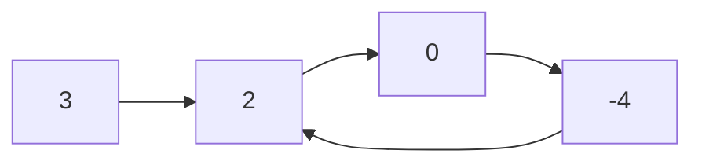
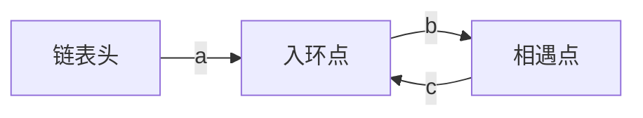
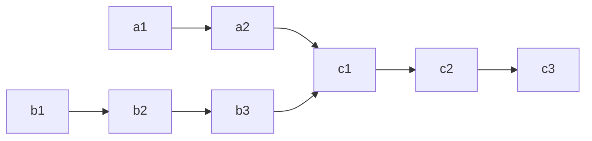
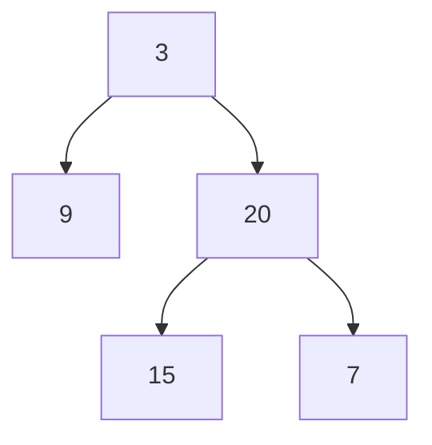

算法题是 Android/后端面试绕不开的一关，而**数组、链表、哈希表、二叉树**是其中出现频率最高的四类数据结构。本文把力扣（LeetCode）与牛客网上高频出现的题目按这四类整理成一份复习清单，覆盖简单与中等难度。

**每道题都遵循同一套结构**：先讲清题意与思路，给出 Kotlin 实现，再对比暴力解等非最优解法，并分析时间/空间复杂度——面试真正的加分项往往不是"写出能跑的代码"，而是"能说清为什么这个解法最优、还有哪些解法各自差在哪里"。

> 本文所有代码基于 Kotlin，链表节点统一用 `ListNode`、二叉树节点统一用 `TreeNode`，定义如下，后续题目不再重复：
>
> ```kotlin
> class ListNode(var value: Int) {
>     var next: ListNode? = null
> }
>
> class TreeNode(var value: Int) {
>     var left: TreeNode? = null
>     var right: TreeNode? = null
> }
> ```
{: .prompt-info }

## 一、数组

数组考点集中在**双指针、二分查找、滑动窗口、前缀和**这几类技巧上，核心思想都是"用一次或有限次遍历替代嵌套遍历"。

### 1. 移动零（简单）

> 给定数组 `nums`，将所有 `0` 移到末尾，同时保持非零元素的相对顺序。要求原地操作。

**最优解：双指针（快慢指针）**。把数组想象成两个区域：`[0, slow)` 是"已经排好的非零区"，`slow` 指向下一个非零元素应该落脚的位置；`fast` 负责向前探路，逐个扫描每个元素。

- `fast` 遇到 `0`：跳过（这个 0 迟早会被后面的非零元素换走，或最终留在末尾），`slow` 不动。
- `fast` 遇到非零：把它交换到 `slow` 位置，然后 `slow++`，让非零区扩大一格。

为什么交换能保证顺序不乱？因为 `slow` 始终 ≤ `fast`，`slow` 到 `fast` 之间要么是 0、要么是已经被换到后面的元素，交换只会把非零元素往前"压实"、把 0 往后推，非零元素之间的相对先后不变。

以 `[0,1,0,3,12]` 为例：`fast=1` 时把 `1` 换到 `slow=0`，得到 `[1,0,0,3,12]`，`slow→1`；`fast=3` 把 `3` 换到 `slow=1`，得到 `[1,3,0,0,12]`，`slow→2`；`fast=4` 把 `12` 换到 `slow=2`，得到 `[1,3,12,0,0]`。结束。

```kotlin
/**
 * 移动零：将所有 0 移到数组末尾，保持非零元素相对顺序。
 * Move all zeros to the end while keeping the order of non-zero elements.
 * @param nums 待处理的整型数组
 */
fun moveZeroes(nums: IntArray) {
    var slow = 0
    for (fast in nums.indices) {
        if (nums[fast] != 0) {
            // 把非零元素交换到前面，slow 之前全是已排好的非零元素
            val tmp = nums[slow]
            nums[slow] = nums[fast]
            nums[fast] = tmp
            slow++
        }
    }
}
```

- 时间复杂度 `O(n)`，空间复杂度 `O(1)`，一次遍历原地完成。

**非最优解：额外数组**。开一个新数组，先拷贝所有非零元素，再补 0，最后写回。时间同样 `O(n)`，但空间退化到 `O(n)`，且不满足"原地"要求，面试中会被追问优化。

### 2. 最大子数组和（简单/中等）

> 找出 `nums` 中具有最大和的连续子数组，返回其和。例如 `[-2,1,-3,4,-1,2,1,-5,4]` 的答案是 `6`（子数组 `[4,-1,2,1]`）。

**最优解：动态规划 / Kadane 算法**。核心是转换问题：与其枚举所有子数组，不如只关心"**以每个位置结尾**的最大子数组和"，最后在这 n 个值里取最大。

定义 `cur` = 以 `nums[i]` 结尾的最大子数组和。到了位置 `i`，前面那段（以 `i-1` 结尾的最优子数组，和为 `cur`）只有两种命运：

- 如果 `cur > 0`，它对当前元素是"正贡献"，接上它更划算，于是 `cur = cur + nums[i]`；
- 如果 `cur ≤ 0`，它是个累赘，带上只会拉低总和，不如**从当前元素重新起一段**，于是 `cur = nums[i]`。

两种情况合并成一行 `cur = maxOf(nums[i], cur + nums[i])`。再用 `best` 记录一路上见过的最大 `cur`——注意答案不一定在末尾，所以要用一个独立变量随时"截图"最大值。

以 `[-2,1,-3,4,-1,2,1,-5,4]` 为例，`cur` 的变化是 `-2 → 1 → -2 → 4 → 3 → 5 → 6 → 1 → 5`，过程中的最大值 `6` 就是答案（对应子数组 `[4,-1,2,1]`）。

```kotlin
/**
 * 最大子数组和（Kadane 算法）。
 * Maximum subarray sum using Kadane's algorithm.
 * @param nums 整型数组
 * @return Int 最大连续子数组的和
 */
fun maxSubArray(nums: IntArray): Int {
    var cur = nums[0]   // 以当前元素结尾的最大和
    var best = nums[0]  // 全局最大和
    for (i in 1 until nums.size) {
        // 要么接在前面后面，要么从当前元素重新开始
        cur = maxOf(nums[i], cur + nums[i])
        best = maxOf(best, cur)
    }
    return best
}
```

- 时间 `O(n)`，空间 `O(1)`。

**非最优解一：暴力枚举**。双层循环枚举所有子数组起止点求和，`O(n²)`（甚至朴素求和到 `O(n³)`）。数据量一大就超时。

**非最优解二：分治**。把数组从中间劈开，最大子数组要么在左半、要么在右半、要么横跨中点，递归求解，`O(n log n)`。比暴力好但仍不如 Kadane，面试中作为"能想到多种解法"的加分项提一下即可。

### 3. 盛最多水的容器（中等）

> 数组 `height` 中每个元素代表一根竖线的高度，找出两条线与 x 轴围成容器可盛最多的水。

**最优解：双指针**。面积 = `宽 × 高`，其中宽是两指针的下标差，高是**较短的那条边**（水会从矮的一侧溢出）。左右指针分别从两端向中间收缩，关键在于"每次移动哪一边"。

假设当前 `height[left] < height[right]`，此时面积被 `left` 卡住。如果移动**长边** `right`：宽一定变小，而高最多还是 `height[left]`（甚至更小），面积绝不可能变大——所以以 `left` 为短边的所有组合里，当前这个宽度最大的就是最优的，可以放心舍弃 `left`，把它往中间挪一格去博一个更高的边。反之移动短边才有翻盘的可能。

这就是双指针的精髓：**每移动一步，就一次性排除掉一整批不可能更优的组合**，从而把 `O(n²)` 的枚举压到 `O(n)`，且保证不会漏掉真正的最优解。

```kotlin
/**
 * 盛最多水的容器：双指针求最大面积。
 * Container with most water, solved with two pointers.
 * @param height 每根竖线的高度数组
 * @return Int 可容纳的最大水量
 */
fun maxArea(height: IntArray): Int {
    var left = 0
    var right = height.size - 1
    var best = 0
    while (left < right) {
        val area = minOf(height[left], height[right]) * (right - left)
        best = maxOf(best, area)
        // 移动较短的一边，才有可能获得更大面积
        if (height[left] < height[right]) left++ else right--
    }
    return best
}
```

- 时间 `O(n)`，空间 `O(1)`。

**非最优解：暴力枚举**。双层循环枚举每一对线求面积，`O(n²)`。双指针本质是"每次排除掉不可能更优的一大批组合"，把 `O(n²)` 降到 `O(n)`。

### 4. 三数之和（中等）

> 找出 `nums` 中所有和为 `0` 且不重复的三元组。

**最优解：排序 + 双指针**。三数之和为 0，可以固定其中一个数 `nums[i]`，问题就退化成"在剩下的数里找两个数，和为 `-nums[i]`"——这正是两数之和。而这里选择**先排序**，是为了能用双指针 `O(n)` 地解决这个子问题，并顺带解决"去重"这个最麻烦的点。

排序后，在 `i` 的右侧用 `left`、`right` 两个指针从两端夹逼：

- `sum < 0`：和太小，需要更大的数，`left++`；
- `sum > 0`：和太大，需要更小的数，`right--`；
- `sum == 0`：命中，记录一组，然后 `left`、`right` 同时向内收缩继续找。

**去重是本题最容易翻车的地方**，靠排序后"跳过相邻相同值"解决，分两层：外层固定值 `nums[i]` 若和上一个相同就 `continue`（否则会产生重复的三元组）；命中一组后，内层也要跳过与当前 `nums[left]`/`nums[right]` 相同的值。此外 `if (nums[i] > 0) break` 是个提前剪枝——排序后最小的固定值都大于 0，三个正数不可能凑成 0。

```kotlin
/**
 * 三数之和：找出所有和为 0 的不重复三元组。
 * Find all unique triplets that sum to zero.
 * @param nums 整型数组
 * @return List 所有满足条件的三元组
 */
fun threeSum(nums: IntArray): List<List<Int>> {
    nums.sort()
    val res = mutableListOf<List<Int>>()
    for (i in nums.indices) {
        if (nums[i] > 0) break            // 最小值已 >0，后面不可能凑成 0
        if (i > 0 && nums[i] == nums[i - 1]) continue  // 跳过重复的固定值
        var left = i + 1
        var right = nums.size - 1
        while (left < right) {
            val sum = nums[i] + nums[left] + nums[right]
            when {
                sum < 0 -> left++
                sum > 0 -> right--
                else -> {
                    res.add(listOf(nums[i], nums[left], nums[right]))
                    // 跳过重复的左右值，避免重复三元组
                    while (left < right && nums[left] == nums[left + 1]) left++
                    while (left < right && nums[right] == nums[right - 1]) right--
                    left++
                    right--
                }
            }
        }
    }
    return res
}
```

- 时间 `O(n²)`（排序 `O(n log n)` + 外层遍历每次内层 `O(n)`），空间 `O(log n)`（排序栈开销，不计结果）。

**非最优解：暴力三重循环 + 去重**。`O(n³)` 枚举所有三元组，再用 Set 去重。逻辑直白但性能差，是"排序+双指针"要优化掉的对象。

### 5. 合并区间（中等）

> 给出若干区间 `intervals`，合并所有重叠区间。例如 `[[1,3],[2,6],[8,10]]` → `[[1,6],[8,10]]`。

**最优解：按起点排序后线性合并**。乱序时，任意两个区间都可能重叠，判断起来是 `O(n²)`。而**按起点升序排序**后有一个关键性质：能和某区间重叠的，只可能是紧跟在它后面的区间——因为后面区间的起点都 ≥ 当前起点，只要后一个的起点没超过前一个的终点，就一定重叠。

于是只需一趟遍历，维护结果列表的最后一个区间 `last`：

- 当前区间起点 `> last[1]`：中间有空隙，不重叠，作为新区间加入；
- 否则重叠，把 `last` 的终点扩展为 `max(last[1], 当前终点)`（当前区间可能被 `last` 完全包住，所以取较大值而非直接覆盖）。

以 `[[1,3],[2,6],[8,10]]` 为例：先放入 `[1,3]`；`[2,6]` 起点 `2 ≤ 3` 重叠，终点扩为 `6`，得 `[1,6]`；`[8,10]` 起点 `8 > 6` 不重叠，新开区间。最终 `[[1,6],[8,10]]`。

```kotlin
/**
 * 合并区间：合并所有重叠的区间。
 * Merge all overlapping intervals.
 * @param intervals 区间数组，每个元素为 [start, end]
 * @return Array 合并后的区间数组
 */
fun merge(intervals: Array<IntArray>): Array<IntArray> {
    if (intervals.isEmpty()) return emptyArray()
    // 按起点升序排序，保证重叠区间相邻
    intervals.sortBy { it[0] }
    val res = mutableListOf<IntArray>()
    for (interval in intervals) {
        val last = res.lastOrNull()
        if (last == null || interval[0] > last[1]) {
            res.add(interval)          // 不重叠，新开区间
        } else {
            last[1] = maxOf(last[1], interval[1])  // 重叠，扩展终点
        }
    }
    return res.toTypedArray()
}
```

- 时间 `O(n log n)`（瓶颈在排序），空间 `O(log n)`（不计结果数组）。

**非最优解：两两比较反复合并**。不排序，反复扫描数组两两判断是否重叠并合并，直到没有可合并的为止，最坏 `O(n²)` 甚至更差。排序把"任意两区间可能重叠"变成"只有相邻区间可能重叠"，是效率提升的关键。

### 6. 搜索旋转排序数组（中等）

> 升序数组在某点旋转（如 `[0,1,2,4,5,6,7]` 变成 `[4,5,6,7,0,1,2]`），在其中查找 `target`，存在返回下标否则返回 `-1`。要求 `O(log n)`。

**最优解：改进二分**。普通二分依赖数组整体有序，而旋转后整体无序，不能直接用。但旋转数组有个救命的性质：**无论从哪个中点 `mid` 劈开，左右两半里至少有一半是完全有序的**（旋转点只会落在其中一半）。

于是每一步先判断哪半有序，再看 `target` 是否落在那个"有序半"的值域内：

- `nums[left] <= nums[mid]`：说明**左半 `[left, mid]` 有序**。若 `target` 落在 `[nums[left], nums[mid]]` 里，收缩到左半 `right = mid - 1`；否则去右半 `left = mid + 1`。
- 否则**右半 `[mid, right]` 有序**。若 `target` 落在 `[nums[mid], nums[right]]` 里，去右半；否则去左半。

诀窍是：**永远拿有序的那一半来判断**，因为只有在有序区间里，"target 是否在 `[端点, 端点]` 之间"这个判断才可靠；无序的那一半留到下一轮劈开后再说。每轮仍然砍掉一半，所以维持 `O(log n)`。

```kotlin
/**
 * 搜索旋转排序数组：在旋转后的升序数组中二分查找目标值。
 * Binary search in a rotated sorted array.
 * @param nums 旋转后的数组
 * @param target 目标值
 * @return Int 目标值下标，不存在返回 -1
 */
fun search(nums: IntArray, target: Int): Int {
    var left = 0
    var right = nums.size - 1
    while (left <= right) {
        val mid = left + (right - left) / 2
        when {
            nums[mid] == target -> return mid
            // 左半段有序
            nums[left] <= nums[mid] -> {
                if (target in nums[left]..nums[mid]) right = mid - 1
                else left = mid + 1
            }
            // 右半段有序
            else -> {
                if (target in nums[mid]..nums[right]) left = mid + 1
                else right = mid - 1
            }
        }
    }
    return -1
}
```

- 时间 `O(log n)`，空间 `O(1)`。

**非最优解：线性扫描**。直接遍历找 `target`，`O(n)`。能过但完全没用上"部分有序"这个条件，面试要求 `O(log n)` 时会被判不合格。

## 二、链表

链表考点几乎全部围绕**指针操作**：虚拟头节点（dummy）、快慢指针、迭代 vs 递归。链表题的通用技巧是**用一个 dummy 头节点简化边界处理**。

### 1. 反转链表（简单）

> 反转一个单链表。

**最优解：迭代（三指针）**。反转的本质是把每个节点的 `next` 指针**掉头**，让它指向自己的前驱。用 `prev` 记住已经反转好的那一段的头（初始为 `null`，因为原头节点反转后会成为尾、其 `next` 应为 `null`），`cur` 指向当前待处理的节点。

每一步做四件事，顺序不能乱：

1. `next = cur.next`：先用临时变量存住下一个节点，否则下一步改掉 `cur.next` 后就找不到后续链表了；
2. `cur.next = prev`：掉头，指向前驱；
3. `prev = cur`：`prev` 前移到当前节点；
4. `cur = next`：`cur` 前移到之前存好的下一个。

如此 `prev` 像滚雪球一样带着"已反转段"前进，`cur` 走到 `null` 时，`prev` 正好是新的头节点。以 `1→2→3` 为例：处理完 `1` 后 `prev=1`（`1→null`），处理完 `2` 后 `prev=2`（`2→1→null`），处理完 `3` 后 `prev=3`（`3→2→1→null`），返回 `prev`。

```kotlin
/**
 * 反转链表（迭代法）。
 * Reverse a singly linked list iteratively.
 * @param head 链表头节点
 * @return ListNode 反转后的新头节点
 */
fun reverseList(head: ListNode?): ListNode? {
    var prev: ListNode? = null
    var cur = head
    while (cur != null) {
        val next = cur.next  // 暂存下一个节点
        cur.next = prev      // 反转指针
        prev = cur           // prev、cur 同步后移
        cur = next
    }
    return prev
}
```

- 时间 `O(n)`，空间 `O(1)`。

**非最优解：递归**。思路是先一路递归到链表尾部，把后半段反转好，再回过头处理当前节点。关键的 `head.next!!.next = head` 值得琢磨：此时 `head.next` 还指着原来的下一个节点，而那个节点现在是已反转段的尾部，让它的 `next` 指回 `head`，就把 `head` 接到了反转段末尾；紧接着 `head.next = null` 把自己的旧指针断掉（否则会和刚建立的指针形成环）。代码简洁但递归栈深度 `O(n)`，链表很长时有栈溢出风险：

```kotlin
/**
 * 反转链表（递归法）。
 * Reverse a singly linked list recursively.
 * @param head 链表头节点
 * @return ListNode 反转后的新头节点
 */
fun reverseListRecursive(head: ListNode?): ListNode? {
    if (head?.next == null) return head
    val newHead = reverseListRecursive(head.next)
    head.next!!.next = head  // 让下一个节点反过来指向自己
    head.next = null
    return newHead
}
```

- 时间 `O(n)`，空间 `O(n)`（递归栈）。因空间开销，迭代法更优。

### 2. 环形链表（简单）

> 判断链表中是否有环。

**最优解：快慢指针（Floyd 判圈）**。慢指针每次走一步，快指针每次走两步。用"操场跑圈"来理解：如果跑道是环形的，跑得快的人早晚会从后面追上（套圈）跑得慢的人；如果跑道是直线（无环），快的人一直冲到终点 `null`，永远不会和慢的人相遇。

为什么"必然相遇"而不会错过？因为两者速度差恰好是 1——一旦都进入环内，快指针相对慢指针每步逼近 1 个身位，距离逐格缩小到 0，绝不会"一步跨过去"擦肩而过。判断相遇用 `slow === fast`（引用相等，比较是不是同一个节点对象）。快指针一旦走到 `null`（或 `fast.next` 为 `null`），说明存在链尾，即无环。

下图中 `-4` 的 `next` 指回 `2` 形成环，`fast` 进入环后会一圈圈追上 `slow`：



```kotlin
/**
 * 判断链表是否有环（快慢指针）。
 * Detect whether a linked list has a cycle.
 * @param head 链表头节点
 * @return Boolean 有环返回 true
 */
fun hasCycle(head: ListNode?): Boolean {
    var slow = head
    var fast = head
    while (fast?.next != null) {
        slow = slow?.next        // 慢指针走一步
        fast = fast.next?.next   // 快指针走两步
        if (slow === fast) return true  // 相遇即有环
    }
    return false
}
```

- 时间 `O(n)`，空间 `O(1)`。

**非最优解：哈希表**。遍历时把访问过的节点存入 Set，若再次遇到已存在的节点说明有环。时间 `O(n)` 但空间 `O(n)`。快慢指针把空间降到常数，是这道题的标准最优解。

### 3. 环形链表 II：返回入环节点（中等）

> 若链表有环，返回入环的第一个节点，否则返回 `null`。

**最优解：快慢指针 + 数学推导**。先用上一题的快慢指针找到相遇点，再让一个指针回到链表头、另一个留在相遇点，两者**同速（每次一步）**前进，它们再次相遇的地方就是入环点。

这个"回到头再同速走"的操作为什么能命中入环点？设头到入环点距离为 `a`，入环点到相遇点距离为 `b`，相遇点再绕回入环点距离为 `c`（即环长 = `b + c`）。相遇时慢指针走了 `a + b`，快指针走了慢指针的两倍且多绕了 `n` 圈：`2(a+b) = a + b + n(b+c)`。化简得 `a = (n-1)(b+c) + c`。

这个式子的含义是：**从头走 `a` 步到入环点**，恰好等于**从相遇点走 `c` 步（再加上绕 `n-1` 圈）也到入环点**。所以让两个指针分别从头和相遇点同速出发，走过相同步数后必然在入环点碰面。

下图标出了三段距离 `a`、`b`、`c`（`b + c` 为环长）：



```kotlin
/**
 * 返回链表入环的第一个节点。
 * Return the node where the cycle begins, or null if no cycle.
 * @param head 链表头节点
 * @return ListNode 入环节点，无环返回 null
 */
fun detectCycle(head: ListNode?): ListNode? {
    var slow = head
    var fast = head
    while (fast?.next != null) {
        slow = slow?.next
        fast = fast.next?.next
        if (slow === fast) {
            // 相遇后，一个指针回到头，两指针同速前进再次相遇即入环点
            var ptr = head
            while (ptr !== slow) {
                ptr = ptr?.next
                slow = slow?.next
            }
            return ptr
        }
    }
    return null
}
```

- 时间 `O(n)`，空间 `O(1)`。

**非最优解：哈希表**。遍历节点存入 Set，第一个重复出现的节点就是入环点，`O(n)` 空间。逻辑更直观，但空间不如快慢指针。

### 4. 合并两个有序链表（简单）

> 将两个升序链表合并为一个新的升序链表。

**最优解：迭代 + dummy 头节点**。这是"归并排序"合并步骤的链表版：两个链表各有一个指针 `p1`、`p2`，每次比较两者当前节点，把较小的那个"摘"下来接到结果链表尾部，并让对应指针后移。

难点在于结果链表的头节点该是谁一开始并不知道，且每次接节点都要操作"尾部的 `next`"。**dummy（虚拟头）节点**正是为此而生：先造一个不存实际值的哑节点，用 `tail` 指针始终指向结果链表的当前末尾，接节点只需 `tail.next = 选中节点; tail = tail.next`，完全不用为"第一个节点"写特殊分支。当某个链表走空后，另一个链表剩余部分已经有序，直接用 `tail.next = p1 ?: p2` 整体接上即可。最后返回 `dummy.next`——跳过哑节点，才是真正的头。

```kotlin
/**
 * 合并两个有序链表。
 * Merge two sorted linked lists into one sorted list.
 * @param l1 第一个升序链表
 * @param l2 第二个升序链表
 * @return ListNode 合并后的升序链表头节点
 */
fun mergeTwoLists(l1: ListNode?, l2: ListNode?): ListNode? {
    val dummy = ListNode(0)  // 虚拟头节点，避免单独处理头部
    var tail = dummy
    var p1 = l1
    var p2 = l2
    while (p1 != null && p2 != null) {
        if (p1.value <= p2.value) {
            tail.next = p1
            p1 = p1.next
        } else {
            tail.next = p2
            p2 = p2.next
        }
        tail = tail.next!!
    }
    tail.next = p1 ?: p2  // 接上剩余部分
    return dummy.next
}
```

- 时间 `O(m+n)`，空间 `O(1)`。

**非最优解：递归**。每次比较头节点，递归合并剩余部分。代码更短但递归栈 `O(m+n)`，长链表有栈溢出风险，所以空间上不如迭代。

### 5. 删除链表的倒数第 N 个节点（中等）

> 删除链表倒数第 `n` 个节点并返回头节点，尽量一趟遍历完成。

**最优解：快慢指针一次遍历**。要删倒数第 `n` 个节点，最直接的想法是先数出总长再算正数第几个，但那要遍历两趟。用双指针可以把"倒数"转化成两指针之间固定的**间距**，一趟搞定。

让 `fast` 先走 `n` 步，此时 `fast` 和 `slow` 之间隔着 `n` 个节点。然后两者同速前进，当 `fast` 走到最后一个节点（`fast.next == null`）时，这个 `n` 的间距保证了 `slow` 恰好停在**待删节点的前一个**——因为要删除某节点必须拿到它的前驱，才能用 `slow.next = slow.next.next` 把它跳过去。

这里 dummy 节点解决的是"删的正好是头节点"这个边界：若不加 dummy，删头节点时 `slow` 没有前驱可站。让 `slow`、`fast` 都从 dummy 出发，头节点也有了统一的"前驱"，返回 `dummy.next` 即可。

```kotlin
/**
 * 删除链表的倒数第 N 个节点（一次遍历）。
 * Remove the n-th node from the end of the list in one pass.
 * @param head 链表头节点
 * @param n 倒数第几个（从 1 开始）
 * @return ListNode 删除后的链表头节点
 */
fun removeNthFromEnd(head: ListNode?, n: Int): ListNode? {
    val dummy = ListNode(0)
    dummy.next = head
    var fast: ListNode? = dummy
    var slow: ListNode? = dummy
    repeat(n) { fast = fast?.next }  // 快指针先走 n 步
    // 同步前进，直到快指针到末尾
    while (fast?.next != null) {
        fast = fast?.next
        slow = slow?.next
    }
    slow?.next = slow?.next?.next    // 跳过待删节点
    return dummy.next
}
```

- 时间 `O(n)`，空间 `O(1)`，只遍历一趟。

**非最优解：两次遍历**。第一趟统计链表长度 `L`，第二趟走到第 `L-n` 个节点删除。时间同为 `O(n)` 但需要遍历两趟。快慢指针的价值在于"一趟搞定"，面试题干里那句"尽量一趟完成"就是在暗示这个解法。

### 6. 相交链表（简单）

> 找到两个单链表相交的起始节点，不相交返回 `null`。

**最优解：双指针走对方的路**。两条链表若相交，从交点开始的**后半段是完全共享的**，长度相同，差别只在交点之前各自的长度不同（设为 `a` 和 `b`，公共段长 `c`）。麻烦的正是这个长度差——若能让两个指针"对齐"到距离交点相同的位置，同步走就能相遇。

技巧是让指针 `pA` 走完 A 再接着走 B，`pB` 走完 B 再接着走 A。这样两个指针各自走的总路程都是 `a + b + c`，天然抵消了长度差。于是：

- 若相交，两指针必在交点处相遇（此时都走了 `a + c + b` 或 `b + c + a`，步数相同）；
- 若不相交，两者会在各自走完 `a + b` 后**同时**变成 `null`，循环条件 `pA !== pB` 不再成立而退出，返回 `null`。

无需提前计算长度差，"走对方的路"这一步就把它消化掉了。

下图中两条链表在 `c1` 交汇，公共段 `c1→c2→c3` 被两者共享：



```kotlin
/**
 * 找到两个链表的相交起始节点。
 * Find the node at which two linked lists intersect.
 * @param headA 链表 A 的头节点
 * @param headB 链表 B 的头节点
 * @return ListNode 相交节点，不相交返回 null
 */
fun getIntersectionNode(headA: ListNode?, headB: ListNode?): ListNode? {
    var pA = headA
    var pB = headB
    // 走到头就换到对方链表，抵消长度差
    while (pA !== pB) {
        pA = if (pA == null) headB else pA.next
        pB = if (pB == null) headA else pB.next
    }
    return pA
}
```

- 时间 `O(m+n)`，空间 `O(1)`。

**非最优解：哈希表**。先把链表 A 的所有节点存入 Set，再遍历 B，第一个在 Set 中出现的节点即交点。`O(m+n)` 时间但 `O(m)` 空间。双指针巧妙地用"走对方的路"抵消了长度差，把空间降为常数。

## 三、哈希

哈希表的核心价值是**用 `O(1)` 的查找替代 `O(n)` 的遍历**，从而把很多"暴力双重循环 `O(n²)`"的问题优化到 `O(n)`。前缀和 + 哈希更是子数组类问题的杀手锏。

### 1. 两数之和（简单）

> 数组中找出和为 `target` 的两个数的下标。

**最优解：哈希表一次遍历**。暴力解要为每个数 `nums[i]` 回头去找"另一个数 `target - nums[i]`"，这个"查找"是 `O(n)` 的。哈希表的作用就是把这个查找变成 `O(1)`。

边遍历边建表，对每个 `nums[i]`：先算出它需要的搭档 `need = target - nums[i]`，去表里查 `need` 有没有出现过——**注意是先查再存**。因为表里存的都是"当前元素之前"出现过的数，查到就说明找到了一对下标且互不相同；查不到再把当前 `值→下标` 存进去，留给后面的元素当搭档。这样只需一趟遍历，且天然避免了一个数和自己配对。

```kotlin
/**
 * 两数之和：返回和为 target 的两个数的下标。
 * Return indices of the two numbers that add up to target.
 * @param nums 整型数组
 * @param target 目标和
 * @return IntArray 两个数的下标
 */
fun twoSum(nums: IntArray, target: Int): IntArray {
    val map = HashMap<Int, Int>()  // 值 -> 下标
    for (i in nums.indices) {
        val need = target - nums[i]
        if (map.containsKey(need)) return intArrayOf(map[need]!!, i)
        map[nums[i]] = i
    }
    return intArrayOf()
}
```

- 时间 `O(n)`，空间 `O(n)`。

**非最优解：暴力双重循环**。枚举所有两数组合，`O(n²)` 时间、`O(1)` 空间。哈希表用 `O(n)` 的额外空间换来时间从 `O(n²)` 降到 `O(n)`，是典型的空间换时间。

### 2. 有效的字母异位词（简单）

> 判断字符串 `t` 是否是 `s` 的字母异位词（字母种类和个数完全相同，仅顺序不同）。

**最优解：计数数组**。异位词的本质是"每种字母出现的次数完全相同"，所以只要统计并比较两个字符串的字母频次即可。仅含小写字母时，用一个长度 26 的数组当"频次表"（`c - 'a'` 把字母映射到下标 0~25），比 HashMap 更省。

技巧是**一加一减、抵消归零**：遍历 `s` 时对应字母 `+1`，遍历 `t` 时 `-1`。如果两者每种字母数量都相等，最后数组必然全为 0。代码里甚至不用最后再扫一遍数组——在减的过程中一旦某个字母计数变成负数，就说明 `t` 里这个字母比 `s` 多，可以立刻返回 `false`（配合开头 `s.length != t.length` 的长度校验，多退和少补是等价的）。

```kotlin
/**
 * 判断 t 是否为 s 的字母异位词。
 * Check whether t is an anagram of s.
 * @param s 源字符串
 * @param t 待判断字符串
 * @return Boolean 是异位词返回 true
 */
fun isAnagram(s: String, t: String): Boolean {
    if (s.length != t.length) return false
    val count = IntArray(26)
    for (c in s) count[c - 'a']++
    for (c in t) {
        count[c - 'a']--
        if (count[c - 'a'] < 0) return false  // t 中某字母数量超过 s
    }
    return true
}
```

- 时间 `O(n)`，空间 `O(1)`（固定 26 个字母）。

**非最优解：排序比较**。把两个字符串排序后比较是否相等。`O(n log n)` 时间，慢于计数法；但胜在能自然扩展到 Unicode 等更大字符集，可作为通用解法提及。

### 3. 字母异位词分组（中等）

> 将字符串数组中互为字母异位词的字符串分到同一组。

**最优解：排序后的字符串作为哈希键**。分组的难点是如何给"是不是一组"找一个统一的判断标准。互为异位词的字符串，字母集合和频次都一样，只是顺序不同——那么把每个字符串**排序**，异位词就会变成同一个字符串，比如 `"eat"`、`"tea"`、`"ate"` 排序后都是 `"aet"`。

于是用排序后的结果作为哈希表的 key，原字符串作为 value 追加进对应的列表（`getOrPut` 在 key 不存在时自动建一个空列表）。遍历一遍后，`map.values` 就是分好的各组。这里哈希表扮演的是"按特征归类"的角色——凡是需要"把有某种共同特征的元素聚在一起"，都可以想到"设计一个能代表该特征的 key"这条路。

```kotlin
/**
 * 字母异位词分组。
 * Group anagrams together.
 * @param strs 字符串数组
 * @return List 分组后的结果
 */
fun groupAnagrams(strs: Array<String>): List<List<String>> {
    val map = HashMap<String, MutableList<String>>()
    for (str in strs) {
        // 排序后的字符串作为分组 key，异位词的 key 相同
        val key = str.toCharArray().sorted().joinToString("")
        map.getOrPut(key) { mutableListOf() }.add(str)
    }
    return map.values.toList()
}
```

- 时间 `O(n·k log k)`（`n` 个字符串，每个长 `k` 需排序），空间 `O(n·k)`。

**非最优解：计数数组作为键**。用每个字符串的 26 位字母计数（如 `"a2b1c1"`）作为 key，避免排序，把单个 key 的构造降到 `O(k)`，整体 `O(n·k)`。当字符串很长时比排序法更快，是一个可以主动抛出的进阶优化。

### 4. 最长连续序列（中等）

> 找出未排序数组中最长连续元素序列的长度，要求 `O(n)`。例如 `[100,4,200,1,3,2]` 的答案是 `4`（`1,2,3,4`）。

**最优解：哈希表 + 只从序列起点扩展**。先把所有数丢进 HashSet，这样"某个数在不在"就是 `O(1)` 查询。有了它，判断以某个数开头的连续序列有多长，只需不断查 `num+1, num+2, …` 在不在集合里。

但如果对**每个**数都这么向后扩展，会大量重复计算（比如序列 `1,2,3,4`，从 1 数一次、从 2 又数一次）。关键的剪枝是：**只从序列的起点开始扩展**。怎么判断 `num` 是不是起点？看 `num-1` 在不在集合里——如果不在，说明没有比它更小的相邻数，它就是某段连续序列的最左端，才值得向后数。

这个剪枝保证了每段连续序列只会被它的起点扫描一次，每个数最多被访问两次（一次作为别人的 `num+1` 被查询，一次在自己起点段里被数到），所以整体是 `O(n)` 而非 `O(n²)`。以 `[100,4,200,1,3,2]` 为例，只有 `1`（因为 `0` 不在集合）和 `100`、`200` 会触发扩展，从 `1` 数出 `1,2,3,4` 得到长度 4。

```kotlin
/**
 * 最长连续序列的长度。
 * Length of the longest consecutive elements sequence.
 * @param nums 未排序的整型数组
 * @return Int 最长连续序列长度
 */
fun longestConsecutive(nums: IntArray): Int {
    val set = nums.toHashSet()
    var best = 0
    for (num in set) {
        // 只从序列起点开始扩展，避免重复计算
        if (!set.contains(num - 1)) {
            var cur = num
            var len = 1
            while (set.contains(cur + 1)) {
                cur++
                len++
            }
            best = maxOf(best, len)
        }
    }
    return best
}
```

- 时间 `O(n)`（关键在"只从起点扩展"，否则会退化），空间 `O(n)`。

**非最优解：排序**。排序后遍历统计最长连续段，`O(n log n)`。逻辑简单但达不到题目要求的 `O(n)`。"只从起点扩展"这个剪枝是本题最容易被问到的细节。

### 5. 和为 K 的子数组（中等）

> 统计数组中和恰好为 `k` 的连续子数组的**个数**（元素可能为负，不能用滑动窗口）。

**最优解：前缀和 + 哈希表**。这题把两个技巧拼在一起。**前缀和** `preSum[i]` 表示从头到第 `i` 个元素的累加和，那么任意子数组 `[j+1, i]` 的和就能用两个前缀和相减得到：`preSum[i] - preSum[j]`。这样"求某段区间和"从 `O(n)` 累加降到了 `O(1)` 相减。

要子数组和为 `k`，即 `preSum[i] - preSum[j] = k`，移项得 `preSum[j] = preSum[i] - k`。于是遍历到 `i` 时，问题变成"**前面出现过多少个前缀和等于 `preSum[i] - k`**"——每一个这样的 `j` 都对应一个和为 `k` 的子数组。这正是哈希表擅长的：用 `前缀和 → 出现次数` 的映射，`O(1)` 查询并累加计数。

必须初始化 `map[0] = 1`，代表"空前缀"（还没加任何元素时前缀和为 0）。它负责处理"从下标 0 开始、整段和恰好为 `k`"的情况——此时 `preSum[i] - k = 0`，需要能在表里查到这个 0。这一行极易漏写，是本题最经典的坑。

```kotlin
/**
 * 统计和为 k 的连续子数组个数。
 * Count subarrays whose sum equals k.
 * @param nums 整型数组（可能含负数）
 * @param k 目标和
 * @return Int 满足条件的子数组个数
 */
fun subarraySum(nums: IntArray, k: Int): Int {
    val map = HashMap<Int, Int>()
    map[0] = 1        // 前缀和为 0 出现 1 次（对应空前缀）
    var preSum = 0
    var count = 0
    for (num in nums) {
        preSum += num
        // 存在前缀和为 preSum - k，则中间那段子数组和为 k
        count += map.getOrDefault(preSum - k, 0)
        map[preSum] = map.getOrDefault(preSum, 0) + 1
    }
    return count
}
```

- 时间 `O(n)`，空间 `O(n)`。

**非最优解：暴力枚举**。双层循环枚举所有子数组求和，`O(n²)`。因为数组含负数，无法用滑动窗口（和不单调），前缀和+哈希是本题的标准最优解——`map[0]=1` 这个初始化极易漏写，也是面试常考的细节。

## 四、二叉树

二叉树是**递归**思想的最佳练兵场。绝大多数题都能套用"先想清楚：当前节点该做什么、需要向左右子树要什么信息"这个框架。层序遍历则对应 BFS + 队列。

### 1. 二叉树的最大深度（简单）

> 返回二叉树的最大深度（根到最远叶子节点的节点数）。

**最优解：递归（DFS）**。套用二叉树递归的通用框架"当前节点做什么、向左右子树要什么信息"：一棵树的最大深度，等于**它左右子树中较深的那个深度，再加上根节点自己这一层**，即 `max(左子树深度, 右子树深度) + 1`。

递归的两个要素都很清晰：**终止条件**是空节点返回深度 0（这是把问题不断缩小后的最简情形）；**递推**是相信 `maxDepth(root.left)` 和 `maxDepth(root.right)` 已经正确算出了两棵子树的深度（这种"相信子问题已解决"的思维叫递归的信任），当前节点只负责取较大值加一。整棵树每个节点恰好被访问一次，所以是 `O(n)`。

```kotlin
/**
 * 二叉树的最大深度（递归）。
 * Maximum depth of a binary tree (DFS).
 * @param root 根节点
 * @return Int 最大深度
 */
fun maxDepth(root: TreeNode?): Int {
    if (root == null) return 0
    return maxOf(maxDepth(root.left), maxDepth(root.right)) + 1
}
```

- 时间 `O(n)`，空间 `O(h)`（`h` 为树高，递归栈开销；最坏退化为链表时 `O(n)`）。

**非最优解：层序遍历（BFS）**。用队列一层层遍历，统计层数。时间同为 `O(n)`，但需要队列存储，空间 `O(n)`（最宽一层的节点数）。递归写法更简洁，当担心递归栈溢出（树极深）时才改用 BFS。

### 2. 翻转二叉树（简单）

> 翻转一棵二叉树（每个节点的左右子树互换）。

**最优解：递归**。翻转整棵树 = 交换根的左右孩子，并且左右两棵子树各自也翻转好。所以对当前节点只做一件事：交换它的左右孩子指针；剩下的交给递归——`invertTree(root.right)` 和 `invertTree(tmp)` 会把两棵子树内部也翻转到位。

要留意**交换的次序陷阱**：如果先写 `root.left = invertTree(root.right)`，`root.left` 就被覆盖了，再想翻转原来的左子树就找不到它了。所以代码里先用 `tmp` 把原左子树存下来，再把翻转后的右子树赋给 `root.left`，最后把翻转后的 `tmp`（原左子树）赋给 `root.right`。这类"赋值会覆盖掉还要用的值"的问题，用临时变量暂存是通用解法。

```kotlin
/**
 * 翻转二叉树。
 * Invert a binary tree.
 * @param root 根节点
 * @return TreeNode 翻转后的根节点
 */
fun invertTree(root: TreeNode?): TreeNode? {
    if (root == null) return null
    val tmp = root.left
    root.left = invertTree(root.right)
    root.right = invertTree(tmp)
    return root
}
```

- 时间 `O(n)`，空间 `O(h)`。

**非最优解：迭代（BFS/DFS + 队列/栈）**。用队列层序遍历，对每个出队节点交换左右孩子。时间同样 `O(n)`，空间 `O(n)`。递归写法足够优雅，迭代主要用于规避深树栈溢出。

### 3. 对称二叉树（简单）

> 判断一棵二叉树是否轴对称。

**最优解：递归判断两棵子树是否镜像**。"轴对称"不是拿单棵树自己比，而是把根的左右子树看成两棵树，判断它们是否**互为镜像**。这就需要一个接收两个节点的辅助函数 `isMirror(a, b)`。

两棵子树镜像的条件要同时满足：根值相等；并且**外侧对外侧、内侧对内侧**——`a` 的左孩子要和 `b` 的右孩子镜像（`a.left` vs `b.right`），`a` 的右孩子要和 `b` 的左孩子镜像（`a.right` vs `b.left`）。注意这里是"交叉比较"，这正是镜像与"两树相同"的区别所在。

终止条件也要照顾对称：两个都为空是镜像（返回 `true`）；只有一个为空、或值不等，则不镜像（返回 `false`）。这个空值判断顺序不能反，得先处理"都空"再处理"一空一非空"，否则会漏判。

```kotlin
/**
 * 判断二叉树是否轴对称。
 * Check whether a binary tree is symmetric.
 * @param root 根节点
 * @return Boolean 对称返回 true
 */
fun isSymmetric(root: TreeNode?): Boolean {
    if (root == null) return true
    return isMirror(root.left, root.right)
}

/**
 * 判断两棵子树是否互为镜像。
 * Check whether two subtrees are mirror images of each other.
 * @param a 左子树节点
 * @param b 右子树节点
 * @return Boolean 互为镜像返回 true
 */
private fun isMirror(a: TreeNode?, b: TreeNode?): Boolean {
    if (a == null && b == null) return true
    if (a == null || b == null || a.value != b.value) return false
    return isMirror(a.left, b.right) && isMirror(a.right, b.left)
}
```

- 时间 `O(n)`，空间 `O(h)`。

**非最优解：迭代 + 队列**。每次成对入队要比较的节点（`左.left` 与 `右.right`、`左.right` 与 `右.left`），出队时比较。时间 `O(n)`、空间 `O(n)`，逻辑等价但代码更繁琐。

### 4. 二叉树的层序遍历（中等）

> 按层从上到下、每层从左到右返回节点值，结果按层分组。

**最优解：BFS + 队列，按层处理**。层序遍历天然是广度优先（BFS）：用队列先进先出的特性，把每个出队节点的左右孩子依次入队，节点就会一层一层地被处理。但普通 BFS 会把所有节点混在一起出队，怎么知道"这一层到哪结束"？

关键技巧是**在每轮循环开始时先记下当前队列长度 `size`**——此刻队列里装的恰好是"完整的一层"（上一层的孩子都已入队、下一层还没开始入队）。于是内层用 `repeat(size)` 只处理这么多个节点，把它们的值收进同一个子列表，同时把它们的孩子入队为下一层做准备。这一轮结束，`level` 就是完整的一层，`res` 因此按层分好了组。把握住"进入循环时队列 = 当前层"这个不变量，是这类分层 BFS 的通用套路。

以下面这棵树为例：



每轮循环开始时队列的变化如下，`size` 恰好圈定了当前层：

| 轮次 | 循环开始时队列 | size | 本层收集 | 入队的孩子 |
|---|---|---|---|---|
| 1 | `[3]` | 1 | `[3]` | 9, 20 |
| 2 | `[9, 20]` | 2 | `[9, 20]` | 15, 7 |
| 3 | `[15, 7]` | 2 | `[15, 7]` | 无 |

最终结果 `[[3], [9,20], [15,7]]`。

```kotlin
/**
 * 二叉树的层序遍历。
 * Level-order traversal of a binary tree.
 * @param root 根节点
 * @return List 按层分组的节点值
 */
fun levelOrder(root: TreeNode?): List<List<Int>> {
    val res = mutableListOf<List<Int>>()
    if (root == null) return res
    val queue = ArrayDeque<TreeNode>()
    queue.add(root)
    while (queue.isNotEmpty()) {
        val size = queue.size          // 当前层的节点数
        val level = mutableListOf<Int>()
        repeat(size) {
            val node = queue.removeFirst()
            level.add(node.value)
            node.left?.let { queue.add(it) }
            node.right?.let { queue.add(it) }
        }
        res.add(level)
    }
    return res
}
```

- 时间 `O(n)`，空间 `O(n)`（队列最多存一层节点）。

**非最优解：DFS + 记录深度**。递归时携带当前深度 `depth`，把节点值放进 `res[depth]` 对应的子列表。时间 `O(n)`、空间 `O(h)`。能得到相同结果，但"层序"本质是 BFS，用 DFS 略显别扭，且不便处理"逐层"的变体（如锯齿遍历）。

### 5. 从前序与中序遍历序列构造二叉树（中等）

> 给定不含重复元素的前序遍历 `preorder` 和中序遍历 `inorder`，重建二叉树。

**最优解：递归 + 哈希表定位根**。重建的钥匙在于两种遍历各自的规律：**前序**是"根→左→右"，所以第一个元素一定是当前子树的根；**中序**是"左→根→右"，所以在中序里找到这个根，它左边的全是左子树、右边的全是右子树。

于是递归地做三件事：拿前序首元素定根 → 在中序里定位根，从而切出左右子树的范围 → 分别递归重建左、右子树。难点是"确定每次递归中，前序和中序各自负责的区间边界"：设左子树有 `leftSize` 个节点（由根在中序的位置减去左边界算出），那么前序里 `[preL+1, preL+leftSize]` 是左子树、其后是右子树；中序里根左边是左子树、右边是右子树。

朴素做法每层都在中序数组里线性扫描找根，最坏 `O(n²)`。这里用哈希表把"中序值 → 下标"一次性预存，定位根从 `O(n)` 降到 `O(1)`，整体降到 `O(n)`——这也是本题最常被追问的优化点。

```kotlin
/**
 * 从前序与中序遍历序列构造二叉树。
 * Build a binary tree from preorder and inorder traversal.
 * @param preorder 前序遍历序列
 * @param inorder 中序遍历序列
 * @return TreeNode 构造出的树的根节点
 */
fun buildTree(preorder: IntArray, inorder: IntArray): TreeNode? {
    // 中序值 -> 下标，O(1) 定位根在中序中的位置
    val idx = HashMap<Int, Int>()
    for (i in inorder.indices) idx[inorder[i]] = i

    fun build(preL: Int, preR: Int, inL: Int, inR: Int): TreeNode? {
        if (preL > preR) return null
        val rootVal = preorder[preL]      // 前序第一个是根
        val root = TreeNode(rootVal)
        val mid = idx[rootVal]!!          // 根在中序中的位置
        val leftSize = mid - inL          // 左子树节点数
        root.left = build(preL + 1, preL + leftSize, inL, mid - 1)
        root.right = build(preL + leftSize + 1, preR, mid + 1, inR)
        return root
    }
    return build(0, preorder.size - 1, 0, inorder.size - 1)
}
```

- 时间 `O(n)`，空间 `O(n)`（哈希表 + 递归栈）。

**非最优解：每次线性扫描中序找根**。不预存哈希表，每层递归都在中序数组里线性查找根的位置，最坏 `O(n²)`（树退化为链表时）。哈希表把定位从 `O(n)` 降到 `O(1)`，是本题的关键优化点。

### 6. 二叉树的最近公共祖先（中等）

> 找出二叉树中两个指定节点 `p`、`q` 的最近公共祖先（LCA）。

**最优解：递归**。定义递归函数的返回值为"**在这棵子树里，找到了 `p`/`q` 中的谁**"：找到就返回那个节点，什么都没找到返回 `null`。带着这个定义看当前节点：

- 终止条件：碰到 `null`，或碰到 `p`/`q` 本身，就把当前节点返回上去（说明"这一支找到了目标"）。
- 向左右子树各要一次结果 `left`、`right`，然后分三种情况判断：
  - `left` 和 `right` **都非空**：说明 `p`、`q` 分别落在当前节点的左右两侧，那么当前节点就是它们的**最近公共祖先**，返回自己；
  - 只有一侧非空：说明 `p`、`q` 都在那一侧（或只找到一个），把非空的那侧结果原样上抛——LCA 在更深处，或那侧的返回值本身就是答案；
  - 都为空：这棵子树与 `p`、`q` 无关，返回 `null`。

妙处在于：当 `p` 是 `q` 的祖先时，递归在 `p` 处就命中终止条件返回 `p`，另一侧返回 `null`，结果正确地落在 `p`——同一套逻辑自动覆盖了这个边界，无需特判。整棵树只遍历一趟，`O(n)`。

```kotlin
/**
 * 二叉树的最近公共祖先。
 * Lowest common ancestor of two nodes in a binary tree.
 * @param root 根节点
 * @param p 目标节点 p
 * @param q 目标节点 q
 * @return TreeNode 最近公共祖先节点
 */
fun lowestCommonAncestor(root: TreeNode?, p: TreeNode, q: TreeNode): TreeNode? {
    if (root == null || root === p || root === q) return root
    val left = lowestCommonAncestor(root.left, p, q)
    val right = lowestCommonAncestor(root.right, p, q)
    return when {
        left != null && right != null -> root  // 左右各找到一个，当前节点即 LCA
        else -> left ?: right                  // 否则返回非空的一侧
    }
}
```

- 时间 `O(n)`，空间 `O(h)`。

**非最优解：记录父节点 + 路径回溯**。先 DFS/BFS 记录每个节点的父指针，再从 `p` 一路向上把祖先存入 Set，然后从 `q` 向上找第一个在 Set 中的节点。时间 `O(n)`、空间 `O(n)`。递归解法一趟遍历即可，更简洁高效。

### 7. 验证二叉搜索树（中等）

> 判断一棵二叉树是否是合法的二叉搜索树（BST）：左子树所有值 < 根 < 右子树所有值。

**最优解：中序遍历判断递增**。这题最漂亮的切入点是抓住 BST 的一条隐藏性质：**对 BST 做中序遍历（左→根→右），得到的序列一定严格递增**。于是"验证是不是 BST"就等价于"验证中序序列是不是严格递增"。

不需要真的把序列存下来再检查，只要在中序遍历的过程中维护"上一个访问到的值 `prev`"，每访问一个节点就比较：当前值必须 **严格大于** `prev`（`≤` 即非法，等号也不行，因为 BST 不允许重复值）。比较通过后再更新 `prev` 为当前值，继续遍历右子树。

一个易错的边界：`prev` 初值要能小于任何合法节点值。这里用 `Long.MIN_VALUE` 而非 `Int.MIN_VALUE`，是为了防止树里恰好存在值为 `Int.MIN_VALUE` 的节点时误判——用 `Long` 拉宽下界，把这个角落情况一并覆盖。

```kotlin
/**
 * 验证是否为合法的二叉搜索树（中序遍历法）。
 * Validate a binary search tree via inorder traversal.
 * @param root 根节点
 * @return Boolean 合法返回 true
 */
fun isValidBST(root: TreeNode?): Boolean {
    var prev: Long = Long.MIN_VALUE  // 用 Long 防止节点值为 Int.MIN_VALUE 的边界问题

    fun inorder(node: TreeNode?): Boolean {
        if (node == null) return true
        if (!inorder(node.left)) return false      // 遍历左子树
        if (node.value <= prev) return false        // 当前值必须严格大于前一个
        prev = node.value.toLong()
        return inorder(node.right)                  // 遍历右子树
    }
    return inorder(root)
}
```

- 时间 `O(n)`，空间 `O(h)`。

**非最优解一：上下界递归**。递归时给每个节点传入合法的取值区间 `(min, max)`，判断节点值是否在区间内并向下收缩边界。同样 `O(n)`，是一种等价的优秀解法，可作为备选答案。

**非最优解二：只比较父子节点**。仅判断 `left.val < root.val < right.val` 是**错误解法**——它只保证了相邻两层的关系，无法保证"左子树里最大值也小于根"。这是面试高频陷阱，务必主动指出为什么它是错的。

## 结语：解题的通用套路

回顾这四类题目，可以提炼出几条贯穿始终的优化思路：

| 数据结构 | 高频技巧 | 优化本质 |
|---|---|---|
| 数组 | 双指针、二分、前缀和 | 用一次/有限次遍历替代嵌套遍历，`O(n²)→O(n)` 或 `O(log n)` |
| 链表 | dummy 头节点、快慢指针 | 简化边界、一趟遍历替代多趟、常数空间替代哈希 |
| 哈希 | 哈希表、前缀和+哈希 | 空间换时间，`O(1)` 查找替代 `O(n)` 遍历 |
| 二叉树 | 递归（DFS）、BFS 队列 | 想清"当前节点做什么、向子树要什么信息" |

> 💡 **面试建议**：面试时不要一上来就写最优解。**先说暴力解、点明它的复杂度瓶颈，再自然引出优化思路**，这个过程比直接背出最优解更能体现你的思维过程。写完代码后主动分析时空复杂度、说明边界处理（空输入、单节点、极端值），是拿高分的关键。
{: .prompt-tip }
