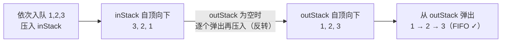

这是算法面试题整理的第二篇，承接上一篇 [数组·链表·哈希·二叉树高频算法面试题整理](/posts/数组链表哈希二叉树高频算法面试题整理/)，本篇聚焦**栈、队列、字符串**三类。它们背后有几个特别高频的"套路武器"：**单调栈、单调队列、滑动窗口**——掌握了它们，一大批看起来很难的题会瞬间变简单。

**每题依旧遵循同一结构**：题意与思路 → Kotlin 实现 → 对比非最优解 → 时空复杂度分析。原理层面还没打牢的同学，建议先读姊妹篇 [一文通俗读懂常见数据结构](/posts/通俗理解常见数据结构/)。

> 栈（Stack）是"后进先出 LIFO"，队列（Queue）是"先进先出 FIFO"。Kotlin 里常用 `ArrayDeque` 同时充当栈和队列：`addLast`/`removeLast` 当栈用，`addLast`/`removeFirst` 当队列用。
{: .prompt-info }

## 一、栈

栈最擅长处理**"就近匹配 / 就近比较"**的问题：括号匹配、表达式求值、"找下一个更大的元素"（单调栈）都是它的主场。

### 1. 有效的括号（简单）

> 判断字符串是否是有效括号序列，如 `"()[]{}"` 有效，`"(]"` 无效。

**最优解：栈**。括号匹配的本质是"**最近未匹配的左括号，必须最先被闭合**"——比如 `([)]` 就是错的，因为 `)` 想闭合时，最近的左括号是 `[` 而不是 `(`。这种"最近优先"的配对，正好是栈"后进先出"的拿手戏。

规则很简单：遇到左括号就入栈（记下"欠一个对应的右括号"）；遇到右括号 `c`，就看栈顶是不是与它匹配的左括号——是则弹出（配对成功），否则立刻判非法。两种边界要一并处理：右括号来时栈已空（没有左括号可配），以及全部遍历完栈却非空（有左括号没被闭合），都属于无效。用一个 `右→左` 的映射表 `pairs` 查匹配，代码最简洁。

以 `"([)]"` 为例的栈变化：

| 字符 | 动作 | 栈（底→顶） |
|---|---|---|
| `(` | 左括号入栈 | `(` |
| `[` | 左括号入栈 | `( [` |
| `)` | 栈顶是 `[`，与 `)` 不匹配 → **返回 false** | — |

```kotlin
/**
 * 判断括号序列是否有效。
 * Check whether the brackets are valid.
 * @param s 只含括号的字符串
 * @return Boolean 有效返回 true
 */
fun isValid(s: String): Boolean {
    val stack = ArrayDeque<Char>()
    val pairs = mapOf(')' to '(', ']' to '[', '}' to '{')
    for (c in s) {
        if (c in pairs) {
            // 右括号：栈顶必须是与之匹配的左括号
            if (stack.isEmpty() || stack.removeLast() != pairs[c]) return false
        } else {
            stack.addLast(c)  // 左括号入栈
        }
    }
    return stack.isEmpty()   // 全部匹配完栈应为空
}
```

- 时间 `O(n)`，空间 `O(n)`。

**非最优解：反复替换**。循环把 `()`、`[]`、`{}` 替换成空串，直到不能再替换，最后看是否为空串。逻辑直观，但每次替换要扫描整个字符串，最坏 `O(n²)`，且依赖字符串替换 API，不如栈优雅。

### 2. 最小栈（简单）

> 设计一个栈，支持 `push`、`pop`、`top`，并能在 **O(1)** 时间内返回栈中最小元素。

**最优解：辅助栈**。难点在于：只用一个变量记录最小值是不够的——因为栈会 `pop`，一旦弹出的正好是那个最小值，就得知道"次小值"是谁，而单个变量无从回溯。

解法是让"历史最小值"也随栈的形态一起变化：开一个与数据栈**同步压弹**的最小值栈 `mins`，它的栈顶始终等于"当前数据栈里的最小值"。`push(v)` 时，新的最小值就是 `min(v, 之前的最小值)`，一起压入；`pop` 时两个栈一起弹出，`mins` 的新栈顶自然就回到了"去掉刚弹出元素后"的最小值。这样 `getMin` 只需读 `mins` 栈顶，`O(1)`。核心思想是**用一个与主栈同生共死的辅助结构，把"每个状态下的最小值"都缓存下来**。

```kotlin
/**
 * 最小栈：O(1) 获取栈中最小元素。
 * A stack that returns its minimum element in O(1).
 */
class MinStack {
    private val data = ArrayDeque<Int>()
    private val mins = ArrayDeque<Int>()  // 辅助栈，栈顶始终是当前最小值

    fun push(value: Int) {
        data.addLast(value)
        // 新的最小值 = min(当前值, 之前的最小值)
        mins.addLast(if (mins.isEmpty()) value else minOf(value, mins.last()))
    }

    fun pop() {
        data.removeLast()
        mins.removeLast()
    }

    fun top(): Int = data.last()

    fun getMin(): Int = mins.last()
}
```

- 所有操作 `O(1)`，空间 `O(n)`。

**非最优解：每次遍历求最小**。只用一个栈，`getMin` 时遍历整个栈找最小值。空间省了，但 `getMin` 退化到 `O(n)`，不满足题目"O(1) 取最小"的要求。（进阶：还可用"只存差值"的技巧把辅助栈省掉，可作为加分回答。）

### 3. 每日温度（中等）

> 给定每日温度数组，返回一个数组，第 `i` 项表示第 `i` 天之后还要等几天才会遇到更高温度，没有则为 0。这是**单调栈**的典型题。

**最优解：单调栈**。这题问的是"每一天右边第一个更高温度在哪"，属于经典的"**找右边第一个更大元素**"。暴力要为每天向右扫，重复比较很多。单调栈的思路是：**把那些"还在等更高温度"的天先缓存进栈，一旦来了更高温度，就一次性结算它们**。

栈里存的是下标，且保证**栈内对应温度从栈底到栈顶单调递减**。为什么能保持递减？因为每来一天 `i`，只要它比栈顶那天温度高，就说明栈顶那天"等到了"——弹出它并记下天数差 `i - prev`；一直弹到栈顶温度 ≥ 当前，再把 `i` 压入。这样比当前低的天都被清走了，递减性自然维持。每个下标最多进栈一次、出栈一次，所以是 `O(n)`。

以 `[73,74,72,76]` 为例（栈内存下标）：

| i | 温度 | 触发弹出（结算） | 栈（底→顶，下标） | res |
|---|---|---|---|---|
| 0 | 73 | 无 | `0` | `[0,0,0,0]` |
| 1 | 74 | 弹 0，`res[0]=1-0=1` | `1` | `[1,0,0,0]` |
| 2 | 72 | 无（72<74） | `1 2` | `[1,0,0,0]` |
| 3 | 76 | 弹 2 `res[2]=3-2=1`；弹 1 `res[1]=3-1=2` | `3` | `[1,2,1,0]` |

遍历结束仍留在栈里的天（下标 3）右边没有更高温度，`res` 保持默认 0。

```kotlin
/**
 * 每日温度：求每天还要等多少天才有更高温度（单调栈）。
 * Daily temperatures via a monotonic stack.
 * @param temperatures 每日温度数组
 * @return IntArray 每天需要等待的天数
 */
fun dailyTemperatures(temperatures: IntArray): IntArray {
    val res = IntArray(temperatures.size)
    val stack = ArrayDeque<Int>()  // 存下标，对应温度单调递减
    for (i in temperatures.indices) {
        // 当前温度比栈顶那天高，就找到了栈顶那天的答案
        while (stack.isNotEmpty() && temperatures[i] > temperatures[stack.last()]) {
            val prev = stack.removeLast()
            res[prev] = i - prev
        }
        stack.addLast(i)
    }
    return res
}
```

- 时间 `O(n)`（每个下标最多进栈出栈一次），空间 `O(n)`。

**非最优解：暴力双重循环**。对每一天，往后逐天找第一个更高温度，`O(n²)`。单调栈的妙处在于"用一个递减栈把已经遍历过、还在等更高温度的天缓存起来"，避免重复回溯，把 `O(n²)` 降到 `O(n)`。

### 4. 逆波兰表达式求值（中等）

> 计算逆波兰（后缀）表达式的值，如 `["2","1","+","3","*"]` = `(2+1)*3` = `9`。

**最优解：栈**。中缀表达式（我们平时写的 `2+1*3`）求值麻烦，是因为要处理运算符优先级和括号。而**后缀（逆波兰）表达式已经把运算顺序编码进了排列里**：运算符出现时，它需要的两个操作数一定就是紧邻它之前算好的两个值——这天然契合栈"最近的先取"。

于是规则很直接：遇到数字就入栈；遇到运算符就弹出栈顶两个数、运算、把结果压回。最容易写错的是**减法和除法的操作数顺序**：栈是后进先出，所以**先弹出的是右操作数 `b`，后弹出的才是左操作数 `a`**，必须算 `a - b`、`a / b` 而不能反。

以 `["2","1","+","3","*"]` 为例：压 `2`、压 `1` → 栈 `[2,1]`；遇 `+` 弹出 `1`、`2` 算 `2+1=3` 压回 → `[3]`；压 `3` → `[3,3]`；遇 `*` 弹出 `3`、`3` 算 `3*3=9` → `[9]`，结果 9。

```kotlin
/**
 * 逆波兰表达式求值。
 * Evaluate reverse Polish notation.
 * @param tokens 逆波兰表达式的 token 数组
 * @return Int 表达式的计算结果
 */
fun evalRPN(tokens: Array<String>): Int {
    val stack = ArrayDeque<Int>()
    for (t in tokens) {
        when (t) {
            "+", "-", "*", "/" -> {
                val b = stack.removeLast()   // 注意：后弹出的是左操作数
                val a = stack.removeLast()
                stack.addLast(
                    when (t) {
                        "+" -> a + b
                        "-" -> a - b
                        "*" -> a * b
                        else -> a / b
                    }
                )
            }
            else -> stack.addLast(t.toInt())  // 数字直接入栈
        }
    }
    return stack.last()
}
```

- 时间 `O(n)`，空间 `O(n)`。

**说明**：本题栈解法就是标准最优解，几乎没有更差的常见解法可比——它正是"栈解决就近匹配"这一思想的直接体现。面试时要点明**减法、除法的操作数顺序**（先弹出的是右操作数），这是最容易写错的地方。

## 二、队列

队列的高频考点是**用两个栈模拟队列**（考察对两种结构的理解），以及**单调队列**（滑动窗口极值）。

### 1. 用两个栈实现队列（简单）

> 用两个栈实现一个队列，支持在队尾插入、从队首删除。

**最优解：一个"入队栈" + 一个"出队栈"**。栈是后进先出，队列要先进先出，两者顺序正好相反。而**"反转一次顺序"恰好可以用第二个栈完成**：把一个栈里的元素逐个弹出再压入另一个栈，顺序就颠倒了一次——从"后进先出"变回"先进先出"。

具体是：入队一律压进 `inStack`；出队时，如果 `outStack` 为空，就把 `inStack` 的元素**全部倒进** `outStack`（此时 `outStack` 栈顶正是最早入队的元素），再从 `outStack` 弹出。



关键优化是 `transfer` 里那句 **"只有 `outStack` 空了才倒"**：只要 `outStack` 里还有货，就一直从它弹，不去打扰 `inStack`；等它彻底空了才一次性补充。这样每个元素一生只被"搬运"一次（进 in、倒进 out、出 out），所以虽然单次 `pop` 偶尔要搬一整批，但**均摊到每个操作是 `O(1)`**。

```kotlin
/**
 * 用两个栈实现队列。
 * Implement a queue using two stacks.
 */
class MyQueue {
    private val inStack = ArrayDeque<Int>()   // 负责入队
    private val outStack = ArrayDeque<Int>()  // 负责出队

    fun push(x: Int) = inStack.addLast(x)

    fun pop(): Int {
        transfer()
        return outStack.removeLast()
    }

    fun peek(): Int {
        transfer()
        return outStack.last()
    }

    fun empty(): Boolean = inStack.isEmpty() && outStack.isEmpty()

    /**
     * 当出队栈为空时，把入队栈的元素全部倒过去（顺序反转成 FIFO）。
     * Move all elements from inStack to outStack when outStack is empty.
     */
    private fun transfer() {
        if (outStack.isEmpty()) {
            while (inStack.isNotEmpty()) outStack.addLast(inStack.removeLast())
        }
    }
}
```

- **均摊** `O(1)`：每个元素最多被"倒"一次，push/pop 均摊常数时间。

**非最优解：每次出队都倒来倒去**。出队时无脑把元素倒过去、弹出、再倒回来，每次 `O(n)`。关键优化是"**只有 outStack 空了才倒**"，让每个元素一生只搬一次，从而做到均摊 `O(1)`。

### 2. 滑动窗口最大值（中等偏难）

> 给定数组和窗口大小 `k`，窗口从左向右滑动，返回每个窗口内的最大值。这是**单调队列**的经典题。

**最优解：单调队列（双端队列）**。求每个窗口最大值，暴力要在每个窗口里重新比一遍。单调队列的核心洞察是：**当一个较大的新元素进来时，它左边所有比它小、且在它后面出场的元素，都永远没机会再当最大值了**——因为只要新元素还在窗口里，它就压着那些小的；等新元素滑出窗口时，那些更早的小元素早就先滑出了。既然如此，它们可以被直接丢弃。

用一个双端队列存**下标**，维持"对应值从队首到队尾单调递减"。每步做三件事：

1. **队尾清理**：当前值比队尾大，就把队尾一路弹掉（它们失去了成为最大值的资格），再把当前下标入队——递减性得以维持；
2. **队首过期**：队首下标若已滑出窗口（`≤ i - k`），从队首移除；
3. **取答案**：窗口一旦形成（`i ≥ k-1`），队首下标对应的值就是当前窗口最大值。

注意"队尾"和"队首"两端各司其职：队尾负责维护单调性，队首负责淘汰过期元素并提供答案，这正是需要**双端**队列的原因。以 `nums=[1,3,-1,-3,5]`、`k=3` 为例：

| i | nums[i] | 队尾清理 | 入队后 deque(下标) | 队首过期处理 | 记录最大值 |
|---|---|---|---|---|---|
| 0 | 1 | — | `0` | — | — |
| 1 | 3 | 弹 0（1<3） | `1` | — | — |
| 2 | -1 | — | `1 2` | — | `res[0]=nums[1]=3` |
| 3 | -3 | — | `1 2 3` | — | `res[1]=nums[1]=3` |
| 4 | 5 | 弹 3、2、1（都 <5） | `4` | — | `res[2]=nums[4]=5` |

得到 `[3,3,5]`。

```kotlin
/**
 * 滑动窗口最大值（单调队列）。
 * Sliding window maximum via a monotonic deque.
 * @param nums 整型数组
 * @param k 窗口大小
 * @return IntArray 每个窗口的最大值
 */
fun maxSlidingWindow(nums: IntArray, k: Int): IntArray {
    val res = IntArray(nums.size - k + 1)
    val deque = ArrayDeque<Int>()  // 存下标，对应值单调递减，队首为最大值
    for (i in nums.indices) {
        // 队尾比当前值小的都弹掉（它们不可能再成为最大值）
        while (deque.isNotEmpty() && nums[deque.last()] < nums[i]) deque.removeLast()
        deque.addLast(i)
        // 队首下标已滑出窗口，移除
        if (deque.first() <= i - k) deque.removeFirst()
        // 窗口形成后记录队首（最大值）
        if (i >= k - 1) res[i - k + 1] = nums[deque.first()]
    }
    return res
}
```

- 时间 `O(n)`（每个下标最多进出队一次），空间 `O(k)`。

**非最优解一：暴力**。对每个窗口遍历求最大值，`O(n·k)`，数据大时超时。

**非最优解二：大顶堆**。用堆维护窗口内元素，取堆顶为最大值，`O(n log k)`。比暴力好，但需要处理"过期元素"（懒删除），且不如单调队列的 `O(n)`。单调队列的核心思想是"**一个新来的大元素，会让它前面所有更小的元素永远失去成为最大值的资格**"，所以可以直接把它们丢弃。

## 三、字符串

字符串题的高频武器是**双指针**和**滑动窗口**。很多"最长/最短子串"问题都能用滑动窗口在 `O(n)` 内解决。

### 1. 最长公共前缀（简单）

> 查找字符串数组中所有字符串的最长公共前缀，不存在返回 `""`。

**最优解：纵向扫描**。公共前缀的长度不可能超过最短的那个字符串，而且只要在某一列上出现分歧，前缀就到此为止。所以把所有字符串"竖着对齐"，**一列一列地比**：以第一个字符串 `strs[0]` 为基准，对第 `i` 列，检查其余每个字符串在第 `i` 位是否都等于 `strs[0][i]`。

一旦遇到两种情况之一就立即返回 `strs[0].substring(0, i)`：某个字符串已经走到末尾（`i == str.length`，它比公共前缀还短），或某个字符与基准不一致。这种"逐列比、早发现早退出"的方式，遇到明显分歧时能很快结束，不必把每个字符串都读完。

```kotlin
/**
 * 查找字符串数组的最长公共前缀（纵向扫描）。
 * Find the longest common prefix among strings.
 * @param strs 字符串数组
 * @return String 最长公共前缀
 */
fun longestCommonPrefix(strs: Array<String>): String {
    if (strs.isEmpty()) return ""
    // 逐个字符列比较
    for (i in strs[0].indices) {
        val c = strs[0][i]
        for (str in strs) {
            // 某字符串到头了，或字符不一致，公共前缀到此为止
            if (i == str.length || str[i] != c) return strs[0].substring(0, i)
        }
    }
    return strs[0]
}
```

- 时间 `O(n·m)`（`n` 个字符串，`m` 为最短串长度），空间 `O(1)`。

**非最优解：横向扫描**。先算前两个字符串的公共前缀，再拿它和第三个求公共前缀……逐个缩小。复杂度相同，但当数组里有个别很长的公共前缀、后面却出现短的不匹配串时，纵向扫描能更早终止，通常更优。

### 2. 无重复字符的最长子串（中等）

> 找出字符串中不含重复字符的最长子串的长度，如 `"abcabcbb"` 的答案是 `3`（`"abc"`）。

**最优解：滑动窗口 + 哈希表**。用一个 `[left, right]` 的窗口表示"当前这段无重复子串"。`right` 一路向右扩张吃进新字符，只要窗口内不出现重复，长度就一直更新；一旦 `right` 指向的字符在窗口内已经出现过，就必须收缩左边界把那个旧的重复字符排除出去。

关键在于**左指针怎么跳**：用哈希表记 `字符 → 最近出现的下标`。当新字符 `c` 的上次位置 `lastIndex[c]` 落在当前窗口内（`>= left`）时，直接把 `left` 跳到 `lastIndex[c] + 1`——一步到位越过那个重复字符，而不是一格格挪。之所以要判断 `>= left`，是因为哈希表里可能残留着**早已滑出窗口**的旧记录，那种情况不该触发收缩。

整个过程 `left` 只增不减、`right` 走一遍，两个指针各扫一趟，所以是 `O(n)`，把暴力的两层循环压成了一次遍历。以 `"abcabcbb"` 为例，窗口从 `"abc"` 开始，`right` 到第二个 `a` 时 `left` 跳过第一个 `a`，窗口变成 `"bca"`，长度始终维持在 3。

```kotlin
/**
 * 无重复字符的最长子串长度（滑动窗口）。
 * Length of the longest substring without repeating characters.
 * @param s 输入字符串
 * @return Int 最长无重复子串的长度
 */
fun lengthOfLongestSubstring(s: String): Int {
    val lastIndex = HashMap<Char, Int>()  // 字符 -> 最近一次出现的下标
    var left = 0
    var best = 0
    for (right in s.indices) {
        val c = s[right]
        // 若字符在窗口内出现过，左边界跳到其上次位置的下一位
        if (lastIndex.containsKey(c) && lastIndex[c]!! >= left) {
            left = lastIndex[c]!! + 1
        }
        lastIndex[c] = right
        best = maxOf(best, right - left + 1)
    }
    return best
}
```

- 时间 `O(n)`，空间 `O(min(n, 字符集大小))`。

**非最优解：暴力枚举所有子串**。枚举每个起点，向后延伸直到出现重复，`O(n²)` 甚至 `O(n³)`（若每次用 Set 重新判重）。滑动窗口的关键是"**左指针只前进不后退**"，把两层循环压成一次遍历。

### 3. 最长回文子串（中等）

> 找出字符串中最长的回文子串，如 `"babad"` 的答案是 `"bab"` 或 `"aba"`。

**最优解：中心扩展**。回文串的定义就是"关于中心左右对称"。与其枚举所有子串再判断，不如反过来**枚举中心、向两边扩张**：从中心出发，只要左右字符相等就同时向外走一步，直到不等或越界，走过的这段就是以该中心为轴的最长回文。

难点是回文有**奇偶两种**：`"aba"` 长度为奇，中心是正中间那个字符；`"abba"` 长度为偶，中心落在两个字符的**间隙**里。所以要枚举 `n` 个单字符中心（`expand(i, i)`）和 `n-1` 个间隙中心（`expand(i, i+1)`），共 `2n-1` 个中心，才不会漏掉偶回文。

还有个易错点是**扩展结束后长度的计算**：`while` 循环退出时，`left`、`right` 已经各自多走了一步（指向不相等或越界的位置），所以真实回文是 `[left+1, right-1]`，长度为 `right - left - 1`、起点为 `left + 1`。每个中心最多扩张 `O(n)`，共 `2n-1` 个中心，故整体 `O(n²)`，但只用常数额外空间。

```kotlin
/**
 * 最长回文子串（中心扩展法）。
 * Longest palindromic substring by expanding around centers.
 * @param s 输入字符串
 * @return String 最长回文子串
 */
fun longestPalindrome(s: String): String {
    if (s.length < 2) return s
    var start = 0
    var maxLen = 1

    /**
     * 从中心 (l, r) 向两边扩展，返回该中心能得到的最长回文长度。
     * Expand around center (l, r) and return the longest palindrome length.
     */
    fun expand(l: Int, r: Int) {
        var left = l
        var right = r
        while (left >= 0 && right < s.length && s[left] == s[right]) {
            left--
            right++
        }
        // 循环结束时多走了一步，真实长度为 right - left - 1
        val len = right - left - 1
        if (len > maxLen) {
            maxLen = len
            start = left + 1
        }
    }

    for (i in s.indices) {
        expand(i, i)      // 奇数长度回文，中心是单个字符
        expand(i, i + 1)  // 偶数长度回文，中心是两个字符间隙
    }
    return s.substring(start, start + maxLen)
}
```

- 时间 `O(n²)`，空间 `O(1)`。

**非最优解一：暴力**。枚举所有子串再逐个判断是否回文，`O(n³)`。

**非最优解二：动态规划**。`dp[i][j]` 表示 `s[i..j]` 是否回文，`dp[i][j] = (s[i]==s[j]) && dp[i+1][j-1]`。时间 `O(n²)` 但空间也要 `O(n²)`，不如中心扩展省空间。（追求极致可用 `O(n)` 的 Manacher 算法，但实现复杂，面试能讲清中心扩展即可。）

### 4. 字符串相加（简单）

> 给定两个用字符串表示的非负整数 `num1`、`num2`，返回它们的和（字符串形式），不能直接转成整数（大数会溢出）。牛客高频题。

**最优解：双指针从末位模拟竖式加法**。既然不能转成整数（大数溢出），就回到小学列竖式加法的做法：**从最低位（字符串末尾）对齐，逐位相加，满十进一**。

两个指针 `i`、`j` 分别从两个字符串末尾往前走，每一步取出各自当前位的数字（某个字符串先走完就用 0 补位），加上上一位的进位 `carry`，得到 `sum`：本位数字是 `sum % 10`，新的进位是 `sum / 10`。循环条件 `i >= 0 || j >= 0 || carry > 0` 里的 **`carry > 0` 很关键**——它负责处理最高位还有进位的情况（如 `"99" + "1" = "100"`），漏了会算错。

因为是从低位往高位算、结果也是从低位往高位拼的，所以最后要把 `StringBuilder` **整体反转**才是正确顺序。用字符相减 `num1[i] - '0'` 把字符转成数字，是处理字符串数字的常用技巧。

```kotlin
/**
 * 字符串形式的大数相加。
 * Add two non-negative integers represented as strings.
 * @param num1 第一个数字字符串
 * @param num2 第二个数字字符串
 * @return String 两数之和的字符串
 */
fun addStrings(num1: String, num2: String): String {
    val sb = StringBuilder()
    var i = num1.length - 1
    var j = num2.length - 1
    var carry = 0  // 进位
    while (i >= 0 || j >= 0 || carry > 0) {
        val a = if (i >= 0) num1[i--] - '0' else 0
        val b = if (j >= 0) num2[j--] - '0' else 0
        val sum = a + b + carry
        sb.append(sum % 10)   // 当前位
        carry = sum / 10      // 进位
    }
    return sb.reverse().toString()
}
```

- 时间 `O(max(m, n))`，空间 `O(max(m, n))`（结果）。

**非最优解：转成整数相加**。`(num1.toLong() + num2.toLong()).toString()`。看似简单，但**大数会溢出**（题目正是要考这个），只能用于长度很小的输入，是本题明确要避开的错误解法。

## 结语：三种结构的"套路武器"

| 结构 | 高频武器 | 一句话心法 |
|---|---|---|
| 栈 | 单调栈 | "找下一个更大/更小元素"就用它，把 `O(n²)` 降到 `O(n)` |
| 队列 | 单调队列、双栈 | 滑动窗口极值用单调队列；两个栈可互相模拟另一种结构 |
| 字符串 | 双指针、滑动窗口 | "最长/最短无重复子串"优先想滑动窗口，左指针只进不退 |

> 💡 **面试建议**：单调栈和单调队列是很多人的盲区，但它们的思想其实一致——**及时丢弃那些"永远不可能再成为答案"的元素**（被更大的数挡住、或已滑出窗口）。想清楚"什么样的元素可以安全丢弃"，这两类题就通了。更基础的数组/链表/哈希/二叉树题，见上一篇 [高频算法面试题整理](/posts/数组链表哈希二叉树高频算法面试题整理/)。
{: .prompt-tip }
