很多人背了一堆"数组查询 O(1)、链表插入 O(1)"的结论，却说不清**为什么**。原因是跳过了最关键的一步：这些数据到底在内存里长什么样？

本文不堆术语，用八个生活里的类比——**储物柜、寻宝游戏、叠盘子、排队、字典、家谱、急诊分诊、城市地图**——把数组、链表、栈、队列、哈希表、二叉树、堆、图彻底讲明白。看懂了"它长什么样"，"它为什么快/慢"就是自然而然的结论。

> 想直接刷题的同学，可以看配套的这篇：[数组·链表·哈希·二叉树高频算法面试题整理](/posts/数组链表哈希二叉树高频算法面试题整理/)。本文负责讲清原理，那篇负责实战。
{: .prompt-tip }

## 开胃：数据在内存里长什么样？

先记住一个最朴素的画面：**内存就是一排排编了号的小格子**，每个格子能存一点数据，格子的编号就是"地址"。

所有数据结构的差别，本质上只是**"数据在这些格子里怎么摆、格子之间怎么找到彼此"**的差别。摆放方式不同，增删改查的快慢就天差地别。带着这个画面往下看。

## 一、数组：连号的储物柜

**类比**：健身房里一排连号的储物柜——1 号、2 号、3 号……紧挨着，中间不空。

数组就是**在内存里连续排列的一批格子**。因为连续、且每个元素大小相同，只要知道第 0 个的地址，想找第 `i` 个直接算：`起始地址 + i × 每个元素的大小`，一步到位。

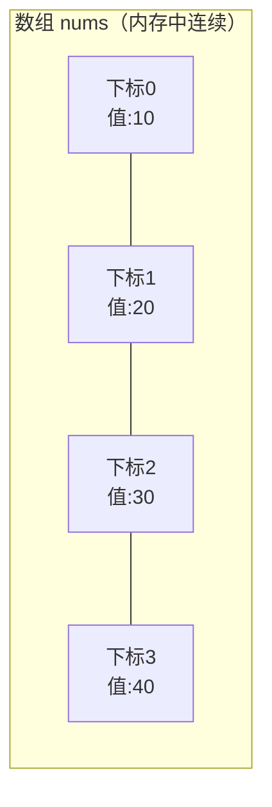

### 为什么"按下标查"这么快？

因为地址能直接算出来，不用一个个找。这就是 **随机访问 O(1)**——你去 88 号柜子，是直接走过去，而不是从 1 号数到 88 号。

### 为什么"插入/删除"这么慢？

假设要在储物柜第 2 号位置**插进**一个新柜子，为了保持"连号不空"，2 号后面的所有柜子都得**集体往后挪一格**。删除同理，后面的要集体往前补。平均要挪一半元素，所以是 **O(n)**。

```kotlin
// 按下标访问：一步到位，O(1)
val nums = intArrayOf(10, 20, 30, 40)
val x = nums[2]   // 直接算地址拿到 30

// 在中间插入：后面元素整体后移，O(n)
val list = mutableListOf(10, 20, 30, 40)
list.add(1, 99)   // 变成 [10, 99, 20, 30, 40]，20/30/40 都往后挪了
```

### 数组的账本

| 操作 | 复杂度 | 原因 |
|---|---|---|
| 按下标访问/修改 | **O(1)** | 地址可直接计算 |
| 查找某个值 | O(n) | 得挨个比对 |
| 中间插入/删除 | O(n) | 后续元素要整体移动 |
| 末尾追加 | 均摊 O(1) | 但容量满了要扩容（见下） |

> **扩容是怎么回事？** 数组一开始就得申请一整块连续内存，装满了怎么办？答案是**新申请一块更大的（通常 1.5~2 倍）连续内存，把旧数据整体搬过去**。单次搬迁是 O(n)，但因为翻倍增长，平摊到每次追加上就是 O(1)，这叫"均摊复杂度"。Kotlin 的 `ArrayList`（`mutableListOf` 底层）就是这么干的。
{: .prompt-info }

**一句话总结**：数组是"**查得快、改得慢**"的结构。适合读多写少、需要按下标随机访问的场景。

## 二、链表：一环扣一环的寻宝游戏

**类比**：寻宝游戏。第一张纸条在你手上，纸条上写着"下一条线索在储物室"，到了储物室又有一张纸条指向下一处……**每张纸条本身可以放在任何角落，靠"指向下一处"的箭头串起来**。

链表的每个元素叫**节点（Node）**，节点里除了存数据，还存一个**指向下一个节点的引用（next）**。节点们**不需要在内存里连续**，谁记着下一个是谁就行。

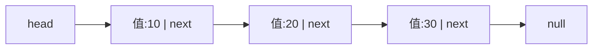

```kotlin
// 单链表节点：存值 + 指向下一个节点
class ListNode(var value: Int) {
    var next: ListNode? = null
}
```

### 为什么"插入/删除"这么快？

想在 10 和 20 之间插一个 99，只需要：**把 10 的箭头改成指向 99，让 99 的箭头指向 20**。前后两根"箭头"改一下就完事，后面的节点一个都不用动，所以是 **O(1)**（前提是你已经站在插入位置）。

```kotlin
// 在 node 之后插入 newNode：只改两根指针，O(1)
val newNode = ListNode(99)
newNode.next = node.next
node.next = newNode
```

### 为什么"按下标查"这么慢？

链表没有"连号"，你不能直接算出第 88 个节点的地址，只能**从头顺着箭头一个个数过去**，所以查找是 **O(n)**。想拿第 5 个，就得从 head 走 5 步。

### 单链表、双链表、循环链表

- **单链表**：每个节点只知道"下一个是谁"，只能单向走。
- **双链表**：节点再存一个 `prev` 指向前一个，可以往回走。代价是多一份指针的内存。Kotlin 的 `LinkedList`（Java 的）就是双链表。
- **循环链表**：尾节点的 `next` 不指向 `null`，而是指回头节点，绕成一个圈。约瑟夫环、轮询调度会用到。

### 数组 vs 链表：一张表说清

| 对比项 | 数组 | 链表 |
|---|---|---|
| 内存布局 | 连续 | 分散，靠指针连接 |
| 按下标访问 | **O(1)** | O(n) |
| 中间插入/删除 | O(n) | **O(1)**（已知位置） |
| 额外内存 | 无 | 每个节点多存指针 |
| 扩容 | 需要，要搬家 | 不需要，随用随加 |

> 关于数组和链表的深入对比，本站另有专文 [数组和链表的区别](/posts/数组和链表的区别/) 可延伸阅读。
{: .prompt-tip }

**一句话总结**：链表是"**改得快、查得慢**"的结构，和数组恰好互补。适合频繁增删、不需要随机访问的场景。

## 三、栈：只能从顶上拿的一摞盘子

前面数组和链表都是"能从任意位置操作"的通用结构。接下来两种——栈和队列——则是**故意给操作加限制**的结构：它们底层通常就是用数组或链表实现的，只是**规定了只能从特定的口进出**，从而换来简单、可靠和特定场景的高效。

**类比**：食堂里叠起来的一摞盘子。你只能从**最上面**拿一个，也只能往**最上面**放一个。最后放上去的盘子，反而最先被拿走——这就是栈的核心规则：**后进先出（LIFO，Last In First Out）**。

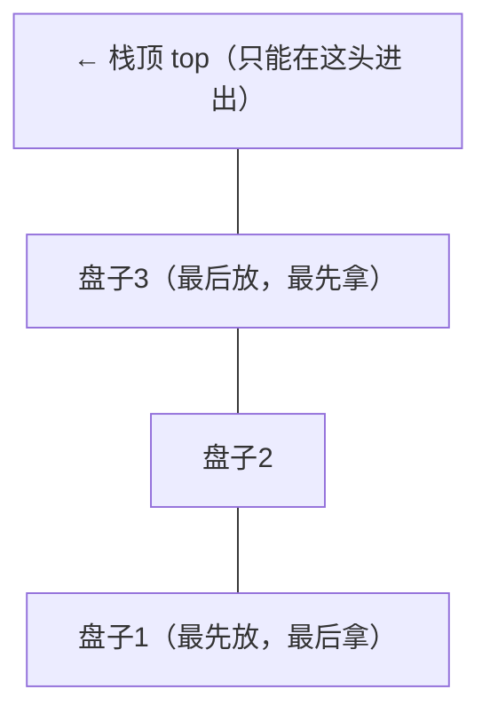

栈只有三个核心操作，且都只在"栈顶"这一头进行，所以**都是 O(1)**：

- **push（入栈/压栈）**：往栈顶放一个元素。
- **pop（出栈/弹栈）**：把栈顶元素拿走并返回。
- **peek（看栈顶）**：只看栈顶是谁，不拿走。

```kotlin
// Kotlin 用 ArrayDeque 当栈：都在“末尾”这一头操作
val stack = ArrayDeque<Int>()
stack.addLast(1)          // push
stack.addLast(2)          // push
val top = stack.last()    // peek → 2
val out = stack.removeLast()  // pop → 2（后进先出）
```

### 栈到底有什么用？

凡是需要"**后发生的先处理 / 原路返回**"的场景，背后几乎都是栈：

- **函数调用栈**：A 调用 B、B 调用 C，返回时一定是先返回 C 再返回 B——这正是 LIFO，递归太深导致的 `StackOverflow` 就是它撑爆了。
- **浏览器后退、编辑器撤销（Ctrl+Z）**：最近的操作最先被撤销。
- **括号匹配、表达式求值、DFS（深度优先遍历）**：都是栈的经典应用。

**一句话总结**：栈是"**只留一个口、后进先出**"的结构。谁最后进来谁最先出去，天生适合"回溯 / 原路返回"类问题。

## 四、队列：先来先服务的排队买奶茶

**类比**：奶茶店门口排队。新来的人只能站到**队尾**，服务永远从**队首**开始，先来的先买到。这就是队列的核心规则：**先进先出（FIFO，First In First Out）**，和栈恰好相反。

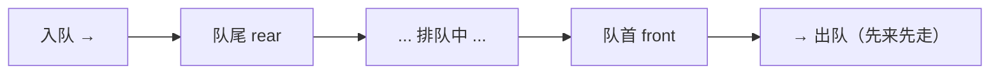

队列的核心操作分别在两头进行，也都是 **O(1)**：

- **enqueue / offer（入队）**：在队尾加一个元素。
- **dequeue / poll（出队）**：从队首取走一个元素。
- **peek（看队首）**：只看下一个将被服务的是谁。

```kotlin
// Kotlin 用 ArrayDeque 当队列：尾进、首出
val queue = ArrayDeque<Int>()
queue.addLast(1)            // enqueue
queue.addLast(2)            // enqueue
val head = queue.first()    // peek → 1
val out = queue.removeFirst()   // dequeue → 1（先进先出）
```

### 两个常见变体

- **双端队列（Deque）**：两头都能进出，既能当栈又能当队列。Kotlin 的 `ArrayDeque` 本质就是它，所以前面栈和队列用的都是它。
- **优先队列（PriorityQueue）**：出队的不是"最先来的"，而是"优先级最高的"，底层用**堆**实现，出队/入队是 O(log n)。求 TopK、任务调度常用。

### 队列到底有什么用？

凡是需要"**按到来顺序公平处理**"的场景，背后几乎都是队列：

- **BFS（广度优先 / 层序遍历）**：一层一层地扫，正是靠队列实现的（后面讲二叉树的层序遍历时会用到）。
- **消息队列、任务调度**：Android 里 `Handler` 的 `MessageQueue`、线程池的任务队列，都是先来的任务先处理。

**一句话总结**：队列是"**一头进、一头出、先进先出**"的结构。谁先来谁先被服务，天生适合"按顺序排队处理"类问题。

## 五、哈希表：不用翻页的字典

**类比**：查字典。你想查"苹果"的解释，不会从第一页翻起，而是**根据拼音 `pingguo` 直接翻到 P 区那几页**。这个"从词 → 页码"的规则，就是哈希的核心。

哈希表（HashMap / HashSet）解决的问题是：**怎么做到"给一个 key，几乎一步就找到对应的 value"？**

它的做法是：底层其实是一个**数组**，再配一个**哈希函数**。哈希函数把任意 key（字符串、对象……）算成一个数字，再对数组长度取余，得到应该存放的下标。

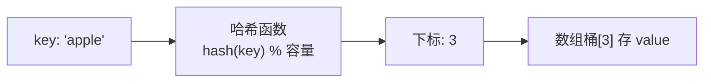

```kotlin
val map = HashMap<String, Int>()
map["apple"] = 5      // 哈希函数算出 apple 该放哪个桶，直接放进去
val v = map["apple"]  // 同样算一次，直接去那个桶取，平均 O(1)
```

因为存和取都靠同一个哈希函数直接定位，所以**平均查找、插入、删除都是 O(1)**。这就是哈希表最大的价值：**用空间换时间，把"挨个找"变成"直接定位"**。

### 哈希冲突：两个 key 算到了同一个格子怎么办？

哈希函数会把无穷多的 key 映射到有限的格子里，必然出现**两个不同的 key 算出同一个下标**，这叫**哈希冲突**。主流解决办法：

- **链地址法（拉链法）**：每个格子（桶）不直接存值，而是挂一个**链表**，冲突的 key 都挂在同一个桶的链表上。查找时先定位桶，再在这条短链表上逐个比对。Java/Kotlin 的 `HashMap` 用的就是这个，而且当链表太长（≥8）会转成**红黑树**，防止退化。
- **开放寻址法**：格子被占了，就按规则往后找下一个空格子放。

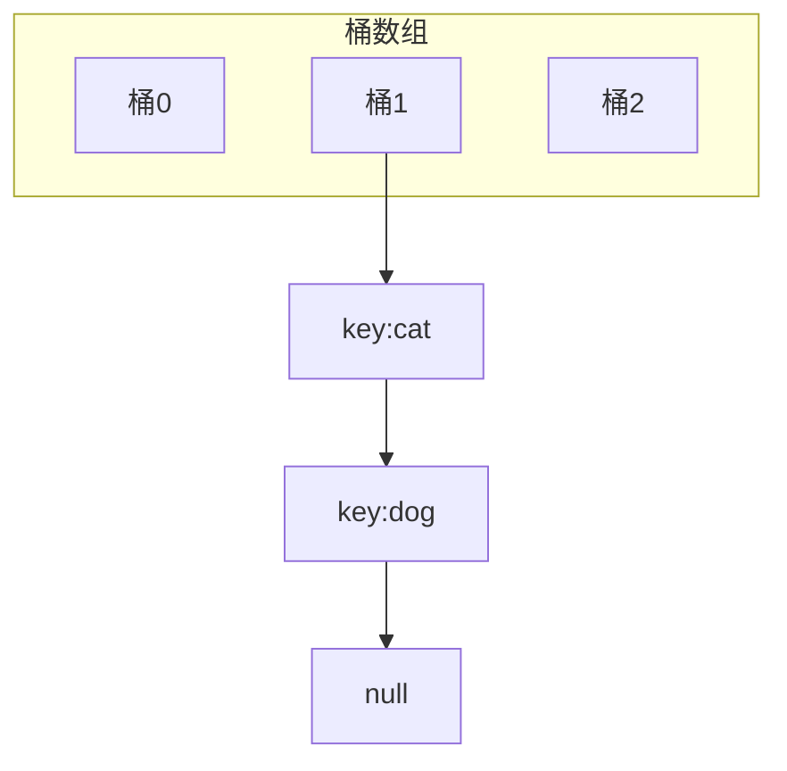

> **为什么说是"平均" O(1)？** 极端情况下所有 key 都冲突到同一个桶，哈希表就退化成一条链表，查找变 O(n)。所以哈希函数要设计得"散得均匀"，同时当元素填得太满（超过**负载因子**，Java 默认 0.75）时会**扩容并重新哈希（rehash）**，把数据重新打散到更大的桶数组里。
{: .prompt-warning }

### 哈希表的账本

| 操作 | 平均 | 最坏 |
|---|---|---|
| 插入/删除/查找 | **O(1)** | O(n)（大量冲突时） |

**一句话总结**：哈希表是"**几乎一步定位**"的结构，代价是无序、且要占额外空间。凡是遇到"判断某元素在不在""统计出现次数""按 key 快速查值"，第一反应就应该是它。

## 六、二叉树：层层分叉的家谱

**类比**：家谱 / 公司组织架构图。最上面一个祖先（根），每个人最多向下连出若干后代。**二叉**树的限制是：每个节点**最多两个孩子**，习惯叫左孩子、右孩子。

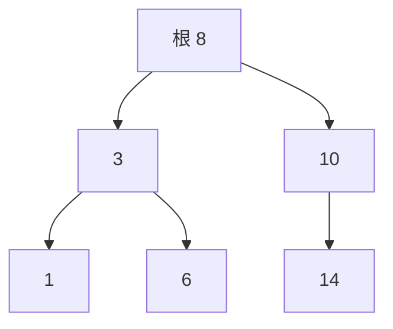

```kotlin
// 二叉树节点：存值 + 左右两个孩子
class TreeNode(var value: Int) {
    var left: TreeNode? = null
    var right: TreeNode? = null
}
```

几个基础名词，看图就懂：

- **根节点**：最顶上没有父亲的节点（上图的 8）。
- **叶子节点**：没有孩子的节点（上图的 1、6、14）。
- **高度/深度**：从根到最深叶子经过的层数。
- **子树**：任意一个节点连同它下面的所有后代，本身又是一棵树——这正是二叉树"天生适合递归"的原因。

### 二叉搜索树（BST）：为什么它能"折半查找"

普通二叉树没什么特别。真正好用的是**二叉搜索树（BST）**，它多了一条铁律：

> **任意节点：左子树所有值 < 它 < 右子树所有值。**

上图就是一棵 BST。有了这条规则，查找一个值就像**猜数字游戏**：从根开始，比当前节点小就往左走，大就往右走，每一步都排除掉一半的节点。

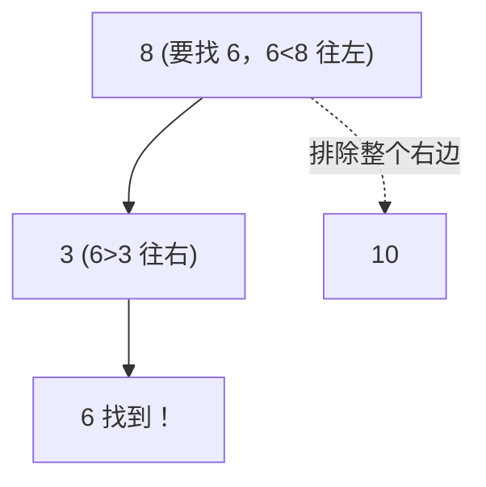

树**平衡**时（左右高度差不多），高度约为 `log n`，所以 BST 的查找、插入、删除都是 **O(log n)**——这比数组的 O(n) 查找快得多，又比数组保持有序时插入要挪一堆元素强。

> **失衡的坑**：如果按 1、2、3、4、5 顺序往 BST 里插，它会退化成一条"只往右长"的链表，查找又变回 O(n)。为了解决这个问题，才有了 **AVL 树、红黑树** 这类"自动保持平衡"的树。Java 的 `TreeMap`、`HashMap` 桶内的树化用的都是红黑树。
{: .prompt-warning }

### 遍历：怎么把树上的节点都走一遍？

树不像数组能从头扫到尾，"遍历顺序"本身就是一门学问。分两大类：

**深度优先（DFS）**——一条路走到黑，按访问根的时机分三种：

- **前序**（根 → 左 → 右）：常用于**复制一棵树**。
- **中序**（左 → 根 → 右）：对 BST 来说，中序遍历结果**恰好是从小到大排好序的**，这是 BST 的黄金性质。
- **后序**（左 → 右 → 根）：常用于**释放/删除一棵树**（先处理完孩子再处理自己）。

```kotlin
/**
 * 中序遍历二叉树（左 → 根 → 右）。
 * In-order traversal of a binary tree.
 * @param root 根节点
 * @param res 收集遍历结果的列表
 */
fun inorder(root: TreeNode?, res: MutableList<Int>) {
    if (root == null) return
    inorder(root.left, res)   // 先遍历左子树
    res.add(root.value)        // 再访问根
    inorder(root.right, res)  // 最后遍历右子树
}
```

**广度优先（BFS）/ 层序遍历**——一层一层地横着扫，借助**队列**实现，常用于求最短路径、按层输出：

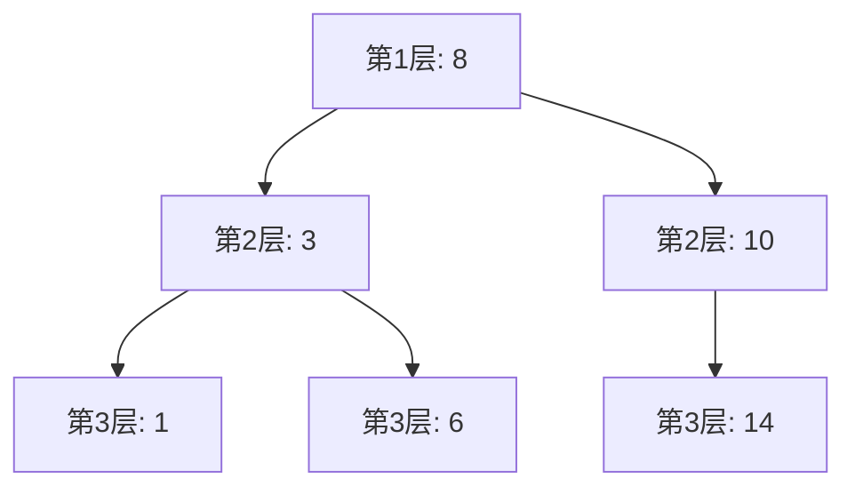

**一句话总结**：二叉树用"分叉"把数据组织成层级，配合"有序"规则（BST）就能实现 O(log n) 的高效查找，是"查找效率"和"动态增删"之间的一个漂亮折中。

## 七、堆：永远让最大的浮到顶上的急诊分诊台

还记得讲队列时提到的**优先队列**吗？它的底层就是**堆**。堆专门解决一类问题：**我不关心整体排序，只想随时快速拿到"最大（或最小）的那一个"。**

**类比**：医院急诊分诊台。它不按"先来后到"排队，而是**永远让病情最危急的排在最前面**优先就诊。但它也不会把所有病人从重到轻排得一清二楚——只保证"最危急的在最前面"，剩下的大致有序就够了。堆就是这种"只保证头部最优，不追求整体有序"的结构。

堆本质是一棵**完全二叉树**（除最后一层外每层都填满，最后一层靠左排列），并满足一条规则：

> **大顶堆**：每个节点都 ≥ 它的两个孩子（堆顶就是全局最大值）；
> **小顶堆**：每个节点都 ≤ 它的两个孩子（堆顶就是全局最小值）。

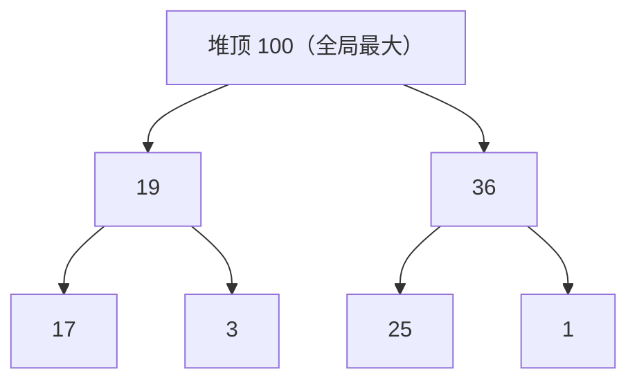

> **和二叉搜索树（BST）别搞混！** BST 是"左 < 根 < 右"，中序遍历能得到完整有序序列；堆只要求"父 ≥ 子"（或父 ≤ 子），**左右孩子之间谁大谁小完全不管**。所以堆只能 O(1) 拿到最值，不能像 BST 那样高效地查任意值。
{: .prompt-warning }

### 一个巧妙点：堆用数组存，不用指针

因为堆是"填满的"完全二叉树，节点可以**按层从上到下、从左到右塞进一个数组**，父子关系直接用下标算出来，连指针都省了：

- 下标 `i` 的**左孩子**是 `2i+1`，**右孩子**是 `2i+2`，**父亲**是 `(i-1)/2`。

核心操作靠"上浮"和"下沉"维持堆的规则：

- **peek（看堆顶）**：数组第 0 个，**O(1)**。
- **插入**：先放到数组末尾，再和父亲比较不断"上浮"，**O(log n)**。
- **弹出堆顶**：把末尾元素挪到堆顶，再不断和较大的孩子交换"下沉"，**O(log n)**。

```kotlin
// Kotlin 用 PriorityQueue（底层就是堆），默认是小顶堆
val minHeap = java.util.PriorityQueue<Int>()
minHeap.add(5); minHeap.add(1); minHeap.add(3)
val min = minHeap.peek()   // 1，O(1) 拿到最小值

// 大顶堆：传入反向比较器
val maxHeap = java.util.PriorityQueue<Int>(compareByDescending { it })
```

### 堆到底有什么用？

凡是"**动态地反复取最值**"的场景，堆就是最佳选择：

- **TopK 问题**：从海量数据里找最大/最小的 K 个，用大小为 K 的堆，`O(n log k)`。
- **优先队列 / 任务调度**：谁优先级高谁先执行。
- **堆排序**：不断取堆顶就能得到有序序列。
- **Dijkstra 最短路径**：每次取距离最小的节点，靠堆加速。

**一句话总结**：堆是"**只让最值浮在顶上**"的完全二叉树（通常用数组实现）。它牺牲了"整体有序"，换来了 O(1) 看最值、O(log n) 增删，是"反复取最值"场景的利器。

## 八、图：错综复杂的城市地图

前面所有结构，节点之间的关系都比较"规矩"：数组链表是一条线，树是一层层往下分叉、每个节点只有一个父亲。而**图（Graph）**放开了所有限制——**任意两个节点之间都可以有连接，可以成环，可以多对多**。它是最通用、也最能描述真实世界复杂关系的结构。

**类比**：城市地图，或者微信好友关系网。城市是**顶点（Vertex）**，连接城市的公路是**边（Edge）**；人是顶点，好友关系是边。

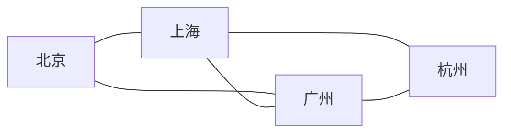

几个关键分类，对着"地图"就好理解：

- **有向图 / 无向图**：好友关系是双向的（无向）；微博关注是单向的、我关注你不代表你关注我（有向）。
- **带权图 / 无权图**：公路有里程（权重），地铁只关心通不通（无权）。
- **树其实是特殊的图**：一个"无环、连通、每个节点只有一个父亲"的图就是树。所以图是树的"超集"。

### 图怎么存？两种主流方式

- **邻接矩阵**：用一个 `n×n` 的二维数组，`matrix[i][j] = 1` 表示 i 和 j 之间有边。查"两点是否相连"是 O(1)，但不管有没有边都占 `O(n²)` 空间，适合**稠密图**。
- **邻接表**：每个顶点挂一个列表，记录它连接了哪些顶点。省空间，适合**稀疏图**（现实中大多是稀疏图，所以邻接表更常用）。

```kotlin
// 邻接表表示一张图：每个顶点 -> 它的邻居列表
val graph = HashMap<Int, MutableList<Int>>()
fun addEdge(u: Int, v: Int) {
    graph.getOrPut(u) { mutableListOf() }.add(v)
    graph.getOrPut(v) { mutableListOf() }.add(u)  // 无向图两个方向都加
}
```

### 图的两种遍历：DFS 和 BFS

怎么把图上所有顶点走一遍？和二叉树类似，但因为**图可能有环，必须用一个 `visited` 集合记录访问过的顶点，避免死循环**：

- **DFS（深度优先）**：一条路走到底再回头，用**栈**或递归实现——正是前面"栈"那节说的应用。
- **BFS（广度优先）**：一圈一圈由近到远扩散，用**队列**实现——正是"队列"那节说的应用。求"最少几步到达"这类最短路径问题就靠它。

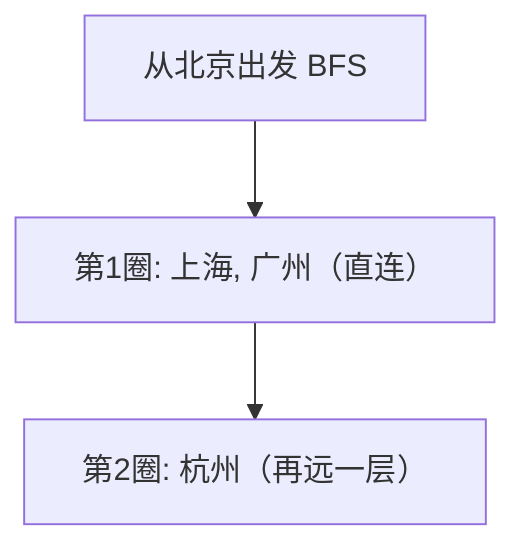

### 图到底有什么用？

图是用来描述"关系"的，现实中的关系网几乎都能用图建模：

- **地图导航 / 最短路径**：Dijkstra、A\* 算法。
- **社交网络**：好友推荐（你可能认识的人）、六度人脉。
- **任务依赖 / 编译顺序**：用有向无环图（DAG）做拓扑排序。

**一句话总结**：图是"**顶点 + 边、可任意连接**"的最通用结构，专门描述复杂的多对多关系。遍历靠 DFS（栈）和 BFS（队列），存储看稠密还是稀疏选邻接矩阵或邻接表。

## 总结：八种结构怎么选？

回到开头那个画面——**它们的差别只是"数据怎么摆、怎么找到彼此"**。一张表收尾：

| 结构 | 生活类比 | 最擅长 | 最不擅长 | 典型复杂度 |
|---|---|---|---|---|
| **数组** | 连号储物柜 | 按下标随机访问 | 中间增删 | 访问 O(1)，增删 O(n) |
| **链表** | 寻宝纸条 | 频繁增删 | 按位置查找 | 增删 O(1)，查找 O(n) |
| **栈** | 叠盘子 | 后进先出、回溯 | 按位置访问 | 进出栈 O(1) |
| **队列** | 排队 | 先进先出、按序处理 | 按位置访问 | 进出队 O(1) |
| **哈希表** | 查字典 | 按 key 极速存取 | 有序遍历、范围查询 | 平均 O(1) |
| **二叉树(BST)** | 家谱 | 有序 + 动态增删查 | 需自平衡防退化 | 平衡时 O(log n) |
| **堆** | 急诊分诊台 | 反复取最大/最小值 | 查任意值 | 取最值 O(1)，增删 O(log n) |
| **图** | 城市地图 | 描述多对多复杂关系 | 结构复杂、开销大 | 遍历 O(V+E) |

选择的思路其实很直白：

- 需要**按下标随机访问**、数据基本不动 → **数组**
- 需要**频繁在头部/中间增删** → **链表**
- 需要**后进先出 / 回溯、原路返回**（如撤销、DFS）→ **栈**
- 需要**先进先出 / 按到来顺序处理**（如 BFS、任务调度）→ **队列**
- 需要**判断存在、按 key 查值、去重、计数** → **哈希表**
- 需要**保持有序，同时又要频繁增删查** → **二叉搜索树 / 红黑树**
- 需要**反复拿到最大/最小值**（如 TopK、优先级调度）→ **堆 / 优先队列**
- 需要**描述"谁和谁有关系"的网状结构**（如地图、社交、依赖）→ **图**

> 💡 **给初学者的建议**：不要死记"谁是 O(1)、谁是 O(n)"。每次想不起来时，就在脑子里画出"储物柜 / 寻宝纸条 / 叠盘子 / 排队 / 字典 / 家谱 / 急诊分诊 / 城市地图"的样子，问自己一句"这个操作在这个画面里要做几步"，复杂度自然就出来了。理解了原理，配套的算法刷题篇也会好懂很多：[数组·链表·哈希·二叉树](/posts/数组链表哈希二叉树高频算法面试题整理/) 讲双指针、快慢指针、前缀和，[栈·队列·字符串](/posts/栈队列字符串高频算法面试题整理/) 讲单调栈、单调队列、滑动窗口。
{: .prompt-tip }
